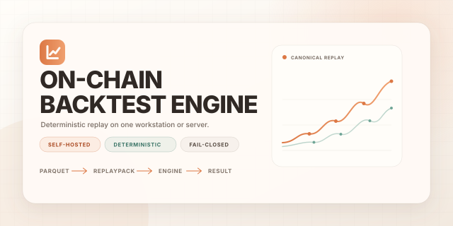
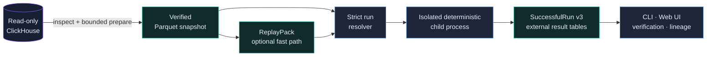

<div align="center">
  
  <br>
  <p>
    <a href="https://www.python.org/"></a>
    
    
    
    
  </p>
  <p><strong>Reproducible on-chain backtests from verified local artifacts, with no SQL or network access in the event loop.</strong></p>
  <p>
    <a href="#quick-start">Quick start</a> ·
    <a href="#features">Features</a> ·
    <a href="#how-it-works">Architecture</a> ·
    <a href="#documentation">Documentation</a> ·
    <a href="#support-the-project">Support</a> ·
    <a href="#contributing">Contributing</a>
  </p>
</div>

---

On-Chain Backtest Engine selectively reads a requested range from an external read-only
ClickHouse source, publishes an immutable canonical Parquet snapshot, and
replays it deterministically on a single Linux, macOS, or Windows host with
16–32 GB of RAM and local NVMe storage. The supported Windows path currently
runs through WSL2 with Ubuntu; a native Windows runtime has not completed its
compatibility gate.

The project is a Python modular monolith. The CLI and Web UI call the same
application use cases, heavy jobs run in isolated child processes, and semantic
identity is kept separate from physical execution settings. It does not require
S3, PostgreSQL, a local ClickHouse service, Kafka, Kubernetes, or multi-host
workers.

> [!IMPORTANT]
> The current working surface includes the reference stack and exact Pump.fun
> Sniping. The project is in alpha: every new source range requires its own
> bounded evidence pass and may correctly stop fail closed.

> [!NOTE]
> Pump.fun Sniping now supports separate identity-bearing `EXOGENOUS_REPLAY`
> and `EXOGENOUS_VIRTUAL_SETTLEMENT` modes through required draft v3, summary
> v3, and round-trip v4 contracts. Virtual settlement explicitly labels
> synthetic sell funding and is not an on-chain executability claim. Switching
> modes requires resolving a new run and changes `logical_run_id`, but reuses
> the existing verified Dataset/Snapshot/ReplayPack without extraction or
> ReplayPack compilation.

## Features

| Capability | Current contract |
|---|---|
| Selective acquisition | Bounded read-only ClickHouse queries with explicit columns, hard limits, and gap-safe preparation |
| Local storage | Immutable canonical Parquet, verified manifests, and content-addressed references |
| Deterministic replay | Reference engine, mmap ReplayPack, and optional DeliverySchedule with no SQL/network in the hot loop |
| Pump.fun Sniping | `EXOGENOUS_REPLAY` and explicit synthetic `EXOGENOUS_VIRTUAL_SETTLEMENT`: exact non-Mayhem universe, `+500` global transactions before buy, `+2s` before the sell decision, integer fees, and ledger-authoritative PnL |
| Verifiable equivalence | Canonical Parquet reference, ReplayPack reference, and NumPy mmap optimized paths are checked for byte-identical outputs under the same admitted exact contract |
| Job control | Durable SQLite queue, isolated child processes, cancel/retry/recovery, and bounded progress |
| Local interface | Typed CLI, loopback-only Control API, and reactive same-origin Web UI with bounded arrow pagination, date-first bounded views, adaptive polling, and a dedicated analytical Sniping dashboard |
| Artifact lifecycle | Verification, lineage, pins, reachability GC, trash grace period, and a verifiable backup/restore contract |
| Exact ML path | Point-in-time features, frozen predictions, and a safe integer-linear runtime |

The UI loads only one bounded table page at a time: 20 jobs, 10 runs, and 25
Sniping round trips by default. Job and run pages are selected globally newest
first through opaque keyset cursors, so a newly inserted row cannot shift an
already-open continuation page. The Run order comes from a rebuildable manifest-bound SQLite index and
the selected artifacts are reverified. Alternate table sorts/search are
explicitly page-local; arrows request the next server page instead of
downloading the full history. The run list is not polled continuously,
and repeated exact artifact reads reuse only bounded, fingerprint-guarded
process-local verification evidence. A clean restart over an unchanged local
artifact inventory also reuses a durable rebuildable-index receipt; any crash,
inventory drift, or corruption falls back to full verification.

## How it works



External access is limited to `inspect-source`, bounded `prepare-dataset`,
bounded `research prepare`, and the optional remote estimate in `plan-dataset`.
Compilation, feature/ML, and backtest paths read only verified committed local
artifacts. The Engine and Strategy never receive a SQL client, credentials, or
future labels.

## Quick start

Python 3.13 and [`uv`](https://docs.astral.sh/uv/) are required. Linux x86_64
and macOS arm64 run natively. On Windows 11 x86_64, use WSL2 with Ubuntu.

Linux and macOS:

```bash
uv sync --all-groups --frozen
source .venv/bin/activate
backtest --help
cp configs/local-16gb.toml configs/local.toml
backtest serve --config configs/local.toml
```

Windows PowerShell first installs and opens WSL2:

```powershell
wsl --install -d Ubuntu
wsl
```

Then run the setup inside Ubuntu, starting from the Windows profile:

```bash
uv sync --all-groups --frozen
source .venv/bin/activate
backtest --help
cp configs/local-windows-wsl2-16gb.toml configs/local.toml
backtest serve --config configs/local.toml
```

From Windows PowerShell, the repository-provided host smoke can be rerun at
any time (the checkout in this example is `~/backtest` inside Ubuntu):

```powershell
wsl --distribution Ubuntu --cd '~/backtest' -- bash scripts/windows-wsl2-smoke.sh
```

Keep the working `data_root` in the WSL2 Linux filesystem, not under `/mnt/c`
or `/mnt/d`; crash durability and mmap semantics on Windows-mounted filesystems
have not passed a dedicated gate. Native Windows runtime CI is not claimed.

The Web UI opens at `http://127.0.0.1:<port>` from the `[control]` section. The
complete path from source inspection to the first exact run is documented in
[Getting Started](docs/getting-started.md). Credentials must come from the
environment, keychain, or a local provider and must never be written to TOML.

## Core workflow

```text
inspect-source
  -> plan-dataset
  -> prepare-dataset
  -> compile-replay             # optional fast path
  -> resolve-run
  -> run / sweep
  -> show-run-summary / list-roundtrips
  -> verify-artifact / show-lineage
```

| Area | Main commands |
|---|---|
| Source and dataset | `inspect-source`, `plan-dataset`, `prepare-dataset` |
| Wallet research | `research prepare`, `research analyze`, `research show`, `research rows` |
| Replay | `compile-replay`, `compile-delivery-schedule` |
| Execution | `resolve-run`, `run`, `sweep` |
| Results | `list-runs`, `describe-run-contract`, `show-run-summary`, `list-roundtrips` |
| Operations | `verify-artifact`, `show-lineage`, pins, GC, backup, and restore verification |

The current syntax is always available through `backtest <command> --help`;
detailed examples are collected in the [CLI reference](docs/cli-reference.md).

## Wallet research

The `/research` dashboard and `backtest research` CLI implement bounded
Pump.fun signing-wallet activity, shared-token purchase pairs and original
trade evidence over immutable local snapshots. The page explains first buys
per wallet/token and missed later coincidences. Its locally bundled Cytoscape.js
graph supports zoom, pan, node dragging, selection and purchase drilldown for
the current page (at most 25 pairs / 50 nodes) or an explicitly selected whole
result (up to 200,000 pairs / 5,000 participating wallets). The full graph has
progress/cancellation, exact completeness checks, wallet search and paginated
neighbours; it persists when the table changes page. Start with the
[wallet research guide](docs/wallet-research.md). The contract is in
[deep dive §24.6](docs/architecture-deep-dive.md#246-on-chain-wallet-research).
Hermetic source/CLI/API/child and browser workflows are verified. Local analysis
of one saved live-source cut passed with all 10,075 signers, 97,040 rows and
180, 1,000 and 3,600-second windows. Compact intermediate keys preserve exact
output within unchanged quotas; see [capacity evidence](docs/research-capacity.md).
Source completeness and causal availability remain `UNKNOWN`; general live
research capacity, transfers, full wallet PnL, owner clustering and automatic
strategy promotion are not claimed. This does not extend admitted Sniping
source scope.

## Honest limitations

- Live admission is bound to an exact cut. A new range, mapping, or evidence
  operand requires a new preparation; configuration cannot turn `UNKNOWN` into
  `PROVEN`.
- Arbitrary plugin bundles, tree/ONNX/GPU tolerance runtimes, stateful ML,
  PumpSwap execution, a second network family, and checkpoint/resume are not
  implemented and remain fail closed.
- `EXOGENOUS_VIRTUAL_SETTLEMENT` is executable but deliberately synthetic: it
  never recomputes external trades or mutates historical reserves, and sell
  output beyond observed real SOL is not evidence of on-chain executability.
  Draft v2 must be re-resolved as v3; committed summary v2/round-trip v3 remain
  readable only under their original strict meaning.
- Linux x86_64 and macOS arm64 are native execution targets. Windows 11 x86_64
  is supported through WSL2/Ubuntu; native Windows execution and CI have not
  completed the required durability, process, and determinism gates.
- A remote source requires verified TLS/VPN/SSH or an explicit local acceptance
  of risk. The Control API remains loopback-only.
- A backup counts as a backup only when it is on another physical device/host
  and has passed a restore drill; another directory on the same NVMe does not.

The exact current-vs-target status is recorded in
[§3.4 of the normative deep dive](docs/architecture-deep-dive.md#34-current-project-state).
If this README and the deep dive disagree, the deep dive is authoritative.

## Documentation

| Document | Read it when you need to... |
|---|---|
| [Getting Started](docs/getting-started.md) | Configure the source, prepare a snapshot, and run the first backtest |
| [Configuration](docs/configuration.md) | Understand TOML, secret refs, transport, and resource limits |
| [CLI reference](docs/cli-reference.md) | Find commands, exact IDs, and workflows |
| [Wallet research](docs/wallet-research.md) | Explore wallet activity and co-buy evidence before writing a strategy |
| [Project layout](docs/project-layout.md) | Understand the repository structure and local data root |
| [Architecture overview](docs/architecture.md) | Get a concise map of the system |
| [Architecture deep dive](docs/architecture-deep-dive.md) | Verify normative invariants, identity, and failure semantics |
| [Performance baseline](docs/performance-baseline.md) | Reproduce and correctly interpret benchmarks |
| [Documentation index](docs/README.md) | Find the remaining guides and contracts |

## Development and quality

Run the full local gate after changing code:

```bash
.venv/bin/ruff format --check src tests
.venv/bin/ruff check src tests
.venv/bin/mypy src/backtest
.venv/bin/lint-imports
.venv/bin/pytest --cov=backtest --cov-report=term-missing
```

Live ClickHouse and performance tests are separate and opt-in. A normal feature
request does not authorize an architecture change: read the
[normative deep dive](docs/architecture-deep-dive.md) first.

## Support the project

If the project is useful to you, you can support it with a donation:

| Network | Address |
|---|---|
| Bitcoin | `bc1p7xa9amu9pjh5cear5dezulujg2fe86su0afg02w3cpxwp8rkychsvx3cmc` |
| Solana | `D7eLSxAPhJaVE9rjyFPeTK6xEsxis1RpQ5Q3FQRMUG1G` |
| TRON | `TGJFm8HHspMBcJ2maog88cTjzVrqz3izsB` |

See [SUPPORT.md](SUPPORT.md) for other ways to help.

## Contributing

Read [CONTRIBUTING.md](CONTRIBUTING.md) before your first pull request. Report
vulnerabilities through the private process in [SECURITY.md](SECURITY.md), and
use [SUPPORT.md](SUPPORT.md) for operational questions. User-facing changes are
recorded in [CHANGELOG.md](CHANGELOG.md).

## License

This project is distributed under the MIT License. See [LICENSE](LICENSE) for the full
text. Provenance of third-party test layouts is documented in
[Third-Party Notices](THIRD_PARTY_NOTICES.md).

> [!WARNING]
> This is research software, not financial advice. Verify the data,
> assumptions, and results independently; do not use the alpha release to
> manage real funds.

---

**Language:** English · [Русский](README.ru.md)
