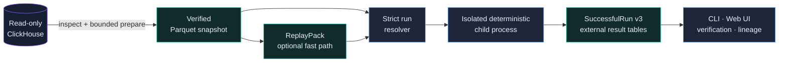

<div align="center">
  
  <br>
  <p>
    <a href="https://www.python.org/"></a>
    
    
    
    
  </p>
  <p><strong>Воспроизводимые ончейн-бэктесты из проверенных локальных artifacts — без SQL и сети в event loop.</strong></p>
  <p>
    <a href="#быстрый-старт">Быстрый старт</a> ·
    <a href="#что-умеет-проект">Возможности</a> ·
    <a href="#как-это-работает">Архитектура</a> ·
    <a href="#документация">Документация</a> ·
    <a href="#поддержать-проект">Поддержать</a> ·
    <a href="#участие-в-разработке">Участие</a>
  </p>
</div>

---

On-Chain Backtest Engine выборочно читает нужный диапазон из внешнего read-only ClickHouse,
публикует immutable canonical Parquet snapshot и воспроизводимо исполняет его на
одном Linux, macOS или Windows host с 16–32 GB RAM и локальным NVMe. На Windows
поддерживаемый путь запуска использует WSL2 с Ubuntu; native Windows runtime
ещё не прошёл полный compatibility gate.

Проект — Python modular monolith. CLI и Web UI используют одни application use
cases, тяжёлые задачи выполняются в изолированных child processes, а semantic
identity отделена от физических настроек запуска. S3, PostgreSQL, локальный
ClickHouse, Kafka, Kubernetes и multi-host workers не требуются.

> [!IMPORTANT]
> Реализованы reference stack и exact Pump.fun Sniping. Проект находится
> в alpha: каждый новый source range допускается только после собственного
> bounded evidence pass и может корректно завершиться fail closed.

> [!NOTE]
> Pump.fun Sniping теперь поддерживает отдельные identity-bearing
> mode `EXOGENOUS_REPLAY` и `EXOGENOUS_VIRTUAL_SETTLEMENT` через
> обязательные contracts draft v3, summary v3 и round-trip v4. Virtual
> settlement явно помечает synthetic sell funding и не является заявлением
> об on-chain execution. Смена mode требует нового resolution и меняет
> `logical_run_id`, но повторно использует те же verified
> Dataset/Snapshot/ReplayPack без extraction и compile-replay.

## Что умеет проект

| Возможность | Текущий контракт |
|---|---|
| Selective acquisition | Bounded read-only ClickHouse queries с explicit columns, hard limits и gap-safe prepare |
| Локальное хранение | Immutable canonical Parquet, verified manifests и content-addressed references |
| Детерминированный replay | Reference engine, mmap ReplayPack и optional DeliverySchedule без SQL/network в hot loop |
| Pump.fun Sniping | `EXOGENOUS_REPLAY` и явный synthetic `EXOGENOUS_VIRTUAL_SETTLEMENT`: exact non-Mayhem universe, `+500` global transactions до buy, `+2s` до sell decision, integer fees и ledger-authoritative PnL |
| Проверяемая эквивалентность | Canonical Parquet reference, ReplayPack reference и NumPy mmap optimized paths проверяются на byte-identical outputs в рамках одного допущенного exact contract |
| Управление задачами | Durable SQLite queue, isolated child processes, cancel/retry/recovery и bounded progress |
| Локальный интерфейс | Typed CLI, loopback-only Control API и реактивный same-origin Web UI с bounded arrow pagination, сортировкой по дате, adaptive polling и отдельным аналитическим Sniping dashboard |
| Жизненный цикл artifacts | Verification, lineage, pins, reachability GC, trash grace period и проверяемый backup/restore contract |
| Exact ML path | Point-in-time features, frozen predictions и безопасный integer-linear runtime |

UI загружает только одну bounded-страницу таблицы: по умолчанию 20 jobs,
10 runs и 25 Sniping round trips. Jobs и runs выбираются глобально от новых к
старым через opaque keyset cursors, поэтому новая запись не сдвигает уже
открытую continuation page. Run-порядок берётся из rebuildable manifest-bound SQLite-индекса, после
чего выбранные artifacts повторно проверяются. Альтернативные сортировки и
поиск явно действуют только на текущей странице, а стрелки запрашивают следующую
страницу с сервера вместо загрузки всей истории. Run list постоянно не
опрашиваются; повторные exact reads используют только bounded process-local
verification evidence, защищённый fingerprint-ом файлов. Clean restart при
неизменившемся local artifact inventory также использует durable receipt
rebuildable-индексов; crash, inventory drift или corruption возвращают полную
проверку.

## Как это работает



К внешнему источнику обращаются `inspect-source`, bounded `prepare-dataset`
и необязательная remote estimate в `plan-dataset`.
Compile, feature/ML и backtest paths читают только проверенные committed local
artifacts. Engine и Strategy не получают SQL-клиент, credentials или future
labels.

## Быстрый старт

Нужны Python 3.13 и [`uv`](https://docs.astral.sh/uv/). Linux x86_64 и macOS
arm64 запускаются нативно; Windows 11 x86_64 использует WSL2 с Ubuntu.

```bash
uv sync --all-groups --frozen
source .venv/bin/activate
backtest --help
```

Создайте gitignored local config и проверьте пути, порт, resource limits и
настройки источника:

```bash
cp configs/local-16gb.toml configs/local.toml
backtest serve --config configs/local.toml
```

В Windows PowerShell сначала установите и откройте WSL2:

```powershell
wsl --install -d Ubuntu
wsl
```

Затем внутри Ubuntu выполните обычную установку, но начните с Windows-профиля:

```bash
uv sync --all-groups --frozen
source .venv/bin/activate
cp configs/local-windows-wsl2-16gb.toml configs/local.toml
backtest serve --config configs/local.toml
```

Из Windows PowerShell можно в любой момент повторить repository-provided host
smoke (в примере checkout находится в `~/backtest` внутри Ubuntu):

```powershell
wsl --distribution Ubuntu --cd '~/backtest' -- bash scripts/windows-wsl2-smoke.sh
```

Рабочий `data_root` храните в Linux filesystem WSL2, а не в `/mnt/c` или
`/mnt/d`: crash durability и mmap semantics для Windows-mounted filesystem ещё
не прошли отдельную проверку. Native Windows runtime CI не заявляется.

Web UI откроется на `http://127.0.0.1:<port>` из секции `[control]`. Полный путь
от source inspection до первого exact run описан в
[инструкции по началу работы](docs/getting-started.ru.md). Credentials должны
поступать только через environment/keychain/local provider и не записываются в
TOML.

## Основной workflow

```text
inspect-source
  -> plan-dataset
  -> prepare-dataset
  -> compile-replay             # optional fast path
  -> resolve-run
  -> run / sweep
  -> show-run-summary / list-roundtrips
  -> verify-artifact / show-lineage
```

| Область | Основные команды |
|---|---|
| Source и dataset | `inspect-source`, `plan-dataset`, `prepare-dataset` |
| Replay | `compile-replay`, `compile-delivery-schedule` |
| Execution | `resolve-run`, `run`, `sweep` |
| Results | `list-runs`, `describe-run-contract`, `show-run-summary`, `list-roundtrips` |
| Operations | `verify-artifact`, `show-lineage`, pins, GC, backup и restore verification |

Актуальный синтаксис всегда доступен через `backtest <command> --help`; подробные
примеры собраны в [CLI reference](docs/cli-reference.ru.md).

## Честные ограничения

- Live admission привязан к exact cut. Новый диапазон, mapping или evidence
  operand требует новой подготовки; `UNKNOWN` нельзя превратить в `PROVEN`
  настройкой.
- Arbitrary plugin bundles, tree/ONNX/GPU tolerance runtime, stateful ML,
  PumpSwap execution, вторая network family и checkpoint/resume пока не
  реализованы и остаются fail closed.
- `EXOGENOUS_VIRTUAL_SETTLEMENT` исполняется, но намеренно остаётся
  synthetic: он не пересчитывает чужие сделки и не меняет исторические
  резервы, а sell output сверх observed real SOL не доказывает
  on-chain execution. Draft v2 нужно re-resolve-нуть как v3; committed
  summary v2/round-trip v3 читаются только в их исходной strict semantics.
- Linux x86_64 и macOS arm64 — native execution targets. Windows 11 x86_64
  поддерживается через WSL2/Ubuntu; native Windows execution и CI ещё не
  прошли обязательные durability, process и determinism gates.
- Remote source требует verified TLS/VPN/SSH либо явного локального принятия
  риска. Control API остаётся loopback-only.
- Backup считается backup только на другом physical device/host и после restore
  drill; другая директория того же NVMe не подходит.

Точный current-vs-target status зафиксирован в [§3.4 нормативного deep
dive](docs/architecture-deep-dive.ru.md#34-текущее-состояние-проекта). Если README и
deep dive расходятся, нормативным источником является deep dive.

## Документация

| Документ | Когда читать |
|---|---|
| [Начало работы](docs/getting-started.ru.md) | Настроить source, подготовить snapshot и запустить первый backtest |
| [Конфигурация](docs/configuration.ru.md) | Понять TOML, secret refs, transport и resource limits |
| [CLI reference](docs/cli-reference.ru.md) | Найти команды, exact IDs и рабочие сценарии |
| [Project layout](docs/project-layout.ru.md) | Разобраться в структуре репозитория и local data root |
| [Architecture overview](docs/architecture.ru.md) | Получить краткую карту системы |
| [Architecture deep dive](docs/architecture-deep-dive.ru.md) | Проверить нормативные invariants, identity и failure semantics |
| [Performance baseline](docs/performance-baseline.ru.md) | Воспроизвести и правильно интерпретировать benchmarks |
| [Навигация по docs](docs/README.ru.md) | Найти остальные руководства и контракты |

## Разработка и качество

Полный локальный gate после изменений кода:

```bash
.venv/bin/ruff format --check src tests
.venv/bin/ruff check src tests
.venv/bin/mypy src/backtest
.venv/bin/lint-imports
.venv/bin/pytest --cov=backtest --cov-report=term-missing
```

Live ClickHouse и performance tests запускаются отдельно и opt-in. Архитектурные
изменения не подразумеваются обычным feature request: сначала прочитайте
[нормативный deep dive](docs/architecture-deep-dive.ru.md).

## Поддержать проект

Если проект оказался полезен, можно поблагодарить переводом:

| Сеть | Адрес |
|---|---|
| Bitcoin | `bc1p7xa9amu9pjh5cear5dezulujg2fe86su0afg02w3cpxwp8rkychsvx3cmc` |
| Solana | `D7eLSxAPhJaVE9rjyFPeTK6xEsxis1RpQ5Q3FQRMUG1G` |
| TRON | `TGJFm8HHspMBcJ2maog88cTjzVrqz3izsB` |

Другие способы помочь — в [SUPPORT.ru.md](SUPPORT.ru.md).

## Участие в разработке

Перед первым pull request прочитайте [CONTRIBUTING.ru.md](CONTRIBUTING.ru.md). Для
сообщений об уязвимостях используйте приватный процесс из
[SECURITY.ru.md](SECURITY.ru.md), а по вопросам эксплуатации — [SUPPORT.ru.md](SUPPORT.ru.md).
История пользовательских изменений ведётся в [CHANGELOG.ru.md](CHANGELOG.ru.md).

## Лицензия

Проект распространяется по лицензии MIT. Полный текст находится в
[LICENSE](LICENSE).
Происхождение сторонних test layouts описано в
[Third-Party Notices](THIRD_PARTY_NOTICES.ru.md).

> [!WARNING]
> Это исследовательское программное обеспечение, а не финансовая рекомендация.
> Проверяйте данные, assumptions и результаты самостоятельно; не используйте
> alpha-версию для управления реальными средствами.

---

**Язык:** [English](README.md) · Русский
