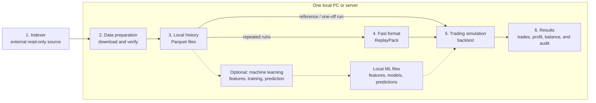
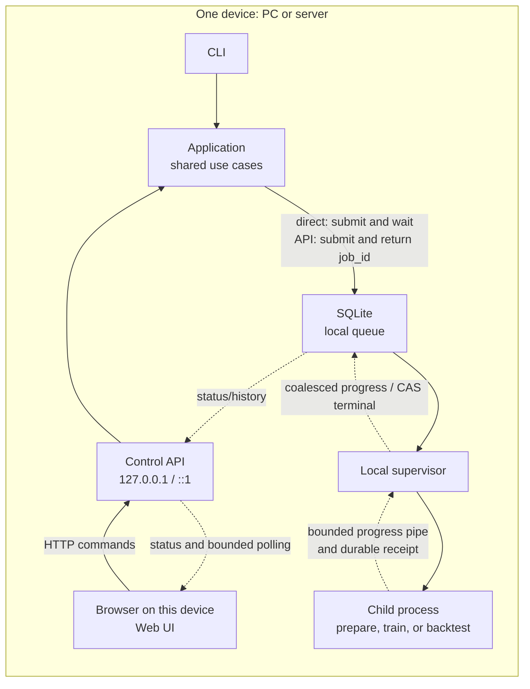
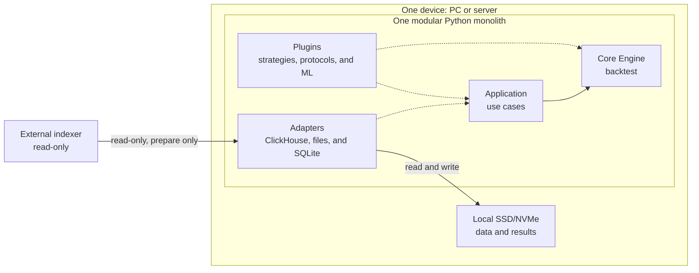
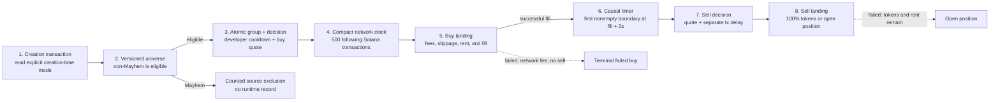

# On-Chain Backtest Engine architecture: deep dive

Status: accepted as the permanent detailed architecture description

> This is the complete normative description of the target architecture.
> [architecture.md](architecture.md) is its synchronized concise overview and
> does not introduce independent decisions. If anything is ambiguous, this deep
> dive applies; any discrepancy is a documentation defect and must be corrected
> in both files.

## How to read this document

- Sections 1–8: target solution, boundaries, and modules.
- Sections 9–17: data preparation, local storage, and Parquet.
- Sections 18–24: ReplayPack, engine, strategies, protocols, features, and ML.
- Sections 25–31: performance, disk, failures, and security.
- Sections 32–38: tests, CLI, roadmap, growth triggers, and Definition of Done.

## 1. The decision in one paragraph

The platform is built as **one Python modular monolith with hexagonal
boundaries**, running entirely on one PC/server with 16–32 GB of RAM and local
NVMe. External ClickHouse is a read-only source only. Data is materialized once
into a selective immutable Parquet snapshot. Repeated fast runs use a derived
`ReplayPack` built from that snapshot and read from NVMe through read-only
memory mapping.

One run executes in one sequential deterministic process. Only independent
runs run in parallel. The hot loop contains no SQL, network access, pandas,
string IDs, per-row validation, or element-by-element ML calls.

The CLI, Web UI, and Control API call the same application use cases. The
Control API places jobs in a local durable SQLite queue, and the process
supervisor starts them in isolated child processes. Neither the API nor UI
participates in the hot loop, so their presence does not slow market-event
processing.

The data path is always:

```text
remote bounded extraction
-> immutable local Parquet snapshot
-> direct reference run OR content-addressed ReplayPack for repeated runs
-> one deterministic local process per run
-> parallel independent runs within measured RAM/I/O budget
-> local results
```

The launch path can be:

```text
Direct CLI -> application use case -> local child process

or

Browser Web UI -> localhost Control API -> SQLite job queue
               -> local supervisor -> the same local child process
```

## 2. Hard constraints

The target single-host envelope is:

- one native Linux x86_64 or macOS arm64 host, or one Windows 11 x86_64 host
  through WSL2 with Ubuntu x86_64;
- 16 GB RAM as the minimum supported profile;
- 32 GB RAM as the recommended profile;
- one local NVMe;
- one researcher and one trusted codebase;
- batch backtests, feature builds, training jobs, and bounded research jobs;
- CPU-first, with an optional local GPU;
- external ClickHouse available only to source-facing `inspect-source`,
  `prepare-dataset`, the optional metadata estimate in `plan-dataset`, and
  the bounded research-only `research prepare` acquisition in section 24.6;
- `research analyze` is local-artifact-only;
- compilation, feature/ML jobs, and backtest runs using only committed local
  artifacts;
- optional Control API and Web UI on the same device;
- Control API listening only on localhost by default;
- every execution process using the same local data root and NVMe.

Windows support in the current runtime means WSL2/Ubuntu, not native Win32
execution. The repository and operational `data_root` MUST be inside the WSL
Linux filesystem, for example under `~/backtest`; `/mnt/c`, `/mnt/d`, other
DrvFS mounts, and network mounts are outside the supported publication/mmap
envelope. Native Windows remains fail closed: POSIX locks, process-group
isolation, resource observation, and directory-`fsync` publication MUST NOT be
replaced by partial compatibility. Separate native Windows support requires an
approved architecture decision in advance, Win32 adapters, and a complete
crash/concurrency/determinism gate.

The first version does not build:

- S3 or MinIO;
- PostgreSQL;
- its own ClickHouse;
- Redis, Kafka, or a distributed queue;
- Kubernetes;
- high availability;
- multi-controller consensus;
- multi-host workers/runners;
- mandatory always-running daemons for the normal CLI mode.

The Control API and Web UI start only through `backtest serve`. Normal CLI
commands may still exit after completing their work. Heavy external services
are added only after the measurable triggers in section 36.

## 3. System context

To avoid conflating different concepts, the architecture is presented in three
simple diagrams:

1. What happens to data.
2. How the CLI or Web UI starts a local job.
3. Which components make up the Python code inside a job.

### 3.1 What happens to data



If ML is unnecessary, the dotted branch can be ignored completely. The system
then becomes one continuous line: indexer → local history → fast reads →
backtest → results.

The primary path reads from left to right:

1. The indexer is an external read-only source of historical data.
2. `prepare-dataset` fetches only the required range and verifies it.
3. Verified history is stored locally in Parquet as the primary immutable copy.
4. ReplayPack is optionally built from Parquet to accelerate repeated runs.
5. The backtest reads the committed snapshot directly, or ReplayPack when its
   measured break-even justifies compilation, invokes the strategy, and models
   trade execution.
6. Trades, profit, portfolio state, audit log, and the exact launch-parameter
   file (`manifest`) are stored on local disk.

The ML branch is optional: it builds features, models, and predictions from the
same snapshot.

After step 2, the indexer is no longer used. Every remaining step runs on one
device with local NVMe.

### 3.2 How a local job starts

The diagram below shows the working single-host execution path. Direct CLI
waits synchronously for terminal state, while the Control API quickly returns
`job_id`, but both branches create a strict immutable `ResolvedJobSpec`, use
one durable queue, one supervisor, and the same isolated child process.



These are two alternative entry points into one implementation:

- Under exclusive controller authority, Direct CLI durably submits the job,
  starts a supervisor cycle, and waits for terminal state; this remains a
  synchronous CLI experience.
- The Web UI calls the Control API; the API stores the job in SQLite and the
  supervisor starts the same child process.
- The Control API quickly returns `job_id` and does not wait for the backtest
  to finish inside the HTTP request.
- The child does not open SQLite. Progress travels through a bounded
  non-blocking pipe, is coalesced by the supervisor, and is read by the UI as
  cursor-based bounded history; individual market events do not pass through
  the API or SQLite.
- After publication, the child durably publishes a completion receipt. Only
  the supervisor, after re-verifying the exact committed outputs, transitions
  the attempt to `SUCCEEDED`.
- Every node in the diagram runs on one PC/server, and computation and data use
  one local NVMe.

### 3.3 What is inside a job

Four definitions are enough to read the diagram:

- The Core Engine computes the backtest itself.
- Application defines the sequence of actions.
- Plugins add replaceable trading and ML logic.
- Adapters read the indexer and local files.



- Application use cases coordinate actions but contain no trading math.
- The Engine owns event ordering, portfolio state, and trade execution.
- Plugins add strategies, launchpads, features, and ML without modifying the
  Engine.
- Adapters isolate ClickHouse, files, SQLite, DuckDB, and PyArrow from the
  Engine.
- During a backtest, the Engine knows nothing about the indexer and performs no
  SQL/network calls.

## 3.4 Current project state

The implementation provides a production-oriented reference vertical slice of
the architecture and network-aware Pump.fun Sniping on verified local
artifacts. Live data requires exact, cut-scoped admission:

Pump.fun Sniping now exposes exactly two implemented, identity-bearing modes:
`EXOGENOUS_REPLAY` and `EXOGENOUS_VIRTUAL_SETTLEMENT`. The latter explicitly
splits a successful sell into observed venue-funded and synthetic-funded SOL;
it is deterministic under its declared model, not a counterfactual or
on-chain-executable liquidity claim. Both modes use the strict draft v3,
round-trip v4, summary v3, reference and optimized engines, and the same typed
CLI/API/Web UI contract. Changing the mode requires a fresh v3 resolution and
produces a different `logical_run_id`, order IDs, and round-trip IDs, but
reuses the same verified Dataset/Snapshot/ReplayPack without source
re-extraction or ReplayPack recompilation.

- the separate §24.6 wallet-research slice: bounded successful SOL-paired
  Pump observations, immutable ResearchSnapshot/ResearchResult, local DuckDB
  activity/co-buy analysis, exact source-row evidence, durable isolated jobs,
  and v2 same-source token-mode classification. Shared CLI/API resolution defaults
  to `NON_MAYHEM`, with explicit `ALL`; empty creation signatures are skipped
  in both modes with bounded per-mint warnings; filtering precedes activity, first buys,
  pair aggregation and thresholds. Separate Mayhem/UNKNOWN exclusions are visible.
  Legacy v1 remains readable and supports new ALL analyses; NON_MAYHEM on v1
  requires a fresh preparation. The source-row layout and Sniping are unchanged.
  The slice also provides a CLI and same-origin `/research` dashboard. The page explains first BUY per
  signer/mint within the snapshot, including missed later co-buys, and ships
  pinned local Cytoscape.js with zoom/pan/drag, accessible selection and exact
  pair-evidence navigation. Graph scope is either 25 page pairs / 50 nodes or
  an opt-in whole result up to 200,000 pairs / 5,000 participating wallets.
  The latter loads verified pages with progress, cancellation and exact
  completeness checks; search covers all loaded wallets, neighbour controls
  are paginated, and table navigation preserves the complete graph. Graph
  layout and selection are presentation only. Three levels show all visual
  groups, a group’s complete internal graph with external-pair drilldown, and
  a wallet’s global neighbours, with optional neighbour-to-neighbour pairs.
  Internal/cross-group totals reconcile, grouping is bounded and deterministic,
  and only the active projection enters Cytoscape. Signer/payer roles and duplicate
  multiplicity are preserved; completeness, finality, source consistency and
  causal availability remain `UNKNOWN`. Hermetic source contracts and isolated
  CLI/API execution are verified; the real-browser workflow and installed-wheel
  CLI/child/API/assets gate passed. Local analysis of one saved v1, all-mode live-source
  cut with 97,040 rows and 10,075 signers passed at 180, 1,000 and 3,600-second
  windows with an empty signer selection. Compact native keys preserve exact
  output bytes within unchanged resource quotas; [capacity evidence](research-capacity.md)
  records the scoped comparisons. This does not establish general
  live-source capacity or fidelity. Transfers, full wallet PnL, owner clustering
  and automatic strategy promotion remain unimplemented;
- an installable Python 3.13 package, reproducible `uv.lock`, hexagonal ports,
  Import Linter/AST guardrails, and separate CLI/serve/child composition roots;
- the current source stack uses `bounded-source-evidence/v2`, network-aware
  `source-inspection/v5`, canonical `backtest.dataset-plan/v4`, and
  `DatasetSpec` v5 with a typed `BlockRange`. DatasetSpec v5 includes the
  versioned `global-transaction-duration-roundtrip/v1` settlement requirement
  and exact source-normalization/evidence binding; evidence v1, inspection
  v1–v4, dataset plan v1–v3, and DatasetSpec v1–v4 receive
  `REPREPARE_REQUIRED`. `inspect-source`, selective `plan-dataset`, and bounded
  read-only ClickHouse extraction use a fixed Pump source profile, explicit
  columns, hard limits, streaming batches, a prohibition on
  `SELECT *`/`OFFSET`, and secret redaction. A bounded evidence pass performs
  four coordinated stream passes, deterministically splitting them into
  internal shards no wider than 4096 blocks when needed, and publishes exactly
  one aggregated generated receipt per capability only after successful
  cross-stream verification. Static capability TOML cannot declare `PROVEN`.
  Solana `slot` remains only a physical mapping inside the source adapter;
- production `prepare-dataset`: canonical schema v3,
  `canonical-distribution/v5`, `canonical-snapshot/v4`, sorted immutable
  Parquet, snapshot manifest, QA/fidelity boundaries, and gap-safe incremental
  reuse. Reuse requires exact network/position/source/capability/schema/range/
  revision/watermark, build key, and verified bytes; an unknown mutable shard
  is read again, and the frontier never jumps over a missing, failed, or
  quarantined gap. Before snapshot-root publication, the Sniping read-only
  candidate validator checks clock, positions, transaction groups, causal
  launch classification under the versioned universe policy, Pump state
  transitions for eligible launches, and the settlement path of every
  decision-range target;
- an atomic local artifact repository with staging, hashes, `fsync`, locks,
  rename, `COMMITTED`, reader verification, collision quarantine, and a
  rebuildable catalog;
- canonical Parquet replay, network-aware `replay-pack/v3` with compact
  block/all-transaction clock arrays, a content-addressed NumPy mmap reader,
  and optional DeliverySchedule with dynamic/materialized equivalence;
- an exact reference engine with atomic historical groups, separated states, a
  causal scheduler, integer constant-product execution, asset-tagged network
  costs, and a correlated double-entry `run-ledger/v2`; FirstSwap strategy and
  a readable Pump.fun Sniping reducer. The Sniping reference path implements a
  post-creation-group quote, 600-second developer cooldown, buy after `+500`
  global transactions, sell decision after `+2s`, a separate sell latency,
  Pump/Solana fees, slippage, rent/cashback, and realized/open PnL integer math;
- a separate `numpy-mmap-pumpfun-sniping-v1` backend with SoA state, compact
  clock, bounded arena, and buffered outputs. Checked-in hermetic tests compare
  it with reference Parquet and reference ReplayPack by normalized audit,
  ledger, fills, round trips, balances, and result hash across different batch/
  readahead values;
- a resolver that materializes defaults and pins the exact semantic reference
  bundle closure, configs, runtime, and artifact dependencies in an immutable
  `ResolvedRunSpec`. The strict `pumpfun-sniping-run-draft/v3` requires one of
  the two supported execution modes and embeds
  `pumpfun-solana-wallet-account-profile/v2`; the resolver materializes the
  matching immutable settlement semantics. Legacy draft v2 receives
  `RERESOLVE_REQUIRED`, while aliases and missing dependencies cannot reach
  execution;
- one durable SQLite execution path for Direct CLI and API: strict job-specific
  payload parsers, immutable `ResolvedJobSpec`, idempotency, atomic claim, CAS,
  resource admission, an isolated SQLite-free child, bounded progress pipe,
  durable receipts, cancel/retry, and restart reconciliation;
- a loopback Control API and packaged same-origin Web UI with typed prepare,
  backtest/sweep, ML, and Pump.fun Sniping forms, cursor-based progress polling,
  run comparison, artifact/lineage queries, and resource status;
- shared warm-sunset (default) and original dark appearance choices on all
  React screens. A closed browser-local preference applies
  before first paint and synchronizes across tabs; unavailable browser storage
  leaves an explicitly tab-only choice. Appearance does not enter API commands,
  execution identity, result values, or pagination;
- controller identity and a strict loopback CLI client: health returns only a
  digest derived from the concrete controller instance and canonical local
  data root, not the path itself. The CLI first checks the owner of
  `controller.lock`, verifies that identity, and only then delegates a
  supported command. A missing/malformed owner, unreachable/mismatched peer,
  or competing non-delegable command fails closed before the local SQLite/
  application container opens;
- bounded query projections: job status returns operational submit/update time
  plus input count/digest, not an executable payload or complete input-reference
  list. Run list/get returns start/completion time, scalar exact hashes/counters,
  physical settings, canonicality, bounded warnings, and
  `final_balances_count`/`final_balances_digest`, not a balance array. Job pages
  use `submitted_at_ns DESC, job_id DESC`; run pages are globally newest-first.
  Browser arrows for both lists use scope-bound opaque keyset cursors; the
  bounded offset path remains only for compatibility.
  Run pagination uses the rebuildable `run_index`, ordered by integer UTC
  completion epoch descending and exact Run
  artifact ID ascending; every selected bounded page is rechecked against its
  verified `successful-run/v3` manifest. Missing, dirty, or stale projection state fails
  closed instead of silently omitting or misordering a run. Alternate allowlisted
  UI sorts affect only the loaded bounded page. Full verified manifest and
  lineage are read through separate metadata endpoints with hard limits;
- rebuildable catalog indexes carry a durable `CLEAN`/`UNCLEAN` restart
  receipt. A clean unchanged inventory avoids payload re-hashing; crash,
  migration, offline inventory change, index drift, or corruption forces full
  verification and remains fail closed;
- Pump.fun run-contract discovery and an exact result-query surface: bounded
  summary, keyset pages of at most 200 round trips, a combined bounded
  summary-plus-one-page dashboard projection, matching CLI commands, and a
  shared packaged React Strategy results screen. Summary cards use verified
  metadata; supplemental whole-run distributions use the separately bounded
  §34.2 result scan. Tables manually load keyset pages and retain one row page. Atomic amounts, boundary/time
  values, and PnL travel over the transport as decimal strings; the browser
  receives no raw paths, Parquet, or SQL. Newly produced runs use
  `pumpfun-sniping-run-summary/v3` and `pumpfun-roundtrips/v4`: execution mode,
  settlement policy, liquidity evidence and venue/synthetic funding accompany
  component-level account lifecycle, fee/deposit/slippage aggregates, and
  valuation completeness across engine, manifest, CLI, API, and UI. Committed
  summary v2 and round-trip v3 remain readable only under their original
  strict meaning;
- `successful-run/v3` with a bounded summary/descriptors and streaming external
  `roundtrips.parquet`/`final_balances.parquet`; unbounded balance rows are not
  embedded in the manifest;
- an operator surface with artifact verification, run/lineage queries, durable
  pins, reachability GC, trash purge, a verified different-device backup cut,
  and an empty-directory restore drill;
- point-in-time FeatureSet, Universe, LabelSet, exact integer-linear
  ModelBundle, walk-forward ModelSchedule, frozen PredictionSet, and embedded
  exact-linear inference. The embedded path loads selected models once and
  precomputes bounded batches into a quota-limited temporary mmap before the
  event hot loop;
- a reference/optimized equivalence harness for the narrow FirstSwap backend
  and mode-specific Pump.fun Sniping closures. Hermetic equivalence does not
  establish live-source throughput or admit an arbitrary source cut;
- an exact artifact-bound benchmark harness for eight workload types: closed
  1/7/30 capacity, batch/readahead/process grids, profile-before-admission,
  spawn workers, cache evidence, and atomic benchmark reports. Direct/control
  comparison uses a real `DirectJobExecutor` and real loopback HTTP plus the
  durable queue/supervisor path in an isolated local data root.

“Production-oriented” here means complete publication, identity, causality,
failure, and child-isolation contracts for the checked-in reference stack.
“Hermetic Pump.fun Sniping slice” means that code, immutable bundles, resolvers,
engines, result adapters, and interfaces run on verifiable local fixtures with
an explicitly proven source contract. Hermetic evidence alone does not prove
live-indexer fidelity. Every live cut requires its own bounded source proof.
A new `inspect-source` determines live schema and capabilities; checked-in
Pump.fun capability/projection examples deliberately have `UNKNOWN` proofs,
and remote estimates remain `UNKNOWN` without a verified estimator.
Representative 1/7/30-day, cold/warm, extraction/ML/control-plane, and
operational evidence must be collected for the concrete deployment.
Deployment admission also requires verified TLS/VPN/SSH transport or explicitly
enabled deployment-local `allow_insecure_remote_http` with accepted risk,
bounded four-stream schema/fidelity validation, cold/warm runs without swap
on the supported 16/32 GB profile, and an encrypted backup generation with a
recorded restore on another physical device/host. If code is not preserved by
a durable Git remote, the deployment must retain a separate durable
code/config/lockfile archive.

The fail-closed boundary remains explicit: exact embedded ML currently supports
only the safe integer-linear runtime; tree/ONNX/GPU tolerance and stateful modes
are not connected. FirstSwap and Pump.fun optimized backends accept only their
exact allowlisted semantic closures and reject conditional protocol replay,
causal overlays, incompatible schedule/ordering, and other configs before
mutation. Production Pump.fun admission rejects every `UNKNOWN` proof, gap,
incomplete settlement tail, missing/unknown launch mode, unsupported eligible
mode/version, or legacy artifact. Known `mayhem_mode=true` is an accounted
universe exclusion in bounded source evidence, not an unsupported target. SSE
is not implemented; the UI uses bounded polling. Backup is unavailable without
a configured different physical device/host but does not block backtest execution.
Resume/checkpoint and automatic acquisition-requirement assembly from arbitrary
plugin registries are likewise not presented as working features. The packaged
React UI implements `resolve -> submit -> progress -> result -> lineage`
through the shared loopback API. Sniping, Copy Buy, and FirstSwap use one
Strategy results structure; the legacy scripts and separate HTML dashboards
have been removed. Old result bookmarks resolve to the same React shell.
Its lifecycle checks are hermetic and do not extend live-source admission or
establish deployment-wide production readiness.

The generic network foundation and Pump.fun Sniping are now part of the
implemented surface for verified local artifacts, with explicit cut-scoped
source admission and execution/performance gates. `NetworkId`,
`PositionSchemaId`, `BlockRange`, and `ChainPosition` pass through source,
snapshot, ReplayPack, run, and result identities; legacy pre-network artifacts
are rejected with `REPREPARE_REQUIRED`, without an implicit Solana default or
in-place migration. Reference and dedicated optimized Sniping backends, strict
draft, resolver, CLI/API/UI, and external results are implemented and covered
by focused hermetic tests.

The normative Sniping universe policy excludes Mayhem before execution. Its
exact policy ID is
`successful-sol-paired-non-mayhem-pumpfun-launches-in-decision-range-v2`.
The checked-in universe bundle, resolver, reference/NumPy runtime guards, and
live normalizer/evidence path pin policy v2: eligible normal legacy, Token-2022,
and cashback remain, while excluded launches contribute only to the bounded
classified/excluded count and ordered digest. Hermetic tests cover this
closure; the former implicit all-modes policy receives
`REPREPARE_REQUIRED` and is not reinterpreted.

Mode-aware account lifecycle is also a current working contract. The strict
`pumpfun-sniping-run-draft/v3`, embedded
`pumpfun-solana-wallet-account-profile/v2`, and `pumpfun-roundtrips/v4`
implement a mode-specific ATA for every mint and one wallet-scoped Pump
UserVolumeAccumulator. `fresh`/`prewarmed` describes only initial UVA state;
reservation, one-time creation, failed-landing rollback, successful ATA close,
locked failed-sell state, and ledger-authoritative PnL use one shared reducer in
the reference and NumPy backends. Draft v2 receives `RERESOLVE_REQUIRED`;
committed summary v2/round-trip v3 remain readable under their original
meaning, while draft/account v1 and round-trip v2 cannot enter new execution.

Live `pumpfun-curve-trade-normalizer/v2` is implemented and preserves a
successful one-zero-leg dust transition while rejecting a both-zero no-op;
simulated quotes/fills remain strictly positive. Raw Pump trade rows from this
source contain no separate protocol/creator fee columns. The normalizer derives
both components from the exact curve SOL leg using the pinned effective-dated
95/30-bps profile and its integer rounding rules. These components are
therefore deterministic derived-not-observed values: evidence binds the fee
formula/profile and normalizer digest but does not claim that the source
observed separate transfer columns.

Versioned sentinel and lifecycle normalizers are implemented too. A canonical
Unix-epoch/zero-transaction sentinel with pinned hash/validator closes only
skipped-slot coverage and creates no clock boundary. A terminal group is
normalized as `buy_v2 -> derived completion -> migration` at one transaction
boundary. The interim bundle policy counts a bundled buy only when a successful
`BUY` for the same signature/mint appears after the create instruction in the
same creation transaction. A successful `SELL` in the same transaction still
applies to the curve atomically before the strategy decision, but is not a
bundled buy; source `bundled_buys_count` remains non-binding metadata.

Live source admission is always cut-scoped. A successful bounded proof must
cover the exact decision range and its settlement tail before inspection,
snapshot, ReplayPack, or run publication. Missing transitions produce
`CURVE_TRANSITION_MISMATCH`; partial clock or bundle checks do not permit an
inspection artifact or downstream closure. A TOML flag or manual `PROVEN`
cannot bypass rejection. Production admission also requires mode-specific
three-way exact equivalence and the representative performance gate for the
declared cut. Cold-cache and 7/30-day/deployment measurements remain separate
requirements. A second network family, PumpSwap execution, and cross-network
runs are outside this slice and fail closed.

External source volume is not bounded by local capacity. Full mirrors are
outside the architecture; extraction is limited to specific experiments.

The separate §23.5 Pump.fun copy-buy reference slice is implemented end to end:
independent signer coverage, bounded older-curve initialization and all-market
history, pre-root four-attempt settlement validation, integer price TP/SL and
holding timer, shared wallet/account/ledger execution, immutable external
position results, resolver, Direct CLI, Control API and Web UI. Copy-only
receipt v3, inspection v6, DatasetSpec v6 and plan v5 feed
`pumpfun-copy-buy-run-draft/v1`, `pumpfun-copy-run-summary/v1` and
`pumpfun-copy-position/v1`. Both exogenous modes pass the hermetic execution
and accounting gates. Canonical Parquet and ReplayPack reference outputs
match, including actual Parquet batch/readahead variation and independent
repeat runs in the integration fixtures.

The shared React Strategy results screen shows whole-run summary charts,
entry/exit/attempt distributions and a manually paged signal table for Copy Buy
and Sniping. `/copy-results` and `/sniping-results` are compatibility aliases.
Each Pump position opens a market-cap chart from the run's exact retained
canonical snapshot through an application query port. The Pump projection uses full supply times the virtual-reserve
marginal price, floored in SOL lamports, after complete transaction groups.
Creator or leader signals, actual filled entries/exits and failed/rejected
attempts keep separate markers and exact chain coordinates. The curve line ends at completion
or migration; there is no PumpSwap or USD history. Interactive reads admit at
most 10,000,000 input rows (at most 500,000 clock rows), 128 partitions, 1 GiB of Parquet, 50,000 selected
venue events, 4,000 output points and six markers, with one active history scan
and a ten-second cooperative scan deadline. Selection happens in bounded
columnar batches before Python event decoding; unrelated venues are not replayed.
Every input still passes committed-byte authentication, exact snapshot and
distribution-manifest/schema/count checks under leases. Selected rows retain
semantic digest and transaction-clock validation and canonical ordering. This
post-run projection trusts the authenticated successful run's exact input closure;
it does not replace the full logical-stream verification required for execution.
Oversized or unavailable history fails explicitly; no truncated chart, new
persisted artifact, external-source request or replay-semantic change is made.

The complete UI is now React/TypeScript: overview, run history/comparison,
launch, jobs/events, data preparation, all six typed ML forms, resources,
manifest and React Flow lineage. Warm sunset is the default; dark theme and
mobile navigation share the same components. Radix controls, React Hook Form
with Zod, TanStack Query/Table and Recharts replace the old manual DOM/SVG
implementations. Node is build/test tooling only; the Python wheel contains
all same-origin static assets and lazy chunks.
English is the default presentation language, including API messages, labels,
number/date formatting and accessibility text. A closed English/Russian
browser-local choice synchronizes across tabs and preserves mounted forms and
result selections; unavailable storage leaves a tab-only choice. Language and
appearance do not enter commands, query identity or stored financial values.
The sidebar brand is `onchain backtest engine`.

The common `strategy-results/v1` query views preserve stored family facts and
use existing position IDs or FirstSwap ORDER IDs. FirstSwap correlates actual
columnar fills with audit outcomes; PnL/round-trip/chart concepts without a
defined policy remain explicitly inapplicable. Optional `strategy-analytics/v1`
reductions are bounded by §34.2 and return typed busy/quota errors without
partial statistics. No engine, source, artifact identity or financial policy
changed. Component tests, real Chrome lifecycle/CSP/mobile checks, the full
section 33 gate and installed-wheel CLI/API/static checks cover this cutover;
these are hermetic UI evidence, not new live-source admission.

Live copy admission requires exact evidence for the selected wallets and
source cut. The CLI and browser/API/queue paths passed a small local technical
trial; that evidence applies only to its exact wallets and cut and does not
establish profitability or production performance. Optimized copy execution,
materialized delivery schedules, ML overlays, PumpSwap routing and any source
cut without its own exact evidence remain unavailable. Existing Sniping
semantics, artifact versions and cut-scoped admission are unchanged.

## 4. Why a modular monolith

Here, monolith means one distribution, not one giant module or one OS process.
The distribution has three working entry modes: Direct CLI, `backtest serve`,
and the job child process. All three compose the same application/domain
modules through a shared bootstrap; the child receives an exact canonical
launch envelope, does not open SQLite, and returns only bounded progress and a
durable receipt. On one host this provides:

- zero network latency between modules;
- one virtual environment and lockfile;
- straightforward debugging and profiling;
- atomic application of venue transition and ledger postings;
- no serialization between engine, strategy, and execution model;
- minimal steady-state RAM and CPU load.

Hexagonal boundaries are still required:

- domain knows nothing about ClickHouse, DuckDB, SQLite, or PyArrow;
- strategy does not know where data is stored;
- a protocol plugin does not depend on a concrete indexer transport;
- the local filesystem can later be replaced by another adapter;
- the Python reference reducer can later be accelerated without changing
  semantics.

The Control API does not turn internal modules into microservices. It is
another inbound adapter beside the CLI: HTTP ends at the application boundary;
synchronous control use cases run in the API process, while a heavy command is
only durably queued. The Engine and plugins then run in-process inside an
isolated child from the same distribution. The Web UI is a thin API client.
There is still no network boundary in the hot path.

## 5. Physical execution on one device

The deployment has only two physical boundaries:

- an external read-only indexer available only to data-preparation commands;
- one local PC/server containing the Control API, process supervisor, Python
  execution processes, and local NVMe.

The same package supports two modes:

| Mode | Running components | Use case |
|---|---|---|
| Direct CLI | Command, durable queue/supervisor lifecycle, and required child; API/UI off | Scripts, CI, one-off run |
| Local UI | `backtest serve`, Web UI, Control API, and local supervisor | Interactive work and monitoring |

In both modes, all computation and data stay on one host. The browser is only a
thin interface: it receives no Parquet/ReplayPack and computes nothing.
Parquet, ReplayPack, models, SQLite, and results are ordinary local files.

In UI mode, an HTTP request never executes a heavy backtest synchronously. The
Control API validates the command, creates a durable SQLite job, and quickly
returns `job_id`. The local supervisor starts the job in a separate child
process, while the UI receives infrequent progress events.

`backtest serve` holds an exclusive `controller.lock` for its lifetime.
Mutating Direct CLI holds the same lock for the duration of a command. The
server therefore cannot start in the middle of a direct write, and a second
supervisor cannot appear. While the server holds the lock, mutating CLI either
sends the command to the loopback Control API or exits with a clear error.
Read-only CLI can read committed artifacts through ordinary reader locks.

The owner record in the lock and `/api/v1/health` are tied through the
domain-tagged
`control_plane_id = H("backtest.control-plane-identity", schema, canonical
resolved data root, controller instance ID)`. This is the operational identity
of one local controller and is excluded from run/artifact identities. Only the
digest—not the path or lock record—is returned externally. The CLI first tries
to acquire authority; if the lock is already held, it validates the owner
record, contacts only the configured loopback address, and requires exact
`control_plane_id` equality. Supported job/query operations then use the
strict bounded HTTP client; a non-delegable mutation receives a typed
controller conflict. Local SQLite composition does not start before this
decision, so the CLI does not create a second operational writer even in a race
with server startup.

A typical lifecycle:

```text
inspect -> plan -> prepare -> validate -> commit snapshot
                                      -> compile replay
                                      -> run one or many backtests
                                      -> analyze/export
```

During a latency-sensitive run, heavy extraction, compaction, or training does
not start by default. A simple local admission controller blocks conflicting
heavy jobs.

## 6. Roles of local technologies

| Component | Role | Does not |
|---|---|---|
| Python | Use cases, engine, plugins, CLI, and Control API | Store giant rows as objects |
| Web UI | Job creation, status, results, and lineage | Execute backtests or read data files |
| Control API | Command validation, job control, query endpoints, bounded progress history | Participate in the event hot loop |
| Local supervisor | Admission control and child processes | Change engine semantics |
| Local filesystem | Authoritative committed artifacts | Back itself up |
| Parquet | Canonical snapshots/features/results | Have to be the fastest replay format |
| Arrow IPC | Typed mmap event buffers | Define retention; the manifest does |
| NumPy `.npy` | Dense mmap indexes/features/predictions | Replace the schema manifest |
| DuckDB | In-process ETL, joins, research SQL, and spill | Participate in the hot loop |
| SQLite | Jobs, refs, pins, and searchable metadata | Make missing bytes committed |
| NVMe | Sequential data path and OS page cache | Provide HA/DR |

These roles are already represented by the production adapters in the
reference slice. PyArrow and DuckDB publish and read canonical Parquet in
bounded batches; NumPy stores ReplayPack, DeliverySchedule, and dense ML
overlays in verified read-only mmap; SQLite serves queue/attempts/events, shard
ledger, artifact/lineage index, pins, and completion records. Verified
filesystem commit remains authority for artifact bytes, and SQLite indexes do
not legitimize missing files.

DuckDB and SQLite are embedded libraries, not daemons. While idle they retain no
separate processes and do not continuously consume RAM.

The Web UI ships as prebuilt static assets inside the Python distribution.
Production requires no separate Node.js process. One lightweight ASGI process
serves the API, static UI, and bounded progress polling; heavy jobs always run
in child processes.

The initial dependency policy is:

- one primary analytical engine: DuckDB;
- PyArrow for Parquet/IPC and batches;
- NumPy for compact numeric state and dense overlays;
- standard-library `sqlite3` for the catalog;
- do not add Polars until DuckDB/PyArrow shows a measurable gap.

This reduces the dependency surface and avoids three parallel dataframe APIs.

## 7. Proposed Python package structure

```text
pyproject.toml
src/backtest/
  domain/
    identifiers.py
    time.py
    market_events.py
    intents.py
    execution.py
    ledger.py
    fidelity.py
  engine/
    scheduler.py
    historical_state.py
    observed_state.py
    simulation_state.py
    portfolio.py
    audit.py
    rng.py
  application/
    ports/
      source.py
      artifacts.py
      catalog.py
      jobs.py
      progress.py
      processes.py
      replay.py
      strategies.py
      models.py
    use_cases/
      inspect_source.py
      plan_dataset.py
      prepare_dataset.py
      compile_replay.py
      compile_delivery_schedule.py
      run_backtest.py
      run_sweep.py
      build_features.py
      train_model.py
      submit_job.py
      cancel_job.py
      query_jobs.py
      query_runs.py
      gc.py
      verify.py
  adapters/
    source/clickhouse/
    artifacts/localfs/
    catalog/sqlite/
    process/local/
    query/duckdb/
    columnar/arrow/
    results/localfs/
  plugins/
    protocols/
      pumpfun/
      pumpswap/
      raydium/
      meteora/
    strategies/
    features/
    models/
    execution/
    risk/
    universe/
    valuation/
  runtime/
    resource_budget.py
    process_supervisor.py
    local_job_runner.py
    controller_lock.py
    thread_limits.py
    file_locks.py
  bootstrap/
    config.py
    container.py
    cli.py
    serve.py
    job_child.py
  interfaces/
    cli/
      main.py
    api/
      app.py
      routes_jobs.py
      routes_runs.py
      routes_artifacts.py
      routes_system.py
      schemas.py
    web/
      static/
tests/
  unit/
  property/
  contract/
  golden/
  integration/
  e2e/
  performance/
```

This is one package and one environment. The CLI, Control API, and Web UI are
inbound interfaces to the same use cases. Internal directories do not become
separate services or wheels before the API stabilizes.

## 8. Dependency direction and ports

The import rule is:

```text
interfaces/adapters/plugins -> application ports -> engine/domain
bootstrap -> everything for wiring
domain/engine -X-> adapters, CLI, Control API, DuckDB, SQLite, ClickHouse, PyArrow
```

The key ports are:

```python
class SourceReader(Protocol):
    def list_capabilities(self, source_id: SourceId) -> tuple[CapabilityDescriptor, ...]: ...
    def scan(self, request: ExtractionRequest) -> Iterator[IndexedBatch]: ...


class ArtifactRepository(Protocol):
    def stage(self, spec: ArtifactDraft) -> ArtifactWriter: ...
    def open_committed(self, artifact_id: ArtifactId) -> ArtifactHandle: ...


class JobQueue(Protocol):
    def submit(self, spec: ResolvedJobSpec, idempotency_key: str) -> JobRecord: ...
    def request_cancel(self, job_id: JobId) -> None: ...
    def claim_next(
        self,
        supervisor_instance_id: str,
        capacity: ResourceCapacity,
    ) -> JobAttempt | None: ...
    def transition(
        self,
        attempt_id: AttemptId,
        expected_version: int,
        new_state: AttemptState,
        result_artifact_id: ArtifactId | None = None,
    ) -> JobAttempt: ...


class ProgressSink(Protocol):
    def publish(self, event: ProgressEvent) -> None: ...


class ProcessRunner(Protocol):
    def spawn(self, attempt: JobAttempt) -> ProcessHandle: ...
    def probe(self, handle: ProcessHandle) -> ProcessStatus: ...
    def terminate(self, handle: ProcessHandle, grace_seconds: float) -> None: ...


class ReplaySource(Protocol):
    def boundaries(self) -> BoundaryReader: ...
    def event_batches(self) -> Iterator[EventBatch]: ...


class Strategy(Protocol):
    def requirements(self) -> StrategyRequirements: ...
    def on_event(self, event: EventView, ctx: StrategyContext) -> Iterable[Intent]: ...
```

The domain contract describes semantics but does not require the hot loop to
create one Python object per event. An adapter may implement `EventBatch` as
typed array views.

API routes do not access SQLite or the filesystem directly. They validate
transport DTOs, invoke an application use case, and transform the result into a
versioned response DTO. This allows the CLI and API to share contract tests and
the web framework to be replaced later without changing the core.

Introduce an interface only at a real seam. A port is not required between
every pair of functions.

## 9. End-to-end workflow

### 9.1 `inspect-source`

- reads metadata without mutation;
- stores a schema fingerprint without credentials;
- describes capabilities and fidelity;
- for an explicit half-open evidence range, executes four bounded read-only
  stream passes with explicit columns; deterministically splits larger ranges
  into internal shards no wider than 4096 blocks, while inspection embeds one
  aggregated generated receipt per capability;
- does not create a local mirror.

Metadata-only inspection and a bounded evidence pass are not two sources of
truth. The second mode adds verifiable provenance for a concrete source cut to
the same declarative schema. A proof status not derived from executed checks
remains `UNKNOWN`.

### 9.2 `plan-dataset`

- combines strategy, execution-model, feature, and warmup requirements;
- derives network, position schema, protocols, capabilities, columns, decision
  range, and capability-specific half-open block ranges;
- adds a bounded right settlement tail sufficient for every already-permitted
  decision, order latency, and liquidation lifecycle;
- produces a dry-run budget;
- fails fast on insufficient fidelity or quota excess.

The current `PlanDataset` compiles `DataRequirement` values already supplied
by the caller; automatic assembly from strategy/feature/model registries is not
implemented. No remote estimator is connected in bootstrap, so source/local
byte estimates are normally `UNKNOWN`; proven fidelity, day, and disk
violations are still rejected.

For Pump.fun Sniping, one requirement MUST carry
`global-transaction-duration-roundtrip/v1`: target stream, settlement streams,
500-transaction initial delay, two-second minimum duration, maximum permitted
sell latency, and a hard `maximum_tail_blocks`. The planner conservatively
extends only settlement streams once across that complete bounded cap;
`TOKEN_LAUNCH` ends with the decision range. A caller-specified tail above the
cap, source watermark below the required boundary, or quota failure for this
extraction produces a typed fail-closed result. The planner does not perform
unbounded iterative fetching.

The same requirement pins the exact universe policy
`successful-sol-paired-non-mayhem-pumpfun-launches-in-decision-range-v2`. The
launch stream is still extracted for every successful SOL-paired creation in
the decision range; otherwise the denominator and causal classification of
Mayhem exclusions cannot be proven. Trade/lifecycle settlement is needed only
for eligible non-Mayhem targets; source pushdown cannot remove a launch before
checking its explicit creation-time `mayhem_mode`. The policy ID, source
mapping/query digest, and projector/config digest enter DatasetSpec dependency
identity. Changing any operand requires new bounded evidence and preparation,
not reinterpretation of the old artifact.

### 9.3 `prepare-dataset`

- extracts bounded shards in streaming batches;
- normalizes source records;
- applies the protocol projector;
- performs as-of joins, cross-capability transaction-clock checks, and QA;
- publishes immutable Parquet partitions and a snapshot manifest.

When a settlement requirement is present, individual distributions do not yet
form an executable snapshot. The store assembles a read-only candidate from
verified committed distributions, and before calculating and publishing the
snapshot root a protocol validator checks:

- one network/position identity and exact event/capability mapping;
- strict canonical order, transaction grouping, and `event_index`;
- compact-clock coverage for every transaction position plus separate proof of
  continuous source slots, correctly excluding known skipped-slot sentinels
  from canonical boundaries;
- complete causal launch classification under the exact universe policy and a
  binding to the bounded source-evidence/validation exclusion count and digest,
  with no unknown mode;
- versioned Pump state/lifecycle transitions for eligible launches after atomic
  group apply;
- for every eligible target in the decision range, a boundary for `+500`, the
  first nonempty boundary no earlier than `+2s`, and landing after the maximum
  prepared sell latency.

Any rejection leaves the snapshot root invisible. Already committed orphan
distributions do not form a snapshot and are handled later by reconciliation/
GC. This local candidate validation does not elevate `UNKNOWN` upstream
fidelity and does not replace generated inspection receipts.

### 9.4 `compile-replay`

- sorts the canonical stream;
- builds stable numeric dictionaries;
- separates envelopes and type-specific payloads;
- stores the compact block clock as arrays of block ordinal, transaction count,
  cumulative transaction prefix, and block time without expanding an object
  for every network transaction;
- builds only generic offsets/indexes independent of latency or seed;
- publishes a rebuildable mmap ReplayPack.

### 9.5 `compile-delivery-schedule` (optional)

- accepts an already resolved ReplayPack, latency/clock policies, RNG, and
  scheduler versions;
- materializes only the observation-delivery stream for a frequently repeated
  policy;
- publishes a separate rebuildable DeliverySchedule with its own content ID;
- does not embed run-specific latency in a generic ReplayPack.

If a schedule does not repay compilation/disk cost, `run-backtest` builds the
same stream in bounded in-memory batches. Both paths MUST be scheduler-
equivalent.

### 9.6 `run-backtest`

- opens only committed local artifacts;
- passes compatibility preflight;
- performs causal replay without network/SQL;
- buffers audit/results;
- publishes RunManifest only after successful completion.

Decision range and replay range are different concepts. Strategy may create new
targets only inside the decision range, but already-created orders/timers MUST
complete on the right settlement tail. If the source watermark or hard quota
cannot prove a sufficient tail, `plan-dataset`, preparation, or the run fails
closed; an unfinished trade does not disappear from the result as a silently
censored observation.

### 9.7 `run-sweep`

- builds a list of immutable ResolvedRunSpecs;
- estimates peak private RSS and native-thread demand;
- admits exactly as many processes as fit the budget;
- does not split one stateful run into time shards;
- publishes `sweep-result/v2` with exact run-artifact refs, physical settings,
  and only a closed set of selected scalar comparison metrics. Final balances
  are represented by count/content digest and are not duplicated as arrays in
  sweep rows.

### 9.8 `submit-and-monitor` through the Control API

- accepts a versioned command DTO and mandatory idempotency key;
- calls the same resolver/preflight as the CLI;
- stores an immutable ResolvedJobSpec and `QUEUED` state in SQLite;
- quickly returns `job_id` without holding the HTTP request until computation
  completes;
- the local supervisor transitions the job to `STARTING/RUNNING` and starts a
  child process;
- rate-limited progress enters SQLite event history; the current Web UI reads
  it through cursor-based polling, while SSE remains an optional transport;
- terminal state is `SUCCEEDED`, `FAILED`, `CANCELLED`, or `INTERRUPTED`;
- canonical RunManifest appears only after the normal artifact commit protocol.

Job state is operational metadata and does not enter `logical_run_id`. The same
ResolvedRunSpec run directly from the CLI or through the Web UI MUST produce
the same canonical audit/result hash.

`ResolvedJobSpec` is the common immutable envelope for `prepare`, `compile`,
`backtest`, `features`, `train`, and `predict`. For a backtest, its payload
contains the exact `ResolvedRunSpec`. Priority, UI labels, retry policy, and
timestamps concern operational scheduling and do not change logical experiment
identity.

This workflow is implemented for `prepare`, `compile-replay`, optional delivery
compilation, backtest/sweep, and exact ML jobs. Direct CLI and API pass through
one strict job decoder/resolver and one supervisor/child/completion protocol;
only response waiting and physical attempt provenance differ. Unknown
`JobType`, unresolved alias, extra opaque field, incorrect artifact closure, or
incompatible preflight fails closed before child execution.

## 10. Selective acquisition instead of a full mirror

`DatasetSpec` is the result of requirement compilation, not a manual table
list. The new normative envelope is `backtest.dataset-plan/v4` with an embedded
`DatasetSpec` v5:

```text
strategy requirements
+ feature/model requirements
+ execution/fidelity/clock requirements
+ warmup + decision range + settlement tail
= network + position schema + capabilities + columns + protocol versions
  + capability-specific block ranges
```

In the current slice, the left side of this equation is passed to
`plan-dataset` as a versioned tuple of `DataRequirement`. Automatic plugin
registries will arrive only with real strategy/feature/model bundles.

DatasetSpec v5 adds the exact settlement requirement, sentinel/lifecycle
normalization profiles, exact evidence binding, and capability-specific ranges
to identity. It does not promise that the listed blocks are sufficient; it
records a bounded causal contract that MUST be proven against the actual
compact clock before snapshot publication. Evidence v1, inspection v4,
`backtest.dataset-plan/v1`–`v3`, and DatasetSpec v1–v4 are not reinterpreted;
they receive `REPREPARE_REQUIRED`.

Extraction rules:

1. Every logical shard has a typed half-open `BlockRange`
   `[from_block_ordinal, to_block_ordinal)` for one `NetworkId`; the Solana
   adapter maps `block_ordinal` to source `slot` without changing its value.
2. The block range is the authoritative filter; a source-specific field name
   does not become core identity.
3. A UTC date filter is added only as a proven-safe pruning superset.
4. Only explicit columns are requested.
5. `OFFSET` is not used.
6. Keyset pagination is allowed only with a proven total key.
7. With ambiguous duplicates, the complete bounded shard is read with
   multiplicity preserved.
8. Query limits and an identifier are mandatory.
9. Credentials do not enter query ID, logs, exceptions, or cache keys.

A budget report is built before the query:

```text
estimated source rows/bytes
requested decision/block range and settlement tail
expected local Parquet bytes
temporary spill/staging reserve
current free disk and low watermark
hard max_remote_bytes / max_local_bytes / max_days
```

The initial slice is one protocol and 1–7 days. After measuring bytes/day and
events/sec, the range can expand for a concrete experiment. Data is not
downloaded “for the future” without a consumer.

Pump.fun Sniping requires four versioned capability streams from one
network-consistent cut:

1. `BLOCK_CLOCK`: `block_ordinal`, second-resolution `block_time`, block hash,
   and complete `transaction_count`.
2. `TOKEN_LAUNCH`: exact transaction/instruction position, mint, immutable
   creator, creation user, bonding curve, quote asset, explicit immutable
   creation-time `mayhem_mode`, and creation-time state for eligible modes.
3. `PUMP_CURVE_TRADE`: direction, atomic amounts, complete reserve transition,
   fee components, program/mode version, and lifecycle flags.
4. `PUMP_CURVE_LIFECYCLE`: completion and migration boundaries.

Here, `fee components` means mandatory canonical values, not mandatory physical
source columns with those names. For the currently verified source, a raw trade
contains the exact curve SOL leg but no separate protocol/creator fee columns.
The installed Pump normalizer deterministically derives both components under
the pinned effective-dated 95/30-bps profile and exact integer rounding.
The receipt marks them derived-not-observed and binds the formula/profile/
normalizer digest; that derivation is not presented as source transfer
observation.

A source-specific physical representation does not become core semantics. For
the verified Pump/Solana source, a canonical sentinel with Unix epoch,
`transaction_count=0`, and an exact pinned hash/validator fingerprint denotes
a known skipped/non-produced slot. Evidence uses it only to establish
continuity of the integer source range; the normalizer emits no `BLOCK_CLOCK`,
transaction, or duration boundary from it. By contrast, a real produced block
with zero transactions remains a canonical clock row with its real block time/
hash, although it creates no transaction boundary. A missing integer position,
conflicting duplicate, or malformed sentinel produces typed
`INCOMPLETE_BLOCK_RANGE`, never a synthetic block or interpolation.

For the proven special lifecycle shape, one transaction group may contain a
terminal `buy_v2` and migration with the same signature/mint/block/transaction
identity even though the migration table carries no `ix_idx`. The versioned
lifecycle-order profile retains the source-indexed trade as `2 * raw_ix`, then
assigns derived completion `2 * raw_ix + 1` and migration
`2 * raw_ix + 2`. This extension is allowed only when evidence proves terminal
reserve state and the absence of a third Pump instruction beyond those trade/
migration instructions; otherwise the candidate fails closed. All three
transitions apply atomically at one transaction boundary. For a standalone
migration that is the sole Pump event in its transaction, the normalizer uses
the deterministic singleton `event_index=0`. Raw source index/provenance is
retained separately and is not replaced by the derived coordinate.

For all four capabilities, a snapshot uses one authoritative source per stream.
Silent merging with archive RPC or another table is prohibited. RPC is allowed
only as bounded opt-in validation evidence and a golden-fixture source, never
as a runtime fallback or a way to invisibly fill a production snapshot.

The Sniping universe is classified before target creation and the cooldown
signal. `mayhem_mode=true` receives reason `MAYHEM_EXCLUDED`; bounded source
evidence and snapshot validation retain an excluded count and ordered digest
over stable launch identity/chain position. Excluded rows do not become
canonical execution events, run-audit rows, or zero-valued round trips.
`false` retains eligible normal legacy, Token-2022, and cashback modes. A
missing/null, out-of-domain, conflicting, or only late-enriched mode stops
preparation; it cannot be treated as either non-Mayhem or a valid exclusion.

## 11. Source boundaries, revisions, and fidelity

The following MUST NOT be conflated:

- `effective_at`: the fact's position in the chain;
- `source_observed_at`: nullable timestamp, only when measured by the source;
- `extracted_at`: local operational timestamp;
- `available_at`: causal delivery boundary inside a run.

Local `extracted_at` never becomes historical `available_at`.

A capability boundary stores:

```text
source_id
capability + schema version
network_id + position_schema_id
block range
snapshot cut
chain_finality
ingestion_watermark (nullable)
upstream_revision (nullable/unproven)
internal_revision
source_consistency
completeness
validation_status
```

Without an upstream contract, finality, completeness, revision, and consistency
remain `UNKNOWN`. `validation_status=PASS` means only that the artifact passed
known local checks. It does not elevate upstream completeness.

The bundle cut does not exceed the minimum contiguous committed frontier across
all required capabilities. The frontier never jumps over a missing, failed, or
quarantined shard.

Re-reading a changed shard creates a new immutable internal revision. A missing
row does not become a tombstone without a CDC/deletion contract, stable
identity, and a proven-complete read. A content hash is not used as proof of
event uniqueness.

### 11.1 Network and chain-position contract

The core does not use `slot` as a universal identity. The normative value
objects are:

```text
NetworkId = "<family>:<immutable-chain-reference>"
PositionSchemaId = "block32-transaction32-v1"
BlockRange(network_id, from_block_ordinal, to_block_ordinal)
ChainPosition(
  network_id,
  position_schema_id,
  block_ordinal,
  transaction_index,
  event_index,
)
```

`NetworkId` contains a canonical lowercase network family and immutable chain
reference. Alias `mainnet`, `solana:mainnet`, a mutable cluster URL, endpoint,
or credential is invalid. For Solana, the immutable reference is derived from
genesis identity: use the complete base58 string returned by `getGenesisHash`,
not its display prefix. Source `slot` is normalized into `block_ordinal`
without losing value.

The first `PositionSchemaId` is `block32-transaction32-v1`:

- `block_ordinal` and zero-based `transaction_index` MUST fit unsigned 32-bit;
- `event_index` represents a proven versioned intra-transaction order but does
  not create a separate execution boundary;
- the transaction-group boundary uses the checked integer formula
  `boundary_ordinal = (block_ordinal << 32) + transaction_index + 1`;
- overflow, a negative value, or
  `transaction_index >= transaction_count` is rejected before publication;
- a network requiring wider coordinates receives a new position schema and new
  artifacts, not a silent widening of the existing contract.

One canonical distribution, snapshot, ReplayPack, DeliverySchedule, and run
contains exactly one `NetworkId` and one `PositionSchemaId`. Network is stored
once in root-manifest/dictionary metadata rather than as a string in every
event row, but it enters identity for canonical events, dataset revision,
snapshot, orders, and runs. A mixed-network snapshot and synchronized
cross-network run are prohibited in this slice; future support for a second
network uses the same core contracts but creates no hidden shared clock.

This is an explicit schema break. Network-aware versions of source inspection,
DatasetSpec, canonical snapshot, ReplayPack, DeliverySchedule, ResolvedRunSpec,
and SuccessfulRun do not read pre-network slot-only artifacts. The typed result
is `REPREPARE_REQUIRED`; no default `NetworkId`, in-place rewrite, dual runtime,
or migration tool is created. Legacy artifact bytes remain immutable and can
be deleted only by normal reachability GC.

### 11.2 Pump.fun transaction-clock evidence gate

Before Pump.fun Sniping is allowed, bounded live validation MUST prove that:

- `BLOCK_CLOCK.transaction_count` includes every successful, failed, and vote
  transaction in canonical Solana block order;
- Pump `transaction_index` uses the same zero-based complete order rather than
  an index of protocol transactions only;
- every integer Solana slot in the requested range is represented by either a
  regular produced-block row or the exact canonical skipped-slot sentinel. The
  sentinel has Unix epoch, zero transaction count, and pinned hash/validator
  fingerprint, closes source coverage only, and creates no canonical clock or
  boundary. A missing slot, conflicting duplicate, or malformed sentinel
  produces `INCOMPLETE_BLOCK_RANGE`, while a produced zero-transaction block is
  a separate regular row with real time/hash;
- creation fields from `ReplacingMergeTree` are immutable creation-time values,
  not late enrichment;
- explicit `mayhem_mode` exists for every launch, belongs to the same creation
  transaction, has a proven Boolean domain, and immutable creation-time
  semantics;
- bundled creation/dev-buy instructions have an exactly proven order and can
  be applied as one atomic transaction group;
- every successful SOL-paired launch in the decision range is either causally
  classified as `MAYHEM_EXCLUDED` or is an eligible non-Mayhem target; a
  missing or twice-classified launch is prohibited;
- reserve transitions, Pump program/mode, component-fee rounding, completion,
  and migration coverage are sufficient for exact replay of eligible targets;
- a same-transaction terminal trade/migration group with missing migration
  `ix_idx` has one signature/mint/block/transaction identity, terminal state,
  and proven order
  `terminal buy_v2 -> derived completion -> migration`. A versioned derived
  `event_index` places the lifecycle suffix after the trade without a new
  transaction boundary, and an extra/unordered Pump instruction fails closed;
- a successful dust row with one zero amount leg has a positive other leg and
  a complete, direction-consistent before/after reserve transition; two zero
  legs, a synthetic amount, and silent row filtering are prohibited;
- block time exists, has the declared second resolution, and does not decrease
  on the used settlement tail.

Column presence or local QA `PASS` does not prove these properties. Any
unknown, gap, clock regression, or mismatched transaction universe leaves
source fidelity `UNKNOWN` and prohibits Sniping before engine mutation.
Approximate `+500`, counting only Pump transactions, and silent fallback to
another source are prohibited.

Generated source evidence and pre-root snapshot validation solve different
problems. A receipt proves properties of the authoritative source cut; the
candidate validator re-walks already extracted canonical rows and rejects lost
order/group/state/clock or any launch whose complete maximum settlement path
cannot be positioned. Success in the second check does not elevate unproven
upstream semantics.

Static capability config MUST store every generated proof field as `UNKNOWN`;
the parser rejects manual `PROVEN`/`REFUTED`. A bounded adapter may change
status only as a result of an executed check. A content-addressed
`bounded-source-evidence/v2` receipt binds:

```text
source_id
capability_id + protocol_version + capability_schema_version
NetworkId + PositionSchemaId + exact BlockRange/source cut
capability mapping digest + query-template digest
executed query fingerprints + canonical result digest + observed row count
derived proof statuses
optional exact universe policy ID + source mapping/query/projector digests
classified/eligible/excluded counts + ordered exclusion digest/reason
skipped-slot sentinel profile + recognized count/digest
lifecycle-order profile + derived-order count/digest
```

`source-inspection/v5` embeds receipts and their IDs. `PlanDataset` verifies
the selected capability/version, mapping/query contracts, cut/range, and proof
statuses against the exact inspection artifact. A receipt does not elevate
finality, completeness, consistency, or any other semantics the queries cannot
prove. The generic ClickHouse validator can still prove only non-vacuous
second-resolution/monotone block time and a literal successful-launch flag,
while refuting range violations. For the supported fixed Pump source profile, bootstrap
installs a separate fixed-profile evaluator: it performs four-stream
normalization and sentinel/clock/order/universe/state/fee/lifecycle checks, and
builds v2 receipts with `PROVEN` claims only after complete success. Fee split
on this path is derived from the observed curve SOL leg under the pinned 95/30
profile and integer rounding, so provenance explicitly says
derived-not-observed. Missing required transitions produce
`CURVE_TRANSITION_MISMATCH` and prevent inspection publication. A generic
fallback and local validation cannot bypass this cut-scoped rejection or
elevate the remaining claims.

## 12. Local data layers

### 12.1 Raw source cache

Optional narrow source rows used for:

- development of an immature projector;
- schema/debug analysis;
- golden fixtures;
- avoiding another remote query while a normalizer changes frequently.

The raw cache is evictable and not authoritative. A stable stream may be
stream-projected directly into a canonical partition. The tradeoff is that a
projector defect then requires another extraction.

### 12.2 Canonical partitions

- immutable Parquet;
- only required typed columns;
- integer atomic units for amounts/reserves/fees;
- sorted by canonical chain position;
- network + day + bounded block bucket as the initial partition policy;
- a 128–512 MiB file target as a benchmark candidate, not dogma;
- ZSTD as the initial storage codec;
- provenance, query hash, and source boundary in the manifest, not every row.

### 12.3 Snapshot

A snapshot is an immutable manifest referencing exact canonical partitions. It
does not copy their bytes. Two strategies with identical requirements reuse
the same partitions by hash.

For Sniping, snapshot publication additionally verifies a deterministic
launch-universe binding: exact policy ID, source mapping/query/projector
digests, total classified/eligible/`MAYHEM_EXCLUDED` counts, and the ordered
exclusion digest/reason in bounded source evidence and the validation report.
No separate sidecar or run-audit rows are created for excluded launches.

If DatasetSpec contains a settlement requirement, the root manifest is neither
built nor published until protocol-specific validation succeeds for the entire
read-only candidate. Committed distributions without a valid root are orphan
inputs, not a snapshot or execution authority.

### 12.4 Derived artifacts

- ReplayPack;
- DeliverySchedule;
- features;
- predictions;
- research aggregates.

Derived does not automatically mean disposable. An artifact is marked
`REBUILDABLE` only when its manifest contains a deterministic rebuild contract
and every exact input is retained transitively. ReplayPack and DeliverySchedule
normally satisfy this condition.

Frozen prediction bytes in `CANONICAL_EXACT` are immutable execution input, not
an ordinary cache: `prediction_set_id` enters the resolved run, lineage/pin,
and backup when required. A feature/prediction overlay can be deleted only when
nothing references it and its manifest proves reproducibility from retained
inputs/runtime; otherwise it is `NON_REBUILDABLE` or `EXPENSIVE_REBUILD` and
protected by retention policy.

## 13. Physical local data-root structure

```text
var/
  catalog/
    catalog.sqlite
  locks/
    controller.lock
    writer.lock
    publication.lock
    retention.lock
    run-<execution-attempt-id>.lock
  staging/
    <attempt-id>/
  job_receipts/
    <attempt-id>.json
  cache/
    raw/<source>/<network>/<capability>/<block-shard>/
  canonical/
    <logical-content-hash>/
      <canonical-distribution-id>/
        manifest.json
        part-*.parquet
        COMMITTED
  snapshots/
    <snapshot-id>/
      manifest.json
      validation.json
      COMMITTED
  replay/
    <snapshot-id>/<replay-pack-id>/
  delivery_schedules/
    <delivery-schedule-id>/
  features/
    <feature-set-id>/
  predictions/
    <prediction-set-id>/
  models/
    <model-bundle-id>/
  pins/
    <pin-id>.json
  runs/
    <logical-run-id>/
      <execution-attempt-id>/
        manifest.json
        summary.json
        trades.parquet
        ledger.parquet
        audit/
        COMMITTED
  tmp/
  trash/
```

Every temporary and final path for one artifact MUST be on the same filesystem/
mount. Otherwise atomic rename is not guaranteed. Network mounts are not local
NVMe and are not used for the mmap hot path.

`job_receipts/<attempt-id>.json` is a small atomically published completion
receipt. It contains attempt ID, ResolvedJobSpec ID, and exact output artifact
IDs/hashes but does not replace their manifests. The receipt exists only for
reconciliation when a controller dies after artifact commit but before the
SQLite update.

`var/` is configured and can be moved to a large NVMe. Paths do not enter
logical hashes.

## 14. Artifact identities and manifests

Five different IDs are used:

1. `artifact_sha256`: hash of concrete bytes.
2. `logical_content_hash`: hash of canonical records/schema without path,
   compression, or attempt time.
3. `canonical_distribution_id`: exact ordered physical files plus writer/
   codec/layout contract.
4. `dataset_revision_id`: logical content plus source boundaries and projector/
   schema/causal policies.
5. `snapshot_id`: hash of the root manifest containing
   `dataset_revision_id` and exact distribution IDs/hashes.

`H(...)` in identity formulas means domain-tagged SHA-256 over deterministic
canonical serialization. The own ID field, `created_at`, attempt/path/host
metadata, and SQLite state are excluded from the hash; ordered refs and configs
are normalized under a versioned schema. The stored ID is then verified by
recalculation. This removes circular hashing and formatting dependence.

Repacking the same logical rows with another compatible writer may change
distribution/snapshot ID but not the logical hash. Changing the source cut
changes the dataset revision even if the rows happen to match. In the Engine,
RunSpec, paths, and telemetry, `snapshot_id` always means the exact root
artifact; it is not an alias for `dataset_revision_id`.

For network-aware schemas, canonical `NetworkId`, `PositionSchemaId`, and exact
block coordinates are semantic inputs to all five identities. Identical
payload and numeric position on different networks MUST produce different
event/content/dataset/snapshot identities. Endpoint, source column name
`slot`, credentials, and local path remain excluded.

At minimum, a snapshot manifest contains:

```text
snapshot_id
dataset_revision_id
logical_content_hash
canonical schema version
network_id + position_schema_id
source/capability boundaries
decision range, settlement tail, exact settlement requirement and requested/actual block ranges
launch universe policy/dependency digest + exact bounded evidence/validation binding
skipped-slot sentinel and lifecycle-order profile/digests
query template hash
adapter/projector/code/runtime versions
canonical distribution IDs + data-root-relative partition refs + physical hashes
row counts and min/max canonical position
identity/order/state/fee/finality/completeness fidelity
validation report hash
dictionary and duplicate policies
created_at as operational metadata only
```

Every composite artifact has a root manifest. A directory listing is not a
manifest. Manifest refs are always content-addressed and relative to the
configured data root; they never contain an absolute host path.

A canonical distribution is first published independently under its physical
ID. A snapshot manifest may reference only already-committed distributions and
becomes the sole visibility point for the exact bundle. For a protocol-specific
DatasetSpec, the visibility point is additionally gated by the pre-root
candidate validator. An orphan distribution after a crash or validation
failure is permitted and can later be reconciled/adopted/garbage-collected; by
itself it does not create a snapshot.

## 15. Atomic local publication

The local profile has exactly one materialization writer. An OS file lock on
`writer.lock` prevents a second writer from running concurrently. The same
protocol applies separately to a canonical distribution, snapshot root,
derived artifact, and run root; a composite snapshot does not attempt to rename
files from different directory trees in one operation.

Publication protocol:

1. Create a unique staging directory on the same filesystem and under the final
   parent.
2. Write partitions and sidecars.
3. Verify schema, counts, order, ranges, and hashes.
4. `fsync` files and the staging directory.
5. Write the root manifest and `fsync` it.
6. While already holding the writer admission lock, acquire shared
   `retention.lock`, re-verify referenced inputs, and then acquire exclusive
   `publication.lock` for the short publish phase.
7. Atomically rename the staging directory to a unique final directory.
8. `fsync` the final parent; a directory without a marker is still invisible.
9. Create a temporary marker in the final directory containing artifact ID and
   manifest hash.
10. `fsync` the marker.
11. Atomically publish the marker as `COMMITTED` through `os.replace`.
12. `fsync` the final directory.
13. Release `publication.lock` and the shared retention lock; this is the
    normal visibility/commit point.
14. Update the rebuildable SQLite index.

`open_committed` acquires locks in shared retention → shared publication order,
then verifies marker, root manifest, ID, and verification/durability receipt,
and registers a read lease before returning a handle. If a marker exists but
the post-fsync receipt is absent—for example, after a writer crash before the
catalog update—the reader does not trust it. It releases the shared publication
lock, reacquires it exclusively in the same lock order, performs full
verification, fsyncs the final directory/parent again, and only then adopts the
artifact. A SQLite receipt only accelerates this decision; it does not
legitimize bytes itself. A consumer therefore cannot observe the unproven
marker-rename → directory-fsync window and cannot lose a race with GC. A marker
without a valid manifest/hash does not make bytes visible. A SQLite record
cannot make missing bytes valid.

The final path is expected to be free. If it already exists, the writer does
not overwrite it through `os.replace`. A committed path is reused only after
manifest/hash verification. An uncommitted collision under the writer lock is
moved to quarantine; committed bytes are never overwritten in place.

Crash semantics:

- before successful `fsync` at step 12: pre-commit/recovery state; the artifact
  cannot be considered durable;
- recovery may adopt a surviving marker only after full manifest/hash
  verification;
- after step 13: a durable committed artifact that the catalog finds during
  reconciliation;
- disk full before durable commit leaves only recovery/orphan state;
- a retry reuses bytes only after full hash verification.

Startup reconciliation acquires locks in the common order: writer lock, then
exclusive `retention.lock`, `publication.lock`, and artifact lock before adopt/
quarantine. Recovery therefore does not race with `open_committed`, GC, or a
new publisher.

In v1, the ReplayPack compiler introduces no second cache-key lock: it acquires
global `writer.lock`, rechecks `build_key -> committed content ID` after
acquisition, and only then builds. This is cheaper and prevents duplicate
builds/deadlocks. Per-key builder locks are needed only after a trigger for
multiple concurrent writers.

## 16. SQLite catalog

SQLite stores small mutable operational state:

```text
jobs
job_attempts
job_events
api_idempotency_keys
shard_ledger
artifact_index
lineage_edges
pins
gc_candidates
run_index
model_index
```

Mode:

- WAL;
- `foreign_keys=ON`;
- explicit transactions;
- one writer;
- short catalog transactions;
- large arrays, events, predictions, and audit are not written to SQLite.

For the Control API this is also a durable local job queue, not a distributed
queue:

- unique `(command_type, idempotency_key)` prevents a double click/retry from
  creating two jobs; `request_digest` of the exact canonical command bytes is
  stored beside it;
- the same key with the same digest returns the existing job, while the same
  key with another digest receives `409 IDEMPOTENCY_CONFLICT`;
- `backtest serve` and mutating Direct CLI compete for one exclusive
  `controller.lock`; a second controller/writer fails fast or uses the already
  running loopback API;
- the API process and local supervisor use one `JobQueue` adapter;
- claim uses a short `BEGIN IMMEDIATE` transaction, after which heavy work
  starts outside the transaction;
- the state machine passes through `QUEUED -> STARTING -> RUNNING` and then
  exactly one terminal state: `SUCCEEDED`, `FAILED`, `CANCELLED`, or
  `INTERRUPTED`;
- each transition checks `state_version`, `attempt_id`, and transition
  legality;
- child processes never write SQLite directly: bounded progress goes to the
  supervisor, which serializes short transactions;
- after successful artifact commit, the child atomically publishes and fsyncs
  `job_receipts/<attempt-id>.json` with exact output IDs/hashes;
- progress is coalesced/rate-limited, so one market-event row does not become a
  database event;
- cancel is a durable flag; the supervisor sends cooperative stop and then
  applies a timeout policy;
- after restart, reconciliation compares `RUNNING` attempts with local PID/
  start token and transitions lost processes to `INTERRUPTED` rather than
  reporting success;
- `SUCCEEDED` is set only after verifying the committed result manifest;
- completion performs CAS only for the current attempt, current
  `state_version`, and `cancel_requested=false`;
- the cancel transaction first atomically sets `cancel_requested=true`. If it
  beats completion, late committed output remains an orphan/debug artifact and
  is not attached to the job;
- if completion already transitioned the attempt to `SUCCEEDED`, a later
  cancel receives a terminal conflict;
- a stale/cancelled attempt cannot complete a newer retry attempt;
- HTTP polling/stream clients do not hold a write transaction open.

The current SQLite schema implements `jobs`, `job_attempts`, `job_events`,
`attempt_runtime`, typed failures/retry schedule, artifact/build-key/lineage
indexes, shard ledger/frontiers, pins, completion receipts, and `run_index`.
The run table is only a rebuildable ordering/search projection over fully
verified `successful-run/v3` manifests: it is bound to the exact manifest
digest, stores exact logical/attempt IDs and integer UTC start/completion epoch,
and is replaced atomically with the other rebuildable artifact indexes. Every
verified Run has either a searchable row or an explicit unqueryable row for a
legacy/debug manifest. Insert/delete triggers keep the generation `DIRTY` until
the adapter completes transactional structural checks. The table cannot make
absent or invalid filesystem bytes readable. List and logical-run queries
reject missing, dirty, or mismatched index state and reverify only the selected
bounded artifacts. Model views remain projected from verified artifact
metadata. Idempotency key and request digest are stored with the immutable job
record. The supervisor performs short CAS transactions and never passes a
SQLite connection to a child process.

The implemented catalog also stores a rebuildable `CLEAN`/`UNCLEAN` restart
receipt. Before a controller or direct CLI session uses the catalog, it marks
the receipt `UNCLEAN` under controller/writer authority. A normal exit publishes
`CLEAN` only after a second bounded inventory agrees exactly with the artifact,
lineage, build-key, conflict, and Run indexes. On the next clean unchanged
start, small control files are re-authenticated and a device/inode/mode/link/
size/mtime/ctime inventory can avoid reading every payload byte again. A schema
migration, unclean exit, inventory change, index drift, or ambiguous metadata
forces a complete `open_committed` verification and atomic rebuild. This
receipt is only cache evidence: it cannot make a missing or corrupt artifact
authoritative, and direct CLI performs the same reconciliation before a query.

Startup reconciliation first looks for a durable receipt and re-verifies the
referenced artifact manifest/hashes. A receipt without a valid artifact cannot
produce success. If the receipt is absent but a process with the exact PID/
start token remains alive after controller crash, the new supervisor does not
blindly adopt lost IPC: it terminates the process group under policy and marks
the attempt `INTERRUPTED`. A retry always receives a new `attempt_id`.

Authority is divided as follows:

- verified filesystem `COMMITTED` plus manifest under the publication/recovery
  protocol is truth;
- SQLite is authority for current local job/attempt/API idempotency state;
- atomic files under `pins/` are authority for retention roots; SQLite only
  indexes them;
- artifact indexes and cursors can be rebuilt from committed manifests;
- source frontier is derived from the contiguous committed shard ledger, not
  `max(block_ordinal)` or source-specific `max(slot)`.

A pin is also a durable artifact, although small. The pin command under shared
`retention.lock`:

1. Writes a canonical record with version, `pin_id`, exact roots, reason, and
   checksum to a temporary file inside `pins/` opened with no-overwrite
   semantics.
2. Performs file `fsync`.
3. Atomically renames it to `pins/<pin-id>.json`; an existing valid pin is not
   overwritten.
4. Performs `fsync(pins directory)`.
5. Only then acknowledges the pin to the user and updates the rebuildable
   SQLite index.

The scanner ignores temporary/invalid records. Explicit unpin under the same
lock atomically moves the record into a retained tombstone/retired namespace
and fsyncs both directories before acknowledging; silently unlinking authority
is prohibited.

If SQLite is corrupt, the system disables writes, scans committed roots,
verifies hashes, and rebuilds only rebuildable artifact/run/model indexes. The
job queue, idempotency keys, and unfinished attempts cannot be fully restored
from manifests; they come from the latest SQLite backup or an explicitly new
empty queue while already committed results are preserved. SQLite backup
therefore uses the backup API, not a copy of live WAL files.

## 17. Canonical Parquet snapshot

Parquet is a portable, compressed, reproducible storage contract. It does not
have to be the fastest hot format.

The canonical event stream stores:

```text
network_id + position_schema_id at artifact level
boundary_ordinal + block/transaction/event chain position
transaction group
event kind
stable causal/source references
protocol/version
typed payload columns
identity and ordering fidelity
nullable measured source observation time
```

Requirements:

- amounts, reserves, balances, and fees use integer atomic units;
- do not narrow `UInt64`/`Int128` without a bounds proof;
- protocol math and ledger use no float;
- rows are sorted by canonical position and proven sub-position;
- a transaction group is preserved atomically;
- `TRANSACTION_PARTIAL` does not pretend to have exact instruction order;
- one snapshot has one authoritative source per capability.

Core-owned generic protocol events for launchpad replay are:

- `TokenLaunchEvent`: asset, immutable developer, creation user, venue, quote
  asset, and versioned protocol payload schema;
- `VenueTradeEvent`: sold/bought assets, integer amounts, venue, lifecycle,
  and versioned protocol transition payload;
- `VenueLifecycleEvent`: completion, migration, or another versioned venue
  transition.

The core knows these values and causal grouping but does not know the Pump.fun
reserve formula, fee split, Token-2022/cashback semantics, or Mayhem formulas.
The Pump.fun protocol plugin owns eligible-mode semantics through
`PumpCurveStateV1` and versioned integer reducers, while the versioned universe
policy owns causal Mayhem classification before target creation. An unknown
payload schema, missing/unknown mode for any launch, unsupported eligible mode,
or lifecycle transition rejects the entire run; synthetic zero state and
partial protocol fallback are prohibited.

A generic `VenueTradeEvent` permits amount `0` for exactly one of the sold/
bought legs only when the protocol normalizer carries proof of a successful
nonzero historical state transition in a versioned payload. Two `0` legs, a
negative amount, a zero leg without a positive counter-leg/complete transition,
and unknown success status are invalid. For Pump v2, the verified case is a
positive-input, zero-output dust trade. This is an exact historical event, not
an execution result: generic `Order`, `ProtocolQuote`, `Fill`, and ledger
transfer still require a positive amount actually transferred. The projector
does not replace `0` with `1`, remove the row, or construct a synthetic fill.
This semantics receives dependency ID `pumpfun-curve-trade-normalizer/v2`; the
normalizer code/config digest enters projector, dataset revision, snapshot,
and ReplayPack semantic identities. The old positive-only closure requires
`REPREPARE_REQUIRED` even though the UInt64 physical layout already represents
zero. Reference Parquet, reference ReplayPack, and optimized ReplayPack MUST
preserve the zero leg, reserve transition, audit, and result byte-identically.

`VenueLifecycleEvent.event_index` may be derived only from a versioned
source-specific order profile with exact evidence. For the Pump source, the
special group in section 10 has normalized suffix
`terminal buy_v2 -> completion -> migration`; every transition shares one
transaction-group identity and one boundary. The derived coordinate is not
presented as source `ix_idx`: raw position and derivation profile are retained
in provenance and semantic identity.

For `TRANSACTION_PARTIAL`, a row-by-row reducer in source/hash order is
prohibited. Exactly two alternatives are allowed:

1. The protocol plugin provides a group-level terminal-state reducer whose
   property/golden tests prove independence from the unknown permutation.
2. Preflight rejects execution/strategy requirements that need intermediate
   intra-transaction states or unknown order.

Within an unordered group there are no strategy callbacks, order eligibility,
or observation delivery. `historical group apply` in the Engine means one
atomic terminal transition. If protocol math depends on unknown order, fidelity
MUST NOT be elevated and the run fails fast.

For a one-off run, the Engine can read Parquet batches directly. For sweeps, a
ReplayPack is built first.

## 18. ReplayPack: fast derived replay cache

### 18.1 Why a second format is needed

Compressed Parquet pages must be decoded and decompressed. `memory_map=True`
does not turn Parquet into zero-copy numeric arrays. Repeated runs therefore use
a derived uncompressed or lightly encoded pack on NVMe.

ReplayPack costs:

- additional disk space;
- compilation time;
- rebuild after a replay-layout/compiler change.

It is justified when:

```text
compile_cost + N * replaypack_run_time
< N * parquet_run_time
```

The break-even point is measured, not guessed.

### 18.2 Structure

```text
replay/<snapshot-id>/<replay-pack-id>/
  manifest.json
  clock/
    block_ordinal.npy
    transaction_count.npy
    cumulative_transaction_prefix.npy
    block_time_ns.npy
  boundaries.arrow
  envelopes.arrow
  payloads/
    swaps.arrow
    token_creations.arrow
    liquidity.arrow
    transfers.arrow
  indexes/
    group_offsets.npy
    boundary_offsets.npy
  dictionaries/
    assets.arrow
    pools.arrow
    accounts.arrow
  COMMITTED
```

The global envelope contains:

```text
boundary_ordinal
transaction_group_id_uint
type_code
payload_index
source_or_creator_boundary_ordinal
stable_causal_id_uint
fidelity_flags
```

Clock arrays have a row count proportional to blocks rather than total
transactions. `cumulative_transaction_prefix` supports a checked binary search
for “N global transactions after target” and creates a synthetic scheduler
boundary even in a transaction with no Pump event. `block_time_ns` stores
normalized second-resolution source time in integer nanoseconds only as a
modeled clock; it does not replace chain order. A produced zero-transaction
block remains in the clock but is not an execution boundary.

A known skipped/non-produced source sentinel is not a zero-transaction block.
Evidence uses it to verify the contiguous integer source range, but it does not
enter ReplayPack clock arrays and has no modeled time. Its Unix-epoch marker
does not participate in monotonicity or duration search.

Payloads are stored as type-specific structures of arrays. This is preferable
to one giant wide table with dozens of nullable columns.

Mint, pool, account, and signature strings are each deterministically
dictionary-encoded once into compact integer IDs. They are not constructed as
Python strings in the hot loop.

### 18.3 Identity

`replay_semantics_id` describes semantics that affect the result:

- canonical event projection and event-kind semantics;
- group/boundary ordering;
- numeric overflow/rounding interpretation;
- null/missingness and causal availability policy.

`replay_layout_schema_id` describes physical representation only:

- dtype/endian and nullable bitmap layout;
- dictionary encoding/order;
- offsets, grouping indexes, and file layout.

Build lookup and committed content identity remain distinct:

```text
replay_build_key = H(
  snapshot_id,
  replay_semantics_id,
  replay_layout_schema_id,
  compiler bundle ID,
  writer bundle + native runtime lock IDs,
  canonical writer/index settings
)

replay_pack_id = H(
  canonical committed root manifest,
  logical output stream hash,
  exact ordered physical output hashes
)
```

The SQLite cache maps `replay_build_key -> verified replay_pack_id`. If one
build key produces different output, the compiler/writer violated its
determinism contract: the new artifact does not replace the old one, and both
are quarantined pending investigation. Own ID/operational fields are excluded
from the manifest hash under section 14.

ReplayPack is not a source of truth and is always rebuildable from the
snapshot. For every physical column, the manifest pins dtype, endian, nullable
bitmap, and overflow policy. A wide integer is never silently narrowed; use a
proven bound, Arrow wide type, or fixed two-limb representation.

## 19. Replay reader, mmap, and batching

Reader rules:

- open the pack read-only;
- before mmap, verify marker, manifest, file sizes, and verification state;
- read sequentially;
- retain the current and next batch;
- bounded readahead 1–2;
- do not open thousands of small files;
- close mmap only after array views are finished.

Initial benchmark grid:

- 32k, 64k, 128k, and 256k rows;
- or 64–256 MiB decoded bytes per batch;
- readahead 1, 2, and 4 for testing, with default 1–2;
- measure cold and warm OS cache separately.

Mmap is not “free RAM.” Touched pages consume resident/page cache, while random
access can cause page-fault thrashing. Data layout and the Engine are therefore
optimized for sequential scan.

Full physical hashes are checked during build/copy/restore, after an unclean
shutdown, and by periodic scrub. Fast repeated open may reuse bounded
process-local verification evidence only when path, device, inode, mode, link
count, size, mtime, ctime, and manifest/descriptor files have not changed. Any
fingerprint change forces a new full verification; cache entries hold no file
handle or retention lease. Strict run policy may require a full rehash.

## 20. Deterministic engine

One run has one sequential reducer. State is separated:

- only historical groups modify `HistoricalReferenceState`;
- `ObservedState` contains only information delivered to the strategy;
- `SimulationVenueState` stores exogenous/shadow/fork state according to the
  execution mode;
- `PortfolioState` is derived from the ledger;
- internal queues store deliveries, orders, timers, and notifications.

A typical hot step:

```text
historical group apply
-> simulation reconcile
-> observation delivery
-> strategy callback
-> risk/order acceptance
-> venue execution + ledger commit
-> strategy notification
-> buffered audit append
```

The hot loop prohibits:

- SQL and network calls;
- pandas/DataFrame transformations;
- Pydantic validation per event;
- `Decimal` and `datetime` arithmetic;
- mint/signature strings;
- one Python object/dict per market event;
- synchronous logging/writing per event;
- global `random`, `datetime.now()`, Python `hash()`, and random UUIDs.

Dense state such as reserves, balances, flags, and latest observations is stored
in NumPy arrays indexed by integer IDs. A Python dict remains acceptable for
rare sparse/dynamic state.

Historical event boundaries and scheduled execution boundaries form one
ordered stream. The transaction clock may create a boundary with no protocol
event; such a boundary has a typed `ChainPosition`, executes only applicable
scheduler phases, and synthesizes no historical record. This is required for
latency over all network transactions without expanding ReplayPack to one
Python row per transaction.

A skipped-slot sentinel is not a historical or scheduler event: it ends at
source evidence/normalization and is never visible to the Engine. Its epoch
timestamp cannot open a duration timer.

The scheduler and reducers are first written in readable Python. Only narrow
pure kernels move to Numba-compatible code, Cython, or a Rust extension after
profiling. Every optimized backend MUST produce the same golden audit hash as
the reference backend.

## 21. Scheduler and causal time

Raw `block_time` does not define chain order. Snapshot/ReplayPack stores a
strictly monotone `boundary_ordinal` for historical transaction groups.
`SchedulerInstant` contains:

```text
boundary_ordinal
chain_position (nullable only for explicit synthetic boundary)
monotone_logical_ns (nullable modeled clock metadata)
```

The normative scheduler key is:

```text
(
  release_boundary_ordinal,
  phase_priority,
  source_or_creator_boundary_ordinal,
  stable_causal_id
)
```

`source_or_creator_boundary_ordinal` is the boundary of the originating
historical record or the boundary where a deterministic internal item was
created. `stable_causal_id` is a domain-tagged fixed-width unsigned/binary
identity of the source/order/timer; it is independent of path, Python `hash()`,
allocation order, or string dictionary. ReplayPack field
`stable_causal_id_uint` is its physical numeric representation without a
semantic change.

Phase order:

```text
10 HISTORICAL_REFERENCE_APPLY
20 SIMULATION_STATE_RECONCILE
30 OBSERVATION_DELIVERY
40 STRATEGY_CALLBACK
50 RISK_AND_ORDER_ACCEPTANCE
60 VENUE_EXECUTION_AND_LEDGER_COMMIT
70 STRATEGY_EXECUTION_NOTIFICATION
80 CHECKPOINT
```

Latency is converted to `release_boundary_ordinal` before enqueue:

- block latency: the first boundary no earlier than the target block ordinal;
- transaction-position latency: the boundary after N global network
  transactions according to the proven compact block clock;
- duration latency: the first future boundary under the declared modeled
  clock;
- with low clock fidelity, the target rounds upward or the run is rejected.

Observation latency is measured from the effective boundary. Order latency is
measured from the current decision instant. Every new order satisfies:

```text
eligible_boundary_ordinal > current_decision_boundary_ordinal
```

Even a delayed signal cannot create an order in the past or in the current
already-applied transaction group.

Pump.fun Sniping order latency has exact semantics: the next global Solana
transaction after the target is number 1; the buy executes in phase 60 after
historical transaction number 500 is applied and before number 501. Vote and
failed transactions count. The sell timer first selects the first transaction
boundary of the first nonempty block with
`block_time >= buy_fill_block_time + 2 seconds`, builds the reference quote
there, and then a separate mandatory `sell_delay_transactions >= 1` selects the
landing boundary. Missing/non-monotone time, an unknown transaction universe,
or insufficient settlement tail produces a typed rejection; rounding downward
and using the last-known boundary are prohibited. Known skipped-slot sentinels
enter neither the transaction prefix nor duration search. A missing/malformed/
conflicting slot is rejected as `INCOMPLETE_BLOCK_RANGE` before scheduler
construction.

For common latency, a separate DeliverySchedule pre-materializes arrays of
`release_ordinal + event_row_index`. The Engine performs a sequential two-way
merge of the historical and delivery streams instead of one Python heap
operation per market event. A heap remains for rare dynamic orders/timers.

Derivation lookup and content identity are also separate:

```text
delivery_build_key = H(
  replay_pack_id,
  latency_model_bundle_id + canonical latency config digest,
  clock_policy_bundle_id + canonical clock config digest,
  RNG algorithm + root_seed,
  scheduler/engine bundle IDs + canonical config digests,
  delivery compiler bundle ID,
  writer bundle + native runtime lock IDs + canonical writer settings
)

delivery_schedule_id = H(
  canonical committed root manifest,
  logical delivery stream hash,
  exact ordered physical output hashes
)
```

Rows are stable-sorted by `(release_boundary_ordinal,
source_or_creator_boundary_ordinal, stable_causal_id)`. `ResolvedRunSpec` pins
all listed inputs and, when precomputed, the schedule ID. Preflight recalculates
the build key, verifies it in the schedule manifest, then verifies content ID/
hashes. Identical build keys with differing output are quarantined as a
nondeterministic compiler. The SQLite cache maps build key to verified content
ID. Without a materialized schedule, the canonical scheduler produces the same
ordering from the same resolved inputs; the test suite verifies equivalence.

## 22. Execution, venue state, and ledger

Simulation modes:

1. `EXOGENOUS_REPLAY`: an own order does not alter the historical market.
2. `EXOGENOUS_VIRTUAL_SETTLEMENT`: an own order does not alter the historical
   market, while a successful sell may settle the part of its virtual-reserve
   quote that exceeds observed real venue liquidity from an explicit synthetic
   external ledger source.
3. `SHADOW_STATE_REPLAY`: an own order changes shadow state until
   reconciliation.
4. `CONDITIONAL_PROTOCOL_REPLAY`: historical inputs and orders apply to fork
   state.

No mode is called exact without protocol golden tests and sufficient
capabilities. A simulated own order never mutates `HistoricalReferenceState`.
`EXOGENOUS_VIRTUAL_SETTLEMENT` may be canonical-exact only relative to its
declared deterministic synthetic model; it MUST be labelled synthetic and
MUST NOT be presented as an on-chain-executable liquidity result.

For the virtual-settlement mode, every buy is identical to
`EXOGENOUS_REPLAY`: the real-token-reserve cap, lifecycle, program, fee,
slippage, and account checks remain mandatory. Only a sell's real-SOL solvency
gate changes. The Pump formula reads the actual causal historical virtual
reserves at reference and landing boundaries and computes:

```text
required_gross_output = virtual-reserve sell formula output
venue_funded = min(required_gross_output, observed_real_sol_reserves)
synthetic_shortfall = required_gross_output - venue_funded
```

On a successful landing, one atomic ledger transaction debits the venue by
`venue_funded` and a deterministic `EXTERNAL` synthetic-liquidity account by
`synthetic_shortfall`, then credits wallet net proceeds plus protocol and
creator fees. The two funding debits MUST equal the gross output. Synthetic
wallet proceeds are ordinary spendable SOL after settlement and can fund later
orders. A failed program/lifecycle/slippage landing posts only the applicable
network fee and posts neither Pump fees nor synthetic liquidity. Historical
real or virtual reserves are never reduced by an own fill; multiple own sells
may therefore independently settle against the same historical state, and
each row MUST expose that modeling limitation.

The venue model returns a pure `ExecutionPlan`:

```text
venue transition
fills
fees
ledger postings
reports
```

The Engine verifies reservations, conservation, bounds, and idempotency, then
atomically applies the venue transition and postings. An error rolls back the
entire logical step.

The ledger is double-entry and append-only. Postings sum to zero for each asset,
including external accounts: venue, network, protocol fee collector, and
creator. Available and reserved balances are separate. PnL and valuation are
derived views under an as-of price policy.

Canonical `run-ledger/v2` adds immutable `correlation_kind` (`ORDER` or
`ROUNDTRIP`) and exact `correlation_id` to every transaction. Correlation enters
ledger bytes/hash and is not later inferred from a reason string. Realized cash
flow for one round trip is calculated from its committed correlated postings
over portfolio available/reserved accounts, not from a parallel shadow
counter. Result reconciliation MUST reject a ledger/round-trip PnL mismatch.

Network cost is a separate resolved network-plugin contract, not part of the
Pump.fun curve formula. Generic `NetworkCostQuote` carries `fee_asset_id` and
`account_deposit_asset_id` together with integer atomic components. The Engine
reserves and posts every amount in the explicitly named asset and does not
assume it is the quote asset. Solana Sniping v1 resolves both IDs to `SOL`, so
its scalar cash PnL is also unambiguously denominated in SOL atomic units. A
network with a different fee asset requires a versioned per-asset valuation/
result contract; the current SOL-only summary is not reinterpreted. For Solana,
buy and sell have independent fee profiles:

```text
base_fee_lamports = signatures * lamports_per_signature
priority_fee_lamports = ceil(
  compute_unit_limit * micro_lamports_per_compute_unit / 1_000_000
)
```

A Jito tip is not modeled in Sniping v1. If a transaction was submitted and
landed, base + priority fee is charged even on program, migration, or slippage
failure. In that case there are no Pump fees, fills, or venue transition. A
local pre-submit rejection for balance/reservation charges nothing.

Account lifecycle is defined by strict
`pumpfun-solana-wallet-account-profile/v2`. Its `fresh`/`prewarmed` describes
only initial wallet-scoped Pump UserVolumeAccumulator (UVA) state, not the
presence of a token account for a mint that does not yet exist. Every successful
buy atomically creates a separate ATA specifically for the purchased mint; a
successful sale of 100% of tokens closes only that ATA and returns its exact
deposit. A failed sell leaves the token balance and that ATA locked. The UVA is
not closed within a run and its deposit is not returned.

The Pump plugin emits core-owned ordered account requirements
`{schema_id, scope, release_policy}`; the Solana plugin assigns them an explicit
SOL amount from an effective-dated account-cost profile. The initial v2 profile
contains:

| Pump token/mode contract | Account schema | Scope / release | Deposit |
|---|---|---|---:|
| normal legacy token program | `solana-associated-token-account-legacy-v1` | mint / `CLOSE_ON_SUCCESSFUL_SELL` | 2 039 280 lamports |
| eligible Token-2022, including cashback Token-2022 mapping | `solana-associated-token-account-token-2022-immutable-owner-v1` | mint / `CLOSE_ON_SUCCESSFUL_SELL` | 2 074 080 lamports |
| each eligible wallet without a UVA | `pumpfun-user-volume-accumulator-v1` | wallet / `RUN_LOCKED` | 1 844 400 lamports |

Mode selects the requirement in the Pump plugin, but lamports are not
hardcoded in the strategy/Engine: the exact profile ID, effective range,
component schema IDs, and amounts are pinned by the resolver. A missing/
unknown/mismatched token-program mode, account schema, or price makes the job
non-executable before portfolio mutation.

For `fresh`, UVA is absent from the opening portfolio. Until created, every
pending buy conservatively reserves its maximum buy spend, network fee,
mode-specific ATA, and UVA; this preserves deterministic admission with
multiple orders before the first landing. The first successful buy in canonical
landing order creates and locks the UVA exactly once. Later landings see the
existing UVA, release their redundant UVA reservation before commit, and do
not create a second account. `prewarmed` begins the run with a proven UVA in
opening state: new buys reserve only their ATA and create no in-run UVA cash
flow.

A landed failed buy charges only base/priority network fee, releases gross, ATA,
and UVA reservations, and leaves account state unchanged. A pre-submit
rejection charges nothing and likewise leaves account state unchanged; the
cooldown remains consumed under the strategy contract. Account creation, Pump
transition, portfolio postings, and UVA/ATA reducer-state changes are one atomic
ledger transaction: an error rolls them all back. Reference and NumPy backends
use one pure account-requirement mapper, one run-scoped wallet provisioning
reducer, and shared ledger settlement helpers; a separate primitive
approximation is prohibited.

An ATA/UVA deposit is a balance-sheet asset/locked capital, not trading profit.
Realized cash PnL for a round trip is derived from correlated cash postings: if
its buy was the first to create the UVA, its cash PnL includes that cash
outflow. Economic PnL adds the remaining wallet-scoped UVA value exactly once
so the lock is not counted as trading loss; a prewarmed UVA is opening state
with no in-run cash/PnL delta. Open-position net-liquidation MTM adds the
refundable ATA deposit; for a closed position, the ATA return is already in
cash flow and is not added again.

A closed round trip receives realized cash PnL as the sum of actual ledger cash
flows, including Pump and both network fees. An open position receives a
separate net-liquidation MTM view after expected sell Pump/network fees and rent
return; this is not realized PnL. Cashback is a separate non-spendable
receivable: it does not fund later orders and is not automatically claimed, but
does enter economic PnL separately. After migration, the last pre-migration
Pump quote may be shown only as `STALE_PRE_MIGRATION`, not as an executable
current price.

Audit and results are written into column buffers and flushed in blocks. The
entire ledger/audit is neither retained in RAM nor written one row at a time.

## 23. Strategies and protocol plugins

### 23.1 Strategy contract

A strategy declares:

- subscriptions;
- protocols/assets/universe;
- warmup;
- feature/model IDs;
- minimum identity/order/state/fee/completeness fidelity;
- supported execution modes;
- estimated dynamic state and resource class.

StrategyContext provides only:

- current scheduler instant;
- read-only observed market view;
- read-only portfolio view;
- causal feature/prediction views;
- deterministic RNG;
- buffered telemetry.

The context contains no SQL client, source adapter, future labels, mutable
catalog, snapshot statistics, or model-registry alias.

A strategy version is an immutable bundle:

```text
code/package digest
API version
config schema
default config
requirements
dependency lock/runtime digest
tests/golden metadata
```

An alias such as `latest` or `production` is resolved to an exact digest before
`ResolvedRunSpec` is created.

### 23.2 An indexer adapter is not a protocol plugin

The indexer adapter owns:

- connection/transport;
- query planning and pushdown;
- retries/limits;
- schema mapping into capability records;
- source boundaries/fidelity.

The protocol plugin owns:

- semantic decoding;
- launchpad/AMM/CLOB lifecycle;
- direction and asset semantics;
- integer math/rounding/fees;
- migrations;
- venue state/reducer;
- conversion of capability records into canonical events.

This allows a second indexer without rewriting the Pump.fun model and a new
launchpad without changing ClickHouse transport.

### 23.3 Pump.fun Sniping v1

This is a separate immutable strategy bundle and separate strict draft
contract, not a set of nullable FirstSwap fields. The normative sequence is:

```text
successful SOL-paired Pump.fun creation transaction
-> classify explicit creation-time mayhem_mode
-> if Mayhem: source-evidence exclusion, no runtime record
-> if non-Mayhem: eligible target
-> apply whole transaction group, including bundled dev buy
-> cooldown decision + post-group buy reference quote
-> skip exactly 500 subsequent global Solana transactions
-> buy landing
-> after successful fill wait two modeled seconds
-> sell decision + sell reference quote
-> skip configured sell_delay_transactions
-> sell landing for 100% acquired tokens
```



The universe policy is immutable:
`successful-sol-paired-non-mayhem-pumpfun-launches-in-decision-range-v2`.
Every successful SOL-paired creation is first causally classified using
explicit immutable creation-time `mayhem_mode`. `true` increments the validated
exclusion count and ordered digest with reason `MAYHEM_EXCLUDED`, but creates
no canonical execution event, run-audit row, target, signal, cooldown, or
order. Every remaining non-Mayhem creation is a target regardless of whether it
has a developer buy. The developer comes only from immutable
`TokenLaunchEvent.developer` derived from Pump `CreateEvent.creator`; payer and
creation user do not replace the developer. The strategy callback runs after
atomic application of the entire eligible transaction group, so the reference
curve already contains proven bundled instructions.

This is not a post-hoc survivorship filter: it uses only a field effective in
the creation transaction itself, while the denominator and exclusion count/
digest are bound to the snapshot through the exact bounded evidence/validation
receipt. A missing, nullable, out-of-domain, late-enriched, or conflicting mode
makes the entire candidate non-executable. Non-Mayhem normal legacy,
Token-2022, and cashback remain eligible. Mayhem curve/trade/lifecycle math is
not required because Mayhem is outside the execution universe; broadly
extracted Mayhem rows cannot be mixed with eligible-mint state or silently
dropped without a validated count/digest binding.

Cooldown state is empty at the beginning of the decision range and keyed by
developer. The first eligible creation signal immediately sets cooldown for
exactly 600 seconds, even if a later balance pre-submit rejection or buy
execution failure occurs. A signal at `t + 599s` is permanently skipped and
does not extend cooldown; `t + 600s` is eligible. At the same second timestamp,
canonical chain position wins. New targets are prohibited on the settlement
tail.

A buy intent uses a fixed gross SOL budget. Pump.fun protocol + creator fees
are inside the gross budget; Solana network fee and component account deposits
are reserved in addition to it. At target time, only maximum buy spend, buy
network fee, mandatory mode-specific ATA, and—for a fresh wallet whose UVA is
still absent—maximum UVA deposit are reserved; sell fee is not reserved in
advance. One run uses a shared wallet/portfolio, and deterministic reservation
order matches canonical signal order. Insufficient available SOL is a
pre-submit rejection with no fee, but cooldown remains consumed.

Reference and landing slippage are calculated independently for both sides with
integer math:

```text
min_out = floor(reference_out * (10_000 - slippage_bps) / 10_000)
signed_slippage_atomic = landing_out - reference_out
```

A buy reference quote is built from the post-creation-transaction curve for
fixed gross input. A sell reference quote is built at the causal decision
boundary after two seconds. Exactly `min_out` executes; one atomic unit below
fails. Favorable movement executes and remains signed in reporting; float and
`Decimal` are prohibited. A sell is created only after a successful buy and
sells 100% of the tokens actually received. A failed buy creates no sell; a
failed sell leaves an open position.

Execution mode is an explicit required field of the v3 Sniping draft and is
restricted to this closed set:

| Mode | Historical market | Sell liquidity |
|---|---|---|
| `EXOGENOUS_REPLAY` | Own orders do not mutate it; external trades are replayed as observed | Gross output MUST fit observed real SOL reserves |
| `EXOGENOUS_VIRTUAL_SETTLEMENT` | Own orders do not mutate it; external trades are replayed as observed | Quote uses causal historical virtual reserves; any gross-output shortfall versus observed real SOL is explicitly synthetic |

In both modes, own size participates in its reference and landing quote, but
the own trade does not modify `HistoricalReferenceState` or permanently affect
subsequent historical events. External transactions are not recomputed. This
is deterministic exogenous quote replay, not counterfactual reconstruction.
The modes differ only in sell settlement liquidity: virtual settlement does
not synthesize buy-side tokens and does not relax any other check.

At a virtual-settlement sell boundary, the protocol returns exact output-
liquidity evidence containing policy ID, quote asset, required virtual gross
output, observed real reserve, and synthetic shortfall. Reference and landing
evidence are kept separately because intervening historical transactions may
change all three values. Only a successful landing has settled venue-funded
and synthetic-funded amounts; a failed landing can have a potential shortfall
but uses zero synthetic liquidity. Active open-position MTM uses the same mode
and reports only projected shortfall, never a ledger posting.

Completion/migration before buy or sell landing produces a failed original
Pump instruction with network fee; there is no PumpSwap route or retry. A
migrated curve remains `STALE_PRE_MIGRATION` for display-only valuation in both
modes; synthetic liquidity cannot revive it. Only SOL-paired Pump.fun launches
are supported; a different quote asset fails closed.

The Pump.fun protocol plugin owns `PumpCurveStateV1`, program/mode activation,
integer buy/sell formulas, separate component rounding, and lifecycle. The
initial effective-dated bonding-curve fee profile is 95 bps protocol + 30 bps
creator fee. It is allowed only inside the proven activation range and exact
program/mode mapping. Eligible normal legacy, Token-2022, and cashback receive
explicit versioned semantics and golden vectors. Mayhem receives only the exact
creation-time classifier/exclusion contract, not an execution reducer. An
unknown combination or missing mode stops the entire run; known Mayhem is
accounted only in source evidence/validation and is not routed to PumpSwap.

When terminal `buy_v2` and migration arrive in the same transaction identity,
the Pump source normalizer first applies the trade, then derived completion,
then migration. This is one atomic historical group; a strategy callback or
order landing between those transitions is prohibited. A missing migration
instruction index is replaced only by a versioned derived `event_index`, never
by a synthetic transaction boundary.

The strategy creates a core-owned `RoundTripIntent`; the Pump plugin constructs
quotes, venue plan, and generic account requirements; the Solana plugin
provides effective-dated network/account costs; and the engine-owned wallet
reducer and ledger remain shared. Adding another launchpad or network does not
put their formulas into strategy/core.

### 23.4 Sniping results contract

Sniping publishes buffered canonical `roundtrips.parquet` and
`final_balances.parquet`; the ledger remains the financial source of truth.
The normative row contract for newly produced runs is
`pumpfun-roundtrips/v4`, the bounded manifest summary is
`pumpfun-sniping-run-summary/v3`, and the canonical ledger table remains
`run-ledger/v2`. A round-trip row contains network/position identities,
developer/token, cooldown decision, target/reference/landing positions, exact
buy/sell reference/landing/minimum amounts, every fee component, rent/account
lifecycle, status, realized cash PnL, optional MTM status/value, and a separate
cashback receivable. V3 replaces ambiguous scalar account fields with
deterministically ordered component records: `requirement_schema_id`, explicit
`asset_id`, `scope`, `release_policy`, `maximum_reserved_atomic`,
`paid_atomic`, `released_atomic`, `refunded_atomic`, `locked_delta_atomic`,
lifecycle, and ORDER/ROUNDTRIP attribution. The token ATA component belongs to
a concrete mint; the UVA component is wallet-scoped and has nonzero paid/
locked delta only in the row whose successful buy landing actually created it.
Thus summary/ledger does not duplicate one UVA on every round trip, while
redundant reservations remain auditable. Each leg's failure code is retained.
Atomic integers are serialized without float.

V4 additionally stores the run `execution_mode` and a sell-only typed
liquidity record with:

- the versioned settlement policy ID and quote asset;
- reference required virtual gross output, observed real reserve, and
  potential synthetic shortfall;
- nullable landing counterparts when a landing quote was obtained;
- actually settled venue-funded and synthetic-funded amounts, which are zero
  unless the sell filled successfully;
- projected virtual-settlement shortfall for an active open-position MTM,
  separately from used liquidity.

The record validates `shortfall = max(0, required - observed)` and, for a
successful sell, `venue_funded + synthetic_funded = landing required gross`.
Quote shortfall is never mislabeled as used liquidity. The deterministic
synthetic source is represented by an existing `EXTERNAL` ledger account kind
and a versioned account ID derived from network and venue, so `run-ledger/v2`
needs no reinterpretation.

Summary v3 contains the execution mode and settlement policy plus bounded
`filled_sell_count`, `real_liquidity_sufficient_filled_sell_count`,
`synthetic_liquidity_used_sell_count`, `gross_sell_settlement_atomic`,
`venue_funded_sell_atomic`, and `synthetic_funded_sell_atomic`. It validates
that venue-funded plus synthetic-funded equals gross settled output and that
its synthetic total reconciles with both round-trip rows and correlated ledger
postings. It also retains bounded totals for protocol/creator/base/priority fees,
paid/refunded/locked account deposits, favorable/adverse slippage, and buy/sell
slippage failures. It does not present a partial valuation as full portfolio
PnL: if any open position is unvalued,
`valuation_status=PARTIAL_UNVALUED_OPEN_POSITIONS`,
`economic_pnl_atomic=null`, while the sum of valued rows remains separate as
`valued_economic_pnl_subtotal_atomic`. With `COMPLETE`, the full value equals
that subtotal.

`pumpfun-roundtrips/v2` and resolved account-profile/draft v1 are not
reinterpreted as later versions. Already committed round-trip v3 and summary
v2 bytes remain immutable and readable under their original strict schemas;
readers never rewrite or rehash them as v4/v3. New execution accepts only the
exact account-profile v2 and draft v3 closure. An unresolved legacy draft v2
receives `RERESOLVE_REQUIRED` or a typed incompatible dependency before
mutation; it is never silently assigned a selectable mode. Dataset, Snapshot,
and ReplayPack bytes do not change for this run-contract break.

SuccessfulRun v3 does not embed unbounded balance rows: the root manifest stores
descriptors, row counts, and canonical content digests, while exact rows live
in referenced verified Parquet. The manifest remains under 1 MiB and MUST
publish at least 16 385 open positions without the old embedded final-balance
limit.

### 23.5 Pump.fun copy-buy strategy v1

This is a separate approved strategy contract. It does not change the fixed
Sniping rules in §§23.3–23.4 and does not inherit their implementation or live
source admission. Until its complete preparation, reference execution, result,
and interface gates pass, copytrading remains unavailable for execution.

#### Signals and one-time entry

The immutable run configuration contains a canonical sorted, unique, nonempty
list of Solana wallet addresses. A signal is a successful Pump `BUY` whose
exact source `signing_wallet` belongs to that list and whose historical
position lies in the decision range. `fee_payer`, creator, creation user, and
an inferred beneficial owner MUST NOT replace `signing_wallet`. Leader sales
do not trigger an exit. The signer and exact source event identity must survive
normalization, canonical Parquet, and ReplayPack; older signerless artifacts
require new preparation and cannot be enriched during replay.

Only supported SOL-paired, creation-time non-Mayhem curves are eligible.
Creation may precede the decision range: bounded preparation must prove the
initial state and all subsequent transitions, not silently exclude an older
token. The source contract must prove coverage of candidate leader purchases,
creation-time classification, every required market trade regardless of signer,
lifecycle, and the authoritative all-transaction clock. A missing creation,
unknown signer/mode, ambiguous order, or missing transition fails closed.
Known Mayhem remains excluded with bounded evidence counts/digests and no
execution events. Existing Sniping creation-range evidence is insufficient.

Signals are observed after the complete historical transaction, including any
other trades and terminal lifecycle transitions. After observation, the first
eligible signal consumes the mint for the entire run, before quotation,
balance/risk checks, or submission. There is one attempted entry per mint,
including when that entry is rejected, fails on landing, or later closes.
Later purchases by the same or another tracked wallet are ignored. Signals
sharing a transaction use proven canonical event order; duplicate source
delivery must not create another signal or change the winning wallet.

The strategy uses one shared wallet and a fixed gross SOL budget per entry;
Pump fees are inside this budget, while network fees and account deposits are
additional under §22. No averaging, partial exit, or leader-sale copying is
allowed in v1. Budget, initial balance, TP/SL, maximum holding time, slippage,
observation delay, and buy/sell order delays are explicit validated run inputs.
Observation delay is a nonnegative number of global transactions; each order
delay is at least one. Source second-resolution time is not promoted to a
measured subsecond feed delay. Historical signal range and delayed decision
position remain distinct; a signal in range may be delivered in the tail.

#### Price triggers and causal exits

TP/SL measures token price change without fees. The entry price is the actual
buy's curve SOL input divided by tokens received, excluding Pump/network fees,
rent, and cashback. The current price is the marginal curve price
`virtual_sol_reserves / virtual_token_reserves` of the latest causally delivered
active state. Both prices are positive integer ratios of atomic units of the
same assets; thresholds use exact cross multiplication, never floats.
TP triggers at or above `entry_price * (10000 + take_profit_bps) / 10000`;
SL triggers at or below `entry_price * (10000 - stop_loss_bps) / 10000`.
TP is positive; SL is in `(0, 10000]`. Trigger prices are separate from the
size-aware reference and landing execution quotes. Fees and account effects
still enter actual cash/economic PnL through the correlated ledger.

Maximum holding time starts at the successful own buy landing. Its timer is
driven by the authoritative clock even without further Pump trades, at the
first nonempty transaction boundary no earlier than the deadline. On a
boundary where both a price condition and timeout are true, SL takes priority,
then TP, then timeout. A buy fill can make the position eligible for evaluation
only after its committed execution notification; every resulting sell lands
strictly later. No callback observes a partial historical transaction.

The first exit condition is latched. A position has at most one pending sell;
later prices or leader buys cannot cancel the exit or enqueue another sale.
Each sell attempts to close all actually held tokens. Its fresh reference quote
uses the causally observed state, while landing uses the historical state at
the delayed execution boundary, with independently enforced slippage, lifecycle,
fee, account, and liquidity checks. Historical state is never changed by own
orders. Existing strict/virtual settlement modes and their asset-tagged ledger
funding rules remain applicable and explicit in identity and results.

#### Four bounded sell attempts

The limit is four attempts total: the first attempt plus at most three retries.
Starting a sell decision consumes an attempt, including a pre-submit rejection
for unavailable quotation or insufficient network-fee SOL. Such a rejection
pays no fee. A submitted instruction that fails on landing pays the applicable
base and priority network fees, with no Pump fee and no account-state change.

After an unsuccessful attempt, the next sell decision is at the first suitable
nonempty transaction boundary at least two modeled seconds after the failure;
its ordinary sell-order delay follows separately. Reference output, minimum
output, costs, and curve availability are recomputed for every attempt. The
original exit reason stays latched even if the price recovers. A success ends
the sequence; four failures leave an exhausted open position with its actual
tokens, locked deposits, cashback, and all incurred fees. There is no fifth
attempt, no buy retry, and no reset of the mint's consumed state.

Completion/migration cannot cause a retroactive exit or PumpSwap reroute.
It can make a submitted instruction fail, or a later attempt fail before
submission. The same four-attempt rules apply. Unsupported source/protocol
semantics are run-level contract failures, not retryable order rejections.

#### Preparation, identity, results, and admission

A versioned copytrading settlement requirement must bound the complete path of
every possible signal: observation delay, buy delay, maximum holding time,
four sell delays, and three two-second retry waits. Before snapshot publication,
the validator proves this path on the exact compact clock, including boundary
rounding and lifecycle/group ordering. It extracts a bounded settlement tail
once, respects the hard block cap, and creates no new entry targets in the tail.
Insufficient clock/history fails closed; truncating retries or forcing a final
sale does not make a successful run. Bounded creation/initial-state evidence
and signer coverage are part of the exact source mapping/query/projector
closure. They cannot be asserted by static `PROVEN` configuration.

Separate versioned strategy, draft/config, signal/position/order identities,
and result schemas carry this contract. Wallet list, price policy, latencies,
four-attempt/two-second policy, once-per-mint consumption, settlement requirement,
fee/account policies, source evidence, network, and position schema enter
semantic identity. Existing Sniping artifacts retain their exact interpretation.
Physical backend, batch size, and readahead remain attempt provenance.

Buffered external columnar results record signal wallet/event/position,
observation and buy boundaries, actual fee-free entry price, exit reason and
trigger price, and each of the at most four attempts with its decision/landing
positions, reference/landing amounts, failure stage/code, and fees. They also
record closed/exhausted status, remaining tokens/deposits, cashback, correlated
cash PnL, and separately qualified valuation. Summary counters and bounded
descriptors reconcile with these rows and the ledger; the root manifest remains
below 1 MiB. Synthetic funding is explicit and never called on-chain executable.

CLI and Control API resolve the same typed draft and immutable dependency
closure; Web UI submits through that API and uses bounded result projections.
Admission requires signer-preserving canonical/ReplayPack equivalence,
transaction-atomic delayed observation, once-per-mint failure tests, exact TP/SL
boundaries, quiet-market timeout, all four rejection/landing/retry paths,
tail proof, lifecycle, shared-wallet ledger/account reconciliation, and existing
Sniping regression gates. Any dedicated optimized copy backend additionally
requires its own readable reference oracle, profiler, three-way equivalence,
and representative performance/resource gate under §§27 and 33. Neither the
Sniping benchmark nor its one-day live cut admits copytrading automatically.

#### Signer-preserving input representation

`pumpfun-copybuy-trade-payload-v1` stores the exact `signing_wallet` together
with `state_after`, the existing integer Pump curve state. The signer is a
canonical base58 32-byte Solana public key. This payload uses the existing
generic protocol-payload storage field; it introduces no inferred actor,
physical event kind, or replacement event identity. The original exact
source occurrence, transaction group, and event coordinates remain intact.
Signer changes alter canonical event bytes and content identity, not the
identity of the underlying source occurrence.

`pumpfun-copybuy-live-normalizer/v1` reuses the existing reserve, fee, sentinel,
and lifecycle transformations, adds strict signer preservation, and binds the
copy-buy classification policy
`successful-sol-paired-non-mayhem-pumpfun-copy-buys-v1` into its own config
digest. A mapped source signer is required even when the payer is present.
The existing signerless payload/normalizer retain their original meaning and
cannot satisfy copy-buy input validation. This transport representation alone
does not prove candidate coverage, older-curve initialization, or settlement;
the complete preparation gate above remains mandatory.

#### Bounded copy-buy preparation contract

Copy preparation uses an explicit sorted wallet set, decision range, bounded
creation/history lookback, and one hard-capped settlement tail. A separate
fixed source query enumerates successful SOL-paired leader BUY occurrences in
the decision range without joining away tokens whose creation is missing.
Creation, full market trades from every signer, and lifecycle are then read
for those candidate mints only, from the bounded history start through the
required tail. Every candidate must have exactly one proven creation and a
complete initial-state/transition path. Missing older creation rejects the cut;
it is not an exclusion. Known creation-time Mayhem is excluded with explicit
candidate and mint counts and an ordered digest.

`pumpfun-copybuy-coverage-evidence/v1` binds the exact wallets, history and
decision ranges, candidate/eligible/excluded counts, canonical eligible signal
digest, exclusion digest, and fixed candidate-query fingerprint. Coverage is
proved by reconciling the independent candidate enumeration with the complete
market stream. Snapshot validation recomputes the eligible signal count/digest
from signer-bearing canonical events. A count alone or a query that starts by
inner-joining available creations cannot prove candidate completeness.

Copy-only bounded receipt v3 and source inspection v6 carry this coverage in
addition to the existing exact clock, order, immutable creation, transition,
fee, and lifecycle proofs. They use separate copy query/normalizer/projector
identities. DatasetSpec v6 and dataset plan v5 bind the copy coverage and a
`global-transaction-duration-four-attempt-copybuy/v1` settlement requirement.
The requirement explicitly includes observation delay, buy delay, maximum hold,
four sell delays and three two-second retry waits; its trade target stream is
also a settlement stream. This does not relax the v1 single-roundtrip contract
that forbids this overlap. Existing Sniping receipt v2, inspection v5,
DatasetSpec v5 and plan v4 retain their original bytes and interpretation.
Copy-specific versions cannot satisfy Sniping admission, or vice versa.

## 24. Features, labels, universe, and ML

### 24.1 FeatureSpec

Every feature has:

```text
feature name/version
entity key
input capabilities/feature dependencies
effective time semantics
available time semantics
warmup
dtype/null policy
code/runtime digest
```

An offline FeatureSet is an immutable overlay with:

- entity/event row mapping;
- `available_boundary_ordinal`;
- missing bitmap;
- warmup/lineage;
- schema/dtype/hash.

Where possible, features are aligned to ReplayPack row IDs and read as `.npy`
mmap. Runtime joins on mint strings are prohibited in the hot loop.

Shared expensive features materialize once. Strategy-specific features are
computed lazily and cached by content hash. No
`strategy x config x event` cube is built.

### 24.2 Labels and universe

Labels are physically separated from strategy inputs. They may use the future
only in the training/evaluation pipeline. The Strategy API has no label port.

The universe is built point-in-time. A token that later became successful
cannot enter an earlier universe on that basis.

Sniping Mayhem exclusion is a special case of the same rule: eligibility is
decided only from explicit `mayhem_mode` effective in the creation transaction.
Universe policy and source mapping/query/projector config digests are pinned in
DatasetSpec dependency identity; snapshot publication verifies the exact
bounded evidence/validation binding, ReplayPack inherits the snapshot, and
ResolvedRunSpec pins this closure. A policy change requires new artifacts, not
reinterpretation of an old snapshot.

### 24.3 Training and ModelBundle

A training job runs separately from a backtest and pins:

- training dataset ID;
- feature/label/universe IDs;
- temporal split and purge/embargo policy;
- hyperparameters and root seeds;
- framework/runtime versions;
- `training_cutoff`;
- cutoff-fitted transforms, scalers, and calibrators;
- modeled or historical `model_available_at`.

ModelBundle includes weights, preprocessing, schema, calibration, lineage,
metrics, runtime digest, checksum, and a determinism declaration.

### 24.4 Walk-forward model schedule

A schedule is a sorted list of half-open intervals:

```text
[eligible_from, eligible_until)
model_bundle_id
training_cutoff
model_available_at
availability_basis
```

Preflight requires:

- no overlap;
- exactly one eligible model for each covered decision;
- `model_available_at <= eligible_from`;
- training inputs/labels/fitted components available no later than model
  availability;
- a gap produces typed `MODEL_UNAVAILABLE`;
- fallback is explicit and enters the schedule hash.

### 24.5 Inference modes

1. Heavy ensemble/GPU: one offline batch inference and frozen predictions.
2. Small tree/linear/ONNX model: load once in the local child process and run
   batch inference.
3. Stateful sequential model: bounded state/checkpoint or precomputation over a
   limited universe.

A frozen prediction stores:

```text
entity/event row ID
available_boundary_ordinal
model schedule digest
feature digest
inference policy/runtime digest
prediction values/status
```

The normative lower bound is:

```text
prediction_available_boundary = max(
  feature_available_boundary,
  selected_model_or_ensemble_available_boundary,
  modeled_inference_completion_boundary
)
```

For an ensemble, model availability is the maximum availability of all base
models, fitted transforms, gates, and calibrator. Model/feature/schedule aliases
resolve to exact IDs before overlay construction. The prediction builder writes
every operand into lineage, and preflight checks the lower bound. Early offline
batch computation and late materialization do not give a prediction an earlier
causal delivery.

`prediction_set_id` includes exact feature sets, model schedule/bundles,
inference policy, causal availability policy, compiler/runtime, and physical
prediction hashes. The Strategy receives a prediction only at its declared
available boundary.

`CANONICAL_EXACT` is allowed only for a deterministic exact path: frozen exact
bytes or an embedded implementation that pre-materializes the same exact
causal overlay, uses checked arithmetic, and proves byte-identical audit/result
against the frozen path. GPU tolerance mode is explicitly marked
`NON_CANONICAL_TOLERANCE` and receives no canonical-hash guarantee.

The current reference implementation supports two exact execution modes:

- `FROZEN` reads a verified immutable `PredictionSet`;
- `EMBEDDED_BATCH` loads selected exact integer-linear ModelBundles once,
  selects the point-in-time model/fallback for each row, and before the hot loop
  precomputes prediction values/status into a bounded quota-limited temporary
  `.npy` mmap. There is no per-event inference, SQL/network, or tolerance
  comparison.

Both modes use one `ExactInferencePolicy`: prediction name, missing/gap/fallback
semantics, modeled completion delay, checked arithmetic, and availability rule
enter the canonical policy digest and logical dependency closure. Availability
is calculated from the exact selected model and fitted operands, not from the
maximum of all future schedule entries. Preflight rejects gaps/overlaps, a
future model, missing feature, unsupported framework/runtime/dtype, overflow,
and exact/tolerance mixing without silent fallback. Focused golden tests pin
equal audit/result hashes for frozen and embedded paths across batch and
readahead values and prove that future rows/models do not change earlier
decisions.

Tree/ONNX/GPU tolerance and stateful sequential runtimes remain target extension
points but are absent from current reference composition and fail closed.

### 24.6 On-chain wallet research

Research is an independent data consumer before a strategy exists. The first
slice studies observed successful SOL-paired `pumpfun_v2_swaps` participation
on one Solana network and a typed half-open block range. Acquisition retains
every returned swap, including identical rows with multiplicity. Version two
additionally classifies the observed mints from creation records in the same
source; it does not restrict swaps to launches inside the observation range
or apply the Sniping execution universe.
The exact observation scope is visible in every result and dashboard.

Two new artifact kinds, `RESEARCH_SNAPSHOT` and `RESEARCH_RESULT`, use the
existing publication, verified-reader, lease, lineage, pin, GC and backup
protocols. Their top-level directories are `research-snapshots/` and
`research-results/`. Neither kind is an executable canonical snapshot,
ReplayPack, FeatureSet, Universe or SuccessfulRun. Existing artifact IDs and
Sniping source-evidence/settlement gates are not redefined or relaxed.

`research-dataset-spec/v2` pins one source ID, immutable NetworkId and position
schema, exact block range, the fixed source profile/mapping/query digest, and
the installed research code/runtime digest. Acquisition accepts no SQL, table
name, path or executable code through a transport DTO. The fixed adapter
checks the required source columns/types before its first data scan and uses
explicit columns, parameterized block bounds, a unique credential-free query
ID, streaming batches, and throw-on-excess server row/byte/time/memory limits.
Local row, output and temporary quotas are mandatory too. A schema change,
malformed row, limit failure or interrupted scan publishes no snapshot.

The approved Mayhem extension uses `wallet-research-snapshot/v2`, retaining the
unchanged `wallet-observations/v1` table and adding `token_modes.parquet`
and the bounded `data_issues.parquet` warning table.
After spooling the complete swap range, one bounded lookup selects exactly its
canonical distinct mint set (at most 50,000) from `pumpfun_token_creation` in
the same source/network. Its authoritative creation BlockRange is `[0, swap
range end)`; launches before the swap range are eligible classification inputs.
The fixed query/profile and this range rule enter DatasetSpec v2 identity.
No `FINAL`, latest-version choice, arbitrary history mirror or source merge is
allowed: relevant creation identity and mode must agree across all returned
rows. Metadata duplicates are counted, never used to multiply or deduplicate
swaps. Each of the two source streams is capped at 20 million scanned rows,
2 GiB scanned bytes, 2 million returned rows, 1 GiB returned bytes, 120 seconds,
one native thread and the existing remote memory budget. The mint operand is
bounded to 50,000 full addresses. Any cap violation rejects the entire snapshot.

The fixed creation projection contains mint, block/transaction/instruction,
signature and explicit immutable creation-time `mayhem_mode`. Malformed/null/
out-of-domain mode, inconsistent creation identity or conflicting modes reject
preparation; a missing creation record yields explicit `UNKNOWN`, never false.
The user-approved research-only exception is a literal empty creation signature:
retain its reported mode and partial coordinates, record the closed issue code
`MISSING_CREATION_SIGNATURE`, and exclude that mint from analysis in both modes.
A nonempty malformed signature still rejects. The issue does not fabricate a
transaction identity or imply replay eligibility. All returned creation fields
must still agree, including the signature; an empty and nonempty version of the
same creation remain conflicting evidence and reject. Repeated identical partial
records preserve multiplicity. Missing/null/invalid mode is never excused by a
missing signature. Original swap observations remain intact in the snapshot.
A known creation must precede or coincide with the first observed source
position for that mint. Every mint gets exactly one canonical mode row, with
`NON_MAYHEM`, `MAYHEM` or `UNKNOWN`, exact canonical creation-reference text (empty
only for missing creation), the count of matching source metadata rows, and
an issue string (empty or `MISSING_CREATION_SIGNATURE`). A partial creation
reference retains its literal empty signature only with that issue.
This table is itself content-addressed, sorted by mint, bounded, and committed
atomically with the observations. Mode-row coverage must equal the exact
observed mint set; neither missing nor extra classification rows may publish.
Snapshot metadata records reconciled mode-specific mint and observation counts.
Classification describes source observations and does not establish past causal
availability, source completeness/finality or executable replay admission.

The `wallet-observations/v1` table preserves source signature, source instruction
position, block/transaction position, second-resolution UTC source block time,
mint and quote asset, BUY/SELL, integer source-reported amount legs, signing
wallet and fee payer as separate roles. Addresses and signatures are validated
as complete Solana base58 values. A signer or fee payer is not automatically a
beneficial owner, creator, token-account owner or cluster. Amount legs are
source observations; they do not establish wallet cash PnL, net proceeds or
complete fee accounting. Invalid/null required roles or amounts fail closed.

Source completeness, finality, snapshot consistency and causal availability
remain `UNKNOWN` unless independently proven by an applicable source contract.
The initial research profile does not claim these proofs. Successful local
validation proves only that the bounded scan completed and its observed rows
satisfy the declared schema/range. It cannot establish the absence of trades
or relationships outside those observations. In particular, a research
snapshot cannot admit the rejected two-day Sniping cut or become evidence for
exact replay. No research-mode flag changes an existing execution validator.

Rows are canonical-sorted by source chain coordinates followed by all observed
fields with a fixed bytewise string order. A stable row ordinal identifies an
observation inside its exact snapshot, not a globally unique on-chain event.
No payload hash is used for deduplication. Identical observations remain
separate rows; metrics called row counts explicitly count source rows. Query
batch boundaries and source delivery order do not affect logical row digests.
Without an authoritative source revision, a new acquisition performs a fresh
bounded scan rather than treating an old range as current. Its build key pins
the request, observed schema, actual canonical observation digest and writer/
runtime contract; committed content ID remains a separate manifest/byte hash.
Operational extraction time and endpoint/credentials are excluded from both.

The installed research runtime digest uses `backtest.research-runtime/v1`
over the existing runtime manifest's `abi`, `dependencies`, `python` and
`operating_system` fields. An explicit research source-code allowlist is pinned
separately. Native thread counts and environment settings remain physical
attempt settings, so changing them does not redefine an analytical recipe.

`wallet-co-buy-analysis/v2` is a closed, versioned recipe over exactly one
verified ResearchSnapshot. Parameters are a canonical sorted optional signer
selection, a nonnegative inclusive `window_seconds`, a positive minimum
shared-mint count and an explicit `mode`: `NON_MAYHEM` or `ALL`. Shared CLI/API
resolution materializes `NON_MAYHEM` as the default. An empty signer selection
means all observed signers. `NON_MAYHEM` includes only explicitly classified
ordinary mints, excluding both Mayhem and UNKNOWN mints with separate visible
counts; `ALL` retains both plus unknowns, subject to the data-issue exclusion
common to both modes. This is an observational allowlist,
not a claim that UNKNOWN tokens are Mayhem. Filtering precedes activity, first
BUY selection, pair aggregation and the minimum-shared-mint threshold. A wallet
is not globally excluded merely because it also traded Mayhem tokens.

`wallet-research-result/v2` retains the existing activity/pair/evidence schemas
and exact snapshot observation references. Its bounded mode counts describe
the signer-selected rows before the mode filter; ordinary + Mayhem + unknown
counts reconcile to that scope, and the included subset reconciles to
`selected_rows`. Changing mode creates a new analysis/build/content identity,
never a cosmetic graph filter or reinterpretation of a committed result.

Both v2 snapshot and result publish `data_issues.parquet` atomically with their
other tables. Its fixed columns are canonical mint-sorted `row_id`, `mint`,
`issue`, and `observation_rows`. It lists each affected mint once, at most 50,000;
counts preserve original swap multiplicity. Snapshot warnings cover all source
rows; result warnings cover signer-selected rows before either filter. The
bounded `data_issue_counts` map contains `mints`, `non_mayhem_rows` and
`mayhem_rows`, reconciled with mode counts, warning-table cardinality and the
included row count. The partial-record issue never belongs to UNKNOWN.
UI must show a visible warning with the excluded mint/row counts and expose
all affected addresses and reasons through existing bounded table pagination.
No unbounded mint list enters a manifest or HTTP response. The mode and warning
spools share one quarter of the existing temporary quota; the other quarters
remain raw observations, sorted observations and native spill. All published
tables share the existing total output quota. Legacy v1 retains its original
meaning and has no retrospective data-quality exclusions or invented warnings.

Legacy dataset/snapshot/analysis/result v1 remains readable with its original
meaning and identity; a v1 analysis means ALL and never carries fabricated mode
information. New preparation/queued execution must resolve current v2 operands.
A new ALL recipe may read a v1 snapshot, reporting its modes as unknown;
NON_MAYHEM on v1 rejects with `RESEARCH_REPREPARE_REQUIRED` before queue admission
and again before calculation. No in-place migration, silent default mode or
fallback to ALL is permitted. The recipe
publishes source-row activity counts, per-signer distinct-mint participation,
and evidence-backed signer pairs. It has no wallet-PnL, common-owner, transfer,
profitability, predictive-power or strategy-executability claim.

For each selected signer/mint, choose the first observed BUY in source-position
order within the snapshot, breaking otherwise equal coordinates by canonical
observation ordinal. Two different signers form one candidate for that mint;
the candidate qualifies when the absolute difference of those two reported
block timestamps is at most `window_seconds`. Each mint contributes at most
once to a pair, regardless of repeated buys or duplicate source rows. Pairs
use lexical signer order; a direction count describes only which first
observation precedes the other in reported source position. Same transaction
positions are tied, not an inferred intra-transaction trading sequence.
The minimum shared-mint filter is applied after complete candidate aggregation.

Pair evidence stores the mint and both exact snapshot row ordinals. Drilldown
reopens that snapshot and verifies those references. Activity, pair counts,
thresholds, direction/tie counts and evidence totals reconcile. Result identity
pins snapshot ID, recipe/code/runtime digest and canonical semantic parameters;
physical batch size, thread count, memory budgets and chart styling are not
semantic operands. A deterministic rebuild declaration is valid only with
transitively retained exact inputs and code/runtime. A build key producing
different bytes follows the existing collision/quarantine protocol.

DuckDB performs bounded local sorting, joins and aggregation through an
application-owned port; domain/application import no DuckDB or PyArrow.
Candidate cardinality and per-mint participant limits are checked before the
pair join. Exceeding a hard limit rejects the complete calculation, never
silently drops a popular token, truncates a relation or computes a top-k sample
while describing it as complete. Source rows, result rows, native threads,
memory, spill, output and wall time are bounded under existing admission.

`PREPARE_RESEARCH` and `ANALYZE_WALLETS` are strict resolved job types using the
same controller, idempotency, queue, isolated child, progress, cancellation,
receipt and completion-verification path as existing heavy jobs. Only the
prepare child can receive source credentials. Analysis resolves and rechecks
the exact input schema/code/runtime before queue admission and child mutation.
No browser or heavy HTTP handler reads Parquet or runs a scan.

The same-origin research page provides typed acquisition/analysis forms,
job/result navigation, bounded activity/pair pages and pair-evidence drilldown.
The graph has two explicit display scopes: the current pair page (at most 25
pairs / 50 wallets), and an opt-in whole-result view (at most 200,000 pairs /
5,000 participating wallets). The latter includes every qualifying pair in
one exact committed result, independently of table pagination; it is not a
claim to show all market connections. Whole-result counters come from verified
summary metadata, not the currently loaded page. Filters that affect an
analysis create a new result; display changes do not. Responses preserve wide
integers as decimal strings and accept exact artifact IDs, closed table roles,
scope-bound keyset cursors and bounded limits. Raw SQL, file paths, source
credentials, traces and execution artifacts remain unavailable to the browser.

Whole-result loading uses the existing verified keyset API in sequential pages
of at most 200 rows, with a 2 MiB response cap, 128 MiB cumulative transport cap,
15-second request deadline and 180-second overall load/build deadline. One
active loader, one complete bounded pair/adjacency model and one rendered
projection are retained. Before declaring completion,
the client checks exact artifact/table scope, contiguous pair ordinals from
zero, cursor exhaustion and equality with the verified summary pair count.
Exceeding a row, wallet, byte or time bound rejects the whole view explicitly;
no truncation, top-k selection or partially loaded graph is labelled complete.
Cancellation, result replacement and display-scope replacement release pending
requests, buffers and graph instances, and stale callbacks cannot alter the
replacement view. Construction yields in bounded chunks. The approved whole-view
presentation has three navigable levels: all visual groups, every wallet and
internal pair of one group, and a selected wallet with all incident pairs across
the entire result. An optional explicit toggle adds all pairs among those
neighbours; the displayed counters distinguish both sets.

Visual grouping is a presentation heuristic over the complete loaded pair set,
not a research recipe or an ownership/coordinated-trading assertion. The
versioned `local-modularity-20-v1` display policy starts with singleton wallets,
uses shared-mint counts as positive edge weights, canonical address order,
resolution one and at most twenty greedy local-moving sweeps, with deterministic
ties and no RNG. It stops early when no node moves; reaching twenty sweeps is
labelled a bounded heuristic, never a proof of optimum or convergence. This is
the local-moving stage only, not a claim to implement full multilevel Louvain.
Group numbers are local navigation labels, not persistent analytical IDs.

The overview represents every wallet once. Every exact pair contributes either
to one group's internal count or one inter-group edge count; these counts MUST
reconcile to the verified total. Group views expose all internal pairs and
explicit external-group counts with paginated access to every crossing pair.
All groups, including small and disconnected ones, remain navigable. Overview
edges mean numbers of wallet pairs, whereas wallet edges retain shared-token
counts; the UI MUST explain the distinction and never add those counts as if
they had the same meaning. Exact ordinal drilldown remains available at all
levels. Breadcrumbs and global wallet search make navigation reversible without
fetching another result or changing table pagination.

Grouping, projection construction and rendering yield in bounded batches with
ownership checks. The existing 180-second initial deadline includes grouping;
each later projection has a cancellable 30-second deadline. No partial
projection is labelled complete, and a rejected projection releases its canvas
while retaining the verified model for another navigation attempt. Scope/result
replacement discards both. Only the active projection enters Cytoscape. Large
projections use deterministic geometric rings ordered by local degree (or
visual group for wallet neighbours), with the selected wallet at the centre;
small projections may use the existing finite CoSE layout, bounded to 150 nodes,
1,000 edges and 400 iterations. Layout is not a measured distance or importance
score. No new analytical engine, source query or server process is introduced.

Search and selection operate on all participating wallets and their complete
incident connections in the loaded scope. Inspector controls are separately
paginated so neither a wallet's degree nor the full result becomes unbounded
DOM. Exact pair ordinals continue to drive verified purchase drilldown, even
when the pair is outside the table page. Display scope, search, selection and
layout never change recipe identity, source fidelity, artifacts or strategy
inputs. No new analytical query, source read or graph artifact is introduced.

New exploratory calculations may be developed in trusted local code over
verified artifacts and promoted to reviewed versioned recipes. This does not
introduce a browser SQL/Python editor or unverified plugin execution. A
research finding enters a strategy only through a separately admitted causal
FeatureSpec/Universe/strategy bundle. Wallet selection and clustering used for
decisions must be fitted only from information available at the historical
decision boundary; future poisoning must not change earlier decisions.

Acceptance requires observed-role/range/schema validation, multiplicity and
batch/order equivalence, independently specified co-buy fixtures, inclusive
window boundaries, same-transaction ties, evidence reconciliation, quota/
corruption/failure non-publication, exact-input/identity checks, research-kind
rejection by execution readers, CLI/API resolved-job equivalence, isolated
source-free analysis, cancellation/restart/receipt integration, bounded browser
smoke, and installed-package assets. Live extraction remains opt-in, read-only
and bounded; hermetic tests do not claim live source fidelity or capacity.

## 25. RunSpec, RunManifest, and RNG

A user's `RunSpecDraft` may contain convenient aliases. It is not executable
and is not a reproducibility identity. The resolver first pins every alias,
default, canonical config, and transitive bundle, then creates an immutable
`ResolvedRunSpec`. Only the resolved form can enter preflight/queue/start. It
separately derives the experiment's logical identity and the concrete attempt's
physical identity.

Abbreviated `ResolvedRunSpec` example:

```yaml
spec_version: 3
network_id: solana:<immutable-genesis-reference>
position_schema_id: block32-transaction32-v1
dataset_revision_id: sha256:...
logical_content_hash: sha256:...
snapshot_id: sha256:...
replay_semantics_id: sha256:...
replay_input:
  format: replay_pack
  replay_layout_schema_id: sha256:...
  replay_pack_id: sha256:...
strategy_bundle_id: sha256:...
strategy_config:
  threshold: "0.75"
strategy_config_digest: sha256:...
feature_set_ids:
  - sha256:...
model_schedule_id: sha256:...
prediction_set_ids:
  - sha256:...
runtime_lock_id: sha256:...
resolved_dependency_ids:
  - role: protocol:pumpfun
    bundle_id: sha256:...
    config_digest: sha256:...
    api_version: 1
  - role: universe
    bundle_id: sha256:...
    config_digest: sha256:...
  - role: valuation:price_source
    bundle_id: sha256:...
    config_digest: sha256:...
dependency_merkle_root: sha256:...
engine:
  bundle_id: sha256:...
  config:
    arithmetic_policy: checked-integer-v1
    transaction_group_policy: atomic-v1
  config_digest: sha256:...
scheduler:
  bundle_id: sha256:...
  config:
    phase_table: canonical-v1
  config_digest: sha256:...
execution:
  model_bundle_id: sha256:...
  config:
    mode: SHADOW_STATE_REPLAY
  config_digest: sha256:...
latency:
  model_bundle_id: sha256:...
  config:
    observation_blocks: 1
    order_blocks: 1
  config_digest: sha256:...
clock_policy:
  bundle_id: sha256:...
  config:
    duration_mapping: ceil-to-next-boundary
  config_digest: sha256:...
risk:
  policy_bundle_id: sha256:...
  config:
    max_position_atomic: 1000000000
  config_digest: sha256:...
delivery_schedule_id: sha256:...  # optional precomputed artifact
initial_portfolio:
  SOL: 100000000000
rng:
  algorithm: hmac-sha256-keyed-v1
  root_seed: 42
replay_contract: CANONICAL_EXACT
```

`pumpfun-sniping-run-draft/v3` is a separate strict transport/application DTO.
The user specifies exact dataset/replay IDs, initial SOL, gross buy budget,
buy/sell slippage bps, `sell_delay_transactions >= 1`, one closed execution
mode from section 23.3, wallet-account profile v2, effective Pump fee profile,
separate Solana buy/sell fee profiles, and root seed. Nested
`pumpfun-solana-wallet-account-profile/v2` specifies exact
`profile_id`, initial UVA state `fresh`/`prewarmed`, and an effective-dated
account-cost profile with the three versioned requirement schemas from section
22; the single editable `token_account_schema` from v1 is removed because the
schema is selected by each mint's token program/mode. Atomic amounts travel as
decimal strings; the Web UI handles them with `BigInt`, not JavaScript
`Number`. The single run workflow/form also makes backend, batch, readahead,
output buffer, and threads editable, but sends them as a separate typed
`RunPhysicalSettingsCommand` in the API's `RunBacktestCommand`; its canonical
durable payload has schema `backtest.run-job/v2`. These fields do not enter the
semantic draft: they are attempt provenance only and do not change
`logical_run_id`.

The resolver materializes immutable Sniping parameters—600-second cooldown,
buy latency of 500 all-network transactions, 2-second sell-decision delay,
SOL-only, sell-all, the selected execution mode, and universe policy
`successful-sol-paired-non-mayhem-pumpfun-launches-in-decision-range-v2`—
together with exact bundle/config digests. Network, position schema, both
slippage limits, Pump/Solana fee profiles, rent/account profile v2 and component
prices, PnL/valuation policy, transaction-clock contract, and launch-
classification policy/evidence binding enter the semantic projection and
change `logical_run_id`. Backend, batch, readahead, and physical ReplayPack
layout remain attempt provenance.

The execution component also pins exactly one matching settlement policy:
`real-reserve-capped-v1` for `EXOGENOUS_REPLAY`, or
`virtual-reserve-output-with-explicit-synthetic-shortfall-v1` plus
`spendable-synthetic-proceeds-v1` for
`EXOGENOUS_VIRTUAL_SETTLEMENT`. A mode/policy mismatch fails preflight. The
mode and policy IDs change component digests, dependency closure,
`logical_run_id`, order IDs, and round-trip IDs. They do not change Dataset,
Snapshot, ReplayPack, or physical attempt identity inputs, so the same verified
market-data closure is reused without `prepare-dataset` or `compile-replay`.

Transport discovery exposes `execution_mode` as a required `CLOSED_ENUM` with
exactly the two supported values. Draft v2 remains an immutable legacy
contract and is not parsed as v3; a new run must be re-resolved from v3 rather
than silently receiving a default mode.

An artifact with the former implicit all-modes universe policy is not reused as
v2: resolver/preflight returns `REPREPARE_REQUIRED` or a typed incompatible
dependency before engine mutation. Mayhem policy is not an editable UI field
and cannot be disabled by run configuration.

The exact DatasetSpec v5 settlement/normalization requirement also enters
dataset identity and, through the pinned dataset/snapshot closure, run
semantics. The resolver rejects `sell_delay_transactions` above the prepared
`maximum_followup_delay_transactions`; matching snapshot/replay ID without
verifying the embedded DatasetSpec is insufficient.
The asset IDs for network fee and account deposit enter the resolved network-
cost bundle/config; Solana v1 pins both to `SOL`.

The exact skipped-slot sentinel profile, lifecycle-order profile, and their
bounded evidence counts/digests also enter the DatasetSpec/snapshot dependency
closure. Changing the sentinel fingerprint, derived `event_index` transform,
or terminal-group predicate requires new preparation and changes dataset/run
semantics; endpoint and operational query time remain outside logical identity.

Draft v1, scalar account profile v1, and result expectation v2 cannot enter the
new resolver: before source/Engine opens, they receive
`REPREPARE_REQUIRED`/a typed incompatible dependency. Runtime does not select
semantics based on the presence of nullable fields and does not support v1/v2
dual execution.

`ResolvedRunSpec` has a full document hash over canonical bytes of all configs
and IDs; this is a document integrity/provenance ID, not `logical_run_id`.
Preflight verifies config digests, bundle compatibility, prediction
availability, and DeliverySchedule identity. `resolved_dependency_ids` are
canonical-sorted leaves of `role + bundle ID + config digest + API/schema
version` for the complete transitive closure: protocol/venue, universe,
valuation, price/oracle, feature/model transforms, execution, risk, latency,
clock, scheduler, and Engine. Preflight walks manifests again, verifies
`dependency_merkle_root`, and rejects a missing, duplicate, or unresolved leaf.

`ResolvedRunSpec` contains no mutable aliases, path-dependent IDs, endpoint, or
credentials. Frozen exact inference requires exact `prediction_set_ids`; a
model schedule without prediction bytes is sufficient only for a declared
deterministic embedded inference mode.

`runtime_lock_id` is the content ID of an immutable runtime manifest: Python
implementation/version, OS/architecture/ABI, CPU feature set, exact dependency/
wheel/source hashes, and native-library versions. For an embedded accelerator,
it also pins GPU model/compute capability, driver, backend, precision/math mode,
and determinism-related environment/thread settings. It describes physical
attempt reproducibility and is excluded from the logical projection. Frozen
prediction bytes are no longer dependent on inference hardware during replay,
but their own build provenance remains in the PredictionSet manifest. Two
runtimes/backends may share a `logical_run_id` only when both declare
`CANONICAL_EXACT` and produce byte-identical normalized audit; a tolerance
backend remains non-canonical. Preflight verifies runtime compatibility with
Engine/bundle APIs.

`replay_input.format` may be `canonical_parquet` for a reference/one-off run or
`replay_pack` for the fast path. Normatively, there are two identities:

```text
logical_run_id = H(
  dataset_revision_id + logical_content_hash,
  replay_semantics_id,
  canonical semantic projection of ResolvedRunSpec,
  dependency_merkle_root
)

execution_attempt_id = H(
  logical_run_id,
  exact snapshot_id,
  replay format + layout/pack ID,
  optional delivery_schedule_id,
  runtime_lock_id + backend/operational settings,
  unique attempt nonce
)
```

Preflight verifies that the exact `snapshot_id` manifest actually contains the
declared `dataset_revision_id` and `logical_content_hash`. The logical
projection excludes `snapshot_id`, format, `replay_layout_schema_id`,
`replay_pack_id`, `delivery_schedule_id`, `runtime_lock_id`, backend, batch/
readahead, and attempt metadata; latency/clock/seed semantics remain. Parquet
versus ReplayPack and schedule-on versus schedule-off therefore share one
`logical_run_id` but have distinct attempts/provenance. Canonical audit/result
hash is built from normalized semantic records and contains neither attempt ID
nor physical layout IDs.

Preflight also requires exact `network_id` and `position_schema_id` equality
across the entire closure. A mixed network, legacy slot-only schema, or
identical numeric position with another network identity is rejected before
reader/strategy/ledger mutation.

Operational RunManifest records both identities and the exact physical reader/
pack/schedule. For `replay_pack`, preflight verifies that the pack derives from
the same snapshot, semantics, and layout manifest. Both readers MUST produce
the same canonical audit hash.

RunManifest adds:

- `logical_run_id` and `execution_attempt_id`;
- resolved artifact/code/runtime digests;
- input physical hashes;
- effective compatibility/fidelity assumptions;
- batch/readahead/thread settings as operational metadata;
- audit/result hashes;
- canonicality;
- warnings and failure data;
- operational start/end timestamps.

SuccessfulRun/`RunManifest` v3 stores a bounded exact summary and descriptors
for external result tables, but does not embed canonical final-balance rows.
For list/get/sweep comparison it stores stable row counts and domain-tagged
content digests; exact `roundtrips.parquet`, `final_balances.parquet`, ledger,
and audit are opened only through verified artifact readers. Warnings are
canonically sorted and limited to 16 values of at most 256 printable
characters. The manifest is limited to 1 MiB; transport/view layout changes
neither `logical_run_id`, audit, nor result hash. Legacy SuccessfulRun v2 does
not execute as a network-aware run and receives `REPREPARE_REQUIRED`.

`CANONICAL_EXACT` MUST NOT be silently downgraded. If the runtime cannot meet
the requested guarantee, the run fails or enters quarantine and is not
published as a result.

RNG is stateless and keyed:

```text
draw = HMAC-SHA256(
    root_seed,
    component_id,
    causal_event_or_order_id,
    draw_index,
)
```

Changing batch size, prefetch, or the ordering of other runs does not alter an
RNG draw.

## 26. Parallelism on one host

The unit of process parallelism is:

- a complete ResolvedRunSpec;
- a parameter configuration;
- a seed;
- a walk-forward fold;
- an independent training job.

The following are not parallelized:

- time shards of one stateful portfolio;
- events in one transaction group;
- strategy, execution, and ledger phases of one step;
- components with shared mutable state.

A process receives only a small config, paths, and digests. It opens read-only
mmap itself. Arrow Tables, DataFrames, and model bytes are not passed through a
multiprocessing queue.

The execution model MUST be spawn-safe on every supported profile. It MUST NOT
rely on `fork` after loading giant Python objects or model sessions; this keeps
the same child-process boundary on native Linux, macOS, and the Linux runtime
inside Windows/WSL2.

The OS page cache reuses identical immutable file pages between processes.
Mutable state is separate for each run, and every output directory is unique.

Nested thread pools must be limited:

```text
OMP_NUM_THREADS
MKL_NUM_THREADS
OPENBLAS_NUM_THREADS
Arrow/DuckDB threads
ONNX intra-op/inter-op threads
```

On 8 physical cores, `4 processes x 8 model threads` is worse than a deliberate
combination of process count and intra-op threads.

## 27. RAM, CPU, and I/O budget

### 27.1 Profiles

| Host | Default before benchmarking | Aggregate private RSS target |
|---|---|---|
| 16 GB | 1 heavy or 2 light runs | About 6–8 GB |
| 32 GB | 2 heavy or 2–4 light runs | About 12–16 GB |

These are starting admission limits, not promises. The remaining memory is
needed for:

- the OS and Python runtime;
- the filesystem page cache;
- shared model/session memory;
- staging/output buffers;
- a safety reserve;
- short-lived peaks.

The number of local run processes is calculated as follows:

```text
available_private_budget =
  RAM
  - measured_OS_baseline
  - safety_reserve
  - page_cache_floor
  - host_staging_output_reserve
  - measured_control_api_ui_overhead
  - measured_fixed_shared_overhead

P = min(
  floor(available_private_budget / peak_private_RSS_per_process),
  floor(physical_cores / native_threads_per_process),
  max_processes_by_measured_NVMe_bandwidth,
)
```

`processes = cpu_count()` is not a policy. If the budget cannot accommodate one
declared child process, the job does not start. A process-local model session,
inference/output buffers, and temporary state are included in measured peak
process RSS; a separate reserve covers host-level buffers only.

`peak_private_RSS_per_process` MUST include model weights/session memory under
spawn-based launch (in particular on macOS), unless a benchmark has proven
their file-backed sharing. Only measured, genuinely fixed/shared overhead is
subtracted once; mmap/page-cache bytes are observed separately and still
require a safety reserve.

In the Direct CLI profile, `measured_control_api_ui_overhead = 0`. In the UI
profile, the real RSS of the API process, SQLite connections, static assets,
and progress buffers is measured. The UI receives no separate “free” memory
budget and MUST NOT reduce the page-cache floor invisibly.

### 27.2 Memory rules

- never load the whole period into pandas;
- use bounded batches and prefetch;
- run one heavy builder at a time;
- spill sort/join work to NVMe under a hard quota;
- do not permit sustained swap;
- measure private RSS, mapped RSS, major faults, and page-cache behavior;
- if a reused process pool is added later, recycle a child after N runs or an
  RSS threshold.

### 27.3 What matters most for speed

For repeated replay, the priority is usually:

1. Do not make a remote query during a run.
2. Do not decode Parquet again for every sweep.
3. Read sequential mmap arrays.
4. Do not create a Python object per event.
5. Precompute shared features, predictions, and common delivery schedules.
6. Buffer output.
7. Profile first, and only then compile hotspots.

### 27.4 Pump.fun Sniping optimized backend

The readable reference sniping reducer is implemented and remains the semantic
oracle. A separate `numpy-mmap-pumpfun-sniping-v1` is also implemented as a
dedicated backend, not as an extension of FirstSwap shortcuts. It uses
structure-of-arrays for curve/wallet/cooldown/order/position state, compact
block transaction prefixes, a bounded position arena, and buffered
round-trip/balance outputs. The historical hot loop contains no
`CanonicalEvent`, dict, string, or heap item per row/transaction.

The hermetic equivalence suite admits this backend only for the exact
allowlisted sniping closure and proves that reference Parquet, reference
ReplayPack, and optimized ReplayPack produce byte-identical normalized audit,
ledger, fills, round trips, final balances, and result hashes for the same
semantic identity. This is a software-correctness gate, not live-source
performance evidence. The production release gate on a representative one-day
exact external snapshot is:

- median full strategy + ledger wall time at least 2x better than reference;
- one canonical result hash across all measured iterations;
- peak private RSS no more than 3 GiB on the 16-GB profile and 6 GiB on the
  32-GB profile;
- zero sustained swap and one sequential child/native thread per run;
- transaction-clock storage grows with blocks/events, not total transaction
  count.

Admission is execution-mode-specific.
`EXOGENOUS_VIRTUAL_SETTLEMENT` adds only O(own sell/valuation) quote and ledger
work: it adds no shadow curve, no per-historical-transaction object, and no
recomputation of external trades. Separate three-way equivalence covers
real-sufficient and synthetic-shortfall sells, reference/landing evidence,
ledger funding split, MTM, and failure semantics, so both declared modes are
admitted for the exact hermetic closure. Evidence for one mode is never
relabelled as evidence for the other.

Hermetic correctness and capacity evidence applies only to its declared
semantic closure and execution mode. It does not admit another live-source
cut. External-data performance evidence is scoped to the exact
cut/cache/batch/readahead/process grid; warm-cache measurements do not
substitute for cold-cache or 7/30-day measurements. FirstSwap evidence does
not establish Pump.fun Sniping performance.

## 28. Disk budget, retention, and GC

The disk model is:

```text
canonical Parquet
+ raw cache
+ ReplayPack amplification
+ features/predictions
+ models/results/audit
+ staging/spill
+ trash grace period
```

Before every heavy job, check:

- free bytes;
- the low watermark below which extraction does not start;
- the emergency watermark below which builders stop;
- the staging reserve;
- the maximum output for the job;
- pinned bytes that GC is not allowed to touch.

GC performs mark-and-sweep from pinned committed manifests. To eliminate TOCTOU,
all operations that create a reference/lease/pin (including publication of a
run/model schedule) take the shared OS lock `retention.lock`; GC takes the
exclusive lock for final marking, validation, and move:

1. Find retained snapshots, runs, and models.
2. Traverse lineage/references.
3. Mark unreachable artifacts.
4. Under the shared/exclusive protocol, account for active read leases,
   builder/run locks, and orphan grace.
5. Produce a dry run with an estimated number of freed bytes.
6. Take exclusive `retention.lock` and repeat reachability/reference
   validation.
7. Without releasing the lock, atomically move candidates that remain
   unreachable to trash.
8. Delete them after the grace period.

Age/TTL alone does not authorize deletion of a referenced partition. A disk
emergency does not authorize deletion of a pinned artifact.
Every active consumer/run/builder creates a read lease/lock for all input
artifact IDs; GC does not rely on Unix semantics for an already-open but
deleted file. The lease is created and inputs are revalidated under the shared
lock before the run starts. A publisher also validates references and publishes
the root manifest under the shared lock. After a move, a new publisher cannot
reference a missing committed path. The global lock order is
`controller.lock (for a mutating command/server) -> writer/admission (if needed) ->
retention.lock -> publication.lock`. GC, a reader, and a pin never wait for a
controller/writer lock while already holding a retention/publication lock.

The first things removed are:

- abandoned staging;
- tmp/spill;
- unreferenced raw cache;
- rebuildable ReplayPacks;
- only provably rebuildable and unreferenced feature/prediction overlays.

## 29. Backup and recovery

One local NVMe is a single point of failure. A copy in another directory on the
same NVMe is not a backup.

Only irreplaceable or expensive artifacts are copied:

- committed manifests and referenced canonical partitions;
- strategy/model bundles;
- frozen/non-rebuildable feature/prediction inputs of retained runs;
- run audit/results that must be retained;
- authoritative atomic `pins/*.json` and the retention-root manifest;
- the SQLite backup (needed for queued jobs/idempotency state; artifact indexes
  are rebuildable);
- a durable config/schema/lockfile/code archive when a durable Git remote
  does not preserve those inputs.

The following are not copied:

- tmp;
- staging;
- evictable raw cache;
- a rebuildable ReplayPack if compilation is not too expensive;
- outputs explicitly marked disposable.

The backup target is another physical disk or another machine. This may be a
simple file-copy/rsync-like workflow; an S3 service is not required.

Backup is not a runtime dependency: without a second disk/host, all backtests
continue to work, but the user explicitly accepts the risk of losing the only
copy. The cheapest option is periodic generation on an external USB/NVMe,
without an S3 service.

The point-in-time protocol for each generation is:

1. Briefly take the controller `backup_cut` barrier: new submissions and
   terminal job transitions wait, while already-running child processes keep
   computing.
2. Through the SQLite backup API, create a consistent DB backup in local
   staging, `fsync` it, calculate its hash, and record the exact
   successful-result roots visible in this DB cut.
3. Without releasing the barrier, take exclusive `retention.lock`, combine the
   captured result roots with exact valid pins, calculate the transitive
   immutable closure and a `backup_cut_id` that includes the DB hash.
4. Publish a temporary backup lease for the whole closure, then release the
   retention lock and barrier. A new pin, submit, or terminal result after the
   cut belongs to the next generation.
5. In the target-side staging namespace, copy exactly the closure, captured pin
   records, and SQLite backup file.
6. Verify every physical hash; the backup lease prevents GC from deleting a
   source during the copy.
7. Write `root_inventory.json` and a generation manifest with the
   `backup_cut_id` and DB backup hash, then verify the closure again.
8. Publish the generation `COMMITTED` marker last and, where supported, perform
   target-side fsync/atomic rename.
9. Only after durable generation, release the backup lease through the pin
   durability protocol.

The lock order on this path is
`controller.lock -> backup_cut barrier -> retention.lock`. A terminal
transition that attaches a successful result to a job passes through the same
barrier, so the DB cut never references an artifact outside the captured
closure.

An interrupted generation without a valid manifest+marker is not restorable; a
stale backup lease is reconciled against job state/the grace period, not
deleted blindly. A restore into an empty directory is performed periodically
and verifies that captured retention roots survived the SQLite rebuild.

Recovery order:

1. Restore committed files and markers.
2. Verify root/partition hashes.
3. Restore SQLite job state from backup and rebuild artifact indexes if needed.
4. Derive contiguous source frontiers.
5. Leave extraction disabled until reconciliation.
6. Rebuild missing derived caches.

## 30. Failure model

| Failure | Behavior |
|---|---|
| Remote indexer unavailable | Prepare retries/fails; committed runs continue to work |
| Source schema drift | Shard is quarantined; frontier does not advance |
| Missing integer block row or malformed/conflicting skipped-slot sentinel | `INCOMPLETE_BLOCK_RANGE`; candidate root is not published |
| Ambiguous terminal trade/completion/migration order | Source evidence/candidate is rejected before engine mutation |
| Crash during Parquet write | No marker; staging orphan is invisible |
| Crash between marker rename and directory fsync | Recovery state; full verification before adoption |
| Crash after durable commit and before SQLite | Reconciliation finds the committed artifact |
| Disk full | Builder stops; no artifact is visible without verification/recovery |
| Corrupt partition | Hash failure; snapshot/run preflight rejects it |
| Corrupt ReplayPack | Delete/rebuild from snapshot |
| Corrupt SQLite | Disable writes; restore backup or rebuild artifact indexes only |
| Control API process crashed | Receipt+artifact verification restores success; live unknown child is interrupted |
| Browser/SSE disconnected | Run continues; UI reload reads current state from the API |
| Duplicate API submit/retry | Idempotency key returns the existing job |
| Cancel races with commit | CAS winner decides; late output is orphan/debug and is never attached to a cancelled job |
| Local child process OOM | Run fails; no committed RunManifest |
| Local child process killed | Isolated attempt remains partial; cleanup occurs after the grace period |
| Model missing | Preflight fails; no fallback to latest |
| Missing/unknown/conflicting Pump launch mode | Candidate is rejected before target creation; no implicit non-Mayhem default |
| Pump sell gross output exceeds observed real SOL in `EXOGENOUS_REPLAY` | Original Pump instruction fails with `INSUFFICIENT_REAL_SOL_RESERVES`; normal landed-failure fee semantics apply |
| Pump sell gross output exceeds observed real SOL in `EXOGENOUS_VIRTUAL_SETTLEMENT` | Quote records the exact potential shortfall; only a successful fill posts the matching synthetic `EXTERNAL` funding debit |
| Execution mode and settlement policy disagree | Preflight rejects the resolved run before engine or portfolio mutation |
| Audit hash mismatch | Run is quarantined |
| Backup disk unavailable | Local work continues; durability warning remains active |

A partial run may retain a debug attempt, but it is not a canonical result.

Checkpoint/resume may be deferred: restarting is more reliable for a small run.
If resume is introduced, a checkpoint is permitted only on a transaction
boundary and includes all engine/strategy/feature/model states, queues, the
ledger/audit chain, RNG coordinates, and exact digests. Any non-checkpointable
component prohibits resume. Pickle is not used.

## 31. Security

- By default, an external indexer endpoint without verified TLS or a VPN/SSH
  tunnel is not used for operational credentials.
- For a deployment where only direct ClickHouse HTTP is available, a narrow,
  deliberate opt-in `[source].allow_insecure_remote_http = true` is permitted.
  It is valid only for a non-loopback host with `secure = false` and
  `verified_private_tunnel = false`; contradictory combinations and an
  unnecessary opt-in on loopback are rejected. The default remains `false`,
  shipped profiles do not enable it, and the runtime emits an explicit warning
  without the endpoint or credential.
- This opt-in is not protection and means accepting the risk of credential
  interception, disclosure of queries/results, and modification of source
  bytes by an intermediary. It applies only to outgoing read-only ClickHouse
  operations: `inspect-source`, the optional estimate, `prepare-dataset`, and
  the bounded `research prepare` acquisition;
  it does not permit public binding of the Control API/UI.
- The transport opt-in is an operational deployment setting and is not part of
  RunSpec/artifact semantic identities. It does not raise source fidelity,
  finality, completeness, or consistency, and it does not replace bounded
  evidence gates.
- An exposed credential must be rotated before operational use.
- Secrets live in the environment/keychain/local secret provider, not in
  configs/manifests.
- `.env` is not included in artifacts, backup exports, or logs.
- The configured local data root (`var/` by default), staging/trash, and
  generated artifacts MUST be excluded from Git; only schemas and config
  examples remain tracked.
- Source-facing config stores only `secret_ref`; `ResolvedRunSpec` stores no
  secret at all.
- A DSN/password is not included in exceptions, query IDs, cache keys, or
  telemetry.
- Strategy/model bundles are loaded only by allowlist and exact digest.
- Unsafe pickle/model deserialization is prohibited.
- The hot/canonical run requires no network egress.
- In the baseline architecture, the Control API binds only to
  `127.0.0.1`/`::1`; direct binding to `0.0.0.0` is prohibited.
- UI access from another device goes through an authenticated TLS reverse proxy
  on the same server or a VPN/SSH tunnel to the loopback API; an open public
  endpoint is prohibited.
- The Web UI and API are same-origin; permissive CORS is disabled, `Host` and
  `Origin` are checked, and state-changing requests are protected against CSRF.
- The session cookie has `HttpOnly` and `SameSite=Strict`; under HTTPS, `Secure`
  is also mandatory.
- HTML, filenames, and log fragments are escaped; Content Security Policy and
  framing denial are enabled so that job logs cannot become an XSS payload.
- The API has a request-size limit, a rate limit for write endpoints, and audit
  records for create/cancel.
- The API accepts typed configs and content IDs, but not a shell command, Python
  source, an arbitrary import path, or an arbitrary filesystem path.
- Artifact endpoints accept a content ID and return only a manifest, lineage,
  and bounded result export; arbitrary path reads and serving
  ReplayPack/Parquet through the UI are prohibited.
- The browser never receives indexer credentials, `.env`, or a raw exception
  traceback.

Pump.fun source configuration follows the same secret-isolation contract.
Sniping result endpoints accept only an exact run artifact ID and a bounded
cursor, not DuckDB SQL, a Parquet path, or an arbitrary developer/mint-file
selector.

Under a strictly localhost-only mode, the OS user boundary and a random session
token are sufficient. Authentication is mandatory for any remote access.
Multi-tenant authentication/RBAC is unnecessary in v1, but file permissions,
disk encryption, and an encrypted external backup are needed to protect
strategy/model IP.

## 32. Observability and performance harness

Operational logs are correlated through:

```text
job_id
attempt_id
snapshot_id
dataset_revision_id
replay_pack_id
delivery_schedule_id
logical_run_id
execution_attempt_id
strategy/model digest
```

Preparation metrics:

- source rows/bytes/sec;
- local bytes/row;
- Parquet compression;
- spill bytes;
- shard duration/retries;
- schema/fidelity/QA status;
- Sniping classified/eligible/`MAYHEM_EXCLUDED` counts and the ordered exclusion
  digest/reason from bounded source evidence/validation;
- staging/free-disk watermarks.

Compile/run metrics:

- compile wall time and disk amplification;
- Parquet scan-only events/sec;
- IPC mmap scan-only events/sec;
- scheduler/reference reducer events/sec;
- full strategy+ledger events/sec;
- Sniping execution mode and settlement policy ID;
- filled sells, real-liquidity-sufficient filled sells, and synthetic-funded
  filled sells;
- gross/venue-funded/synthetic-funded settled SOL and synthetic funding ratio;
- projected open-position synthetic shortfall, kept separate from actually
  posted synthetic funding;
- peak private/total RSS;
- page faults and swap;
- NVMe read/write throughput;
- output/audit bytes;
- model batch throughput;
- 1/2/4-local-process speedup and efficiency;
- sniping targets/cooldown skips/pre-submit rejects, buy/sell outcomes,
  open/closed positions, slippage, and fee/rent/cashback totals;
- compact transaction-clock blocks/bytes and lookup throughput.

Control API/UI metrics:

- queue depth and job wait/start/run duration;
- counts of legal/failed state transitions and reconciliation results;
- API request latency/error rate without high-cardinality config labels;
- active polling/stream clients, coalesced progress events, and dropped
  transport updates;
- idle/active API RSS and supervisor overhead;
- direct CLI versus API-queued wall time for the same ResolvedRunSpec.

Mandatory benchmark set:

1. Representative 1-day snapshot.
2. Representative 7-day snapshot.
3. A 30-day capacity run after stabilization.
4. Parquet versus ReplayPack.
5. Cold versus warm page cache.
6. Batch 32k/64k/128k/256k.
7. Readahead 1/2/4.
8. Local processes 1/2/4 with bounded native threads.
9. Embedded versus frozen ML inference.
10. Direct CLI versus `backtest serve` with the same run and workload.
11. Pump.fun Sniping reference Parquet versus reference ReplayPack versus
    optimized ReplayPack on one exact one-day source snapshot.

The current exact harness makes this matrix executable one explicitly selected
cell at a time. The existence of the harness is not itself a measurement:

```text
backtest benchmark TARGET_ARTIFACT_ID \
  --attempt-nonce SHA256 \
  --workload WORKLOAD \
  --launch-route LOCAL_ARTIFACT|DIRECT|CONTROL \
  --capacity-days 1|7|30 \
  --batch-rows 32768|65536|131072|262144 \
  --readahead 1|2|4 \
  --process-count 1|2|4
```

The closed workload set is `PARQUET_SCAN`, `REPLAY_PACK_SCAN`,
`REFERENCE_REDUCER`, `OPTIMIZED_REDUCER`, `FULL_BACKTEST`,
`EMBEDDED_INFERENCE`, `FROZEN_INFERENCE`, and
`CONTROL_PLANE_ROUND_TRIP`. The first seven use `LOCAL_ARTIFACT`; the
control-plane workload requires route `DIRECT` or `CONTROL` and one process.
The resolver opens the exact committed target: a snapshot for Parquet, a
ReplayPack for scan/reducers, and a successful Run artifact for
full/ML/control workloads; a runtime/closure/mode mismatch is rejected before
measurement.

Before admission, a separate spawned child profiles the one-day target and
measures private RSS (or an explicit conservative total-RSS basis). Only then
are the requested 1/2/4 processes admitted; warmup is separate from measured
iterations. Capacity 7/30 means versioned
`REPEATED_INDEPENDENT_BASE_STREAM`, not time-sharding and not a claim about
stateful 7/30-day market history. A sample records wall/CPU time, RSS basis,
minor/major faults, swap, available process I/O counters, worker PIDs, the
exact canonical result hash, and cache evidence. `EXTERNALLY_COLD` fails closed
without an external verified eviction controller; `UNCONTROLLED` is not
renamed to cold.

For `CONTROL_PLANE_ROUND_TRIP`, setup of the exact isolated closure/private
SQLite, controller, and server readiness is outside the timed body. Inside the
timed body, `DIRECT` passes through `DirectJobExecutor`; `CONTROL` performs a
real loopback HTTP submit, durable queue/supervisor/isolated child, terminal
polling, and an HTTP run query. Both branches then independently reopen the
exact local Run manifest and compare the canonical result. Every invocation
receives unique nonce/idempotency identities. The outcome is published through
the regular atomic protocol as a versioned `BENCHMARK` artifact containing the
exact spec, profiler, samples, and report digest.

Every performance claim must identify its exact input artifacts, semantic
closure, execution mode, physical grid, cache state, and measured deployment.
Hermetic or FirstSwap measurements do not replace the Pump.fun external-data
gate. Cold-cache, exact 7/30-day, extraction, ML, and control-plane cells
require their own evidence.

## 33. Testing strategy

### Unit/property

- integer protocol math and rounding;
- double-entry conservation;
- order state machine;
- deterministic keyed RNG;
- scheduler ordering;
- `TRANSACTION_PARTIAL` group-reducer permutation invariance or preflight
  rejection;
- as-of/availability predicates;
- dictionary-encoding stability;
- logical content-hash independence from path/compression;
- a build-key collision with different output goes to quarantine;
- dependency Merkle-root/closure verification.

### Contract

- every indexer adapter passes one source-contract suite;
- half-open ranges and date superset;
- projection and multiplicity;
- schema drift;
- source-time/revision uncertainty;
- protocol-plugin capability checks;
- Parquet and ReplayPack produce one logical event stream.

### Causality/ML

- future rows do not change prior decisions;
- latest metadata is not visible before its causal boundary;
- a label is not available to the strategy;
- the universe is point-in-time;
- prediction availability;
- a prediction lower bound accounts for feature, full-ensemble, and inference
  completion;
- a future-trained model/transform is rejected;
- schedule overlap is rejected and a gap is typed;
- exact/tolerance modes are not mixed.

### Determinism/performance

- the same canonical hash under different batch/readahead settings;
- Parquet and ReplayPack are hash-equivalent;
- `logical_run_id` is identical for Parquet/ReplayPack, while attempt IDs
  differ;
- repacking the same dataset revision/content does not change `logical_run_id`,
  but does change the attempt;
- a materialized DeliverySchedule and the dynamic scheduler are hash-equivalent;
- a DeliverySchedule/config/seed mismatch is rejected;
- serial and parallel independent runs match;
- resource admission prevents OOM/sustained swap;
- the result hash does not depend on process completion order.

### Crash/filesystem

- kill during a partition write;
- kill between manifest and marker;
- kill between marker rename and directory fsync;
- kill after durable commit and before the SQLite update;
- pin acknowledgment only after file/directory fsync;
- disk full during staging/spill/output;
- truncated/corrupt partition/ReplayPack;
- SQLite artifact-index rebuild and job-state restore/loss handling;
- GC reachability/pins;
- concurrent pin/run publication versus GC exclusive move;
- a backup generation without a marker is rejected, and pins survive restore;
- a backup cut is not mixed with a pin created after root-inventory capture;
- the backup DB hash and captured successful-result closure form one consistent
  cut;
- restore into an empty directory.

### Control API/Web UI

- CLI and API create byte-identical ResolvedJobSpec;
- job and run ordering, timestamp ties, filters before pagination, and page
  boundaries remain deterministic across adjacent requests;
- missing/dirty/stale `run_index`, v7 migration with existing Runs,
  legacy/debug exclusion, rebuild rollback, and a writer racing a paginated
  reader all fail closed or return one internally consistent SQLite snapshot;
- verification caches cover hit, eviction, mutation invalidation, concurrent
  single-flight, failure non-caching, and a fresh-process full verification;
- the combined dashboard response contains one summary and no more than the
  requested 1–200 rows; later cursor pages never cause eager full-history
  transport or retention in the browser;
- a repeated submit with one idempotency key returns the same job;
- the same idempotency key with a different request digest receives a conflict;
- one queued job cannot be claimed twice;
- permitted and prohibited state transitions with `state_version`;
- restart preserves queued jobs and correctly reconciles running attempts;
- a crash after artifact commit/receipt and before SQLite completion restores
  the exact result;
- cancel before spawn, during a run, and during result publication;
- a property/race test of cancel versus completion CAS has exactly one terminal
  winner;
- a stale/cancelled child cannot complete a new retry attempt;
- `SUCCEEDED` is impossible without a valid committed result;
- a second `backtest serve` is rejected by `controller.lock`;
- UI refresh or SSE disconnect does not cancel a job;
- direct CLI and an API-queued run produce one canonical result hash;
- bind/Host/Origin/CORS/CSRF/session policies;
- XSS escaping, CSP, path traversal, request-size limits, and secret redaction;
- SQLite busy/disk-full and an API-process crash during an active child run;
- active/idle/hidden polling transitions, stale-request suppression, and
  allowlisted page-local sort/search preserve the current bounded page;
- browser smoke test: submit → progress → result → lineage.

### Platform envelope

- native Linux x86_64 and macOS arm64 pass install, CLI/config, full-test, and
  package-smoke gates;
- Windows 11 x86_64 uses WSL2/Ubuntu x86_64 and the same Linux runtime;
- Windows bootstrap checks for WSL2, while runtime/profile smoke uses the
  repository and `data_root` inside the WSL Linux filesystem;
- `/mnt/c`, `/mnt/d`, DrvFS, and network mounts are rejected as the operational
  `data_root` for the Windows profile;
- native Win32 import/start is not declared supported and receives no silent
  fallback in place of the POSIX lock/process/durability contracts.

### Golden E2E

- a small fixed source fixture;
- expected canonical snapshot hash;
- expected event order;
- expected decisions/fills/ledger;
- expected final audit/result hash.

### Pump.fun Sniping acceptance

Hermetic suites for the new vertical slice MUST cover:

- `NetworkId` identity separation, a one-network closure, UInt32 bounds, the
  `block32-transaction32-v1` formula, mixed-network rejection, and a clean
  `REPREPARE_REQUIRED` for legacy artifacts;
- differential/property comparison of the compact prefix clock against a
  naive list, `+500` across blocks without Pump events, successful/failed/vote
  transactions, zero-transaction blocks, and the synthetic boundary after
  transaction No. 500 and before No. 501;
- an exact canonical skipped-slot sentinel closes source continuity but does
  not create a clock/transaction/duration boundary; a real produced
  zero-transaction block remains in the clock; a missing integer slot,
  malformed/conflicting sentinel, missing count, out-of-range transaction
  index, clock regression, and insufficient settlement tail produce a typed
  pre-mutation failure, and block-coverage failures have code
  `INCOMPLETE_BLOCK_RANGE`;
- `backtest.dataset-plan/v4`/DatasetSpec v5 round-trip, settlement/source-
  normalization requirement identity, `REPREPARE_REQUIRED` for evidence v1,
  inspection v4, plan v1–v3, and DatasetSpec v1–v4, automatic one-shot
  extraction exactly to the hard tail cap, and rejection of a caller tail
  above the cap;
- pre-root candidate validation: malformed order/group/protocol state or
  inability to complete the maximum settlement path does not publish a
  snapshot root;
- atomic creation + bundled developer buy and a reference quote only from
  post-group curve state;
- point-in-time universe classification: normal legacy/Token-2022/cashback is
  eligible, Mayhem is excluded before the canonical execution
  stream/signal/cooldown, the bounded source-evidence/validation count+ordered
  digest is reproducible, and a missing/null/out-of-domain/conflicting mode
  fails closed;
- cooldown for different developers and boundaries `t`, `t+599s`, `t+600s`,
  identical timestamps, a pending buy, insufficient balance, and landed
  failure; a suppressed token is permanently skipped and does not extend the
  timer;
- a sell decision at the first eligible nonempty block boundary after `+2s`,
  followed by separate transaction latency; a sell is created only after a
  fill and equals 100% of acquired tokens;
- deterministic shared-wallet reservations and the exact available-SOL
  boundary;
- Pump integer buy/sell math and component rounding against independent
  checked-in RPC/program golden vectors for eligible normal legacy,
  Token-2022, cashback, completion, and migration; Mayhem vectors prove only
  the classifier/exclusion boundary and never pass through the execution
  reducer;
- a same-signature/mint/block/transaction terminal `buy_v2` group without a
  migration `ix_idx` produces exactly
  `trade -> derived completion -> migration`, a deterministic versioned
  `event_index`, one atomic boundary, and no intermediate callback; an
  incorrect terminal state, identity, or extra Pump event fails closed;
- `pumpfun-curve-trade-normalizer/v2`: a successful positive-input/zero-output
  dust transition is retained without a synthetic amount/filtering; both zero
  legs and a missing/contradictory reserve transition fail closed; reference
  Parquet, reference ReplayPack, and optimized ReplayPack produce a
  byte-identical result;
- separate protocol/creator/network ledger accounts, the Solana base/priority
  fee on success and landed failure, and no Pump fees/transition on failure;
- asset-tagged network fee/account deposits, per-asset
  reservation/conservation, and explicit Solana `SOL` resolution without an
  implicit quote-asset assumption;
- buy/sell slippage: equality passes, one atomic unit below fails, and favorable
  movement retains the signed delta;
- the strict draft v3/account-profile v2 and result-row v4/summary v3 schema
  break; legacy draft v2 is not silently assigned a mode, while committed
  round-trip v3/summary v2 remain readable under their original schemas;
- execution-mode identity separation: the same market-data closure resolved as
  `EXOGENOUS_REPLAY` and `EXOGENOUS_VIRTUAL_SETTLEMENT` has distinct component
  digests/logical/order/round-trip identities but the same Dataset/Snapshot/
  ReplayPack IDs;
- real-reserve equality, one-atomic-unit shortfall, zero-real-reserve, and
  large-shortfall sell vectors; buy real-token caps remain identical across
  modes, and object/primitive Pump quotes are byte-equivalent;
- historical trades causally change sell reference/landing virtual quotes,
  while own buys/sells never mutate historical reserves and external trades are
  never recomputed;
- successful virtual settlement conserves gross output as venue-funded plus
  synthetic-funded SOL; the stable synthetic `EXTERNAL` account reconciles
  exactly with round-trip v4 and summary v3, proceeds are spendable, and two
  own sells can independently report shortfall against one historical state;
- slippage/program/migration failures use zero settled synthetic liquidity and
  preserve existing network-fee/account semantics; active open MTM reports
  projected shortfall without a ledger posting, while migrated state remains
  `STALE_PRE_MIGRATION`;
- the strict mode/account mapping, synthetic-funding diagnostics, and UI warning
  that virtual settlement is not on-chain-executable;
- legacy
  ATA 2,039,280, Token-2022 ImmutableOwner ATA 2,074,080, and wallet UVA
  1,844,400 are selected by the exact mode/profile mapping and change semantic
  identity;
- each mint creates its own ATA; a fresh wallet with concurrent pending buys
  reserves UVA conservatively, while canonical successful landing creates it
  exactly once; prewarmed does not create an in-run UVA cashflow;
- atomic ATA/UVA reservation, landed-failure rollback, successful ATA
  close/refund, failed-sell lock, and run-locked UVA; ledger/PnL attribution
  does not duplicate UVA, and reference/NumPy use one shared reducer;
- a separate cashback receivable;
- realized cash PnL, open net-liquidation MTM, and `STALE_PRE_MIGRATION`
  non-executable valuation;
- `run-ledger/v2` ORDER/ROUNDTRIP correlation, equality of realized cash PnL to
  the sum of committed correlated portfolio postings, and
  tamper/reconciliation failure;
- `pumpfun-sniping-run-summary/v3` completeness: nullable full economic PnL
  when open positions are unvalued, an explicit valued subtotal,
  fee/deposit/slippage totals, execution mode, and reconciled venue/synthetic
  settlement totals; committed summary v2 remains readable under its original
  strict meaning;
- a run with at least 16,385 open positions: external Parquet rows are
  published, the manifest remains smaller than 1 MiB, and it contains no
  embedded balances;
- byte-identical normalized audit/result/ledger/fills/roundtrips/balances for
  reference Parquet, reference ReplayPack, and optimized ReplayPack with
  batches `2, 3, 32768, 65536, 131072, 262144`, readahead `1, 2, 4`,
  dynamic/materialized schedules, and different orderings of independent runs;
- CLI/API byte-identical resolved spec, strict DTO validation, and a real
  browser `submit -> progress -> round-trip/PnL -> lineage` smoke test.

The fixed golden fixture simultaneously contains eligible
normal/Token-2022/cashback, a validated source-evidence Mayhem exclusion, a
canonical skipped-slot sentinel next to a real produced zero-transaction
block, bundled creation, multi-block `+500`, failed/vote transactions without a
Pump event, a proven successful zero-output dust transition, and a
same-transaction terminal trade/completion/migration suffix, cooldown
suppression, concurrent fresh-wallet buys with one-time UVA, a successful
round trip, a migration failure, and a sell-slippage failure. Expected atomic
values are defined by literal fixtures, not computed by production code.

The opt-in bounded live-source test runs read-only under the source security
contract and proves the transaction universe/order, exact sentinel
classification/coverage, terminal lifecycle suffix, creation immutability,
explicit complete immutable `mayhem_mode` classification,
curve/program/fee/lifecycle fidelity for eligible targets, and a complete right
tail. Without this, `CANONICAL_EXACT` sniping remains fail closed.

The hermetic part of this matrix is executable in the current reference slice,
but different evidence levels are not mixed. Pump.fun tests cover
network/position identity and the legacy break, the four-stream source
contract, compact clock, post-creation-group causality, cooldown/latencies,
integer Pump/Solana execution, rent/cashback/PnL, and reference/optimized
equivalence. Typed run-contract, result-summary/keyset routes, CLI projections,
and the packaged static UI are verified without exposing raw result artifacts.
Data-integration tests also cover deterministic prepare, incremental
reuse/frontier gaps, and Parquet/ReplayPack/DeliverySchedule; supervisor tests
cover isolated direct/queued execution, receipts, retry/cancel/restart, and
resource failure; Control API contracts cover bounded polling, security, and
metadata queries.
A separate real-socket E2E starts a subprocess uvicorn on loopback: an HTTP
submit remains durable after stop, a new controller/supervisor starts an
isolated child through `SUCCEEDED`, and bounded progress, byte-identical
direct/queued `ResolvedJobSpec`, equal canonical/audit hashes, distinct
physical attempts, artifact/lineage/receipt, CLI delegation, and a second
restart are verified without `TestClient`. ML tests cover future poisoning,
schedule/preflight, and frozen/embedded exact equivalence. GC/backup tests
verify locks, closure, a different-root generation, and empty-directory
restore. The exact benchmark spawn E2E verifies `FULL_BACKTEST` serial and two
real workers, `DIRECT`, real loopback HTTP `CONTROL` in PROFILE/MEASURED phases,
exact `DIRECT_CONTROL` equivalence, and the absence of residual controller
authority/workspace/locks. This is a small lifecycle/equivalence fixture, not
a representative performance sample.
Browser acceptance covers the complete
`resolve -> submit -> progress -> result -> lineage` flow, visible job-state
transitions, actual manifest/lineage controls, and the result dashboard.
Hermetic GUI evidence does not prove live-source fidelity or deployment
readiness. Every live range requires its own bounded source proof and
representative performance evidence; cold-cache and 7/30-day cells remain
separate gates.

## 34. CLI, Control API, and UI

The current top-level CLI surface (`backtest --help`):

```text
backtest inspect-source
backtest plan-dataset
backtest submit-job
backtest jobs
backtest get-job
backtest cancel-job
backtest retry-job
backtest prepare-dataset
backtest compile-replay
backtest compile-delivery-schedule
backtest resolve-run
backtest run
backtest run-backtest
backtest sweep
backtest run-sweep
backtest build-features
backtest build-universe
backtest build-labels
backtest train
backtest build-model-schedule
backtest predict
backtest verify-artifact
backtest list-runs
backtest describe-run-contract
backtest show-run-summary
backtest list-roundtrips
backtest show-lineage
backtest pin
backtest unpin
backtest gc
backtest gc-purge
backtest backup
backtest restore-verify
backtest benchmark
backtest serve
```

These commands are wired into the production-composition reference slice.
Direct prepare/compile/run/sweep/ML commands create a strict resolved job,
durably persist it in SQLite, start the same supervisor/isolated child, and
synchronously wait for a terminal state. `submit-job` leaves the job queued for
a running `backtest serve`; job-control and maintenance/query commands do not
create a second writer. `run`/`run-backtest` and `sweep`/`run-sweep` are
explicit CLI entry names over the same semantics, not different engines.

By default, `plan-dataset` downloads nothing. It shows the range,
capabilities, columns, estimated source/local bytes, and fidelity rejections.

Commands support machine-readable JSON output and a human-readable summary.
Progress output is bounded so that logging does not become a bottleneck.

`backtest run` and the other direct heavy commands retain synchronous UX when
the server is off, but they do not bypass the durability path. If
`backtest serve` already holds `controller.lock`, a second mutating controller
fails fast; queue submission to the running server and supported
job/artifact/run/lineage queries go through the strict loopback client only
after it verifies the owner record and `control_plane_id`. The CLI does not
construct a local SQLite/application container before making that choice. An
unavailable or mismatched controller, a malformed owner, and a
non-delegatable mutating command fail closed; a second writer/supervisor MUST
NOT be started.

The current Pump.fun Sniping CLI surface was added without a generic JSON
editor:

```text
backtest describe-run-contract pumpfun-sniping-run-draft/v3
backtest show-run-summary RUN_ARTIFACT_ID
backtest list-roundtrips RUN_ARTIFACT_ID --after CURSOR --limit 1..200
```

`describe-run-contract` returns a closed, versioned contract;
`show-run-summary` and `list-roundtrips` accept only an exact committed Run
artifact ID and go through the same verified result reader/use case as the
HTTP API. The cursor has the form `BOUNDARY_ORDINAL:ROUNDTRIP_ID`. These
commands do not bypass source admission: checked-in examples with `UNKNOWN`
proofs MUST NOT produce a production-admitted sniping run.

The current delegated surface includes enqueue/submit and job control, as well
as `verify-artifact`, `list-runs`, and `show-lineage`. Direct heavy commands,
`serve`, and mutating maintenance do not switch to a hidden local fallback
when controller authority is already held: they terminate with a typed
conflict before opening the database. If the lock is free, the CLI retains
probe authority while constructing the local container, closing the race with
a concurrently starting server.

### 34.1 Control API v1

The minimal HTTP contract:

```text
POST /api/v1/sources/{source_id}/inspect
POST /api/v1/datasets/plan
POST /api/v1/run-specs/resolve
GET  /api/v1/run-physical-settings
POST /api/v1/backtests
POST /api/v1/sweep-specs/resolve
POST /api/v1/jobs
GET  /api/v1/jobs
GET  /api/v1/jobs/{job_id}
POST /api/v1/jobs/{job_id}/cancel
POST /api/v1/jobs/{job_id}/retry
GET  /api/v1/jobs/{job_id}/events       # cursor-based bounded history
GET  /api/v1/runs
GET  /api/v1/runs/{logical_run_id}
GET  /api/v1/artifacts/{artifact_id}    # metadata/manifest, not large bytes
GET  /api/v1/lineage/{artifact_id}
GET  /api/v1/system/resources
GET  /api/v1/ml/reference-contract
POST /api/v1/ml/features
POST /api/v1/ml/universes
POST /api/v1/ml/labels
POST /api/v1/ml/models/train
POST /api/v1/ml/model-schedules
POST /api/v1/ml/predictions
GET  /api/v1/health
```

Current Pump.fun Sniping additions:

```text
GET  /api/v1/run-contracts
GET  /api/v1/run-artifacts/{artifact_id}/summary
GET  /api/v1/run-artifacts/{artifact_id}/dashboard?limit=1..200
GET  /api/v1/run-artifacts/{artifact_id}/roundtrips
     ?after_target_boundary_ordinal=DECIMAL
     &after_roundtrip_id=SHA256&limit=1..200
```

`run-contracts` returns closed, versioned typed schemas, defaults, and
immutable policy fields, including `pumpfun-sniping-run-draft/v3`. Its
`execution_mode` is a required closed enum with exactly
`EXOGENOUS_REPLAY` and `EXOGENOUS_VIRTUAL_SETTLEMENT`; mode-specific settlement
policy is materialized by the resolver rather than accepted as a free-form
client field. Result routes accept an exact committed Run artifact ID, reverify the
manifest/descriptors, and use a composite keyset cursor; either both of its
parts are supplied or neither is. Atomic amounts, PnL, and boundary ordinals
are transported as decimal strings. The routes accept no logical alias, path,
or SQL and expose no Parquet bytes.

The combined `dashboard` route accepts only `limit` and returns the first
canonical round-trip page. Arrow navigation uses the `roundtrips` route and
its composite cursor, so continuation never repeats the summary or requests
an unbounded history.

A long-running mutation responds with `202 Accepted`, a `job_id`, and a status
URL. A retry with the same idempotency key and the same canonical request
digest returns the existing job. The same key with a different payload
receives `409 IDEMPOTENCY_CONFLICT`. Errors have a stable machine code and a
safe human-readable message; tracebacks, absolute paths, and secrets do not
enter the response.

Current v1 uses REST/JSON. The browser polls the current jobs page every two
seconds only while work is active, backs off while idle, pauses while hidden,
refreshes resources on a slower timer, and does not repeatedly poll the run
list. SSE remains an allowed future transport optimization but is not needed
for correctness. WebSocket, GraphQL, and a separate message broker are unnecessary.
One API/controller process serves HTTP and one supervisor loop; multiple ASGI
server processes MUST NOT run because they would create multiple schedulers.

Response surfaces are bounded and do not return executable envelopes:

- job status/list contains `spec_id`, `payload_digest`, input count/digest,
  state, `state_version`, `submitted_at_ns`, and `updated_at_ns`, but not the
  payload or the full input-artifact list;
- jobs/events accept bounded continuation and a page limit no greater than
  1000. A job state filter, when present, is applied before pagination; job
  pages then use the complete deterministic order
  `submitted_at_ns DESC, job_id DESC`. Browser continuation uses an opaque v1
  keyset cursor bound to that exact filter. A legacy `offset` no greater than
  10,000 remains for CLI compatibility and cannot be combined with a cursor;
- runs accept a `limit` of 1–50. Browser pages use an opaque v1 keyset cursor
  bound to either the global or exact logical-run scope. A legacy `offset` no
  greater than 10,000 cannot be combined with the cursor. Pages are selected globally by
  `completed_at_ns DESC, artifact_id ASC` from the manifest-bound rebuildable
  `run_index`; logical-run pages use the same order. Missing, dirty, or stale
  index state fails closed, and every selected record is reverified against
  filesystem authority. Each record contains
  timezone-aware `started_at`/`completed_at`, scalar exact hashes/counters,
  `RunPhysicalSettings` v2, canonicality, no more than 16 warnings of at most 256 characters, and
  `final_balances_count`/`final_balances_digest`, but not raw balance rows;
- artifact manifest metadata is limited to 1 MiB and lineage to 1000 verified
  artifacts/edges; an oversized response fails closed;
- the strict loopback client additionally limits status/body size, uses no
  proxy or redirect, and exactly parses the closed schemas.

### 34.2 Web UI

#### Unified strategy results

The UI uses React and TypeScript, with one shared **Strategy results**
screen for Sniping, Copy Buy, FirstSwap, and each subsequently implemented
strategy. Overview, entries, exits, trades, costs/valuation, and verification
retain the same structure and components. Strategy-specific facts are typed
data and capability states, not separate dashboards. An inapplicable metric
is labelled `NOT_APPLICABLE`; missing historical evidence is `UNAVAILABLE`,
never a fabricated zero. FirstSwap has no defined round-trip/PnL policy and
must not inherit Pump accounting or an invented exit.

The post-run query subsystem in sections 8 and 27 owns a versioned common
presentation contract. Thin HTTP routes call application query use cases;
replaceable result-reader ports expose verified stored facts; adapters read
the exact committed Run and its retained inputs under repository leases.
Bootstrap alone wires implementations. Existing family-specific result APIs
remain compatible. Presentation versions do not change RunSpec, result
schemas, artifact IDs, canonical hashes, engine, or strategy behavior.

Summary cards use verified bounded metadata. Supplemental whole-run analytics
may reduce existing verified result rows, audit, fills, and correlated ledger
postings through a bounded read-only query. They must not rerun strategies,
infer missing signals, use remote sources, or publish a new successful Run.
Entry identity is the stored round-trip/position ID, or an existing ORDER ID
for FirstSwap; actor roles preserve creator versus signing wallet. Counts
distinguish signals, attempted orders, pre-submit rejection, landed failure,
and successful fills. Reasons/exit distributions count actual stored rows or
attempts and declare that denominator. Page-local calculations are never
presented as whole-run analytics. Financial values retain their original
ledger/summary policy, including partial valuation and synthetic settlement.

Supplemental scans have hard limits: at most 100,000 result rows and 64 MiB of
selected result files, batches no larger than 256 rows, one admitted scan at
a time, and a five-second cooperative scan deadline. Admission checks the
verified file lengths and Parquet metadata before semantic scanning; decoded
record JSON also has a 64 MiB cumulative ceiling and each category distribution
has at most 256 labels. An exceeded budget or busy
reader returns a typed query error, not partial global statistics. There is
no background service or new database. Basic bounded summary/page reads
remain independently available when optional analytics exceeds its budget.
Any optional cache is bounded, keyed by exact artifact/presentation version,
and invalidated by the existing physical verification fingerprint; failures
are not cached. Corruption never becomes an unavailable/empty success.

Trade detail retains one selected record and a bounded chart. Market charts
continue to require verified causal historical data and the section 3.4
scan/point/time limits. They do not extrapolate past completion or migration,
invent timestamps, or call a rejection a fill. A family lacking the evidence
required for a chart reports the missing capability explicitly.

React owns every screen and typed form; legacy scripts/HTML have been removed.
The §24.6 research workflow belongs to this same React shell at `/research`;
historical `?artifact=` links select the same exact immutable snapshot/result.
React owns research forms, durable-job feedback, tables, warnings, evidence,
search, graph controls and component lifecycle. The existing pinned Cytoscape.js
3.34.3 canvas renderer and bounded display algorithms are bundled as local
frontend modules; no standalone research HTML, global DOM controller, CDN,
second application shell or additional analytical dependency remains. Research
keeps its own §24.6 table/whole-graph bounds and observation semantics; it does
not pass through strategy result decoding or alter source/engine admission.
Old result URLs resolve to the same React application. The
landing screen is the work overview, launch forms use expandable sections,
and trade detail opens in an accessible large overlay without losing the
current page. Warm/dark themes, charts, diagrams, and tables share local
components. Static build-time UI libraries add no Python analytical engine
or production Node process. Same-origin/CSP/session controls remain intact;
no CDN, inline executable styles/scripts, permissive CORS, or unsafe-eval.
Only one result page is retained, amounts use exact decimal strings/BigInt,
and bounded adaptive polling pauses when hidden. Section 3.4 records the
implemented cutover and its API, browser, packaging and section 33 verification
scope. Unimplemented strategy capabilities remain fail closed.

The common read-only routes under `/api/v1/run-artifacts/{artifact_id}` are
`strategy-summary`, `strategy-dashboard?limit=1..200`,
`entries?after_target_boundary_ordinal=DECIMAL&after_roundtrip_id=SHA256&limit=1..200`,
`entries/{entry_id}?boundary_ordinal=DECIMAL`,
`entries/{entry_id}/chart?boundary_ordinal=DECIMAL`, and `analytics`.
They expose `strategy-results/v1`, `strategy-market-cap/v1`, and
`strategy-analytics/v1` presentation schemas. Existing summary/dashboard/
roundtrip and copy-market-cap routes retain their original semantics.

The Web UI is a thin, same-origin shell over the API and contains only the
required screens:

- create a `prepare`, `backtest`, or `sweep` job from a typed form;
- view the queue, progress, cancel/retry controls, and bounded typed event
  history;
- open the manifest, warnings, lineage, and stored results;
- compare several runs using a closed set of already-computed scalar metrics;
  final balances are compared by count/content digest rather than being sent
  in full in the list response;
- view RAM/CPU/disk budgets and the reason for an admission rejection.

The UI has no SQL console, Python editor, arbitrary file browser, or facility
for uploading unverified strategy/model code. Parquet and ReplayPack are not
sent to the browser. Static assets are built in advance and shipped inside the
Python package, so Node.js is not a runtime dependency. A browser
disconnect/reload does not affect a running job.

The current Sniping UI uses the discovery schema and a dedicated typed form:
exact dataset/replay IDs, decimal-string initial SOL/gross budget, two slippage
limits, `sell_delay_transactions`, wallet profile, Pump fee profile, separate
Solana buy/sell fee profiles, seed, and the required execution-mode selector
make up `pumpfun-sniping-run-draft/v3`. Backend, batch, readahead, output buffer, and
threads are edited in the same run workflow/form; the UI passes them to
`RunBacktestCommand` through a separate typed
`RunPhysicalSettingsCommand` in the API, canonicalized in durable
`backtest.run-job/v2`, so they remain attempt provenance and do not enter the
semantic draft or `logical_run_id`. The fixed 600s/500 tx/2s, SOL-only, and
sell-all semantics are shown read-only and are not duplicated by local
spec-building logic. Discovery supplies the two execution-mode choices;
selecting virtual settlement displays a persistent warning that output beyond
observed real SOL is synthetic, can be reused by the simulated wallet, and is
not evidence that the sale could execute on-chain. The `Results` button on a
committed run opens the shared Strategy results screen for the exact Run
artifact ID. Its summary cards use bounded verified summary v3; supplementary
entry/exit/attempt distributions use the separate bounded analytical query.
Initial paint uses one typed combined summary-plus-page response; later arrows
fetch common entry views of round trips v4 in manual keyset pages of at most 200 rows.
The default is 25, only the current row page is retained, and the dashboard does
not automatically load every page. Search and alternate allowlisted sorts are
explicitly page-local and do not change the canonical keyset order. The
result adapter may reuse a bounded process-local semantic-verification token
for the same exact artifact ID only after one complete table scan; every later
open still passes repository authentication, and any physical fingerprint
change invalidates that lower-level evidence before cached semantics can be
used. Returned page rows are always decoded and strictly validated. The
table displays lifecycle, fees, rent/cashback, reference/landing slippage,
realized PnL, open-position MTM, reference/landing potential shortfall, and
actually settled venue/synthetic funding; integer arithmetic uses `BigInt`. Cards
separate full `economic_pnl_atomic` from
`valued_economic_pnl_subtotal_atomic` and show valuation status/count; `null`
under partial valuation is not replaced with zero. Fee, account-deposit,
slippage, and synthetic-funding totals come from the same verified summary v3
as the CLI/API. The dashboard calls the synthetic/gross ratio a settlement
funding share, never a PnL attribution.

Derived dashboard ratios are presentation projections of summary v3, not new
result data: buy acceptance is `accepted_buy_count / target_count`; close rate
is `closed_position_count / accepted_buy_count`; valuation coverage is
`(open_position_count - unvalued_open_position_count) / open_position_count`;
venue fee share is `(protocol_fee_paid_atomic + creator_fee_paid_atomic) /
(protocol_fee_paid_atomic + creator_fee_paid_atomic +
network_base_fee_paid_atomic + network_priority_fee_paid_atomic)`; synthetic
sell funding share is `synthetic_funded_sell_atomic /
gross_sell_settlement_atomic`. The browser calculates them with `BigInt`,
rounds half-up to two percentage decimals, displays an em dash for a zero
denominator, and leaves the settlement ratio unavailable for legacy summary
v2. A negative operand, a subset numerator larger than its denominator, or an
unvalued-open count larger than open positions rejects the dashboard response.

All listed screens and typed forms, including FeatureSet, Universe, LabelSet,
train, ModelSchedule, and PredictionSet, are implemented in the packaged
React UI. Jobs use adaptive bounded polling; runs refresh initially, manually,
or after a run-producing job succeeds; resources use a slower independent timer. Events
use a bounded cursor, while manifests and lineage use separate metadata
endpoints. A generic JSON editor is not used.

Local-host configuration is stored separately from RunSpec:

```toml
[paths]
data_root = "var"

[resources]
max_builder_memory_mb = 8192
max_parallel_runs = 2
tmp_quota_gb = 50
disk_low_watermark_gb = 100

[replay]
batch_rows = 65536
readahead = 1

[control]
host = "127.0.0.1"
port = 8080
progress_interval_ms = 500
max_request_mb = 2
```

After benchmarking, values are separated into `local-16gb` and `local-32gb`
profiles.

## 35. Phased implementation

### Phase 0 — Python foundation

- create `pyproject.toml` and a lockfile;
- pin supported Python/dependency versions;
- create the `src/` layout, CLI, configuration, and test harness;
- define application ports and separate composition roots for the CLI, serve,
  and job child;
- add lint/type/test commands;
- add the configured data root/staging/trash to `.gitignore` before the first
  extraction;
- do not make Docker a requirement.

Exit: the empty CLI and tests work identically on a local PC/server.

### Phase 1 — Small vertical slice

- one ClickHouse adapter;
- blocks + token creation + one swap stream;
- one protocol projector;
- 1 day / bounded network-aware block range;
- Parquet snapshot + local commit marker;
- Python reference scheduler;
- `SwapExactInIntent`;
- double-entry ledger;
- one simple strategy;
- minimal immutable bundle/config IDs for protocol, strategy, engine,
  scheduler, execution, risk, latency/clock, universe, and valuation/price
  source;
- minimal `runtime_lock_id`;
- minimal typed ResolvedRunSpec and atomically committed RunManifest;
- golden E2E hash.

Exit: a repeated run without the source produces the same hash.

### Phase 2 — Reliable local data layer

- SQLite catalog and rebuild;
- job/attempt/idempotency schema, state machine, and `controller.lock`;
- incremental shards/frontier;
- retries/revisions/schema drift;
- dry-run budgets and disk watermarks;
- GC/pins/trash;
- external backup/restore drill;
- 7-day snapshot.

Exit: kill/disk-full tests do not publish partial data.

### Phase 3 — ReplayPack and speed

- ReplayPack compiler;
- Arrow IPC/NumPy mmap reader;
- dictionary IDs/offsets;
- Parquet/ReplayPack equivalence;
- DeliverySchedule/two-way merge;
- performance harness;
- tuned 16/32 GB profiles.

Exit: ReplayPack accelerates repeated runs and produces the same audit hash.

### Phase 4 — Strategies and parameter sweeps

- packaging/registry for already immutable strategy bundles;
- extended resolver bundle/config aliases and sweep manifests;
- process supervisor/admission control;
- read-only shared mmap;
- 1/2/4-local-process benchmark;
- result comparison/reporting.

Exit: parallel results match serial results and do not cause swap/OOM.

### Phase 5 — Control API and Web UI

- versioned Control API over the existing application use cases;
- durable submit/cancel/retry and restart reconciliation;
- one local supervisor process and idempotent job submission;
- SSE/polling progress without per-event messages;
- thin static Web UI for jobs, runs, results, lineage, and resource status;
- localhost/security defaults, controller lock, and browser/API tests;
- measurement of idle/active RSS and comparison of Direct CLI with a
  UI-queued run.

Exit: CLI and API create the same ResolvedJobSpec and canonical result; restart
does not lose queued jobs, UI disconnect does not affect a run, and API/UI
overhead fits within 16/32 GB.

### Phase 6 — Features and ML

- FeatureSpec and point-in-time overlays;
- label/universe separation;
- TrainingJobSpec/ModelBundle;
- walk-forward schedule;
- frozen predictions;
- one small embedded model;
- typed Web UI forms/status for feature, training, and prediction jobs;
- causality/determinism tests.

Exit: future features/models do not change prior decisions.

### Phase 7 — Profiler-guided optimization

- select measured hotspots;
- accelerate only pure reducers/math;
- retain the reference backend;
- golden equivalence for the optimized backend;
- 30-day capacity run.

Exit: acceleration is proven by end-to-end wall time, not only by a
microbenchmark.

### Phase 8 — Network-aware Pump.fun Sniping

The order within the vertical slice MUST be followed:

1. Adopt the network/position/source/strategy/result contracts in the deep dive
   and synchronized guardrails.
2. Introduce `NetworkId`, `BlockRange`, `ChainPosition`, and
   `block32-transaction32-v1`; migrate FirstSwap and cleanly reject legacy
   slot-only artifacts.
3. Implement the four Pump capabilities, cross-stream evidence gates, compact
   transaction clock, decision range, causal non-Mayhem universe/exclusion
   audit, and right settlement tail.
4. Implement the reference strategy, Pump/Solana plugins, shared wallet,
   fees/rent/cashback, slippage, PnL, and external result tables.
5. Add resolver, CLI/API/UI contracts, and the real browser flow.
6. Profile first, and only then add a dedicated optimized mmap backend with
   full three-way equivalence.

Software gate: hermetic exact source artifacts pass the section 33 checks;
reference Parquet, reference ReplayPack, and optimized ReplayPack have
byte-identical results; strict resolver/CLI/API/UI/result contracts are
available. Such a test run may publish `successful-run/v3`, but it is not
evidence about the live source.

Production release exit: bounded live-source evidence proves exact transaction
clock/protocol fidelity, the real browser flow passes, and representative
one-day external-data performance satisfies the 2x/RSS/no-swap gate. Every cut
without such source evidence remains typed fail closed and publishes no
SuccessfulRun; having an admitted cut does not by itself complete the
production release.

### Current phase status

Functional vertical slices for Phases 0–6 and the software portion of Phase 8
are implemented for the reference stack: prepare/replay/engine/sweeps, durable
direct/API child execution, operator lifecycle, frozen/embedded exact ML, and
hermetic Pump.fun Sniping are wired end to end. Deployment-dependent phase
exits require separate evidence.

- Native Linux x86_64 and macOS arm64 are execution profiles. Windows 11
  x86_64 uses the WSL2/Ubuntu profile and PowerShell bootstrap, with repository
  and `data_root` inside the WSL Linux filesystem. Native Win32 and DrvFS data
  roots are unsupported; the profile does not replace host-specific checks.
- The source schema break is implemented as `bounded-source-evidence/v2` →
  `source-inspection/v5` → `backtest.dataset-plan/v4`/DatasetSpec v5. Fixed Pump
  queries, live normalizer/projector, <=4096-block internal sharding, aggregate
  receipts, and preparation binding are implemented. Legacy versions receive
  `REPREPARE_REQUIRED`.
- Live admission is cut-scoped. Complete source and settlement proofs are
  required before downstream publication. Missing transitions produce
  `CURVE_TRANSITION_MISMATCH`; partial checks or manual `PROVEN` cannot admit
  a rejected cut. Fee components remain derived-not-observed: the normalizer
  derives the 95/30 split from the exact curve SOL leg and binds its profile.
- The bundle policy classifies a bundled buy only as a successful `BUY` with
  the same signature/mint after create in the same transaction. A successful
  same-transaction `SELL` applies before the decision but is not a bundled
  buy; `bundled_buys_count` remains non-binding.
- Source transport uses verified TLS/VPN/SSH or the explicit
  `allow_insecure_remote_http` opt-in with a warning and accepted deployment
  risk. Secrets remain in the external environment/provider; transport and
  secret handling do not replace source evidence.
- The 16/32 GB resource profiles enforce hard admission. The artifact-bound
  benchmark harness supports 1/7/30 capacity, batch/readahead/process, ML, and
  Direct/control measurements. Its presence does not replace representative
  measurements of cold/warm cache, exact source periods, model peaks, or
  control-plane overhead on the intended deployment.
- Different-device backup and restore are implemented. Deployment durability
  requires an encrypted target on another physical device/host and a recorded
  restore drill. If a durable Git remote does not preserve code inputs, a
  separate durable code/config/schema/lockfile archive is required.
- Packaged UI/static assets and the shared loopback API implement submission,
  progress, result/lineage queries, and the shared Strategy results dashboard. Browser
  and subprocess lifecycle checks do not increase source fidelity.
- Phase 7 contains a bounded FirstSwap optimized backend, restricted to its
  exact allowlist. It is not a general engine replacement or a source SLA.
- Phase 8 includes the network foundation, source/schema break, settlement
  validator, reference and dedicated optimized engines, strict draft v3/account
  profile v2, per-mint mode-specific ATA, one-time wallet UVA, correlated
  ledger v2, summary v3/roundtrip v4, resolver, external results, CLI/API/UI.
  Both execution modes share the account reducer and have hermetic three-way
  exact equivalence coverage. Draft v2 requires re-resolution; committed
  summary v2/round-trip v3 retain their original readable meaning. Live cuts
  without exact evidence remain fail closed. Cold-cache, 7/30-day, and
  deployment checks remain separate production gates.

Non-Mayhem policy v2, dust normalizer v2, sentinel exclusion, and deterministic
`terminal buy_v2 -> derived completion -> migration` normalization are
implemented and enter source/dataset identities. These capabilities cannot
turn a partial source audit into valid evidence, and older policy/source/
account artifacts are not reinterpreted.

Missing external evidence remains `TBD`/fail-closed wherever it affects
admission, fidelity, or performance claims.

## 36. When to add heavy infrastructure

| Technology | Trigger |
|---|---|
| Object storage | A versioned off-site archive is required, or local NVMe no longer holds retained data |
| PostgreSQL + external queue | HA/failover, multiple controller writers, or multi-user scheduling is required |
| Local ClickHouse | Repeated hot scans cover hundreds of GB and DuckDB/Parquet p95 does not meet the SLA |
| External orchestrator | Recurring DAGs/backfills and an operator SLA are required |
| Online feature store | A live low-latency inference SLA appears |

Another practical signal for moving storage out is that pinned artifacts
consistently occupy 60–70% of NVMe and local retention/backup policies no
longer help.

These components MUST NOT be added “for the future” before a trigger is
reached.

## 37. Rejected alternatives and anti-patterns

| Alternative | Why not now |
|---|---|
| Full local mirror | It does not fit the disk/budget and is not needed by every strategy |
| Backtest directly from the source | Slow, mutable, network-dependent, and irreproducible |
| Self-hosted ClickHouse | Daemon/RAM/disk overhead without a measured local need |
| S3/MinIO | There is no second host; local FS is simpler and faster |
| PostgreSQL | SQLite/file markers are sufficient for one writer |
| Parquet only for all sweeps | Repeated decoding can become a bottleneck |
| ReplayPack only | Worse storage/evolution; a canonical portable snapshot is required |
| Custom binary from day one | High evolution cost before profiling |
| Service per strategy | Network/deployment overhead without an independent SLA |
| Time-sharded single run | Breaks stateful causality |

The following implementation patterns MUST NOT be used:

- issuing a ClickHouse `SELECT` from a strategy/callback;
- presenting direct public HTTP as a `verified_private_tunnel` or enabling it
  implicitly without a separate local opt-in and warning;
- treating `solana:mainnet`, an endpoint, or a source name as immutable network
  identity;
- counting only Pump transactions instead of all network transactions for
  sniping latency, or expanding every block transaction into a Python object;
- running a network-aware strategy on a legacy slot-only artifact through an
  implicit Solana default or in-place migration;
- treating a late-enriched token creation, missing lifecycle, or unknown Pump
  mode as a supported target;
- silently dropping Mayhem without causal explicit mode, a versioned universe
  policy, the full denominator, and an ordered source-evidence exclusion
  count/digest, or applying a Mayhem execution reducer as part of Sniping v2;
- rerouting a failed/completed Pump bonding-curve order to PumpSwap without a
  separate strategy decision;
- removing the Pump real-SOL guard globally, debiting the venue for liquidity
  it did not have, or hiding synthetic proceeds inside ordinary venue balance;
- presenting `EXOGENOUS_VIRTUAL_SETTLEMENT` as counterfactual/on-chain exact,
  applying it to buy-side token availability, or treating projected MTM
  shortfall as actually used ledger funding;
- `pd.read_parquet(...).to_pandas()` for the entire period;
- a Python dict/dataclass/Pydantic object per market event in the hot loop;
- a Python heap item per historical event;
- random mmap access;
- thousands of tiny Parquet/IPC files;
- per-event ML inference;
- per-event logging/writes;
- executing a heavy job inside the HTTP request process;
- allowing the Web UI to read SQLite/the filesystem directly or start the
  engine;
- multiple ASGI server processes, each with its own supervisor loop;
- per-event progress through SQLite/SSE;
- accepting raw SQL, a shell command, an import path, or an arbitrary file path
  through the API;
- serving Parquet/ReplayPack through the Control API instead of bounded
  metadata/result exports;
- passing a DataFrame/Arrow Table through a process queue;
- a process pool and native libraries, each using all cores;
- a cache key without content/schema/code digests;
- age-based GC without reachability;
- presenting mmap as unlimited RAM;
- promising exact ML replay from tolerance-only output.

## 38. Definition of Done and conclusion

The architecture is ready for implementation when every invariant is
satisfied:

- a backtest never reads remote ClickHouse;
- a strategy never executes SQL/network;
- a Parquet snapshot is immutable and self-contained for replay;
- ReplayPack is derived, rebuildable, and content-addressed;
- a build/cache key is separate from the committed content ID;
- an artifact is not visible without a valid `COMMITTED` marker, manifest/ID
  verification, and durable commit/recovery;
- committed bytes are not changed in place;
- SQLite cannot legitimize missing/uncommitted files;
- Control API and CLI call the same application use cases and create the same
  ResolvedJobSpec;
- repeating an API command with the same idempotency key does not create a
  second job;
- an idempotency key with a different request digest does not reuse the old
  job;
- one `controller.lock` prevents a second local supervisor/writer;
- a supported host is native Linux x86_64, macOS arm64, or Windows 11 x86_64
  through WSL2/Ubuntu; the Windows profile uses the WSL Linux filesystem, while
  native Win32 and DrvFS operational data roots remain fail-closed;
- an HTTP request does not execute a heavy job and instead returns a durable
  `job_id` promptly;
- `SUCCEEDED` is impossible without a valid committed result manifest;
- a durable attempt receipt closes the crash window between artifact commit
  and SQLite update;
- cancel and completion race through CAS; a stale attempt cannot beat a retry;
- API restart, UI disconnect, and duplicate submit do not change canonical run
  semantics;
- the Web UI receives no source credentials, arbitrary paths, or large
  execution artifacts;
- job pages use deterministic submitted-time order, while Run pages require a
  complete manifest-bound index and reverify the selected bounded artifacts;
- the dashboard retains one bounded result page, keeps alternate sort/search
  page-local, and derives whole-run analytics from verified summaries or the
  bounded read-only result reductions in section 34.2;
- process-local verification evidence is bounded, invalidated by physical
  fingerprint changes, and never replaces filesystem authority;
- adaptive polling does not repeatedly scan immutable result artifacts;
- the Control API is available only on loopback by default and is absent from
  the event hot loop;
- remote plaintext ClickHouse remains forbidden by default and is enabled only
  through a separate explicit deployment-local opt-in; this does not weaken
  the loopback Control API, secret isolation, or source fidelity gates;
- the source frontier does not jump a gap;
- an exact skipped-slot sentinel closes only source coverage and creates no
  transaction/duration boundary; an absent integer slot or a
  malformed/conflicting sentinel produces `INCOMPLETE_BLOCK_RANGE`;
- every snapshot/run has one immutable `NetworkId` and one
  `PositionSchemaId`; mixed-network execution is forbidden;
- `block32-transaction32-v1` checked-encodes a block/transaction boundary,
  while legacy slot-only artifacts receive `REPREPARE_REQUIRED`;
- DatasetSpec v5 pins exact bounded settlement and source-normalization
  requirements; the planner does not exceed the hard tail cap, and a
  malformed/incomplete candidate publishes no snapshot root;
- validation PASS does not raise UNKNOWN completeness/finality;
- `extracted_at` does not become causal availability;
- a content hash is not treated as event identity;
- one run executes sequentially;
- only independent runs execute in parallel;
- historical, observed, simulation, and portfolio states are separate;
- delayed observation does not create a retroactive order;
- a Pump.fun target is created after the atomic creation group; developer
  cooldown is 600 seconds and is consumed on the eligible creation signal;
- the Sniping universe policy is versioned and point-in-time: explicit known
  Mayhem is excluded before the canonical execution stream/signal/cooldown;
  exact source evidence/validation stores the ordered count/digest/reason,
  eligible normal legacy/Token-2022/cashback launches are retained, and a
  missing/unknown mode fails closed;
- buy landing counts exactly the next 500 global Solana transactions, including
  failed/vote transactions; the sell decision is causal no earlier than fill +
  2 seconds, and the sell has a separate positive transaction latency;
- an insufficient right settlement tail does not turn a pending round trip
  into a silently censored result;
- venue transition and ledger postings commit atomically;
- network fee and account deposit carry explicit asset IDs, and per-asset
  reservations/postings are not substituted with the quote asset;
- a ledger transaction has immutable order/roundtrip correlation, and realized
  cash PnL reconciles with its committed correlated portfolio postings;
- Pump/Solana fees, slippage, rent, and cashback use integer component
  semantics; a landed failure pays the network fee but not a Pump fee;
- Sniping execution mode is explicit and identity-bearing. In
  `EXOGENOUS_VIRTUAL_SETTLEMENT`, only sell-side real-SOL solvency is relaxed:
  causal historical virtual reserves determine the quote, buy-side real-token
  availability and lifecycle/slippage/fee checks remain mandatory, and own
  orders never mutate historical state or recompute external trades;
- every successful virtual settlement conserves gross sell output as observed
  venue funding plus a versioned synthetic `EXTERNAL` ledger debit; potential
  reference/landing/MTM shortfall is distinguished from actually used
  synthetic liquidity and is exposed in round-trip v4, summary v3, CLI/API,
  and UI;
- migration does not cause silent PumpSwap rerouting; Mayhem is neither
  executed nor rerouted, and an unsupported eligible Pump mode, quote asset,
  or fidelity stops the run;
- a same-transaction terminal Pump transition has one atomic order:
  `buy_v2 -> derived completion -> migration`; derived event indices create no
  transaction boundary and enter versioned identity;
- SuccessfulRun v3 stores bounded descriptors/counts/digests, while unbounded
  round trips and final balances live in verified columnar result artifacts;
- summary v3 does not publish a partial valued subtotal as full economic PnL;
- features/models/predictions obey point-in-time availability;
- frozen exact prediction bytes are pinned in the resolved run/retention;
- embedded exact inference pins exact FeatureSets, ModelSchedule, selected
  ModelBundles, inference policy/runtime, and precomputes a bounded overlay
  before the hot loop with byte-identical frozen equivalence;
- exact and tolerance ML modes are not mixed;
- batch, readahead, format, and parallel scheduling do not change the canonical
  hash;
- logical experiment identity is separate from physical execution-attempt
  provenance;
- aggregate memory admission prevents OOM/sustained swap under the 16/32 GB
  profile;
- disk-full and process crashes do not publish partial artifacts;
- GC does not remove pinned/referenced data;
- pin/run publication and a GC move have no TOCTOU window;
- a backup resides on a different physical device and passes a restore drill;
- the SQLite backup and retained successful artifacts form one verified backup
  cut;
- the first vertical slice has a golden end-to-end hash;
- performance decisions are based on wall time/RSS/I/O, not taste.
- the optimized Pump.fun backend is admitted for a hermetic exact allowlisted
  closure only after three-way reference-Parquet/reference-ReplayPack/
  optimized-ReplayPack equivalence; production admission additionally
  requires a representative external-data 2x/RSS/no-swap gate for every
  declared production cut. Evidence does not automatically transfer to a
  different range/cache/grid.

The final formulation:

> One single-host Python modular monolith prepares selective immutable Parquet
> snapshots from a remote indexer, compiles them into rebuildable mmap
> ReplayPacks, and runs each deterministic backtest in a separate sequential
> process. Independent runs execute in parallel only within the measured
> RAM/CPU/NVMe budget. An optional Web UI controls the same use cases through a
> localhost Control API and durable local SQLite queue.

This target architecture has **no PostgreSQL, S3/MinIO, local ClickHouse,
external/distributed queue, Kafka, or Kubernetes**. All computation remains on
one host; heavy components appear only after a measurable trigger.

## Technical references

- DuckDB runs in process:
  <https://duckdb.org/docs/stable/clients/overview>
- DuckDB performs Parquet projection/filter pushdown:
  <https://duckdb.org/docs/stable/data/parquet/overview>
- Apache Arrow supports memory-mapped files/buffers:
  <https://arrow.apache.org/docs/python/memory.html>
- Arrow IPC API:
  <https://arrow.apache.org/docs/python/api/ipc.html>
- SQLite is a serverless in-process transactional engine:
  <https://sqlite.org/about.html>
- Solana transaction fee structure:
  <https://solana.com/docs/core/fees>
- Pump.fun bonding-curve semantics and fee schedule:
  <https://pump.fun/docs/bonding-curve>
  and <https://pump.fun/docs/fees>

[← Back to the concise architecture blueprint](architecture.md)

---

**Language:** English · [Русский](architecture-deep-dive.ru.md)
