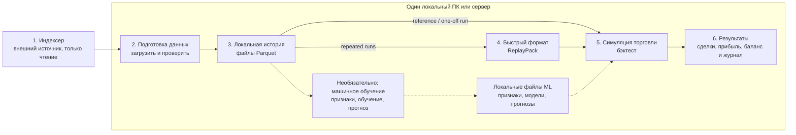
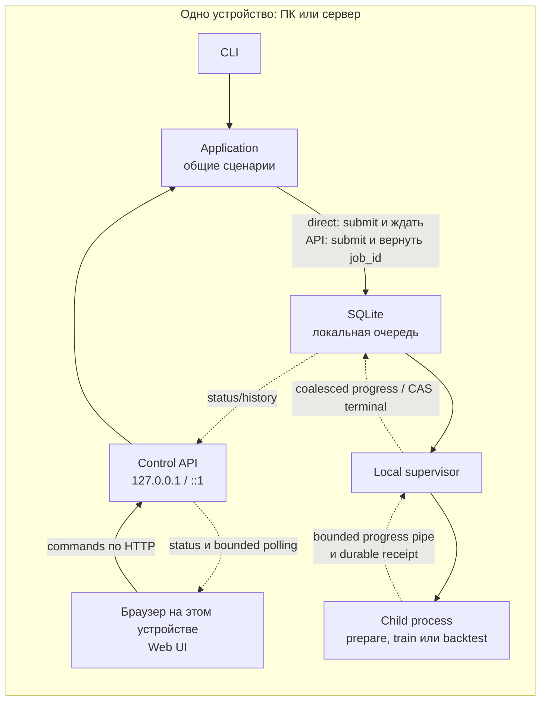
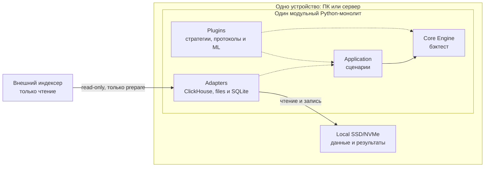
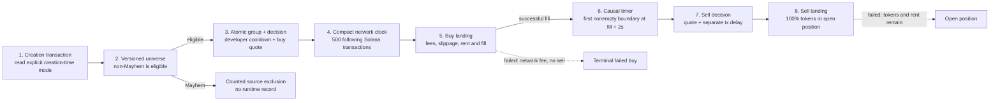

# Архитектура On-Chain Backtest Engine: подробное описание

Статус: принято как постоянное углублённое описание архитектуры

> Это полный синхронизированный русский перевод нормативного описания целевой
> архитектуры. Нормативным источником является английский
> [architecture-deep-dive.md](architecture-deep-dive.md). Файл
> [architecture.ru.md](architecture.ru.md) является его синхронизированным
> кратким обзором и не вводит самостоятельных решений. При расхождении
> применяется английский deep dive; дефект перевода исправляется в обеих
> языковых версиях.

## Как читать документ

- Разделы 1–8: целевое решение, границы и модули.
- Разделы 9–17: подготовка данных, локальное хранение и Parquet.
- Разделы 18–24: ReplayPack, engine, strategies, protocols, features и ML.
- Разделы 25–31: производительность, диск, failures и security.
- Разделы 32–38: тесты, CLI, roadmap, triggers роста и Definition of Done.

## 1. Решение в одном абзаце

Платформа строится как **один Python modular monolith с гексагональными
границами**, целиком запускаемый на одном PC/server с 16–32 GB RAM и local NVMe.
Внешний ClickHouse является только read-only source. Данные один раз
материализуются в selective immutable Parquet snapshot. Для повторных быстрых
прогонов из snapshot собирается derived `ReplayPack`, который читается с NVMe
через read-only memory mapping.

Один run исполняется одним последовательным deterministic process. Параллелятся
только независимые runs. В hot loop нет SQL, network, pandas, строковых IDs,
построчной валидации и поэлементных ML calls.

CLI, Web UI и Control API вызывают одни и те же application use cases. Control
API ставит jobs в локальную durable SQLite queue, а process supervisor запускает
их в изолированных child processes. API и UI не участвуют в hot loop, поэтому
их наличие не замедляет обработку market events.

Путь данных всегда один:

```text
remote bounded extraction
-> immutable local Parquet snapshot
-> direct reference run OR content-addressed ReplayPack for repeated runs
-> one deterministic local process per run
-> parallel independent runs within measured RAM/I/O budget
-> local results
```

Способ запуска можно выбрать:

```text
Direct CLI -> application use case -> local child process

или

Browser Web UI -> localhost Control API -> SQLite job queue
               -> local supervisor -> тот же local child process
```

## 2. Жёсткие ограничения

Целевой single-host envelope:

- один native Linux x86_64 или macOS arm64 host либо один Windows 11 x86_64
  host через WSL2 с Ubuntu x86_64;
- 16 GB RAM — минимальный supported profile;
- 32 GB RAM — рекомендованный profile;
- один local NVMe;
- один исследователь и один доверенный codebase;
- batch backtests, feature builds, training jobs и bounded research jobs;
- CPU-first, optional local GPU;
- внешний ClickHouse доступен только source-facing командам `inspect-source`,
  `prepare-dataset`, optional metadata estimate в `plan-dataset` и
  ограниченному `research prepare` из §24.6;
- `research analyze` читает только committed local artifacts;
- compile, feature/ML jobs и backtest runs работают только с committed local artifacts;
- optional Control API и Web UI работают на том же устройстве;
- Control API по умолчанию слушает только localhost;
- все execution processes используют тот же local data root и NVMe.

Windows support в текущем runtime означает WSL2/Ubuntu, а не native Win32
execution. Repository и operational `data_root` обязаны находиться внутри
Linux filesystem WSL (например, под `~/backtest`); `/mnt/c`, `/mnt/d`, другие
DrvFS mounts и network mounts не входят в supported publication/mmap envelope.
Native Windows остаётся fail-closed: POSIX locks, process-group isolation,
resource observation и directory-`fsync` publication нельзя заменять частичной
совместимостью. Отдельная native Windows поддержка потребует заранее принятого
архитектурного решения, Win32 adapters и полного crash/concurrency/determinism
gate.

Первая версия не строит:

- S3 или MinIO;
- PostgreSQL;
- собственный ClickHouse;
- Redis, Kafka или distributed queue;
- Kubernetes;
- high availability;
- multi-controller consensus;
- multi-host workers/runner;
- обязательные постоянно работающие daemons для обычного CLI-режима.

Control API и Web UI запускаются только командой `backtest serve`. Обычные
CLI-команды по-прежнему могут завершать процесс после выполнения. Тяжёлые
внешние сервисы добавляются только по измеримым triggers из раздела 36.

## 3. Контекст системы

Чтобы не смешивать разные понятия, архитектура показана тремя простыми схемами:

1. Сначала — что происходит с данными.
2. Затем — как CLI или Web UI запускают локальную job.
3. В конце — из каких частей состоит Python-код внутри job.

### 3.1 Что происходит с данными



Если ML не нужен, пунктирную ветку можно полностью игнорировать. Тогда вся система —
это одна сплошная линия: индексер → локальная история → быстрое чтение → бэктест → результаты.

Основной путь читается слева направо:

1. Indexer — внешний read-only источник исторических данных.
2. `prepare-dataset` забирает только нужный диапазон и проверяет его.
3. Проверенная история сохраняется локально в Parquet — это главная неизменяемая копия данных.
4. ReplayPack при необходимости строится из Parquet и ускоряет повторные прогоны.
5. Бэктест читает committed snapshot напрямую либо ReplayPack, если
   measured break-even оправдывает его сборку, вызывает стратегию и
   моделирует исполнение сделок.
6. Сделки, прибыль, состояние портфеля, журнал проверки и файл с точными параметрами запуска
   (`manifest`) сохраняются на локальный диск.

ML-ветка необязательна: она строит features, models и predictions из того же snapshot.

После завершения шага 2 индексер больше не используется. Все остальные шаги работают на одном
устройстве с local NVMe.

### 3.2 Как запускается локальная job

Ниже показан уже работающий single-host execution path. Direct CLI ожидает
terminal state синхронно, а Control API быстро возвращает `job_id`, но обе ветки
создают strict immutable `ResolvedJobSpec`, используют одну durable queue, один
supervisor и один и тот же isolated child process.



Это два альтернативных входа в одну реализацию:

- Direct CLI под exclusive controller authority durable-submit-ит job, запускает
  supervisor cycle и ждёт terminal state; это всё ещё synchronous CLI UX.
- Web UI вызывает Control API; API сохраняет job в SQLite, а supervisor запускает тот же
  child process.
- Control API быстро возвращает `job_id` и не ждёт окончания бэктеста внутри HTTP request.
- Child не открывает SQLite. Progress идёт по bounded non-blocking pipe,
  coalesces supervisor-ом и читается UI как cursor-based bounded history;
  отдельные market events через API/SQLite не проходят.
- После publication child durable-публикует completion receipt; только supervisor
  после повторной проверки exact committed outputs переводит attempt в `SUCCEEDED`.
- Все узлы на схеме работают на одном PC/server; вычисления и данные используют один local NVMe.

### 3.3 Что находится внутри job

Перед чтением схемы достаточно четырёх определений:

- Движок (`Core Engine`) — непосредственно считает бэктест.
- Сценарии (`Application`) — задают последовательность действий.
- Расширения (`Plugins`) — добавляют заменяемую торговую и ML-логику.
- Подключения (`Adapters`) — читают индексер и локальные файлы.



- Сценарии координируют действия, но не содержат торговую математику.
- Движок отвечает за порядок событий, состояние портфеля и исполнение сделок.
- Расширения добавляют strategies, launchpads, features и ML без изменения движка.
- Подключения изолируют ClickHouse, files, SQLite, DuckDB и PyArrow от движка.
- Во время backtest движок не знает об индексере и не выполняет SQL/network calls.

### 3.4 Текущее состояние проекта

Реализация включает production-oriented reference vertical slice архитектуры
и network-aware Pump.fun Sniping на verified local artifacts. Live data
требует точного cut-scoped admission:

Pump.fun Sniping теперь предоставляет ровно два реализованных
identity-bearing mode: `EXOGENOUS_REPLAY` и
`EXOGENOUS_VIRTUAL_SETTLEMENT`. Второй явно делит successful sell
на observed venue-funded и synthetic-funded SOL; это deterministic model,
а не counterfactual и не заявление об on-chain-executable liquidity. Оба
mode используют strict draft v3, round-trip v4, summary v3, reference и
optimized engines и один typed CLI/API/Web UI contract. Смена mode
требует нового resolution v3 и создаёт другие `logical_run_id`,
order IDs и round-trip IDs, но повторно использует те же verified
Dataset/Snapshot/ReplayPack без source extraction и compile-replay.

- отдельный wallet-research сценарий §24.6: bounded successful SOL-paired
  Pump observations, immutable ResearchSnapshot/ResearchResult, локальный
  DuckDB activity/co-buy analysis, exact source-row evidence, durable isolated
  jobs, CLI и same-origin `/research` dashboard. Страница объясняет первую BUY
  для каждой пары «подписант/токен» внутри снимка и пропуск поздних совпадений.
  Локально поставляемая фиксированная версия Cytoscape.js даёт масштабирование,
  перемещение, перетаскивание, доступный выбор и переход к покупкам точной пары
  для максимум 25 пар / 50 узлов страницы либо всего результата до
  200 000 пар / 5 000 участвующих кошельков. Полная загрузка имеет прогресс,
  отмену, проверку полноты, поиск всех кошельков и постраничный список соседей;
  перелистывание таблицы сохраняет полный граф. Раскладка и выделение — только
  отображение. Signer/payer роли и кратность
  строк сохраняются; completeness, finality, source consistency и causal
  availability остаются `UNKNOWN`. Hermetic source contracts, isolated CLI/API,
  real-browser workflow и installed-wheel CLI/child/API/assets gate прошли.
  Live research-source capacity/fidelity не заявляются. Переводы, полный wallet
  PnL, owner clustering и automatic strategy promotion не реализованы;
- installable Python 3.13 package, reproducible `uv.lock`, hexagonal ports,
  Import Linter/AST guardrails и отдельные CLI/serve/child composition roots;
- current source stack использует `bounded-source-evidence/v2`,
  network-aware `source-inspection/v5`, canonical
  `backtest.dataset-plan/v4` и `DatasetSpec` v5 с typed `BlockRange`.
  DatasetSpec v5 включает versioned
  `global-transaction-duration-roundtrip/v1` settlement requirement и exact
  source-normalization/evidence binding; evidence v1, inspection v1–v4,
  dataset plan v1–v3 и DatasetSpec v1–v4 получают
  `REPREPARE_REQUIRED`. `inspect-source`, selective `plan-dataset` и bounded
  read-only ClickHouse extraction используют fixed Pump source profile,
  explicit columns, hard limits, streaming batches, запрет
  `SELECT *`/`OFFSET` и secret redaction. Bounded evidence pass выполняет
  четыре согласованных stream pass, при необходимости делит их на internal
  shards не шире 4096 blocks и публикует ровно один aggregated generated
  receipt на capability только после успешной cross-stream проверки. Static
  capability TOML не может объявить `PROVEN`. Solana `slot` остаётся только
  physical mapping внутри source adapter;
- production `prepare-dataset`: canonical schema v3,
  `canonical-distribution/v5`, `canonical-snapshot/v4`, sorted immutable
  Parquet, snapshot manifest, QA/fidelity boundaries и gap-safe incremental
  reuse. Reuse требует exact network/position/source/capability/schema/range/
  revision/watermark, build key и verified bytes; unknown mutable shard
  читается заново, а frontier не перескакивает missing/failed/quarantined gap.
  Для Sniping read-only candidate validator до публикации snapshot root
  проверяет clock, positions, transaction groups, causal classification
  launches по versioned universe policy, Pump state transitions eligible
  launches и settlement path каждого decision-range target;
- atomic local artifact repository с staging, hashes, `fsync`, locks, rename,
  `COMMITTED`, reader verification, collision quarantine и rebuildable catalog;
- canonical Parquet replay, network-aware `replay-pack/v3` с compact block/
  all-transaction clock arrays, content-addressed NumPy mmap reader и optional
  DeliverySchedule с dynamic/materialized equivalence;
- exact reference engine: atomic historical groups, separated states, causal
  scheduler, integer constant-product execution, asset-tagged network costs и
  correlated double-entry `run-ledger/v2`,
  FirstSwap strategy и readable Pump.fun Sniping reducer. Sniping reference
  path реализует post-creation-group quote, developer cooldown 600 seconds,
  buy `+500` global transactions, sell decision `+2s`, отдельную sell latency,
  Pump/Solana fees, slippage, rent/cashback и realized/open PnL integer math;
- отдельный `numpy-mmap-pumpfun-sniping-v1` backend с SoA state, compact clock,
  bounded arena и buffered outputs; checked-in hermetic tests сравнивают его с
  reference Parquet и reference ReplayPack по normalized audit, ledger, fills,
  round trips, balances и result hash при разных batch/readahead;
- resolver, который materializes defaults и закрепляет exact semantic reference
  bundle closure, configs, runtime and artifact dependencies в immutable
  `ResolvedRunSpec`; strict `pumpfun-sniping-run-draft/v3` требует один из
  двух supported execution modes и включает
  `pumpfun-solana-wallet-account-profile/v2`, а resolver материализует
  matching settlement semantics. Legacy draft v2 получает
  `RERESOLVE_REQUIRED`; aliases и missing dependencies к execution не
  допускаются;
- один durable SQLite execution path для Direct CLI и API: strict job-specific
  payload parsers, immutable `ResolvedJobSpec`, idempotency, atomic claim, CAS,
  resource admission, isolated SQLite-free child, bounded progress pipe,
  durable receipts, cancel/retry и restart reconciliation;
- loopback Control API и packaged same-origin Web UI с typed prepare,
  backtest/sweep, ML и Pump.fun Sniping forms, cursor-based progress polling,
  run comparison, artifact/lineage queries и resource status;
- controller identity и strict loopback CLI client: health возвращает только
  digest, выведенный из конкретного controller instance и canonical local data
  root, но не сам path;
  CLI сначала проверяет владельца `controller.lock`, сверяет эту identity и
  только затем делегирует поддерживаемую команду. Missing/malformed owner,
  недоступный/mismatched peer и конкурирующая неделегируемая команда fail
  closed до открытия локального SQLite/application container;
- bounded query projections: job status возвращает operational submit/update
  time и input count/digest, но не executable payload или полный список refs.
  Run list/get возвращает start/completion time, scalar exact hashes/counters,
  physical settings, canonicality, bounded warnings и
  `final_balances_count`/`final_balances_digest`, но не массив balances. Jobs
  используют `submitted_at_ns DESC, job_id DESC`, runs выбираются глобально
  newest-first. Browser-стрелки обоих списков используют scope-bound opaque
  keyset cursors, а bounded offset path остаётся только для совместимости. Run pagination использует rebuildable
  `run_index` с порядком по integer UTC completion epoch descending и exact Run
  artifact ID ascending; его transactional generation обязана иметь состояние
  `COMPLETE`, а выбранная bounded-страница повторно сверяется с verified
  `successful-run/v3` manifests. Missing, dirty или stale projection fail closed.
  Альтернативные allowlisted UI-сортировки действуют только на загруженной
  bounded-странице. Full verified manifest и lineage читаются отдельными
  metadata endpoints с hard limits;
- rebuildable catalog indexes имеют durable `CLEAN`/`UNCLEAN` restart receipt.
  При clean unchanged inventory payload повторно не хешируются; crash,
  migration, offline inventory change, index drift или corruption требуют
  полной проверки и остаются fail closed;
- Pump.fun run-contract discovery и exact result-query surface: bounded summary,
  keyset pages до 200 round trips, combined summary-plus-one-page projection,
  соответствующие CLI-команды и отдельный packaged dashboard, открываемый из
  `Sniping result`. Глобальные графики dashboard строятся только из verified
  summary, а таблица вручную загружает bounded keyset-страницы, хранит только
  текущую страницу и не вычитывает весь result.
  Atomic amounts, boundary/time values и PnL проходят transport как decimal
  strings; browser не получает raw paths, Parquet или SQL. Новые runs
  используют `pumpfun-sniping-run-summary/v3` и `pumpfun-roundtrips/v4`:
  execution mode, settlement policy, liquidity evidence и venue/synthetic
  funding дополняют component-level account lifecycle, fee/deposit/slippage
  aggregates и valuation completeness между engine, manifest, CLI, API и UI.
  Committed summary v2 и round-trip v3 остаются читаемыми только в
  их исходной strict semantics;
- `successful-run/v3` с bounded summary/descriptors и streaming external
  `roundtrips.parquet`/`final_balances.parquet`; unbounded balance rows не
  встраиваются в manifest;
- operator surface: artifact verification, run/lineage queries, durable pins,
  reachability GC, trash purge, verified different-device backup cut и
  empty-directory restore drill;
- point-in-time FeatureSet, Universe, LabelSet, exact integer-linear ModelBundle,
  walk-forward ModelSchedule, frozen PredictionSet и embedded exact-linear
  inference. Embedded path loads selected models once and precomputes bounded
  batches into a quota-limited temporary mmap before the event hot loop;
- reference/optimized equivalence harness для узкого FirstSwap backend и
  mode-specific Pump.fun Sniping closures. Hermetic equivalence не доказывает
  live-source throughput и не допускает произвольный source cut;
- exact artifact-bound benchmark harness для восьми workload types: closed
  1/7/30 capacity, batch/readahead/process grids, profile-before-admission,
  spawn workers, cache evidence и atomic benchmark reports. Direct/control
  comparison использует соответственно real `DirectJobExecutor` и настоящий
  loopback HTTP + durable queue/supervisor path в изолированном local data root.

«Production-oriented» здесь означает завершённые publication, identity,
causality, failure и child-isolation contracts для checked-in reference stack.
«Hermetic Pump.fun Sniping slice» означает, что код, immutable bundles,
resolvers, engines, result adapters и interfaces выполняются на проверяемых
локальных fixtures с явно доказанным source contract. Сама по себе hermetic
evidence не доказывает fidelity live indexer. Каждый live cut требует своего
bounded source proof. Live schema/capabilities определяет новый
`inspect-source`; checked-in Pump.fun capability/projection examples имеют
`UNKNOWN` proofs, а remote estimates остаются `UNKNOWN` без verified estimator.
Representative 1/7/30-day, cold/warm, extraction/ML/control-plane и operational
evidence собираются для конкретного deployment. Для deployment admission
также нужны verified TLS/VPN/SSH либо явный deployment-local
`allow_insecure_remote_http` с принятым риском, bounded four-stream
schema/fidelity validation, cold/warm runs без swap на поддерживаемом 16/32 GB
profile и encrypted backup с recorded restore на другом physical device/host.
Если durable Git remote не сохраняет исходный код, deployment должен хранить
отдельный durable code/config/lockfile archive.

Fail-closed граница остаётся явной: exact embedded ML сейчас поддерживает только
safe integer-linear runtime; tree/ONNX/GPU tolerance и stateful modes не
подключены. FirstSwap и Pump.fun optimized backends принимают только свои exact
allowlisted semantic closures и до mutation отклоняют conditional protocol
replay, causal overlays, incompatible schedule/ordering и другие configs.
Production Pump.fun admission отклоняет любой `UNKNOWN` proof, gap, incomplete
settlement tail, missing/unknown launch mode, unsupported eligible
mode/version или legacy artifact. Known `mayhem_mode=true` является
учтённым в bounded source evidence universe exclusion, а не unsupported target. SSE не
реализован — UI использует bounded polling. Backup без
настроенного другого physical device/host недоступен, но не блокирует исполнение
бэктестов. Resume/checkpoint и автоматическая сборка acquisition requirements из
произвольных plugin registries также не выдаются за готовые функции. Packaged
static UI реализует `resolve -> submit -> progress -> result -> lineage` через
общий loopback API, включая отдельный Sniping dashboard. Hermetic lifecycle
checks не расширяют live-source admission и не доказывают production
readiness произвольного deployment.

Generic network foundation и Pump.fun Sniping теперь входят в checked-in
working surface для verified local artifacts с явным cut-scoped source
admission и execution/performance gates. `NetworkId`,
`PositionSchemaId`, `BlockRange` и `ChainPosition` проходят через source,
snapshot, ReplayPack, run и result identities; legacy pre-network artifacts
отклоняются с `REPREPARE_REQUIRED`, без implicit Solana default или in-place
migration. Reference и dedicated optimized sniping backends, strict draft,
resolver, CLI/API/UI и external results реализованы и покрыты focused hermetic
tests.

Нормативная universe-policy Sniping исключает Mayhem до execution. Exact policy
ID — `successful-sol-paired-non-mayhem-pumpfun-launches-in-decision-range-v2`.
Checked-in universe bundle, resolver, reference/NumPy runtime guards и live
normalizer/evidence path закрепляют policy v2: eligible normal legacy,
Token-2022 и cashback сохраняются, а excluded launches входят только в bounded
classified/excluded count и ordered digest. Hermetic tests проверяют эту
closure; прежняя implicit all-modes policy получает `REPREPARE_REQUIRED` и не
переосмысляется.

Mode-aware account lifecycle также является текущим working contract. Strict
`pumpfun-sniping-run-draft/v3`, вложенный
`pumpfun-solana-wallet-account-profile/v2` и `pumpfun-roundtrips/v4` реализуют
mode-specific ATA для каждого mint и один wallet-scoped Pump
UserVolumeAccumulator. `fresh`/`prewarmed` относится только к начальному UVA;
reservation, one-time creation, failed-landing rollback, successful ATA close,
locked failed-sell state и ledger-authoritative PnL используют общий reducer в
reference и NumPy backends. Draft v2 получает `RERESOLVE_REQUIRED`;
committed summary v2/round-trip v3 остаются читаемыми в их исходной
semantics, а draft/account v1 и round-trip v2 не допускаются к новому
execution.

Live `pumpfun-curve-trade-normalizer/v2` реализован и сохраняет successful
one-zero-leg dust transition, отклоняя both-zero no-op; simulated quotes/fills
по-прежнему strictly positive. Raw Pump trade rows этого source не содержат
отдельных protocol/creator fee columns. Normalizer выводит оба компонента из
точного curve SOL leg по закреплённому effective-dated profile 95/30 bps и его
integer rounding rules. Поэтому эти components являются deterministic
derived-not-observed values: evidence связывает fee formula/profile и
normalizer digest, но не утверждает, будто source наблюдал отдельные transfer
columns.

Versioned sentinel и lifecycle normalizers тоже реализованы. Canonical
Unix-epoch/zero-transaction sentinel с pinned hash/validator закрывает только
skipped-slot coverage и не создаёт clock boundary. Terminal group
нормализуется как `buy_v2 -> derived completion -> migration` на одной
transaction boundary. Interim bundle policy считает bundled buy только когда
успешный `BUY` той же signature/mint находится в той же creation transaction и
после create instruction. Успешный `SELL` в той же transaction всё равно
применяется к curve atomically до strategy decision, но не считается bundled
buy; source `bundled_buys_count` остаётся non-binding metadata.

Live source admission всегда cut-scoped. Успешный bounded proof должен
покрывать точный decision range и settlement tail до публикации inspection,
snapshot, ReplayPack или run. Missing transitions дают
`CURVE_TRANSITION_MISMATCH`; частичные clock/bundle checks не разрешают
inspection artifact или downstream closure. TOML-флаг и ручной `PROVEN`
не обходят отказ. Production admission также требует mode-specific three-way
exact equivalence и representative performance gate для заявленного cut.
Cold-cache и 7/30-day/deployment measurements остаются отдельными требованиями.
Вторая network family, PumpSwap execution и cross-network run не входят в
этот срез и остаются fail closed.

Объём внешнего источника не ограничен локальной ёмкостью. Full mirror не
входит в архитектуру; extraction ограничивается конкретными экспериментами.

## 4. Почему модульный монолит

Монолит здесь означает один distribution, а не один giant module или один OS process.
Distribution имеет три работающих entry mode: Direct CLI, `backtest serve` и
job child process. Все три собирают одинаковые application/domain modules через
общий bootstrap; child получает exact canonical launch envelope, не открывает
SQLite и возвращает только bounded progress и durable receipt. При одном host
это даёт:

- нулевую network latency между модулями;
- один virtual environment и lockfile;
- простой debug и profiling;
- атомарное применение venue transition и ledger postings;
- отсутствие serialization между engine, strategy и execution model;
- минимальную постоянную нагрузку на RAM и CPU.

Гексагональные границы всё равно нужны:

- domain не знает о ClickHouse, DuckDB, SQLite и PyArrow;
- strategy не знает, где лежат данные;
- protocol plugin не зависит от конкретного indexer transport;
- local filesystem можно позже заменить другим adapter;
- Python reference reducer можно позже ускорить без смены semantics.

Control API не превращает внутренние модули в микросервисы. Это ещё один inbound
adapter рядом с CLI: HTTP заканчивается на application boundary; synchronous
control use cases выполняются в API process, а heavy command только durable-
ставится в queue. Engine и plugins затем вызываются in-process внутри isolated
child из того же distribution. Web UI — тонкий клиент к API. Внутри hot path
network boundaries по-прежнему нет.

## 5. Физический запуск на одном устройстве

В deployment есть только две физические границы:

- внешний read-only indexer, который доступен только командам подготовки данных;
- один local PC/server, где находятся Control API, process supervisor, Python execution
  processes и local NVMe.

Поддерживаются два режима одного и того же package:

| Режим | Что запущено | Когда использовать |
|---|---|---|
| Direct CLI | Команда, durable queue/supervisor lifecycle и нужный child; API/UI выключены | Скрипты, CI, разовый запуск |
| Local UI | `backtest serve`, Web UI, Control API и local supervisor | Интерактивная работа и наблюдение |

В обоих режимах все вычисления и данные остаются на одном host. Браузер является только
тонким интерфейсом: он не получает Parquet/ReplayPack и ничего не считает. Parquet,
ReplayPack, models, SQLite и результаты — обычные local files.

В UI-режиме HTTP request никогда не выполняет тяжёлый backtest синхронно. Control API
проверяет команду, создаёт durable job в SQLite и быстро возвращает `job_id`. Local
supervisor запускает job в отдельном child process, а UI получает редкие progress events.

`backtest serve` держит exclusive `controller.lock` весь lifetime. Mutating Direct CLI
берёт тот же lock на время команды. Поэтому server не может стартовать посередине direct
write, а второй supervisor не появляется. Пока server держит lock, mutating CLI либо
отправляет команду в loopback Control API, либо завершается с понятной ошибкой. Read-only
CLI может читать committed artifacts через обычные reader locks.

Owner record в lock и `/api/v1/health` связываются через domain-tagged
`control_plane_id = H("backtest.control-plane-identity", schema, canonical
resolved data root, controller instance ID)`. Это operational identity одного
local controller, исключённая из run/artifact identities. Наружу возвращается
только digest, а не path или lock record. CLI сначала
пытается получить authority; если lock уже занят, он валидирует owner record,
обращается только к configured loopback address и требует точного совпадения
`control_plane_id`. Поддерживаемые job/query operations после этого выполняются
через strict bounded HTTP client; неделегируемая mutation получает typed
controller conflict. Локальная SQLite composition не начинается до этого
решения, поэтому CLI не создаёт второй operational writer даже в race с
запуском server.

Типичный lifecycle:

```text
inspect -> plan -> prepare -> validate -> commit snapshot
                                      -> compile replay
                                      -> run one or many backtests
                                      -> analyze/export
```

Во время latency-sensitive run тяжёлый extraction, compaction или training по умолчанию
не запускаются. Простой local admission controller блокирует конкурирующие
тяжёлые jobs.

## 6. Роли локальных технологий

| Компонент | Роль | Не делает |
|---|---|---|
| Python | Use cases, engine, plugins, CLI и Control API | Не хранит giant rows как objects |
| Web UI | Создание jobs, status, results и lineage | Не выполняет backtest и не читает data files |
| Control API | Валидация команд, job control, query endpoints, bounded progress history | Не участвует в event hot loop |
| Local supervisor | Admission control и child processes | Не меняет semantics engine |
| Local filesystem | Authoritative committed artifacts | Не является backup самого себя |
| Parquet | Канонические snapshots/features/results | Не обязан быть fastest replay format |
| Arrow IPC | Typed mmap event buffers | Retention задаёт manifest, не сам format |
| NumPy `.npy` | Dense mmap indexes/features/predictions | Не заменяет schema manifest |
| DuckDB | In-process ETL, joins, research SQL, spill | Не участвует в hot loop |
| SQLite | Jobs, refs, pins, searchable metadata | Не делает missing bytes committed |
| NVMe | Sequential data path и OS page cache | Не даёт HA/DR |

Эти роли уже представлены production adapters reference slice. PyArrow и
DuckDB публикуют и читают canonical Parquet bounded batches; NumPy хранит
ReplayPack, DeliverySchedule и dense ML overlays в verified read-only mmap;
SQLite обслуживает queue/attempts/events, shard ledger, artifact/lineage index,
pins и completion records. Verified filesystem commit остаётся authority для
artifact bytes, а SQLite indexes не легализуют missing files.

DuckDB и SQLite — embedded libraries, а не daemons. В idle состоянии они не держат
отдельные процессы и не занимают постоянно RAM.

Web UI поставляется как готовые static assets внутри Python distribution. Для production
не нужен отдельный Node.js process. API, static UI и bounded progress polling обслуживает
один лёгкий ASGI process; тяжёлые jobs всегда вынесены в child processes.

Начальный dependency policy:

- один основной analytical engine: DuckDB;
- PyArrow для Parquet/IPC и batches;
- NumPy для compact numeric state и dense overlays;
- standard-library `sqlite3` для catalog;
- Polars не добавлять, пока DuckDB/PyArrow не покажут измеримый gap.

Это сокращает dependency surface и избегает трёх параллельных dataframe APIs.

## 7. Предлагаемая структура Python package

```text
pyproject.toml
src/backtest/
  domain/
    identifiers.py
    time.py
    market_events.py
    intents.py
    execution.py
    ledger.py
    fidelity.py
  engine/
    scheduler.py
    historical_state.py
    observed_state.py
    simulation_state.py
    portfolio.py
    audit.py
    rng.py
  application/
    ports/
      source.py
      artifacts.py
      catalog.py
      jobs.py
      progress.py
      processes.py
      replay.py
      strategies.py
      models.py
    use_cases/
      inspect_source.py
      plan_dataset.py
      prepare_dataset.py
      compile_replay.py
      compile_delivery_schedule.py
      run_backtest.py
      run_sweep.py
      build_features.py
      train_model.py
      submit_job.py
      cancel_job.py
      query_jobs.py
      query_runs.py
      gc.py
      verify.py
  adapters/
    source/clickhouse/
    artifacts/localfs/
    catalog/sqlite/
    process/local/
    query/duckdb/
    columnar/arrow/
    results/localfs/
  plugins/
    protocols/
      pumpfun/
      pumpswap/
      raydium/
      meteora/
    strategies/
    features/
    models/
    execution/
    risk/
    universe/
    valuation/
  runtime/
    resource_budget.py
    process_supervisor.py
    local_job_runner.py
    controller_lock.py
    thread_limits.py
    file_locks.py
  bootstrap/
    config.py
    container.py
    cli.py
    serve.py
    job_child.py
  interfaces/
    cli/
      main.py
    api/
      app.py
      routes_jobs.py
      routes_runs.py
      routes_artifacts.py
      routes_system.py
      schemas.py
    web/
      static/
tests/
  unit/
  property/
  contract/
  golden/
  integration/
  e2e/
  performance/
```

Это один package и один environment. CLI, Control API и Web UI — inbound
interfaces к одним use cases. Внутренние папки не становятся отдельными services
или wheels до стабилизации API.

## 8. Направление зависимостей и порты

Правило импортов:

```text
interfaces/adapters/plugins -> application ports -> engine/domain
bootstrap -> everything for wiring
domain/engine -X-> adapters, CLI, Control API, DuckDB, SQLite, ClickHouse, PyArrow
```

Ключевые ports:

```python
class SourceReader(Protocol):
    def list_capabilities(self, source_id: SourceId) -> tuple[CapabilityDescriptor, ...]: ...
    def scan(self, request: ExtractionRequest) -> Iterator[IndexedBatch]: ...


class ArtifactRepository(Protocol):
    def stage(self, spec: ArtifactDraft) -> ArtifactWriter: ...
    def open_committed(self, artifact_id: ArtifactId) -> ArtifactHandle: ...


class JobQueue(Protocol):
    def submit(self, spec: ResolvedJobSpec, idempotency_key: str) -> JobRecord: ...
    def request_cancel(self, job_id: JobId) -> None: ...
    def claim_next(
        self,
        supervisor_instance_id: str,
        capacity: ResourceCapacity,
    ) -> JobAttempt | None: ...
    def transition(
        self,
        attempt_id: AttemptId,
        expected_version: int,
        new_state: AttemptState,
        result_artifact_id: ArtifactId | None = None,
    ) -> JobAttempt: ...


class ProgressSink(Protocol):
    def publish(self, event: ProgressEvent) -> None: ...


class ProcessRunner(Protocol):
    def spawn(self, attempt: JobAttempt) -> ProcessHandle: ...
    def probe(self, handle: ProcessHandle) -> ProcessStatus: ...
    def terminate(self, handle: ProcessHandle, grace_seconds: float) -> None: ...


class ReplaySource(Protocol):
    def boundaries(self) -> BoundaryReader: ...
    def event_batches(self) -> Iterator[EventBatch]: ...


class Strategy(Protocol):
    def requirements(self) -> StrategyRequirements: ...
    def on_event(self, event: EventView, ctx: StrategyContext) -> Iterable[Intent]: ...
```

Domain contract описывает semantics, но не обязывает hot loop создавать Python object
на каждое событие. Adapter может реализовать `EventBatch` как typed array views.

API routes не обращаются к SQLite/filesystem напрямую. Они валидируют transport DTO,
вызывают application use case и преобразуют result в versioned response DTO. Это позволяет
проверять CLI и API одними contract tests и позже сменить web framework без изменения core.

Интерфейс вводится только на реальном шве. Между каждыми двумя
функциями порт не нужен.

## 9. End-to-end workflow

### 9.1 `inspect-source`

- читает metadata без мутаций;
- сохраняет schema fingerprint без credentials;
- описывает capabilities и fidelity;
- при explicit half-open evidence range выполняет четыре bounded read-only
  stream pass с explicit columns; большие ranges детерминированно делятся на
  internal shards не шире 4096 blocks, а inspection встраивает один
  aggregated generated receipt на capability;
- не создаёт local mirror.

Metadata-only inspection и bounded evidence pass не являются двумя
источниками truth. Второй режим добавляет к той же declarative
schema проверяемую provenance конкретного source cut. Proof status,
который не выводится из выполненных checks, остаётся `UNKNOWN`.

### 9.2 `plan-dataset`

- объединяет requirements strategy, execution model, features и warmup;
- выводит network, position schema, protocols, capabilities, columns,
  decision range и capability-specific half-open block ranges;
- добавляет bounded правый settlement tail, достаточный для всех уже
  разрешённых decisions, order latency и liquidation lifecycle;
- строит dry-run budget;
- fail-fast при недостаточной fidelity или превышении quota.

Текущий `PlanDataset` компилирует уже переданные вызывающим кодом
`DataRequirement`; автосбор из strategy/feature/model registries ещё не
реализован. Remote estimator не подключён в bootstrap, поэтому source/local
byte estimates обычно `UNKNOWN`; доказанные fidelity, day и disk violations
всё равно отклоняются.

Для Pump.fun Sniping один из requirements обязан нести
`global-transaction-duration-roundtrip/v1`: target stream, settlement streams,
500-transaction initial delay, two-second minimum duration, максимальную
разрешённую sell latency и hard `maximum_tail_blocks`. Planner один раз
консервативно расширяет только settlement streams на весь этот
bounded cap; `TOKEN_LAUNCH` заканчивается вместе с decision range.
Заявленный caller-ом tail выше cap, source watermark ниже нужной
границы или quota на этот extraction дают typed fail-closed. Planner не
делает неограниченные итеративные дозагрузки.

Тот же requirement закрепляет exact universe policy
`successful-sol-paired-non-mayhem-pumpfun-launches-in-decision-range-v2`.
Launch stream всё равно извлекается для всех successful SOL-paired creations в
decision range: иначе нельзя доказать знаменатель и причинно классифицировать
Mayhem exclusions. Trade/lifecycle settlement нужен только для eligible
non-Mayhem targets; source pushdown не может удалить launch до проверки его
explicit creation-time `mayhem_mode`.
Policy ID, source mapping/query digest и projector/config digest входят в
DatasetSpec dependency identity; смена любого operand требует нового bounded
evidence и новой подготовки, а не reinterpretation старого artifact.

### 9.3 `prepare-dataset`

- извлекает bounded shards streaming batches;
- нормализует source records;
- применяет protocol projector;
- выполняет as-of joins, cross-capability transaction-clock checks и QA;
- публикует immutable Parquet partitions и snapshot manifest.

При наличии settlement requirement отдельные distributions ещё не
составляют исполнимый snapshot. Store собирает над verified
committed distributions read-only candidate, а protocol validator до
вычисления и публикации snapshot root проверяет:

- одну network/position identity и exact event/capability mapping;
- strict canonical order, transaction grouping и `event_index`;
- compact clock coverage каждой transaction position и отдельное доказательство
  непрерывности source slots с корректным исключением known skipped-slot
  sentinels из canonical boundaries;
- полную causal classification launches по exact universe policy и binding на
  bounded source-evidence/validation exclusion count+digest без unknown mode;
- versioned Pump state/lifecycle transitions eligible launches после atomic
  group apply;
- для каждого eligible target в decision range — наличие boundary для
  `+500`, первой nonempty boundary не раньше `+2s` и landing
  после максимальной prepared sell latency.

Любой отказ оставляет snapshot root невидимым; уже committed
orphan distributions не образуют snapshot и позже обрабатываются
reconciliation/GC. Эта local candidate validation не повышает
`UNKNOWN` upstream fidelity и не заменяет generated inspection receipts.

### 9.4 `compile-replay`

- сортирует canonical stream;
- строит stable numeric dictionaries;
- разделяет envelopes и type-specific payloads;
- сохраняет compact block clock как arrays block ordinal, transaction count,
  cumulative transaction prefix и block time, не разворачивая объект на каждую
  сетевую транзакцию;
- строит только generic offsets/indexes, не зависящие от latency или seed;
- публикует rebuildable mmap ReplayPack.

### 9.5 `compile-delivery-schedule` (опционально)

- принимает уже resolved ReplayPack, latency/clock policies, RNG и scheduler versions;
- materializes только observation-delivery stream для часто повторяемой policy;
- публикует отдельный rebuildable DeliverySchedule с собственным content ID;
- не встраивает run-specific latency в generic ReplayPack.

Если schedule не окупает compile/disk cost, `run-backtest` строит тот же поток bounded
batches в памяти. Оба пути обязаны быть scheduler-equivalent.

### 9.6 `run-backtest`

- открывает только committed local artifacts;
- проходит preflight compatibility;
- исполняет causal replay без network/SQL;
- буферизует audit/results;
- публикует RunManifest после успешного завершения.

Decision range и replay range — разные понятия. Strategy может создавать новые
targets только внутри decision range, но уже созданные orders/timers обязаны
полностью завершиться на правом settlement tail. Если source watermark или
hard quota не позволяют доказать достаточный tail, `plan-dataset`, prepare или
run fail closed; незавершённая сделка не исчезает из результата как silently
censored observation.

### 9.7 `run-sweep`

- строит список immutable ResolvedRunSpec;
- оценивает peak private RSS и native thread demand;
- допускает ровно столько processes, сколько помещается в budget;
- не делит один stateful run по time shards;
- публикует `sweep-result/v2` с exact run artifact refs, physical settings и
  только закрытым набором выбранных scalar comparison metrics. Final balances
  представлены count/content digest и не дублируются массивом в sweep rows.

### 9.8 `submit-and-monitor` через Control API

- принимает versioned command DTO и обязательный idempotency key;
- вызывает тот же resolver/preflight, который использует CLI;
- сохраняет immutable ResolvedJobSpec и состояние `QUEUED` в SQLite;
- быстро возвращает `job_id`, не удерживая HTTP request до конца вычисления;
- local supervisor переводит job в `STARTING/RUNNING` и запускает child process;
- rate-limited progress попадает в SQLite event history; current Web UI читает
  его cursor-based polling, SSE остаётся optional transport;
- terminal state — `SUCCEEDED`, `FAILED`, `CANCELLED` или `INTERRUPTED`;
- canonical RunManifest появляется только после обычного artifact commit protocol.

Job state является operational metadata и не входит в `logical_run_id`. Один и тот же
ResolvedRunSpec, запущенный напрямую из CLI или через Web UI, обязан дать одинаковый
canonical audit/result hash.

`ResolvedJobSpec` — общий immutable envelope для `prepare`, `compile`, `backtest`,
`features`, `train` и `predict`. Для backtest его payload содержит exact
`ResolvedRunSpec`. Priority, UI labels, retry policy и timestamps относятся к operational
scheduling и не меняют logical experiment identity.

Этот workflow реализован для `prepare`, `compile-replay`, optional delivery
compile, backtest/sweep и exact ML jobs. Direct CLI и API проходят один strict
job decoder/resolver и один supervisor/child/completion protocol; различаются
только ожидание ответа и physical attempt provenance. Unknown `JobType`,
unresolved alias, extra opaque field, неверная artifact closure или
несовместимый preflight fail closed до child execution.

## 10. Selective acquisition вместо full mirror

`DatasetSpec` является результатом компиляции требований, а не ручным списком
таблиц. Новый normative envelope — `backtest.dataset-plan/v4` с
embedded `DatasetSpec` v5:

```text
strategy requirements
+ feature/model requirements
+ execution/fidelity/clock requirements
+ warmup + decision range + settlement tail
= network + position schema + capabilities + columns + protocol versions
  + capability-specific block ranges
```

В текущем срезе левая часть этого уравнения передаётся в `plan-dataset`
как versioned tuple `DataRequirement`; автоматические plugin registries появятся
вместе с реальными strategy/feature/model bundles.

DatasetSpec v5 добавляет в identity exact settlement requirement,
sentinel/lifecycle normalization profiles и exact evidence binding и
capability-specific ranges. Оно фиксирует не обещание, что указанных
blocks хватит, а bounded causal contract, который должен быть доказан
по actual compact clock до snapshot publication. Evidence v1,
inspection v4, `backtest.dataset-plan/v1`–`v3` и DatasetSpec v1–v4 не
переосмысляются: они получают `REPREPARE_REQUIRED`.

Правила extraction:

1. Каждый logical shard имеет typed half-open `BlockRange`
   `[from_block_ordinal, to_block_ordinal)` одного `NetworkId`; Solana adapter
   отображает `block_ordinal` в source `slot` без изменения значения.
2. Block range является authoritative filter; source-specific field name не
   становится core identity.
3. UTC date filter добавляется только как proven-safe superset для pruning.
4. Запрашиваются только explicit columns.
5. `OFFSET` не используется.
6. Keyset pagination допустима только при доказанном total key.
7. При ambiguous duplicates читается полный bounded shard с multiplicity.
8. Query limits и identifier обязательны.
9. Credentials не попадают в query ID, log, exception и cache key.

До запроса строится budget report:

```text
estimated source rows/bytes
requested decision/block range and settlement tail
expected local Parquet bytes
temporary spill/staging reserve
current free disk and low watermark
hard max_remote_bytes / max_local_bytes / max_days
```

Начальный slice — один protocol и 1–7 дней. После измерения bytes/day и
events/sec диапазон расширяется под конкретный experiment. Данные не
скачиваются «на будущее» без consumer.

Pump.fun Sniping требует четыре versioned capability stream от одного
network-consistent cut:

1. `BLOCK_CLOCK`: `block_ordinal`, second-resolution `block_time`, block hash и
   полный `transaction_count`.
2. `TOKEN_LAUNCH`: exact transaction/instruction position, mint, immutable
   creator, creation user, bonding curve, quote asset, explicit immutable
   creation-time `mayhem_mode` и creation-time state для eligible modes.
3. `PUMP_CURVE_TRADE`: direction, atomic amounts, complete reserve transition,
   fee components, program/mode version и lifecycle flags.
4. `PUMP_CURVE_LIFECYCLE`: completion и migration boundaries.

`fee components` здесь означает обязательные canonical values, а не
обязательное наличие одноимённых physical source columns. Для текущего
проверенного source raw trade содержит exact curve SOL leg, но не отдельные
protocol/creator fee columns. Installed Pump normalizer детерминированно
выводит оба компонента по pinned effective-dated profile 95/30 bps и exact
integer rounding. Receipt помечает их как derived-not-observed и связывает
formula/profile/normalizer digest; такая derivation не выдаётся за source
transfer observation.

Source-specific physical representation не становится core semantics. Для
подтверждённого Pump/Solana source canonical sentinel с Unix epoch,
`transaction_count=0` и exact pinned hash/validator fingerprint означает
известный skipped/non-produced slot. Evidence использует его только как запись
непрерывности integer source range; normalizer не выпускает из него
`BLOCK_CLOCK`, transaction или duration boundary. Настоящий produced block с
нулём transactions, напротив, остаётся canonical clock row со своим реальным
block time/hash, хотя transaction boundary не создаёт. Отсутствующая integer
position, conflicting duplicate или malformed sentinel дают typed
`INCOMPLETE_BLOCK_RANGE`, а не synthetic block или interpolation.

Для подтверждённой special lifecycle shape одна transaction group может
содержать terminal `buy_v2` и migration той же signature/mint/block/transaction
identity, хотя migration table не несёт `ix_idx`. Versioned lifecycle-order
profile сохраняет source-indexed trade как `2 * raw_ix`, затем назначает
derived completion `2 * raw_ix + 1` и migration `2 * raw_ix + 2`. Такое
расширение допустимо только когда evidence доказывает terminal reserve state и
отсутствие третьей Pump instruction кроме этих trade/migration;
иначе candidate
fail closed. Все три transition применяются атомарно на одной transaction
boundary. Для standalone migration, являющейся единственным Pump event своей
transaction, normalizer использует deterministic singleton `event_index=0`.
Raw source index/provenance сохраняется отдельно и не подменяется derived
координатой.

Для всех четырёх capabilities snapshot использует один authoritative source на
stream. Silent merge с archive RPC или другой таблицей запрещён. RPC допустим
только как bounded opt-in validation evidence и golden-fixture source, но не
как runtime fallback и не как способ незаметно заполнить production snapshot.

Sniping universe классифицируется до создания target и cooldown signal.
`mayhem_mode=true` получает reason `MAYHEM_EXCLUDED`; bounded source evidence и
snapshot validation сохраняют excluded count и ordered digest по stable launch
identity/chain position. Excluded rows не становятся canonical execution
events, run-audit rows или нулевыми round trips. `false` оставляет
eligible normal legacy, Token-2022 и cashback modes. Missing/null,
out-of-domain, противоречивый либо только late-enriched mode останавливает
prepare; его нельзя трактовать ни как non-Mayhem, ни как допустимый exclusion.

## 11. Source boundaries, revisions и fidelity

Нельзя смешивать:

- `effective_at` — position факта в chain;
- `source_observed_at` — nullable timestamp, только если source его измерил;
- `extracted_at` — local operational timestamp;
- `available_at` — causal delivery boundary внутри run.

Local `extracted_at` никогда не становится историческим `available_at`.

Boundary по capability хранит:

```text
source_id
capability + schema version
network_id + position_schema_id
block range
snapshot cut
chain_finality
ingestion_watermark (nullable)
upstream_revision (nullable/unproven)
internal_revision
source_consistency
completeness
validation_status
```

Без upstream contract значения finality, completeness, revision и consistency остаются
`UNKNOWN`. `validation_status=PASS` означает только, что artifact прошёл
известные local checks. Он не повышает upstream completeness.

Bundle cut не превышает минимальный contiguous committed frontier всех required
capabilities. Frontier не перескакивает missing, failed или quarantined shard.

Повторное чтение изменившегося shard создаёт новую immutable internal revision.
Отсутствующая row не становится tombstone без CDC/deletion contract, stable identity и
proven complete read. Content hash не используется как доказательство event uniqueness.

### 11.1 Network и chain position contract

Core не использует слово `slot` как универсальную identity. Нормативные value
objects:

```text
NetworkId = "<family>:<immutable-chain-reference>"
PositionSchemaId = "block32-transaction32-v1"
BlockRange(network_id, from_block_ordinal, to_block_ordinal)
ChainPosition(
  network_id,
  position_schema_id,
  block_ordinal,
  transaction_index,
  event_index,
)
```

`NetworkId` содержит canonical lowercase network family и immutable chain
reference. Alias `mainnet`, `solana:mainnet`, mutable cluster URL, endpoint или
credential недопустимы. Для Solana immutable reference выводится из genesis
identity: берётся полная base58-строка, которую возвращает
`getGenesisHash`, а не её display-prefix. Source `slot` нормализуется в
`block_ordinal` без потери значения.

Первый `PositionSchemaId` — `block32-transaction32-v1`:

- `block_ordinal` и zero-based `transaction_index` обязаны помещаться в
  unsigned 32-bit;
- `event_index` задаёт доказанный versioned intra-transaction order, но не
  создаёт отдельную execution boundary;
- transaction-group boundary вычисляется checked integer формулой
  `boundary_ordinal = (block_ordinal << 32) + transaction_index + 1`;
- overflow, отрицательное значение или `transaction_index >= transaction_count`
  отклоняются до публикации;
- сеть с более широкими координатами получает новый position schema и новые
  artifacts, а не silent widening существующего контракта.

Один canonical distribution, snapshot, ReplayPack, DeliverySchedule и run
содержит ровно один `NetworkId` и один `PositionSchemaId`. Network хранится в
root manifest/dictionary metadata один раз, а не строкой в каждой event row,
но входит в identity canonical events, dataset revision, snapshot, orders и
runs. Mixed-network snapshot и synchronized cross-network run в этом срезе
запрещены; будущая поддержка второй сети использует те же core contracts, но не
создаёт скрытую общую clock.

Это явный schema break. Network-aware версии source inspection, DatasetSpec,
canonical snapshot, ReplayPack, DeliverySchedule, ResolvedRunSpec и
SuccessfulRun не читают pre-network slot-only artifacts. Typed результат —
`REPREPARE_REQUIRED`; default `NetworkId`, in-place rewrite, dual runtime и
migration tool не создаются. Legacy artifact bytes остаются immutable и могут
быть удалены только обычным reachability GC.

### 11.2 Pump.fun transaction-clock evidence gate

Перед разрешением Pump.fun Sniping bounded live validation обязана доказать,
что:

- `BLOCK_CLOCK.transaction_count` включает все successful, failed и vote
  transactions в canonical Solana block order;
- Pump `transaction_index` использует тот же zero-based полный порядок, а не
  индекс только protocol transactions;
- каждый integer Solana slot requested range представлен либо regular produced
  block row, либо exact canonical skipped-slot sentinel; sentinel имеет Unix
  epoch, нулевой transaction count и pinned hash/validator fingerprint,
  закрывает только source coverage и не создаёт canonical clock/boundary;
  отсутствующий slot, conflicting duplicate или malformed sentinel дают
  `INCOMPLETE_BLOCK_RANGE`, а produced block с нулём transactions представлен
  отдельной regular row с реальным time/hash;
- creation fields из `ReplacingMergeTree` являются immutable creation-time
  values, а не поздним enrichment;
- explicit `mayhem_mode` присутствует для каждого launch, относится к той же
  creation transaction, имеет доказанный boolean domain и immutable
  creation-time semantics;
- bundled creation/dev-buy instructions имеют exact доказанный order и могут
  быть применены одной atomic transaction group;
- every successful SOL-paired launch в decision range либо causal-classified
  как `MAYHEM_EXCLUDED`, либо является eligible non-Mayhem target; пропущенный
  или дважды классифицированный launch запрещён;
- reserve transitions, Pump program/mode, component-fee rounding, completion и
  migration coverage достаточны для exact replay eligible targets;
- same-transaction terminal trade/migration group с missing migration `ix_idx`
  имеет одну signature/mint/block/transaction identity, terminal state и
  доказанный порядок `terminal buy_v2 -> derived completion -> migration`;
  versioned derived `event_index` ставит lifecycle suffix после trade без новой
  transaction boundary, а лишняя/неупорядоченная Pump instruction fail closed;
- successful dust row с одной нулевой amount leg имеет положительную вторую leg
  и complete before/after reserve transition, согласованный с direction; обе
  нулевые legs, synthetic amount и silent row filtering запрещены;
- block time присутствует, имеет заявленную second resolution и не убывает на
  используемом settlement tail.

Наличие колонок или local QA `PASS` не доказывает эти свойства. Любой unknown,
gap, clock regression или несовпадающая transaction universe оставляет source
fidelity `UNKNOWN` и запрещает sniping до engine mutation. Approximate `+500`,
подмена только Pump transactions и silent fallback на другой source запрещены.

Generated source evidence и pre-root snapshot validation решают разные
задачи. Receipt доказывает свойства authoritative source cut;
candidate validator повторно проходит уже extracted canonical rows и
отклоняет потерю order/group/state/clock или хотя бы один launch, для
которого нельзя позиционировать full maximum settlement path. Успех
второй проверки не повышает недоказанную upstream semantics.

Static capability config обязан хранить все generated proof fields как
`UNKNOWN`; ручной `PROVEN`/`REFUTED` parser отклоняет. Bounded
adapter может изменить status только как результат выполненной
проверки. `bounded-source-evidence/v2` receipt content-addressed связывает:

```text
source_id
capability_id + protocol_version + capability_schema_version
NetworkId + PositionSchemaId + exact BlockRange/source cut
capability mapping digest + query-template digest
executed query fingerprints + canonical result digest + observed row count
derived proof statuses
optional exact universe policy ID + source mapping/query/projector digests
classified/eligible/excluded counts + ordered exclusion digest/reason
skipped-slot sentinel profile + recognized count/digest
lifecycle-order profile + derived-order count/digest
```

`source-inspection/v5` встраивает receipts и их IDs. `PlanDataset`
сверяет selected capability/version, mapping/query contracts, cut/range и
proof statuses с exact inspection artifact. Receipt не повышает finality,
completeness, consistency или другую semantics, которую запросы не
могут доказать. Generic ClickHouse validator по-прежнему может доказать только
non-vacuous second-resolution/monotone block time и literal successful launch
flag, а range violations — опровергнуть. Для поддерживаемого fixed Pump source
profile в bootstrap установлен отдельный evaluator: он выполняет four-stream
normalization, sentinel/clock/order/universe/state/fee/lifecycle checks и только
после полного успеха строит v2 receipts с `PROVEN` claims. Fee split в этом
пути выводится из observed curve SOL leg по pinned 95/30 profile и integer
rounding, поэтому provenance явно derived-not-observed. Missing required
transitions дают `CURVE_TRANSITION_MISMATCH` и запрещают inspection publication.
Generic fallback и local validation не могут обойти cut-scoped отказ или
повысить остальные claims.

## 12. Слои локальных данных

### 12.1 Raw source cache

Опциональные narrow source rows для:

- разработки незрелого projector;
- schema/debug analysis;
- golden fixtures;
- защиты от повторного remote query при частых изменениях normalizer.

Raw cache evictable и не authoritative. Для stable stream можно streaming-project сразу в
canonical partition. Цена — при ошибке projector понадобится повторная extraction.

### 12.2 Canonical partitions

- immutable Parquet;
- только нужные typed columns;
- integer atomic units для amounts/reserves/fees;
- sort по canonical chain position;
- network + day + bounded block bucket как начальная partition policy;
- file target 128–512 MiB как benchmark candidate, а не догма;
- ZSTD как начальный storage codec;
- provenance, query hash и source boundary на уровне manifest, а не каждой row.

### 12.3 Snapshot

Snapshot — immutable manifest, ссылающийся на exact canonical partitions. Он не копирует
их bytes. Две strategies с одинаковыми requirements переиспользуют одинаковые
partitions по hash.

Для Sniping snapshot publication дополнительно сверяет deterministic
launch-universe binding: exact policy ID, source mapping/query/projector
digests, total classified/eligible/`MAYHEM_EXCLUDED` counts и ordered exclusion
digest/reason в bounded source evidence и validation report. Отдельный sidecar
и run-audit rows для исключённых launches не создаются.

Если DatasetSpec содержит settlement requirement, root manifest не
строится и не публикуется до успешной protocol-specific validation
целого read-only candidate. Committed distributions без valid root —
orphan inputs, а не snapshot и не execution authority.

### 12.4 Derived artifacts

- ReplayPack;
- DeliverySchedule;
- features;
- predictions;
- research aggregates.

Derived не означает автоматически disposable. Artifact помечается `REBUILDABLE` только
если manifest содержит deterministic rebuild contract и все его exact inputs transitively
retained. ReplayPack и DeliverySchedule обычно удовлетворяют этому условию.

Frozen prediction bytes в `CANONICAL_EXACT` являются immutable execution input, а не
обычным cache: `prediction_set_id` входит в resolved run, lineage/pin и при необходимости
backup. Feature/prediction overlay можно удалить только если он ни на что не referenced и
manifest доказывает воспроизводимость из сохранённых inputs/runtime; иначе он
`NON_REBUILDABLE` или `EXPENSIVE_REBUILD` и защищается retention policy.

## 13. Физическая структура local data root

```text
var/
  catalog/
    catalog.sqlite
  locks/
    controller.lock
    writer.lock
    publication.lock
    retention.lock
    run-<execution-attempt-id>.lock
  staging/
    <attempt-id>/
  job_receipts/
    <attempt-id>.json
  cache/
    raw/<source>/<network>/<capability>/<block-shard>/
  canonical/
    <logical-content-hash>/
      <canonical-distribution-id>/
        manifest.json
        part-*.parquet
        COMMITTED
  snapshots/
    <snapshot-id>/
      manifest.json
      validation.json
      COMMITTED
  replay/
    <snapshot-id>/<replay-pack-id>/
  delivery_schedules/
    <delivery-schedule-id>/
  features/
    <feature-set-id>/
  predictions/
    <prediction-set-id>/
  models/
    <model-bundle-id>/
  pins/
    <pin-id>.json
  runs/
    <logical-run-id>/
      <execution-attempt-id>/
        manifest.json
        summary.json
        trades.parquet
        ledger.parquet
        audit/
        COMMITTED
  tmp/
  trash/
```

Все temporary и final paths одного artifact должны быть на одном filesystem/mount.
Иначе atomic rename не обещается. Network mounts не считаются local NVMe и не
используются для mmap hot path.

`job_receipts/<attempt-id>.json` — маленький atomically published completion receipt.
Он содержит attempt ID, ResolvedJobSpec ID и exact output artifact IDs/hashes, но не заменяет
их manifests. Receipt нужен только для reconciliation, если controller умер после artifact
commit, но до обновления SQLite.

`var/` задаётся config и может быть перенесён на большой NVMe. Пути не
входят в logical hashes.

## 14. Artifact identities и manifests

Используются пять разных ID:

1. `artifact_sha256` — hash конкретных bytes.
2. `logical_content_hash` — hash canonical records/schema без path, compression и attempt time.
3. `canonical_distribution_id` — exact ordered physical files + writer/codec/layout contract.
4. `dataset_revision_id` — logical content + source boundaries + projector/schema/causal policies.
5. `snapshot_id` — hash root manifest с `dataset_revision_id` и exact distribution IDs/hashes.

`H(...)` в identity formulas означает domain-tagged SHA-256 над deterministic canonical
serialization. Own ID field, `created_at`, attempt/path/host metadata и SQLite state из hash
исключаются; ordered refs и configs нормализуются по versioned schema. Stored ID затем
проверяется повторным вычислением. Это убирает circular hash и зависимость от formatting.

Переупаковка тех же logical rows другим compatible writer может изменить
distribution/snapshot ID, но не logical hash. Изменение source cut меняет dataset revision,
даже если rows случайно совпали. В engine, RunSpec, paths и telemetry термин
`snapshot_id` всегда означает exact root artifact; он не является псевдонимом
`dataset_revision_id`.

Для network-aware schemas canonical `NetworkId`, `PositionSchemaId` и exact
block coordinates являются semantic input всех пяти identities. Одинаковые
payload и числовая position в разных сетях обязаны дать разные event/content/
dataset/snapshot identities. Endpoint, source column name `slot`, credentials и
local path по-прежнему исключены.

Snapshot manifest минимум содержит:

```text
snapshot_id
dataset_revision_id
logical_content_hash
canonical schema version
network_id + position_schema_id
source/capability boundaries
decision range, settlement tail, exact settlement requirement and requested/actual block ranges
launch universe policy/dependency digest + exact bounded evidence/validation binding
skipped-slot sentinel and lifecycle-order profile/digests
query template hash
adapter/projector/code/runtime versions
canonical distribution IDs + data-root-relative partition refs + physical hashes
row counts and min/max canonical position
identity/order/state/fee/finality/completeness fidelity
validation report hash
dictionary and duplicate policies
created_at as operational metadata only
```

Каждый composite artifact имеет root manifest. Directory listing не является manifest.
Manifest refs всегда content-addressed и relative к configured data root, никогда не
содержат absolute host path.

Canonical distribution сначала независимо публикуется по physical ID. Snapshot manifest
может ссылаться только на уже committed distributions и становится единственной точкой
видимости exact bundle. Для protocol-specific DatasetSpec точка видимости
дополнительно закрыта pre-root candidate validator-ом. Orphan distribution после
crash или validation failure допустим и позже
reconcile/adopt/GC; он сам по себе не создаёт snapshot.

## 15. Атомарная local publication

В local profile работает ровно один materialization writer. OS file lock на `writer.lock`
запрещает второму writer запуститься параллельно. Один и тот же протокол применяется
отдельно к canonical distribution, snapshot root, derived artifact и run root; composite
snapshot не пытается rename files из разных directory trees одной операцией.

Протокол публикации:

1. Создать unique staging directory на том же filesystem и final parent.
2. Записать partitions и sidecars.
3. Проверить schema, counts, order, ranges и hashes.
4. `fsync` files и staging directory.
5. Записать root manifest и `fsync`.
6. Уже держа writer admission lock, взять shared `retention.lock`, повторно проверить
   referenced inputs и затем exclusive `publication.lock` на короткую publish phase.
7. Атомарно переименовать staging directory в unique final directory.
8. `fsync` final parent; directory без marker ещё invisible.
9. Создать в final directory temporary marker с artifact ID и manifest hash.
10. `fsync` marker.
11. Атомарно опубликовать marker как `COMMITTED` через `os.replace`.
12. `fsync` final directory.
13. Освободить `publication.lock` и shared retention lock; это normal visibility/commit point.
14. Обновить rebuildable SQLite index.

`open_committed` берёт locks в порядке shared retention → shared publication, затем
проверяет marker, root manifest, ID и verification/durability receipt и регистрирует read
lease до возврата handle. Если marker существует, но post-fsync receipt отсутствует
(например, writer crash до catalog update), reader не доверяет ему: он освобождает shared
publication lock и повторно берёт его exclusive в том же lock order, делает full verification,
повторный fsync final directory/parent и лишь
затем adopt. SQLite receipt только ускоряет этот выбор и не легализует bytes сам по себе.
Поэтому consumer не наблюдает недоказанное окно marker rename → directory fsync и не
проигрывает GC race. Marker без valid manifest/hash не делает bytes видимыми.
Запись SQLite не может сделать missing bytes валидными.

Final path ожидается свободным. Если он уже существует, writer не перезаписывает
его через `os.replace`. Committed path переиспользуется только после проверки
manifest/hash. Uncommitted collision под writer lock перемещается в quarantine; committed bytes
никогда не overwrite in place.

Семантика crash:

- до успешного `fsync` шага 12 — pre-commit/recovery state; artifact нельзя считать durable;
- recovery может adopt surviving marker только после полной проверки manifest и hashes;
- после шага 13 — durable committed artifact, который catalog найдёт при reconciliation;
- disk-full до durable commit оставляет только recovery/orphan state;
- retry переиспользует bytes только после full hash verification.

Startup reconciliation берёт locks в общем порядке: writer lock, затем exclusive
`retention.lock`, `publication.lock` и artifact lock до adopt/quarantine. Поэтому recovery не
гоняется с `open_committed`, GC или новым publisher.

В v1 ReplayPack compiler не вводит второй cache-key lock: он берёт global `writer.lock`,
после захвата повторно проверяет `build_key -> committed content ID` и только затем строит.
Это дешевле и исключает duplicate build/deadlock. Per-key builder locks понадобятся лишь
после trigger нескольких concurrent writers.

## 16. SQLite catalog

SQLite хранит маленькое mutable operational state:

```text
jobs
job_attempts
job_events
api_idempotency_keys
shard_ledger
artifact_index
lineage_edges
pins
gc_candidates
run_index
model_index
```

Режим:

- WAL;
- `foreign_keys=ON`;
- explicit transactions;
- один writer;
- short catalog transactions;
- большие arrays, events, predictions и audit в SQLite не пишутся.

Для Control API это одновременно durable local job queue, но не distributed queue:

- unique `(command_type, idempotency_key)` не даёт двойному click/retry создать две jobs;
  рядом хранится `request_digest` exact canonical command bytes;
- тот же key с тем же digest возвращает существующую job, а тот же key с другим digest
  получает `409 IDEMPOTENCY_CONFLICT`;
- `backtest serve` и mutating Direct CLI конкурируют за один exclusive `controller.lock`;
  второй controller/writer fail-fast или использует уже работающий loopback API;
- API process и local supervisor используют один `JobQueue` adapter;
- claim выполняется короткой `BEGIN IMMEDIATE` transaction, после чего тяжёлая работа
  запускается уже вне transaction;
- state machine проходит `QUEUED -> STARTING -> RUNNING`, затем ровно одно terminal
  состояние: `SUCCEEDED`, `FAILED`, `CANCELLED` или `INTERRUPTED`;
- каждая transition проверяет `state_version`, `attempt_id` и допустимость перехода;
- child processes не пишут SQLite напрямую: bounded progress идёт supervisor-у, который
  сериализует короткие transactions;
- после успешного artifact commit child atomically публикует и `fsync`-ит
  `job_receipts/<attempt-id>.json` с exact output IDs/hashes;
- progress coalesces/rate-limits, поэтому одна строка market event не становится DB event;
- cancel — durable flag; supervisor посылает cooperative stop, затем применяет timeout policy;
- после restart reconciliation сверяет `RUNNING` attempts с local PID/start token и переводит
  потерянные процессы в `INTERRUPTED`, не выдавая их за successful;
- `SUCCEEDED` устанавливается только после проверки committed result manifest;
- completion делает CAS только для текущего attempt, актуального `state_version` и
  `cancel_requested=false`;
- cancel transaction сначала атомарно ставит `cancel_requested=true`; если она победила
  completion, поздний committed output остаётся orphan/debug artifact и не привязывается к job;
- если completion уже перевёл attempt в `SUCCEEDED`, поздний cancel получает terminal conflict;
- stale/cancelled attempt не может завершить новую retry attempt;
- HTTP polling/stream clients не держат write transaction открытой.

Текущая SQLite schema реализует `jobs`, `job_attempts`, `job_events`,
`attempt_runtime`, typed failures/retry schedule, artifact/build-key/lineage
indexes, shard ledger/frontiers, pins, completion receipts и `run_index`.
Run-таблица является только rebuildable ordering/search projection над fully
verified `successful-run/v3` manifests: она привязана к exact manifest digest,
хранит logical/attempt IDs и integer UTC start/completion epoch и атомарно
заменяется вместе с остальными rebuildable artifact indexes. Все verified Run
artifacts представлены searchable либо explicit unqueryable row; любые
insert/delete делают generation `DIRTY`, а adapter переводит её в `COMPLETE`
только после transactional completeness checks. List и logical-run queries
отклоняют missing/dirty/mismatched state и повторно проверяют selected bounded
artifacts. Таблица не может сделать отсутствующие или invalid filesystem bytes
читаемыми. Idempotency key и request digest остаются в immutable job record;
model views проецируются из verified artifact metadata. Supervisor выполняет
короткие CAS transactions и никогда не передаёт SQLite connection child process.

Реализованный catalog также хранит rebuildable restart receipt со статусом
`CLEAN`/`UNCLEAN`. Перед использованием catalog controller или Direct CLI
помечает receipt как `UNCLEAN` под controller/writer authority. Штатный выход
публикует `CLEAN` только после того, как второй bounded inventory точно
совпал с artifact-, lineage-, build-key-, conflict- и Run-indexes. На следующем
чистом неизменённом старте повторно аутентифицируются маленькие control
files, а inventory по device/inode/mode/link/size/mtime/ctime позволяет не читать
снова каждый payload byte. Schema migration, unclean exit, изменение
inventory, index drift или неоднозначные metadata принудительно запускают
полный `open_committed` verify и атомарный rebuild. Этот receipt является только
cache evidence: он не делает missing/corrupt artifact authoritative, а Direct CLI
выполняет ту же reconciliation до query.

Startup reconciliation сначала ищет durable receipt и заново проверяет referenced artifact
manifest/hashes. Receipt без valid artifact не даёт success. Если receipt отсутствует, но
process с exact PID/start token ещё жив после controller crash, новый supervisor не усыновляет
потерянный IPC вслепую: он завершает process group по policy и помечает attempt
`INTERRUPTED`. Retry всегда получает новый `attempt_id`.

Разделение authority:

- verified filesystem `COMMITTED` + manifest под publication/recovery protocol — истина;
- SQLite — authority для текущего local job/attempt/API idempotency state;
- atomic files в `pins/` — authority о retention roots, SQLite лишь их index;
- artifact index и cursors можно rebuild из committed manifests;
- source frontier выводится из contiguous committed shard ledger, а не из
  `max(block_ordinal)` или source-specific `max(slot)`.

Pin — тоже durable artifact, хотя он мал. Команда pin под shared `retention.lock`:

1. Пишет canonical record с version, `pin_id`, exact roots, reason и checksum во временный
   файл внутри `pins/`, открытый с no-overwrite semantics.
2. Делает file `fsync`.
3. Атомарно rename в `pins/<pin-id>.json`; существующий valid pin не перезаписывается.
4. Делает `fsync(pins directory)`.
5. Только теперь подтверждает pin пользователю и обновляет rebuildable SQLite index.

Temporary/invalid records scanner игнорирует. Explicit unpin под тем же lock атомарно
перемещает record в retained tombstone/retired namespace и fsync-ит обе directories до
подтверждения; silent unlink authority запрещён.

Если SQLite повреждён, system отключает writes, сканирует committed roots, проверяет hashes
и перестраивает только rebuildable artifact/run/model indexes. Очередь jobs, idempotency keys
и незавершённые attempts полностью из manifests не восстанавливаются: их берут из последнего
SQLite backup либо явно начинают новую пустую queue, сохранив уже committed results. Поэтому
SQLite backup делается через backup API, а не копированием live WAL files.

## 17. Canonical Parquet snapshot

Parquet — portable, compressed и воспроизводимый storage contract. Он не обязан быть
максимально быстрым hot format.

Канонический event stream хранит:

```text
network_id + position_schema_id at artifact level
boundary_ordinal + block/transaction/event chain position
transaction group
event kind
stable causal/source references
protocol/version
typed payload columns
identity and ordering fidelity
nullable measured source observation time
```

Требования:

- amounts, reserves, balances и fees в integer atomic units;
- не сужать `UInt64`/`Int128` без bounds proof;
- float не используется в protocol math и ledger;
- rows отсортированы по canonical position и proven sub-position;
- transaction group сохраняется атомарно;
- `TRANSACTION_PARTIAL` не притворяется exact instruction order;
- один snapshot имеет один authoritative source для каждой capability.

Core-owned generic protocol events для launchpad replay:

- `TokenLaunchEvent`: asset, immutable developer, creation user, venue, quote
  asset и versioned protocol payload schema;
- `VenueTradeEvent`: sold/bought assets, integer amounts, venue, lifecycle и
  versioned protocol transition payload;
- `VenueLifecycleEvent`: completion, migration или другой versioned venue
  transition.

Core знает эти значения и causal grouping, но не знает Pump.fun reserve
formula, fee split, Token-2022/cashback semantics или формулы Mayhem. Pump.fun
protocol plugin владеет eligible mode semantics через `PumpCurveStateV1` и
versioned integer reducers, а versioned universe policy — causal
классификацией Mayhem до target creation. Неизвестный payload schema, missing/
unknown mode любого launch, unsupported eligible mode или lifecycle transition
отклоняет весь run;
synthetic zero state и partial protocol fallback запрещены.

Generic `VenueTradeEvent` разрешает amount `0` ровно для одной из sold/bought
legs только когда protocol normalizer передаёт доказательство успешного
ненулевого historical state transition в versioned payload. Обе legs `0`,
отрицательная amount, zero-leg без positive counter-leg/complete transition и
неизвестный success status недопустимы. Для Pump v2 подтверждённый случай —
positive input и zero output dust trade. Это exact historical event, а не
execution result: generic `Order`, `ProtocolQuote`, `Fill` и ledger transfer
по-прежнему требуют положительный фактически передаваемый amount. Projector не
подменяет `0` на `1`, не удаляет row и не конструирует synthetic fill.
Эта semantics получает dependency ID `pumpfun-curve-trade-normalizer/v2`;
normalizer code/config digest входит в projector, dataset revision, snapshot и
ReplayPack semantic identities. Старый positive-only closure требует
`REPREPARE_REQUIRED`, даже если UInt64 physical layout уже представляет zero.
Reference Parquet, reference ReplayPack и optimized ReplayPack обязаны
byte-identically сохранить zero leg, reserve transition, audit и result.

`VenueLifecycleEvent.event_index` может быть derived, но только из
versioned source-specific order profile с exact evidence. Для Pump source
special group из §10 normalized suffix равен `terminal buy_v2 ->
completion -> migration`; все transitions имеют одну transaction-group
identity и одну boundary. Derived coordinate не выдаётся за
source `ix_idx`: raw position и derivation profile сохраняются в
provenance и semantic identity.

Для `TRANSACTION_PARTIAL` запрещён row-by-row reducer в source/hash order. Допустимы
только два варианта:

1. Protocol plugin даёт group-level terminal-state reducer, для которого property/golden
   tests доказали независимость результата от неизвестной permutation.
2. Preflight отклоняет execution/strategy requirements, которым нужны intermediate
   intra-transaction states или неизвестный порядок.

Внутри unordered group нет strategy callbacks, order eligibility и observation delivery.
`historical group apply` в engine означает одну atomic terminal transition. Если protocol
math зависит от неизвестного порядка, повышение fidelity запрещено и run fail-fast.

Для one-off run engine может читать Parquet batches напрямую. Для sweeps сначала
строится ReplayPack.

## 18. ReplayPack — быстрый derived replay cache

### 18.1 Зачем нужен второй формат

Parquet compressed pages нужно decode/decompress. `memory_map=True` не превращает
Parquet в zero-copy numeric arrays. Поэтому повторные runs используют производный
несжатый или лёгко кодированный pack на NVMe.

Цена ReplayPack:

- дополнительное disk space;
- compile time;
- rebuild при replay layout/compiler change.

Он оправдан, когда:

```text
compile_cost + N * replaypack_run_time
< N * parquet_run_time
```

Точка break-even измеряется, а не угадывается.

### 18.2 Структура

```text
replay/<snapshot-id>/<replay-pack-id>/
  manifest.json
  clock/
    block_ordinal.npy
    transaction_count.npy
    cumulative_transaction_prefix.npy
    block_time_ns.npy
  boundaries.arrow
  envelopes.arrow
  payloads/
    swaps.arrow
    token_creations.arrow
    liquidity.arrow
    transfers.arrow
  indexes/
    group_offsets.npy
    boundary_offsets.npy
  dictionaries/
    assets.arrow
    pools.arrow
    accounts.arrow
  COMMITTED
```

Global envelope содержит:

```text
boundary_ordinal
transaction_group_id_uint
type_code
payload_index
source_or_creator_boundary_ordinal
stable_causal_id_uint
fidelity_flags
```

Clock arrays имеют число rows порядка числа blocks, а не общего количества
transactions. `cumulative_transaction_prefix` позволяет checked binary search
позиции «N global transactions after target» и создаёт synthetic scheduler
boundary даже в transaction без Pump event. `block_time_ns` хранит normalized
second-resolution source time в integer nanoseconds только как modeled clock;
он не заменяет chain order. Produced zero-transaction block остаётся в clock,
но не является execution boundary.

Known skipped/non-produced source sentinel — не zero-transaction block. Он
учитывается evidence при проверке contiguous integer source range, но
не попадает в ReplayPack clock arrays и не имеет modeled time. Его
Unix-epoch marker не участвует в monotonicity и duration search.

Payloads хранятся как type-specific structure-of-arrays. Это лучше одной giant wide
table с десятками nullable columns.

Строки mint, pool, account и signature один раз детерминированно dictionary-encode
в compact integer IDs. В hot loop они не создаются как Python strings.

### 18.3 Identity

`replay_semantics_id` описывает влияющие на result semantics:

- canonical event projection и event-kind semantics;
- group/boundary ordering;
- numeric overflow/rounding interpretation;
- null/missingness и causal availability policy.

`replay_layout_schema_id` описывает только physical representation:

- dtype/endian и nullable bitmap layout;
- dictionary encoding/order;
- offsets, grouping indexes и file layout.

Build lookup и committed content identity не смешиваются:

```text
replay_build_key = H(
  snapshot_id,
  replay_semantics_id,
  replay_layout_schema_id,
  compiler bundle ID,
  writer bundle + native runtime lock IDs,
  canonical writer/index settings
)

replay_pack_id = H(
  canonical committed root manifest,
  logical output stream hash,
  exact ordered physical output hashes
)
```

SQLite cache отображает `replay_build_key -> verified replay_pack_id`. Если один build key
даёт отличающийся output, compiler/writer нарушил determinism contract: новый artifact не
подменяет старый, оба quarantined до выяснения. Own ID/operational fields исключаются из
manifest hash по правилам раздела 14.

ReplayPack не является source of truth и всегда rebuildable из snapshot.
Для каждой physical column manifest фиксирует dtype, endian, nullable bitmap и overflow
policy. Wide integer не сужается молча: используется proven bound, Arrow wide type
или fixed two-limb representation.

## 19. Replay reader, mmap и batching

Правила reader:

- открывать pack read-only;
- до mmap проверить marker, manifest, file sizes и verification state;
- читать sequentially;
- держать current + next batch;
- bounded readahead 1–2;
- не открывать тысячи мелких files;
- закрывать mmap только после завершения array views.

Начальная benchmark grid:

- 32k, 64k, 128k и 256k rows;
- или 64–256 MiB decoded bytes на batch;
- readahead 1, 2 и 4 для проверки, но default 1–2;
- cold OS cache и warm OS cache измеряются раздельно.

Mmap не является «бесплатной RAM». Touched pages занимают resident/page cache,
а random access может вызвать page-fault thrashing. Поэтому data layout и engine оптимизируются
под sequential scan.

Full physical hashes проверяются при build/copy/restore, после unclean shutdown и
периодическим scrub. Fast repeated open может переиспользовать bounded
process-local verification evidence, только если path, device, inode, mode,
link count, size, mtime, ctime и manifest/descriptor files не изменились. Любое
изменение fingerprint заставляет выполнить новую полную verification; cache не
хранит file handle или retention lease. Strict run policy может потребовать
full rehash.

## 20. Детерминированный engine

Один run имеет один sequential reducer. Состояния разделены:

- `HistoricalReferenceState` изменяют только historical groups;
- `ObservedState` содержит только доставленную strategy информацию;
- `SimulationVenueState` хранит exogenous/shadow/fork state по execution mode;
- `PortfolioState` выводится из ledger;
- internal queues хранят deliveries, orders, timers и notifications.

Типичный hot step:

```text
historical group apply
-> simulation reconcile
-> observation delivery
-> strategy callback
-> risk/order acceptance
-> venue execution + ledger commit
-> strategy notification
-> buffered audit append
```

В hot loop запрещены:

- SQL и network calls;
- pandas/DataFrame transformations;
- Pydantic validation на event;
- `Decimal` и `datetime` arithmetic;
- mint/signature strings;
- Python object/dict на каждый market event;
- synchronous log/write на event;
- global `random`, `datetime.now()`, Python `hash()` и random UUID.

Dense state, например reserves, balances, flags и latest observations, хранится в NumPy
arrays по integer IDs. Python dict остаётся для редкого sparse/dynamic state.

Historical event boundaries и scheduled execution boundaries образуют один
ordered stream. Transaction clock может создать boundary без protocol event;
такая boundary имеет typed `ChainPosition`, выполняет только применимые
scheduler phases и не синтезирует historical record. Это необходимо для
latency по всем network transactions, не увеличивая ReplayPack до одной Python
row на transaction.

Skipped-slot sentinel не является historical или scheduler event: он
завершается в source evidence/normalization и никогда не виден engine.
Встреченный в нём epoch timestamp не может открыть duration timer.

Вначале scheduler и reducers пишутся на понятном Python. После profiler только
узкие pure kernels переносятся в Numba-compatible code, Cython или Rust extension. Каждый
optimized backend обязан давать тот же golden audit hash, что reference backend.

## 21. Scheduler и causal time

Raw `block_time` не задаёт chain order. Snapshot/ReplayPack хранит strict monotone
`boundary_ordinal` для historical transaction groups. `SchedulerInstant`:

```text
boundary_ordinal
chain_position (nullable only for explicit synthetic boundary)
monotone_logical_ns (nullable modeled clock metadata)
```

Normative scheduler key:

```text
(
  release_boundary_ordinal,
  phase_priority,
  source_or_creator_boundary_ordinal,
  stable_causal_id
)
```

`source_or_creator_boundary_ordinal` — boundary исходного historical record либо boundary,
на которой deterministic internal item был создан. `stable_causal_id` — domain-tagged
fixed-width unsigned/binary identity источника/order/timer; он не зависит от path, Python
`hash()`, allocation order или string dictionary. ReplayPack field
`stable_causal_id_uint` является его physical numeric representation без смены semantics.

Порядок phases:

```text
10 HISTORICAL_REFERENCE_APPLY
20 SIMULATION_STATE_RECONCILE
30 OBSERVATION_DELIVERY
40 STRATEGY_CALLBACK
50 RISK_AND_ORDER_ACCEPTANCE
60 VENUE_EXECUTION_AND_LEDGER_COMMIT
70 STRATEGY_EXECUTION_NOTIFICATION
80 CHECKPOINT
```

Latency конвертируется в `release_boundary_ordinal` до enqueue:

- block latency — первая boundary не раньше target block ordinal;
- transaction-position latency — boundary через N global network
  transactions по proven compact block clock;
- duration latency — первая future boundary по declared modeled clock;
- при низкой clock fidelity target округляется вверх или run rejected.

Observation latency считается от effective boundary. Order latency считается от
текущего decision instant. Любой новый order имеет:

```text
eligible_boundary_ordinal > current_decision_boundary_ordinal
```

Даже delayed signal не может создать order в прошлом или текущей уже
применённой transaction group.

Для Pump.fun Sniping order latency имеет точную семантику: следующая global
Solana transaction после target считается №1; buy исполняется phase 60 после
применения historical transaction №500 и до №501. Vote и failed transactions
участвуют в счётчике. Sell timer сначала выбирает первую transaction boundary
первого непустого block с `block_time >= buy_fill_block_time + 2 seconds`, на
ней строится reference quote, после чего отдельная обязательная
`sell_delay_transactions >= 1` выбирает landing boundary. Missing/non-monotone
time, неизвестная transaction universe или недостаточный settlement tail дают
typed reject; округление вниз и последняя-известная boundary запрещены.
Known skipped-slot sentinels не входят ни в transaction prefix, ни в
duration search. Missing/malformed/conflicting slot отклоняется как
`INCOMPLETE_BLOCK_RANGE` до scheduler construction.

При common latency отдельный DeliverySchedule предварительно materializes arrays
`release_ordinal + event_row_index`. Engine делает sequential two-way merge historical stream и
delivery stream, а не Python heap operation для каждого market event. Heap остаётся для
редких dynamic orders/timers.

Для него также разделены derivation lookup и content identity:

```text
delivery_build_key = H(
  replay_pack_id,
  latency_model_bundle_id + canonical latency config digest,
  clock_policy_bundle_id + canonical clock config digest,
  RNG algorithm + root_seed,
  scheduler/engine bundle IDs + canonical config digests,
  delivery compiler bundle ID,
  writer bundle + native runtime lock IDs + canonical writer settings
)

delivery_schedule_id = H(
  canonical committed root manifest,
  logical delivery stream hash,
  exact ordered physical output hashes
)
```

Строки stable-sort по `(release_boundary_ordinal,
source_or_creator_boundary_ordinal, stable_causal_id)`. `ResolvedRunSpec`
фиксирует все перечисленные inputs и, если schedule предвычислен, его ID. Preflight
пересчитывает build key, проверяет его в schedule manifest, затем проверяет content ID/hashes.
Одинаковый build key с другим output quarantined как nondeterministic compiler. SQLite cache
отображает build key в verified content ID. Без materialized schedule canonical scheduler
строит тот же ordering из тех же resolved inputs; equivalence проверяется test suite.

## 22. Execution, venue state и ledger

Режимы simulation:

1. `EXOGENOUS_REPLAY` — own order не меняет historical market.
2. `EXOGENOUS_VIRTUAL_SETTLEMENT` — own order не меняет historical market, но
   successful sell может получить часть virtual-reserve quote сверх
   наблюдаемой real venue liquidity из явного synthetic external ledger source.
3. `SHADOW_STATE_REPLAY` — own order меняет shadow state до reconciliation.
4. `CONDITIONAL_PROTOCOL_REPLAY` — historical inputs и orders применяются к fork state.

Ни один режим не называется exact без protocol golden tests и sufficient capabilities.
Собственный simulated order никогда не мутирует `HistoricalReferenceState`.
`EXOGENOUS_VIRTUAL_SETTLEMENT` может быть canonical-exact только относительно
своей объявленной deterministic synthetic model; он ОБЯЗАН быть помечен как
synthetic и НЕ ДОЛЖЕН представляться как on-chain-executable liquidity result.

В virtual-settlement mode каждый buy идентичен `EXOGENOUS_REPLAY`: real-token-
reserve cap, lifecycle, program, fee, slippage и account checks остаются
обязательными. Меняется только sell real-SOL solvency gate. Pump formula читает
актуальные causal historical virtual reserves на reference и landing
boundaries и вычисляет:

```text
required_gross_output = virtual-reserve sell formula output
venue_funded = min(required_gross_output, observed_real_sol_reserves)
synthetic_shortfall = required_gross_output - venue_funded
```

При successful landing одна atomic ledger transaction списывает у venue
`venue_funded`, а у deterministic `EXTERNAL` synthetic-liquidity account —
`synthetic_shortfall`, затем начисляет wallet net proceeds и protocol/creator
fees. Два funding debit ОБЯЗАНЫ равняться gross output. Synthetic wallet
proceeds становятся обычным spendable SOL после settlement и могут
финансировать следующие orders. Failed program/lifecycle/slippage landing
проводит только применимую network fee и не проводит Pump fees или synthetic
liquidity. Own fill никогда не уменьшает historical real или virtual reserves;
поэтому несколько own sells могут независимо settle-иться по одному
historical state, и каждая row ОБЯЗАНА явно показывать это ограничение модели.

Venue model возвращает pure `ExecutionPlan`:

```text
venue transition
fills
fees
ledger postings
reports
```

Engine проверяет reservations, conservation, bounds и idempotency, затем атомарно
применяет venue transition и postings. Ошибка откатывает весь logical step.

Ledger double-entry и append-only. Сумма postings по каждому asset равна нулю,
включая external accounts: venue, network, protocol fee collector и creator. Available и reserved
balances разделены. PnL и valuation — derived views с as-of price policy.

Canonical `run-ledger/v2` добавляет к каждой immutable transaction
`correlation_kind` (`ORDER` или `ROUNDTRIP`) и exact `correlation_id`.
Correlation входит в ledger bytes/hash и не выводится позже из
reason string. Realized cashflow одного round trip вычисляется из
его committed correlated postings по portfolio available/reserved accounts,
а не из параллельного shadow-счётчика. Result reconciliation обязан
отклонить несовпадение ledger и round-trip PnL.

Network cost является отдельным resolved network-plugin contract, а не частью
Pump.fun curve formula. Generic `NetworkCostQuote` несёт
`fee_asset_id` и `account_deposit_asset_id` вместе с integer atomic
components. Engine резервирует и проводит каждую сумму в явно
указанном asset и не предполагает, что это quote asset. В Solana
Sniping v1 оба ID разрешаются в `SOL`, поэтому его scalar cash PnL
также однозначно выражен в SOL atomic units. Network с другим fee
asset потребует versioned per-asset valuation/result contract; текущая
SOL-only summary не переинтерпретируется. Для Solana buy и sell имеют
независимые fee profiles:

```text
base_fee_lamports = signatures * lamports_per_signature
priority_fee_lamports = ceil(
  compute_unit_limit * micro_lamports_per_compute_unit / 1_000_000
)
```

Jito tip в sniping v1 не моделируется. Если transaction была отправлена и
landed, base + priority fee списываются даже при program, migration или
slippage failure. В этом случае Pump fees, fills и venue transition отсутствуют.
Local pre-submit reject из-за balance/reservation ничего не списывает.

Account lifecycle задаёт strict
`pumpfun-solana-wallet-account-profile/v2`. Его `fresh`/`prewarmed` описывает
только начальное wallet-scoped состояние Pump UserVolumeAccumulator (UVA), а не
наличие token account для ещё не созданного mint. Каждый successful buy всегда
атомарно создаёт отдельный ATA именно для купленного mint; successful sell 100%
tokens закрывает только этот ATA и возвращает его exact deposit. Failed sell
оставляет token balance и этот ATA locked. UVA в пределах run не закрывается и
его deposit не возвращается.

Pump plugin выдаёт core-owned ordered account requirements `{schema_id, scope,
release_policy}`; Solana plugin по effective-dated account-cost profile назначает
им explicit SOL amount. Начальный v2 profile содержит:

| Pump token/mode contract | Account schema | Scope / release | Deposit |
|---|---|---|---:|
| normal legacy token program | `solana-associated-token-account-legacy-v1` | mint / `CLOSE_ON_SUCCESSFUL_SELL` | 2 039 280 lamports |
| eligible Token-2022, включая cashback Token-2022 mapping | `solana-associated-token-account-token-2022-immutable-owner-v1` | mint / `CLOSE_ON_SUCCESSFUL_SELL` | 2 074 080 lamports |
| каждый eligible wallet при отсутствующем UVA | `pumpfun-user-volume-accumulator-v1` | wallet / `RUN_LOCKED` | 1 844 400 lamports |

Mode выбирает requirement в Pump plugin, но lamports не hardcode-ятся в
strategy/engine: exact profile ID, effective range, component schema IDs и
amounts закрепляются resolver-ом. Missing/unknown/mismatched token-program mode,
account schema или price делает job неисполняемым до portfolio mutation.

Для `fresh` UVA отсутствует в opening portfolio. Пока он не создан, каждый
pending buy консервативно резервирует свой maximum buy spend, network fee,
mode-specific ATA и UVA; это сохраняет deterministic admission даже при
нескольких orders до первой landing. Первый successful buy в canonical landing
order создаёт и lock-ит UVA ровно один раз. Последующие landing, увидев уже
существующий UVA, освобождают свою redundant UVA reservation до commit и не
создают вторую account. `prewarmed` начинает run с доказанным UVA в opening
state: новые buys резервируют только свой ATA и UVA cashflow в run отсутствует.

Landed failed buy списывает только base/priority network fee, освобождает gross,
ATA и UVA reservations и не меняет account state. Pre-submit reject ничего не
списывает и также не меняет account state; cooldown остаётся consumed по
strategy contract. Создание accounts, Pump transition, portfolio postings и
изменение UVA/ATA reducer state являются одной atomic ledger transaction:
ошибка откатывает их вместе. Reference и NumPy backends используют один pure
account-requirement mapper, один run-scoped wallet provisioning reducer и общие
ledger settlement helpers; отдельная primitive approximation запрещена.

ATA/UVA deposit является balance-sheet asset/locked capital, а не торговой
прибылью. Realized cash PnL round trip выводится из correlated cash postings:
если именно его buy впервые создал UVA, его cash PnL включает этот cash outflow.
Economic PnL добавляет оставшуюся wallet-scoped UVA value ровно один раз, чтобы
lock не считался trading loss; prewarmed UVA является opening state без in-run
cash/PnL delta. Open-position net-liquidation MTM добавляет refundable ATA
deposit; у closed position возврат ATA уже присутствует в cashflow и второй раз
не прибавляется.

Closed round trip получает realized cash PnL как сумма фактических ledger
cashflows, включая Pump и обе network fees. Open position получает отдельную
net-liquidation MTM view после ожидаемых sell Pump/network fees и возврата rent;
это не realized PnL. Cashback — отдельный non-spendable receivable: он не
финансирует следующие orders и не claim-ится автоматически, но отдельно входит
в economic PnL. После migration последняя pre-migration Pump quote может быть
показана только как `STALE_PRE_MIGRATION`, не как executable current price.

Audit и results пишутся column buffers и flush блоками. Весь ledger/audit не держится
в RAM и не пишется на диск по одной row.

## 23. Strategies и protocol plugins

### 23.1 Strategy contract

Strategy объявляет:

- subscriptions;
- protocols/assets/universe;
- warmup;
- feature/model IDs;
- minimum identity/order/state/fee/completeness fidelity;
- supported execution modes;
- estimated dynamic state и resource class.

StrategyContext даёт только:

- current scheduler instant;
- read-only observed market view;
- read-only portfolio view;
- causal feature/prediction views;
- deterministic RNG;
- buffered telemetry.

В context нет SQL client, source adapter, future labels, mutable catalog, snapshot statistics и
model registry alias.

Strategy version — immutable bundle:

```text
code/package digest
API version
config schema
default config
requirements
dependency lock/runtime digest
tests/golden metadata
```

Alias вроде `latest` или `production` разрешается в exact digest до создания
`ResolvedRunSpec`.

### 23.2 Indexer adapter не равен protocol plugin

Indexer adapter отвечает за:

- connection/transport;
- query planning и pushdown;
- retries/limits;
- schema mapping в capability records;
- source boundaries/fidelity.

Protocol plugin отвечает за:

- semantic decoding;
- launchpad/AMM/CLOB lifecycle;
- direction и asset semantics;
- integer math/rounding/fees;
- migrations;
- venue state/reducer;
- conversion capability records в canonical events.

Это позволяет добавить второй indexer без переписывания Pump.fun model и
добавить новый launchpad без изменения ClickHouse transport.

### 23.3 Pump.fun Sniping v1

Это отдельный immutable strategy bundle и отдельный strict draft contract, а
не набор nullable полей FirstSwap. Нормативная цепочка:

```text
successful SOL-paired Pump.fun creation transaction
-> classify explicit creation-time mayhem_mode
-> if Mayhem: source-evidence exclusion, no runtime record
-> if non-Mayhem: eligible target
-> apply whole transaction group, including bundled dev buy
-> cooldown decision + post-group buy reference quote
-> skip exactly 500 subsequent global Solana transactions
-> buy landing
-> after successful fill wait two modeled seconds
-> sell decision + sell reference quote
-> skip configured sell_delay_transactions
-> sell landing for 100% acquired tokens
```



Universe policy — immutable
`successful-sol-paired-non-mayhem-pumpfun-launches-in-decision-range-v2`.
Каждая successful SOL-paired creation сначала causal-classified по explicit
immutable creation-time `mayhem_mode`. `true` увеличивает validated exclusion
count и ordered digest с reason `MAYHEM_EXCLUDED`, но не создаёт canonical
execution event, run-audit row, target, signal, cooldown или order. Target — каждая
оставшаяся non-Mayhem creation независимо от наличия dev buy. Developer берётся
только из immutable `TokenLaunchEvent.developer`, выведенного из Pump
`CreateEvent.creator`; payer и creation user не заменяют developer. Strategy
callback вызывается после atomic apply всей eligible transaction group, поэтому
reference curve уже содержит доказанные bundled instructions.

Фильтр не является post-hoc survivorship filter: он использует только field,
effective в самой creation transaction, а denominator/count/digest exclusions
связываются со snapshot через exact bounded evidence/validation receipt.
Missing, nullable, out-of-domain,
late-enriched или conflicting mode делает весь candidate неисполняемым.
Non-Mayhem normal legacy, Token-2022 и cashback остаются eligible. Mayhem
curve/trade/lifecycle math не требуется, потому что Mayhem не входит в
execution universe; broad extracted Mayhem rows нельзя смешивать с state
eligible mint и нельзя молча выбрасывать без validated count/digest binding.

Cooldown state пуст в начале decision range и keyed по developer. Первый
допустимый creation signal немедленно ставит cooldown на ровно 600 seconds,
даже если позже balance pre-submit reject или buy execution failure. Signal в
`t + 599s` permanently skipped и не продлевает cooldown; `t + 600s` уже
допустим. При одинаковом second timestamp побеждает canonical chain position.
Новые targets на settlement tail запрещены.

Buy intent использует фиксированный gross SOL budget. Protocol + creator fees
Pump.fun входят внутрь gross budget; Solana network fee и component account
deposits резервируются сверх него. При target резервируются только maximum buy
spend, buy network fee, обязательный mode-specific ATA и, для fresh wallet с
ещё отсутствующим UVA, maximum UVA deposit; sell fee заранее не резервируется.
Один run использует общий wallet/portfolio, а deterministic reservation order
совпадает с canonical signal order. Insufficient available SOL означает
pre-submit reject без fee, но cooldown остаётся consumed.

Reference/landing slippage считается раздельно для обеих сторон integer math:

```text
min_out = floor(reference_out * (10_000 - slippage_bps) / 10_000)
signed_slippage_atomic = landing_out - reference_out
```

Buy reference quote строится по post-creation-transaction curve для fixed
gross input. Sell reference quote строится на causal decision boundary после
двух секунд. Значение ровно `min_out` исполняется, меньше на один atomic unit
падает. Favorable movement исполняется и отчёт остаётся signed; float и
`Decimal` запрещены. Sell создаётся только после successful buy и продаёт 100%
фактически полученных tokens. Failed buy не создаёт sell; failed sell оставляет
open position.

Execution mode является explicit required field Sniping draft v3 и ограничен
следующим закрытым набором:

| Mode | Historical market | Sell liquidity |
|---|---|---|
| `EXOGENOUS_REPLAY` | Own orders его не меняют; external trades воспроизводятся как наблюдались | Gross output ОБЯЗАН помещаться в observed real SOL reserves |
| `EXOGENOUS_VIRTUAL_SETTLEMENT` | Own orders его не меняют; external trades воспроизводятся как наблюдались | Quote использует causal historical virtual reserves; любой shortfall gross output против observed real SOL явно synthetic |

В обоих modes own size участвует в reference и landing quote, но own trade не
изменяет `HistoricalReferenceState` и не оказывает permanent impact на
последующие historical events. External transactions не пересчитываются. Это
deterministic exogenous quote replay, а не counterfactual reconstruction. Modes
различаются только settlement liquidity sell: virtual settlement не создаёт
synthetic buy-side tokens и не ослабляет никакую другую проверку.

На virtual-settlement sell boundary protocol возвращает exact output-liquidity
evidence: policy ID, quote asset, required virtual gross output, observed real
reserve и synthetic shortfall. Reference и landing evidence хранятся отдельно,
потому что intervening historical transactions могут изменить все три
значения. Только successful landing имеет settled venue-funded и synthetic-
funded amounts; failed landing может иметь potential shortfall, но использует
zero synthetic liquidity. MTM активной open position использует тот же mode и
показывает только projected shortfall, без ledger posting.

Completion/migration до buy или sell landing даёт failed original Pump
instruction с network fee; route в PumpSwap и retry отсутствуют. Migrated curve
остаётся `STALE_PRE_MIGRATION` display-only valuation в обоих modes; synthetic
liquidity не может оживить её. Поддерживаются только SOL-paired Pump.fun
launches; другой quote asset fail closed.

Pump.fun protocol plugin владеет `PumpCurveStateV1`, program/mode activation,
integer buy/sell formula, separate component rounding и lifecycle. Начальный
effective-dated bonding-curve fee profile имеет 95 bps protocol + 30 bps
creator fee. Он разрешён только внутри доказанного activation range и exact
program/mode mapping. Eligible normal legacy, Token-2022 и cashback получают
explicit versioned semantics и golden vectors. Mayhem получает только exact
creation-time classifier/exclusion contract, не execution reducer. Неизвестная
комбинация или отсутствие mode останавливает весь run; known Mayhem учитывается
только в source evidence/validation и не маршрутизируется в PumpSwap.

Если terminal `buy_v2` и migration приходят в одной
transaction identity, Pump source normalizer сначала применяет trade,
затем derived completion и migration. Это один atomic historical group;
strategy callback и order landing между этими transitions запрещены.
Missing migration instruction index заменяется только versioned
derived `event_index` и никогда synthetic transaction boundary.

Strategy создаёт core-owned `RoundTripIntent`; Pump plugin строит quotes, venue
plan и generic account requirements, Solana plugin — effective-dated
network/account costs, а engine-owned wallet reducer и ledger остаются общими.
Добавление другого launchpad или network не вносит их formulas в strategy/core.

### 23.4 Sniping results contract

Sniping публикует buffered canonical `roundtrips.parquet` и
`final_balances.parquet`; ledger остаётся финансовым source of truth.
Normative row contract для новых runs — `pumpfun-roundtrips/v4`,
bounded manifest summary —
`pumpfun-sniping-run-summary/v3`, а canonical ledger table остаётся `run-ledger/v2`.
Round-trip row содержит network/position identities, developer/token,
cooldown decision, target/reference/landing positions, exact buy/sell
reference/landing/min amounts, every fee component, rent/account lifecycle,
status, realized cash PnL, optional MTM status/value и separate cashback
receivable. V3 заменяет неоднозначные scalar account fields детерминированно
ordered component records: `requirement_schema_id`, explicit `asset_id`,
`scope`, `release_policy`, `maximum_reserved_atomic`, `paid_atomic`,
`released_atomic`, `refunded_atomic`, `locked_delta_atomic`, lifecycle и
ORDER/ROUNDTRIP attribution. Token ATA component принадлежит конкретному mint;
UVA component wallet-scoped и получает non-zero paid/locked delta только в row,
чья successful buy landing действительно создала его. Так summary/ledger не
дублируют один UVA на каждом round trip, но redundant reservations остаются
аудируемыми. Failure code каждой leg сохраняется.
Atomic integers сериализуются без float.

V4 дополнительно хранит run `execution_mode` и sell-only typed liquidity
record с:

- versioned settlement policy ID и quote asset;
- reference required virtual gross output, observed real reserve и potential
  synthetic shortfall;
- nullable landing counterparts, если landing quote был получен;
- фактически settled venue-funded и synthetic-funded amounts, равные zero,
  если sell не был filled successfully;
- projected virtual-settlement shortfall для активного open-position MTM,
  отдельно от использованной liquidity.

Record проверяет `shortfall = max(0, required - observed)`, а для successful
sell — `venue_funded + synthetic_funded = landing required gross`. Quote
shortfall никогда не называется used liquidity. Deterministic synthetic source
представлен существующим `EXTERNAL` ledger account kind и versioned account ID,
выведенным из network и venue, поэтому `run-ledger/v2` не требует
переинтерпретации.

Summary v3 содержит execution mode и settlement policy, а также bounded
`filled_sell_count`, `real_liquidity_sufficient_filled_sell_count`,
`synthetic_liquidity_used_sell_count`, `gross_sell_settlement_atomic`,
`venue_funded_sell_atomic` и `synthetic_funded_sell_atomic`. Он проверяет, что
venue-funded плюс synthetic-funded равняется gross settled output, а synthetic
total сверяется и с round-trip rows, и с correlated ledger postings. Он также
сохраняет bounded totals для protocol/creator/base/priority fees,
paid/refunded/locked account deposits, favorable/adverse
slippage и buy/sell slippage failures. Он не выдаёт частичную
оценку за полный portfolio PnL: если хотя бы одна open position не
оценена, `valuation_status=PARTIAL_UNVALUED_OPEN_POSITIONS`,
`economic_pnl_atomic=null`, а сумма только оценённых rows остаётся
отдельным `valued_economic_pnl_subtotal_atomic`. При `COMPLETE`
полное значение равно этому subtotal.

`pumpfun-roundtrips/v2` и resolved account-profile/draft v1 не
переинтерпретируются как более новые версии. Уже committed round-trip v3 и
summary v2 bytes остаются immutable и читаются по исходным strict schemas;
readers не переписывают и не rehash-ят их как v4/v3. Новое execution принимает
только exact account-profile v2 и draft v3 closure. Unresolved legacy draft v2
получает `RERESOLVE_REQUIRED` или typed incompatible dependency до mutation; ему
никогда не присваивается selectable mode неявно. Dataset, Snapshot и ReplayPack
bytes при этом run-contract break не меняются.

SuccessfulRun v3 не встраивает unbounded balance rows: root manifest хранит
descriptors, row counts и canonical content digests, а exact rows лежат в
referenced verified Parquet. Manifest остаётся меньше 1 MiB и обязан публиковать
не менее 16 385 open positions без прежнего лимита embedded final balances.

## 24. Features, labels, universe и ML

### 24.1 FeatureSpec

Каждая feature имеет:

```text
feature name/version
entity key
input capabilities/feature dependencies
effective time semantics
available time semantics
warmup
dtype/null policy
code/runtime digest
```

Offline FeatureSet — immutable overlay с:

- entity/event row mapping;
- `available_boundary_ordinal`;
- missing bitmap;
- warmup/lineage;
- schema/dtype/hash.

Где возможно, features aligned к ReplayPack row IDs и читаются как `.npy` mmap.
Runtime join по mint strings в hot loop запрещён.

Общие дорогие features materialize once. Strategy-specific features считаются lazy и
кэшируются по content hash. Не строится cube `strategy x config x event`.

### 24.2 Labels и universe

Labels физически отделены от strategy inputs. Они могут использовать будущее
только в training/evaluation pipeline. Strategy API не имеет label port.

Universe строится point-in-time. Токен, который позже стал успешным, не может
попасть в ранний universe на этом основании.

Sniping Mayhem exclusion — частный случай того же правила: eligibility
решается только по explicit `mayhem_mode`, effective в creation transaction.
Universe policy и source mapping/query/projector config digests закрепляются в
DatasetSpec dependency identity; snapshot publication проверяет exact bounded
evidence/validation binding, ReplayPack наследует snapshot, а ResolvedRunSpec
закрепляет эту closure. Смена policy требует новых artifacts, а не
reinterpretation старого snapshot.

### 24.3 Training и ModelBundle

Training job запускается отдельно от backtest и фиксирует:

- training dataset ID;
- feature/label/universe IDs;
- temporal split, purge/embargo policy;
- hyperparameters и root seeds;
- framework/runtime versions;
- `training_cutoff`;
- cutoffs fitted transforms, scalers и calibrators;
- modeled или historical `model_available_at`.

ModelBundle включает weights, preprocessing, schema, calibration, lineage, metrics,
runtime digest, checksum и determinism declaration.

### 24.4 Walk-forward model schedule

Schedule — sorted list half-open intervals:

```text
[eligible_from, eligible_until)
model_bundle_id
training_cutoff
model_available_at
availability_basis
```

Preflight требует:

- no overlap;
- ровно одну eligible model на covered decision;
- `model_available_at <= eligible_from`;
- training inputs/labels/fitted components available не позже model availability;
- gap даёт typed `MODEL_UNAVAILABLE`;
- fallback явный и входит в schedule hash.

### 24.5 Inference modes

1. Тяжёлый ensemble/GPU: один offline batch inference и frozen predictions.
2. Маленькая tree/linear/ONNX model: load once в local child process и batch inference.
3. Stateful sequential model: bounded state/checkpoint или precompute/limited universe.

Frozen prediction хранит:

```text
entity/event row ID
available_boundary_ordinal
model schedule digest
feature digest
inference policy/runtime digest
prediction values/status
```

Normative lower bound:

```text
prediction_available_boundary = max(
  feature_available_boundary,
  selected_model_or_ensemble_available_boundary,
  modeled_inference_completion_boundary
)
```

Для ensemble model availability — максимум availability всех base models, fitted
transforms, gates и calibrator. Model/feature/schedule aliases разрешаются в exact IDs до
построения overlay. Prediction builder записывает все operands в lineage, а preflight
проверяет lower bound. Раннее offline batch computation и late materialization не дают
prediction более раннюю causal delivery.

`prediction_set_id` включает exact feature sets, model schedule/bundles, inference policy,
causal availability policy, compiler/runtime и physical prediction hashes. Strategy получает
prediction только на declared available boundary.

`CANONICAL_EXACT` разрешён только для deterministic exact path: frozen exact
bytes либо embedded implementation, которая заранее materializes тот же exact
causal overlay, использует checked arithmetic и доказывает byte-identical
audit/result относительно frozen path. GPU tolerance mode явно маркируется
`NON_CANONICAL_TOLERANCE` и не получает canonical hash guarantee.

Текущий reference implementation поддерживает два exact execution mode:

- `FROZEN` читает verified immutable `PredictionSet`;
- `EMBEDDED_BATCH` загружает selected exact integer-linear ModelBundles один
  раз, point-in-time выбирает model/fallback для каждой строки и до hot loop
  precomputes prediction values/status в bounded quota-limited temporary `.npy`
  mmap. Per-event inference, SQL/network и tolerance comparisons отсутствуют.

Оба mode используют одну `ExactInferencePolicy`: prediction name,
missing/gap/fallback semantics, modeled completion delay, checked arithmetic и
availability rule входят в canonical policy digest и logical dependency
closure. Availability считается от exact selected model и fitted operands, а
не от максимума всех будущих schedule entries. Preflight отклоняет gaps/
overlaps, future model, missing feature, unsupported framework/runtime/dtype,
overflow и exact/tolerance mixing без silent fallback. Focused golden tests
фиксируют одинаковые audit/result hashes frozen и embedded при разных batch и
readahead и то, что будущие rows/models не меняют prior decisions.

Tree/ONNX/GPU tolerance и stateful sequential runtimes остаются target extension
points, но в current reference composition отсутствуют и fail closed.

### 24.6 Исследование ончейн-активности кошельков

Исследование является самостоятельным потребителем данных до появления
стратегии. Первый сценарий анализирует наблюдаемые успешные SOL-пары из
`pumpfun_v2_swaps` в одной Solana-сети и типизированном полуоткрытом диапазоне
блоков. Он не ограничивается токенами, созданными в decision range, и не
применяет Sniping non-Mayhem universe. Кратность строк источника сохраняется.

Новые виды `RESEARCH_SNAPSHOT` и `RESEARCH_RESULT` используют существующие
публикацию, проверенное чтение, leases, lineage, pins, GC и backup. Каталоги:
`research-snapshots/` и `research-results/`. Эти артефакты не являются
исполняемыми canonical snapshots, ReplayPack, FeatureSet, Universe или
SuccessfulRun. Идентичности и проверки допуска Sniping не меняются.

`research-dataset-spec/v1` фиксирует source ID, immutable NetworkId, схему
позиций, диапазон, фиксированные profile/mapping/query и code/runtime digest.
`research prepare` проверяет схему перед чтением и использует явные колонки,
параметризованные границы, безопасный query ID, потоковые batches и серверные
лимиты строк/байтов/времени/памяти с ошибкой при превышении. Локальные лимиты
строк, результата и временного диска также обязательны. Ошибка схемы, строки,
диапазона, квоты или прерванное чтение не публикует снимок.

`wallet-observations/v1` сохраняет signature, source instruction position,
block/transaction position, UTC block time секундной точности, mint/quote asset,
BUY/SELL, целочисленные наблюдаемые суммы, signing wallet и fee payer отдельно.
Адреса и signatures проверяются как полные Solana base58 значения. Подписант и
плательщик не объявляются экономическим владельцем или кластером. Суммы не
доказывают cash PnL, net proceeds или полноту комиссий. Некорректные обязательные
поля отклоняются. Полнота, финальность, snapshot consistency и причинная
доступность остаются UNKNOWN; успешное чтение не доказывает отсутствие других
сделок. Исследование не разрешает ранее отклонённый Sniping cut.

Наблюдения сортируются по source positions и всем остальным полям в фиксированном
побайтовом порядке. Ordinal обозначает строку конкретного снимка, а не глобальную
идентичность события. Payload hash не используется для deduplication. Новое
извлечение без авторитетной source revision перечитывает ограниченный диапазон.
Build key включает request, наблюдаемую схему, фактический canonical row digest
и writer/runtime; content ID отдельно хеширует manifest и байты. Endpoint,
credentials и operational extraction time исключаются из идентичности.

Research runtime digest использует `backtest.research-runtime/v1` над полями
`abi`, `dependencies`, `python` и `operating_system` существующего runtime
manifest. Явный allowlist исходников research фиксируется отдельно. Native
thread counts и environment settings остаются physical attempt settings,
поэтому их изменение не переопределяет аналитический рецепт.

`wallet-co-buy-analysis/v1` принимает один проверенный ResearchSnapshot,
отсортированный необязательный список подписантов (пустой означает всех),
неотрицательное включительное окно `window_seconds` и положительный минимум
общих токенов. Для signer/mint выбирается первый наблюдаемый BUY в source-position
порядке, с ordinal как tie-breaker. Пара разных подписантов получает совпадение
по mint, если абсолютная разность reported block time не превышает окно. Один
mint учитывается один раз независимо от повторных покупок и дублей. Пары
лексически упорядочены; одинаковая transaction position является tie, а не
доказательством intra-transaction порядка. Порог применяется после полной
агрегации. Evidence хранит mint и два точных ordinal исходного снимка.

Activity, distinct-mint counts, direction/tie counts, пороги и evidence должны
сходиться. Результат фиксирует snapshot ID, recipe/code/runtime и semantic
parameters; batch, threads, memory и оформление графика не входят в semantic
operands. Rebuildable допустим только при сохранённых точных входах и
code/runtime. Конфликт одного build key подчиняется обычному quarantine.

DuckDB выполняет локальные sort/join/aggregate через application-owned port.
До pair join проверяются cardinality и per-mint participant limits. Превышение
отклоняет весь расчёт, не отбрасывает популярные токены или лишние связи.
`PREPARE_RESEARCH` и `ANALYZE_WALLETS` используют существующие controller,
idempotency, queue, child, progress, cancel, receipts и verified completion.
Только prepare child получает source credentials; analysis использует точные
локальные входы. Тяжёлого SQL внутри HTTP request нет.

Same-origin UI содержит типизированные формы, job/result navigation,
ограниченные activity/pair pages и evidence drilldown. Граф явно показывает
текущую pair page (25 пар / 50 кошельков) либо, после явного выбора, весь
результат (до 200 000 пар / 5 000 участвующих кошельков). Во втором режиме
последовательные страницы API по 200 строк проверяются на точный artifact/table,
непрерывные ordinal от нуля, исчерпание cursor и совпадение с summary. Лимиты:
2 MiB на ответ, 128 MiB суммарно, 15 секунд на запрос, 180 секунд на загрузку и
построение. Один loader и граф; отмена/смена режима или результата освобождает
запросы, буферы и граф, устаревшие ответы отбрасываются. Превышение любого
лимита отклоняет весь граф без усечения. Построение порционное, раскладка
геометрическая; поиск охватывает все кошельки и связи, списки инспектора
постраничные. Точные ordinal открывают evidence независимо от страницы таблицы.
Общие метрики берутся из проверенного summary.
Semantic filters создают новый результат, visual settings — нет. Wide integers
передаются decimal strings. API принимает content IDs, закрытые table roles,
scope-bound keyset cursors и bounded limits; SQL, paths, credentials и
tracebacks в браузер не передаются. Локальные исследования могут превращаться
в reviewed versioned recipes; browser SQL/Python editor не добавляется.

Переход в стратегию требует отдельного причинного FeatureSpec/Universe/bundle.
Отбор кошельков и clustering должны использовать только доступные к историческому
решению факты. Требуются tests ролей/границ/схемы, multiplicity и batch/order
equivalence, независимые co-buy fixtures, inclusive windows, transaction ties,
evidence reconciliation, quota/corruption/failure non-publication, execution
rejection исследовательских видов, CLI/API job equivalence, source-free child,
cancel/restart/receipt integration, bounded browser smoke и installed assets.
Live tests остаются opt-in/read-only/bounded; hermetic QA не доказывает live
fidelity или capacity. Полный нормативный контракт: английский §24.6.

## 25. RunSpec, RunManifest и RNG

Пользовательский `RunSpecDraft` может содержать удобные aliases. Он не исполняется и не
является reproducibility identity. Resolver сначала закрепляет все aliases, defaults,
canonical configs и transitive bundles, затем создаёт immutable `ResolvedRunSpec`.
Только resolved форма допускается к preflight/queue/start. Из неё выводятся отдельно
logical identity эксперимента и physical identity конкретной попытки.

Сокращённый пример `ResolvedRunSpec`:

```yaml
spec_version: 3
network_id: solana:<immutable-genesis-reference>
position_schema_id: block32-transaction32-v1
dataset_revision_id: sha256:...
logical_content_hash: sha256:...
snapshot_id: sha256:...
replay_semantics_id: sha256:...
replay_input:
  format: replay_pack
  replay_layout_schema_id: sha256:...
  replay_pack_id: sha256:...
strategy_bundle_id: sha256:...
strategy_config:
  threshold: "0.75"
strategy_config_digest: sha256:...
feature_set_ids:
  - sha256:...
model_schedule_id: sha256:...
prediction_set_ids:
  - sha256:...
runtime_lock_id: sha256:...
resolved_dependency_ids:
  - role: protocol:pumpfun
    bundle_id: sha256:...
    config_digest: sha256:...
    api_version: 1
  - role: universe
    bundle_id: sha256:...
    config_digest: sha256:...
  - role: valuation:price_source
    bundle_id: sha256:...
    config_digest: sha256:...
dependency_merkle_root: sha256:...
engine:
  bundle_id: sha256:...
  config:
    arithmetic_policy: checked-integer-v1
    transaction_group_policy: atomic-v1
  config_digest: sha256:...
scheduler:
  bundle_id: sha256:...
  config:
    phase_table: canonical-v1
  config_digest: sha256:...
execution:
  model_bundle_id: sha256:...
  config:
    mode: SHADOW_STATE_REPLAY
  config_digest: sha256:...
latency:
  model_bundle_id: sha256:...
  config:
    observation_blocks: 1
    order_blocks: 1
  config_digest: sha256:...
clock_policy:
  bundle_id: sha256:...
  config:
    duration_mapping: ceil-to-next-boundary
  config_digest: sha256:...
risk:
  policy_bundle_id: sha256:...
  config:
    max_position_atomic: 1000000000
  config_digest: sha256:...
delivery_schedule_id: sha256:...  # optional precomputed artifact
initial_portfolio:
  SOL: 100000000000
rng:
  algorithm: hmac-sha256-keyed-v1
  root_seed: 42
replay_contract: CANONICAL_EXACT
```

`pumpfun-sniping-run-draft/v3` является отдельным strict transport/application
DTO. Пользователь задаёт exact dataset/replay IDs, initial SOL, gross buy
budget, buy/sell slippage bps, `sell_delay_transactions >= 1`, один execution
mode из закрытого набора раздела 23.3, wallet-account profile v2, effective
Pump fee profile, отдельные Solana buy/sell fee profiles, root seed. Nested
`pumpfun-solana-wallet-account-profile/v2` задаёт exact
`profile_id`, initial UVA state `fresh`/`prewarmed` и effective-dated
account-cost profile с тремя versioned requirement schemas из §22; единичный
editable `token_account_schema` из v1 удалён, потому что schema определяется
token program/mode каждого mint. Atomic amounts передаются decimal strings; Web
UI обрабатывает их через `BigInt`, не JavaScript `Number`. Единый run workflow/form также даёт
редактировать backend, batch, readahead, output buffer и threads, но передаёт
их отдельным typed `RunPhysicalSettingsCommand` в API `RunBacktestCommand`; его
canonical durable payload имеет schema `backtest.run-job/v2`. Эти поля не
входят в semantic draft: они относятся только к attempt provenance и не меняют
`logical_run_id`.

Resolver материализует неизменяемые параметры sniping — cooldown 600s,
buy latency 500 all-network transactions, sell decision delay 2s, SOL-only,
sell-all, выбранный execution mode и universe policy
`successful-sol-paired-non-mayhem-pumpfun-launches-in-decision-range-v2` —
вместе с exact bundle/config digests. Network,
position schema, обоими slippage limits, Pump/Solana fee profiles, rent/account
profile v2 и component prices, PnL/valuation policy, transaction-clock contract и launch-classification
policy/evidence binding входят в semantic projection и меняют `logical_run_id`. Backend,
batch, readahead и physical ReplayPack layout остаются attempt provenance.

Execution component также закрепляет ровно одну matching settlement policy:
`real-reserve-capped-v1` для `EXOGENOUS_REPLAY` или
`virtual-reserve-output-with-explicit-synthetic-shortfall-v1` вместе со
`spendable-synthetic-proceeds-v1` для
`EXOGENOUS_VIRTUAL_SETTLEMENT`. Mismatch mode/policy отклоняется preflight.
Mode и policy IDs меняют component digests, dependency closure,
`logical_run_id`, order IDs и round-trip IDs. Они не меняют Dataset, Snapshot,
ReplayPack или physical attempt identity inputs, поэтому та же verified market-
data closure используется без `prepare-dataset` или `compile-replay`.

Transport discovery показывает `execution_mode` как required `CLOSED_ENUM`
ровно с двумя supported values. Draft v2 остаётся immutable legacy contract и
не парсится как v3; новый run должен быть заново resolved из v3, без неявного
default mode.

Artifact с прежней implicit all-modes universe policy не переиспользуется как
v2: resolver/preflight возвращает `REPREPARE_REQUIRED` либо typed incompatible
dependency до engine mutation. Mayhem policy не является editable UI field и
не может быть отключена run config-ом.

Exact DatasetSpec v5 settlement/normalization requirement также входит в dataset
identity и через pinned dataset/snapshot closure в run semantics. Resolver
отклоняет `sell_delay_transactions` выше prepared
`maximum_followup_delay_transactions`; совпадение snapshot/replay ID без
сверки embedded DatasetSpec недостаточно. Asset IDs network fee и
account deposit входят в resolved network-cost bundle/config; Solana v1
фиксирует оба как `SOL`.

Exact skipped-slot sentinel profile, lifecycle-order profile и их bounded
evidence counts/digests также входят в DatasetSpec/snapshot dependency
closure. Изменение sentinel fingerprint, derived `event_index` transform
или terminal-group predicate требует новой preparation и меняет
dataset/run semantics; endpoint и operational query time по-прежнему не
входят в logical identity.

Draft v1, scalar account profile v1 и result expectation v2 не допускаются в
новый resolver: до открытия source/engine они получают
`REPREPARE_REQUIRED`/typed incompatible dependency. Runtime не выбирает
семантику по наличию nullable fields и не поддерживает v1/v2 dual execution.

`ResolvedRunSpec` имеет full document hash по canonical bytes всех configs и IDs; это
integrity/provenance ID документа, а не `logical_run_id`. Preflight сверяет config digests,
bundle compatibility, prediction availability и DeliverySchedule identity.
`resolved_dependency_ids` — canonical-sorted leaves `role + bundle ID + config digest +
API/schema version` для полного transitive closure: protocol/venue, universe, valuation,
price/oracle, feature/model transforms, execution, risk, latency, clock, scheduler и engine.
Preflight заново обходит manifests, сверяет `dependency_merkle_root` и отклоняет missing,
duplicate или unresolved leaf.

В `ResolvedRunSpec` нет mutable aliases, path-dependent IDs, endpoint или credentials.
Frozen exact inference требует exact `prediction_set_ids`; model schedule без prediction
bytes достаточен только для declared deterministic embedded inference mode.

`runtime_lock_id` — content ID immutable runtime manifest: Python implementation/version,
OS/arch/ABI, CPU feature set, exact dependency/wheel/source hashes и native library versions.
Для embedded accelerator он также фиксирует GPU model/compute capability, driver, backend,
precision/math mode и determinism-related environment/thread settings. Он описывает
физическую воспроизводимость attempt и исключён из logical projection. Frozen prediction
bytes не зависят от inference hardware уже во время replay, но их own build provenance
сохраняется в PredictionSet manifest. Два runtime/backend могут иметь один `logical_run_id`
только если оба declared
`CANONICAL_EXACT` и дают byte-identical normalized audit; tolerance backend остаётся
non-canonical. Preflight проверяет runtime compatibility с engine/bundle API.

`replay_input.format` может быть `canonical_parquet` для reference/one-off run или
`replay_pack` для fast path. Нормативно существуют две identity:

```text
logical_run_id = H(
  dataset_revision_id + logical_content_hash,
  replay_semantics_id,
  canonical semantic projection of ResolvedRunSpec,
  dependency_merkle_root
)

execution_attempt_id = H(
  logical_run_id,
  exact snapshot_id,
  replay format + layout/pack ID,
  optional delivery_schedule_id,
  runtime_lock_id + backend/operational settings,
  unique attempt nonce
)
```

Preflight проверяет, что exact `snapshot_id` manifest действительно содержит заявленные
`dataset_revision_id` и `logical_content_hash`. Из logical projection исключаются
`snapshot_id`, format, `replay_layout_schema_id`, `replay_pack_id`,
`delivery_schedule_id`, `runtime_lock_id`, backend, batch/readahead и attempt metadata;
latency/clock/seed semantics при этом остаются. Поэтому Parquet versus ReplayPack и
schedule-on versus schedule-off получают
один `logical_run_id`, но разные attempts/provenance. Canonical audit/result hash строится
из normalized semantic records и не содержит ни attempt ID, ни physical layout IDs.

Preflight также требует точного совпадения `network_id` и
`position_schema_id` во всей closure. Mixed network, legacy slot-only schema или
одинаковая numeric position с другой network identity отклоняются до reader/
strategy/ledger mutation.

Operational RunManifest записывает обе identity и exact physical reader/pack/schedule.
Для `replay_pack` preflight проверяет, что pack выведен из того же snapshot, semantics и
layout manifest. Оба readers обязаны давать одинаковый canonical audit hash.

RunManifest добавляет:

- `logical_run_id` и `execution_attempt_id`;
- resolved artifact/code/runtime digests;
- input physical hashes;
- effective compatibility/fidelity assumptions;
- batch/readahead/thread settings как operational metadata;
- audit/result hashes;
- canonicality;
- warnings и failure data;
- start/end operational timestamps.

SuccessfulRun/`RunManifest` v3 хранит bounded exact summary и descriptors
external result tables, но не встраивает canonical final-balance rows. Для
list/get/sweep comparison он хранит стабильные row counts и domain-tagged
content digests; exact `roundtrips.parquet`, `final_balances.parquet`, ledger и
audit открываются только через verified artifact readers. Warnings
canonical-sorted и ограничены 16 значениями по 256 printable characters.
Manifest ограничен 1 MiB; transport/view layout не меняет `logical_run_id`,
audit или result hash. Legacy SuccessfulRun v2 не исполняется как network-aware
run и получает `REPREPARE_REQUIRED`.

`CANONICAL_EXACT` нельзя молча downgrade. Если runtime не может выполнить
запрошенную гарантию, run падает/уходит в quarantine и не публикуется
как result.

RNG stateless/keyed:

```text
draw = HMAC-SHA256(
    root_seed,
    component_id,
    causal_event_or_order_id,
    draw_index,
)
```

Изменение batch size, prefetch или порядка других runs не меняет RNG draw.

## 26. Параллелизм на одном host

Единица process parallelism:

- complete ResolvedRunSpec;
- parameter configuration;
- seed;
- walk-forward fold;
- independent training job.

Не параллелятся:

- time shards одного stateful portfolio;
- events одной transaction group;
- strategy, execution и ledger phases одного step;
- components с shared mutable state.

Process получает только small config, paths и digests. Он сам открывает read-only
mmap. Arrow Tables, DataFrames и model bytes через multiprocessing queue не передаются.

Модель должна быть spawn-safe на всех supported profiles. Нельзя полагаться
на `fork` после загрузки giant Python objects или model sessions; это сохраняет
одинаковую child-process boundary на native Linux, macOS и Linux runtime внутри
Windows/WSL2.

OS page cache переиспользует одинаковые immutable file pages между processes.
Mutable state у каждого run отдельно, output directory уникальна.

Нужно ограничить nested thread pools:

```text
OMP_NUM_THREADS
MKL_NUM_THREADS
OPENBLAS_NUM_THREADS
Arrow/DuckDB threads
ONNX intra-op/inter-op threads
```

На 8 physical cores `4 processes x 8 model threads` хуже, чем осознанная комбинация
process count и intra-op threads.

## 27. RAM, CPU и I/O budget

### 27.1 Профили

| Host | Default до benchmark | Aggregate private RSS target |
|---|---|---|
| 16 GB | 1 heavy или 2 light runs | Около 6–8 GB |
| 32 GB | 2 heavy или 2–4 light runs | Около 12–16 GB |

Это стартовые admission limits, а не promises. Остаток памяти нужен для:

- OS и Python runtime;
- filesystem page cache;
- shared model/session memory;
- staging/output buffers;
- safety reserve;
- кратковременных peaks.

Формула количества local run processes:

```text
available_private_budget =
  RAM
  - measured_OS_baseline
  - safety_reserve
  - page_cache_floor
  - host_staging_output_reserve
  - measured_control_api_ui_overhead
  - measured_fixed_shared_overhead

P = min(
  floor(available_private_budget / peak_private_RSS_per_process),
  floor(physical_cores / native_threads_per_process),
  max_processes_by_measured_NVMe_bandwidth,
)
```

`processes = cpu_count()` не является policy. Если budget не вмещает один declared child
process, job не стартует. Process-local model session, inference/output buffers и temporary
state входят в measured peak process RSS; separate reserve покрывает только host-level buffers.

`peak_private_RSS_per_process` обязательно включает model weights/session memory при
spawn-based launch (в частности, на macOS), если benchmark не доказал их file-backed sharing. Однократно вычитается только
измеренный действительно fixed/shared overhead; mmap/page-cache bytes отдельно наблюдаются
и всё равно требуют safety reserve.

В Direct CLI profile `measured_control_api_ui_overhead = 0`. В UI profile измеряется
реальный RSS API process, SQLite connections, static assets и progress buffers. UI не получает
отдельный «бесплатный» memory budget и не должен уменьшать page-cache floor незаметно.

### 27.2 Правила memory

- никогда не загружать whole period в pandas;
- bounded batches и prefetch;
- один heavy builder за раз;
- sort/join spill на NVMe с hard quota;
- не допускать sustained swap;
- мерить private RSS, mapped RSS, major faults и page-cache behavior;
- если позже появится reused process pool, recycle child после N runs или RSS threshold.

### 27.3 Что важнее для speed

Для repeated replay priority обычно такой:

1. Не делать remote query в run.
2. Не декодировать Parquet повторно для каждого sweep.
3. Читать sequential mmap arrays.
4. Не создавать Python object на event.
5. Предвычислить shared features, predictions и common delivery schedules.
6. Буферизовать output.
7. Профилировать, и только потом компилировать hotspots.

### 27.4 Pump.fun Sniping optimized backend

Readable reference sniping reducer реализован и остаётся semantic oracle.
Отдельный `numpy-mmap-pumpfun-sniping-v1` также реализован как dedicated
backend, а не расширение FirstSwap shortcuts. Он использует
structure-of-arrays для curve/wallet/cooldown/order/position state, compact
block transaction prefixes, bounded position arena и buffered
round-trip/balance outputs. В historical hot loop нет `CanonicalEvent`, dict,
string или heap item на каждую row/transaction.

Hermetic equivalence suite допускает этот backend только для exact allowlisted
sniping closure и доказывает, что reference Parquet, reference ReplayPack и
optimized ReplayPack дают byte-identical normalized audit, ledger, fills,
round trips, final balances и result hashes для одинаковой semantic identity.
Это software correctness gate, а не live-source performance evidence.
Production release gate на representative one-day exact external snapshot:

- median full strategy + ledger wall time минимум в 2 раза лучше reference;
- один canonical result hash во всех measured iterations;
- peak private RSS не более 3 GiB на 16-GB и 6 GiB на 32-GB profile;
- zero sustained swap и один sequential child/native thread на run;
- transaction-clock storage растёт по blocks/events, не по total transaction
  count.

Admission является execution-mode-specific.
`EXOGENOUS_VIRTUAL_SETTLEMENT` добавляет только O(own sell/valuation) quote и
ledger work: без shadow curve, per-historical-transaction object и
пересчёта external trades. Отдельная three-way equivalence покрывает
sells с достаточной real liquidity и synthetic shortfall, reference/landing
evidence, ledger funding split, MTM и failure semantics, поэтому оба
declared mode допущены для exact hermetic closure. Evidence одного mode
никогда не переименовывается в evidence другого.

Hermetic correctness/capacity evidence относится только к заявленному
semantic closure и execution mode и не допускает другой live-source cut.
External-data performance evidence ограничено точным cut/cache/batch/
readahead/process grid; warm-cache measurements не заменяют cold-cache или
7/30-day measurements. FirstSwap evidence не доказывает Pump.fun Sniping
performance.

## 28. Disk budget, retention и GC

Дисковая модель:

```text
canonical Parquet
+ raw cache
+ ReplayPack amplification
+ features/predictions
+ models/results/audit
+ staging/spill
+ trash grace period
```

До каждой тяжёлой job проверяются:

- free bytes;
- low watermark, после которого extraction не стартует;
- emergency watermark, после которого останавливаются builders;
- staging reserve;
- max output для job;
- pinned bytes, которые GC не имеет права трогать.

GC работает mark-and-sweep от pinned committed manifests. Для устранения TOCTOU все
операции, создающие reference/lease/pin (включая публикацию run/model schedule), берут
shared OS lock `retention.lock`; GC берёт exclusive lock на final mark, validation и move:

1. Найти retained snapshots, runs и models.
2. Пройти lineage/references.
3. Отметить unreachable artifacts.
4. Под shared/exclusive protocol учесть active read leases, builder/run locks и orphan grace.
5. Сформировать dry-run с freed-byte estimate.
6. Взять exclusive `retention.lock`, повторить reachability/reference validation.
7. Не отпуская lock, атомарно переместить всё ещё unreachable candidates в trash.
8. Удалить после grace period.

Age/TTL сам по себе не разрешает удалить referenced partition. Disk emergency
не имеет права удалять pinned artifact.
Каждый active consumer/run/builder создаёт read lease/lock на все input artifact IDs; GC не полагается
на Unix-семантику уже открытого, но удалённого файла. Lease создаётся и inputs повторно
валидируются под shared lock до старта run. Publisher также валидирует references и
публикует root manifest под shared lock. После move новый publisher не может сослаться на
missing committed path. Общий порядок locks:
`controller.lock (для mutating command/server) -> writer/admission (если нужен) ->
retention.lock -> publication.lock`. GC, reader и pin никогда не ждут controller/writer
lock, уже удерживая retention/publication.

Первыми удаляются:

- abandoned staging;
- tmp/spill;
- unreferenced raw cache;
- rebuildable ReplayPacks;
- только доказуемо rebuildable и unreferenced feature/prediction overlays.

## 29. Backup и recovery

Один local NVMe — single point of failure. Копия в другой папке того же NVMe не
является backup.

Копируются только незаменимые или дорогие artifacts:

- committed manifests и referenced canonical partitions;
- strategy/model bundles;
- frozen/non-rebuildable feature/prediction inputs retained runs;
- run audit/results, которые нужно сохранить;
- authoritative atomic `pins/*.json` и retention-root manifest;
- SQLite backup (нужен для queued jobs/idempotency state; artifact indexes rebuildable);
- durable config/schema/lockfile/code archive, если эти inputs не сохраняются
  в durable Git remote.

Не копируются:

- tmp;
- staging;
- evictable raw cache;
- rebuildable ReplayPack, если compile не слишком дорог;
- outputs, которые явно marked disposable.

Backup target — другой физический диск или другая машина. Это может быть
простой file copy/rsync-like workflow; S3 service для этого не обязателен.

Backup не является runtime dependency: без второго диска/host все backtests работают, но
пользователь явно принимает риск потери единственной копии. Самый дешёвый вариант —
периодическая generation на внешний USB/NVMe, без S3 service.

Point-in-time protocol каждой generation:

1. Кратко взять controller `backup_cut` barrier: новые submissions и terminal job
   transitions ждут, но уже запущенные child processes продолжают считать.
2. Через SQLite backup API создать consistent DB backup в local staging, `fsync`-нуть его,
   посчитать hash и сохранить exact successful-result roots, видимые в этом DB cut.
3. Не отпуская barrier, взять exclusive `retention.lock`, объединить captured result roots с
   exact valid pins, вычислить transitive immutable closure и `backup_cut_id`, включающий DB hash.
4. Опубликовать temporary backup lease на весь closure, затем отпустить retention lock и
   barrier. Новый pin, submit или terminal result после cut относится к следующей generation.
5. В target-side staging namespace скопировать ровно closure, captured pin records и SQLite
   backup file.
6. Проверить все physical hashes; backup lease не даёт GC удалить source во время copy.
7. Записать `root_inventory.json` и generation manifest с `backup_cut_id` и DB backup hash,
   затем проверить closure ещё раз.
8. Опубликовать generation `COMMITTED` marker последним и, где поддерживается, выполнить
   target-side fsync/atomic rename.
9. Только после durable generation снять backup lease по pin durability protocol.

Lock order для этого пути: `controller.lock -> backup_cut barrier -> retention.lock`.
Terminal transition, которая привязывает successful result к job, проходит через тот же
barrier, поэтому DB cut никогда не ссылается на artifact вне captured closure.

Interrupted generation без valid manifest+marker не считается restorable; stale backup lease
reconciles по job state/grace period, а не удаляется вслепую. Периодически выполняется restore
в пустой directory и проверяется, что captured retention roots пережили rebuild SQLite.

Recovery order:

1. Восстановить committed files и markers.
2. Проверить root/partition hashes.
3. Восстановить SQLite job state из backup и rebuild artifact indexes при необходимости.
4. Вывести contiguous source frontiers.
5. Оставить extraction disabled до reconciliation.
6. Перестроить missing derived caches.

## 30. Failure model

| Failure | Поведение |
|---|---|
| Remote indexer unavailable | Prepare retries/fails; committed runs работают |
| Source schema drift | Shard quarantine; frontier не движется |
| Missing integer block row or malformed/conflicting skipped-slot sentinel | `INCOMPLETE_BLOCK_RANGE`; candidate root не публикуется |
| Ambiguous terminal trade/completion/migration order | Source evidence/candidate rejected before engine mutation |
| Crash during Parquet write | Нет marker; staging orphan invisible |
| Crash между marker rename и directory fsync | Recovery state; full verify перед adopt |
| Crash после durable commit до SQLite | Reconciliation находит committed artifact |
| Disk full | Builder stops; no artifact visible without verification/recovery |
| Corrupt partition | Hash fail; snapshot/run preflight reject |
| Corrupt ReplayPack | Delete/rebuild from snapshot |
| Corrupt SQLite | Disable writes; restore backup or rebuild only artifact indexes |
| Control API process crashed | Receipt+artifact verify restores success; live unknown child is interrupted |
| Browser/SSE disconnected | Run continues; UI reload reads current state from API |
| Duplicate API submit/retry | Idempotency key returns the existing job |
| Cancel races with commit | CAS winner decides; late output is orphan/debug, never attached to cancelled job |
| Local child process OOM | Run failed; no committed RunManifest |
| Local child process killed | Isolated attempt remains partial; cleanup after grace period |
| Model missing | Preflight fail; no fallback to latest |
| Missing/unknown/conflicting Pump launch mode | Candidate rejected before target creation; no implicit non-Mayhem default |
| Pump sell gross output превышает observed real SOL в `EXOGENOUS_REPLAY` | Original Pump instruction fails с `INSUFFICIENT_REAL_SOL_RESERVES`; применяются обычные landed-failure fee semantics |
| Pump sell gross output превышает observed real SOL в `EXOGENOUS_VIRTUAL_SETTLEMENT` | Quote хранит exact potential shortfall; только successful fill проводит matching synthetic `EXTERNAL` funding debit |
| Execution mode и settlement policy не совпадают | Preflight отклоняет resolved run до engine или portfolio mutation |
| Audit hash mismatch | Quarantine run |
| Backup disk unavailable | Local work continues; durability warning remains active |

Частичный run может сохранить debug attempt, но не является canonical result.

Checkpoint/resume можно отложить: для маленького run надёжнее restart. Если resume
появляется, checkpoint разрешён только на transaction boundary и включает все
engine/strategy/feature/model states, queues, ledger/audit chain, RNG coordinates и exact digests.
Любой non-checkpointable component запрещает resume. Pickle не используется.

## 31. Security

- По умолчанию внешний indexer endpoint без verified TLS или VPN/SSH tunnel не
  используется для operational credentials.
- Для deployment, где доступен только прямой ClickHouse HTTP, разрешён узкий
  осознанный opt-in `[source].allow_insecure_remote_http = true`. Он допустим
  только для non-loopback host при `secure = false` и
  `verified_private_tunnel = false`; противоречивые комбинации и ненужный
  opt-in на loopback отклоняются. Default остаётся `false`, shipped profiles
  его не включают, а runtime выдаёт явное warning без endpoint или credential.
- Этот opt-in не является защитой и означает принятие риска перехвата
  credential, раскрытия запросов/результатов и изменения source bytes
  посредником. Он действует только для исходящих read-only ClickHouse операций
  `inspect-source`, optional estimate, `prepare-dataset` и bounded
  `research prepare`; он не разрешает
  public bind Control API/UI.
- Transport opt-in является operational deployment setting и не входит в
  RunSpec/artifact semantic identities. Он не повышает source fidelity,
  finality, completeness или consistency и не заменяет bounded evidence gates.
- Раскрытый credential должен быть ротирован до operational use.
- Secrets живут в environment/keychain/local secret provider, не в config/manifests.
- `.env` не попадает в artifacts, backup export и logs.
- configured local data root (`var/` по умолчанию), staging/trash и generated artifacts
  обязательно исключаются из Git; tracked остаются только schemas и config examples.
- source-facing config хранит только `secret_ref`; `ResolvedRunSpec` вообще не хранит secret.
- DSN/password не попадают в exception, query ID, cache key и telemetry.
- Strategy/model bundles загружаются только по allowlist и exact digest.
- Unsafe pickle/model deserialization не допускается.
- В hot/canonical run network egress не нужен.
- Control API в базовой архитектуре bind только на `127.0.0.1`/`::1`; прямой bind на
  `0.0.0.0` запрещён.
- Доступ к UI с другого устройства идёт через authenticated TLS reverse proxy на том же
  server либо VPN/SSH tunnel к loopback API; открытый public endpoint запрещён.
- Web UI и API работают same-origin; permissive CORS выключен, `Host` и `Origin`
  проверяются, а state-changing requests защищены от CSRF.
- Session cookie имеет `HttpOnly` и `SameSite=Strict`; при HTTPS также обязателен `Secure`.
- HTML, filenames и log fragments экранируются; включены Content Security Policy и запрет
  framing, чтобы job logs не становились XSS payload.
- API имеет request-size limit, rate limit для write endpoints и audit записи create/cancel.
- API принимает typed configs и content IDs, но не shell command, Python source, arbitrary
  import path или произвольный filesystem path.
- Artifact endpoints принимают content ID и возвращают только manifest, lineage и bounded
  result export; произвольное чтение path и раздача ReplayPack/Parquet через UI запрещены.
- Browser никогда не получает indexer credentials, `.env` или raw exception traceback.

Pump.fun source configuration соблюдает общий secret-isolation contract.
Sniping result endpoints принимают только exact run artifact ID и bounded
cursor, а не DuckDB SQL, Parquet path или произвольный developer/mint-file
selector.

При строго localhost-only режиме достаточно OS user boundary и случайного session token.
При любом удалённом доступе authentication обязательна. Multi-tenant auth/RBAC в v1 не
нужны, но file permissions, disk encryption и encrypted external backup нужны для защиты
strategy/model IP.

## 32. Observability и performance harness

Операционные logs связаны через:

```text
job_id
attempt_id
snapshot_id
dataset_revision_id
replay_pack_id
delivery_schedule_id
logical_run_id
execution_attempt_id
strategy/model digest
```

Метрики preparation:

- source rows/bytes/sec;
- local bytes/row;
- Parquet compression;
- spill bytes;
- shard duration/retries;
- schema/fidelity/QA status;
- Sniping classified/eligible/`MAYHEM_EXCLUDED` counts и ordered exclusion
  digest/reason из bounded source evidence/validation;
- staging/free-disk watermarks.

Метрики compile/run:

- compile wall time и disk amplification;
- Parquet scan-only events/sec;
- IPC mmap scan-only events/sec;
- scheduler/reference reducer events/sec;
- full strategy+ledger events/sec;
- Sniping execution mode и settlement policy ID;
- filled sells, real-liquidity-sufficient filled sells и synthetic-funded
  filled sells;
- gross/venue-funded/synthetic-funded settled SOL и synthetic funding ratio;
- projected open-position synthetic shortfall отдельно от фактически posted
  synthetic funding;
- peak private/total RSS;
- page faults и swap;
- NVMe read/write throughput;
- output/audit bytes;
- model batch throughput;
- 1/2/4-local-process speedup и efficiency.
- sniping targets/cooldown skips/pre-submit rejects, buy/sell outcomes,
  open/closed positions, slippage и fee/rent/cashback totals;
- compact transaction-clock blocks/bytes и lookup throughput.

Метрики Control API/UI:

- queue depth и job wait/start/run duration;
- counts legal/failed state transitions и reconciliation results;
- API request latency/error rate без high-cardinality config labels;
- active polling/stream clients, coalesced progress events и dropped transport updates;
- idle/active API RSS и supervisor overhead;
- direct CLI versus API-queued wall time для одинакового ResolvedRunSpec.

Обязательный benchmark set:

1. Representative 1-day snapshot.
2. Representative 7-day snapshot.
3. 30-day capacity run после стабилизации.
4. Parquet versus ReplayPack.
5. Cold versus warm page cache.
6. Batch 32k/64k/128k/256k.
7. Readahead 1/2/4.
8. Local processes 1/2/4 с bounded native threads.
9. Embedded versus frozen ML inference.
10. Direct CLI versus `backtest serve` с тем же run и workload.
11. Pump.fun Sniping reference Parquet versus reference ReplayPack versus
    optimized ReplayPack на одном exact one-day source snapshot.

Текущий exact harness делает эту matrix запускаемой по одной явно выбранной
ячейке. Наличие harness само по себе не считается measurement:

```text
backtest benchmark TARGET_ARTIFACT_ID \
  --attempt-nonce SHA256 \
  --workload WORKLOAD \
  --launch-route LOCAL_ARTIFACT|DIRECT|CONTROL \
  --capacity-days 1|7|30 \
  --batch-rows 32768|65536|131072|262144 \
  --readahead 1|2|4 \
  --process-count 1|2|4
```

Closed workload set: `PARQUET_SCAN`, `REPLAY_PACK_SCAN`,
`REFERENCE_REDUCER`, `OPTIMIZED_REDUCER`, `FULL_BACKTEST`,
`EMBEDDED_INFERENCE`, `FROZEN_INFERENCE` и
`CONTROL_PLANE_ROUND_TRIP`. Первые семь используют
`LOCAL_ARTIFACT`; control-plane workload требует route `DIRECT` или `CONTROL`
и один process. Resolver открывает exact committed target: snapshot для
Parquet, ReplayPack для scan/reducers, successful Run artifact для full/ML/
control workloads; runtime/closure/mode mismatch отклоняется до measurement.

Перед admission отдельный spawn child профилирует one-day target и измеряет
private RSS (или explicit conservative total-RSS basis). Только после этого
допускаются requested 1/2/4 processes; warmup отделён от measured iterations.
Capacity 7/30 означает versioned
`REPEATED_INDEPENDENT_BASE_STREAM`, а не time-sharding и не утверждение о
stateful 7/30-day market history. Sample фиксирует wall/CPU time, RSS basis,
minor/major faults, swap, доступные process I/O counters, worker PIDs, exact
canonical result hash и cache evidence. `EXTERNALLY_COLD` fail closed без
внешнего verified eviction controller; `UNCONTROLLED` не переименовывается в
cold.

Для `CONTROL_PLANE_ROUND_TRIP` setup exact isolated closure/private SQLite,
controller и server readiness вынесены за timed body. `DIRECT` внутри timed
body проходит `DirectJobExecutor`; `CONTROL` делает реальный loopback HTTP
submit, durable queue/supervisor/isolated child, terminal polling и HTTP run
query. Обе ветки затем независимо переоткрывают exact local Run manifest и
сверяют canonical result. Каждая invocation получает уникальные nonce/
idempotency identities. Итог публикуется обычным atomic protocol как versioned
`BENCHMARK` artifact с exact spec, profiler, samples и report digest.

Каждый performance claim должен указывать exact input artifacts, semantic
closure, execution mode, physical grid, cache state и измеренный deployment.
Hermetic/FirstSwap measurements не заменяют Pump.fun external-data gate.
Cold-cache, exact 7/30-day, extraction, ML и control-plane cells требуют
собственных доказательств.

## 33. Тестовая стратегия

### Unit/property

- integer protocol math и rounding;
- double-entry conservation;
- order state machine;
- deterministic keyed RNG;
- scheduler ordering;
- `TRANSACTION_PARTIAL` group reducer permutation invariance либо preflight reject;
- as-of/availability predicates;
- dictionary encoding stability;
- logical content hash independence от path/compression.
- build key collision с другим output уходит в quarantine;
- dependency Merkle root/closure verification.

### Contract

- каждый indexer adapter проходит один source contract suite;
- half-open ranges и date superset;
- projection и multiplicity;
- schema drift;
- source time/revision uncertainty;
- protocol plugin capability checks;
- Parquet и ReplayPack дают один logical event stream.

### Causality/ML

- future rows не меняют prior decisions;
- latest metadata не видны до causal boundary;
- label не доступен strategy;
- universe point-in-time;
- prediction availability;
- prediction lower bound учитывает feature, full ensemble и inference completion;
- future-trained model/transform rejected;
- schedule overlap rejected, gap typed;
- exact/tolerance mode не смешиваются.

### Determinism/performance

- same canonical hash при different batch/readahead;
- Parquet и ReplayPack hash-equivalent;
- `logical_run_id` одинаков для Parquet/ReplayPack, attempt IDs различаются;
- repack того же dataset revision/content не меняет `logical_run_id`, но меняет attempt;
- materialized DeliverySchedule и dynamic scheduler hash-equivalent;
- DeliverySchedule/config/seed mismatch rejected;
- serial и parallel independent runs совпадают;
- resource admission не допускает OOM/sustained swap;
- result hash не зависит от process completion order.

### Crash/filesystem

- kill во время partition write;
- kill между manifest и marker;
- kill между marker rename и directory fsync;
- kill после durable commit до SQLite update;
- pin acknowledgement только после file/directory fsync;
- disk full на staging/spill/output;
- truncated/corrupt partition/ReplayPack;
- SQLite artifact-index rebuild и job-state restore/loss handling;
- GC reachability/pins;
- concurrent pin/run publication против GC exclusive move;
- backup generation без marker rejected, pins переживают restore;
- backup cut не смешивается с pin, созданным после root inventory capture;
- backup DB hash и captured successful-result closure образуют один consistent cut;
- restore в empty directory.

### Control API/Web UI

- CLI и API создают byte-identical ResolvedJobSpec;
- job и run ordering, timestamp ties, filters до pagination и page boundaries
  остаются deterministic между соседними запросами;
- missing/dirty/stale `run_index`, v7 migration с existing Runs, legacy/debug
  exclusion, rebuild rollback и writer race с paginated reader fail closed либо
  возвращают один internally consistent SQLite snapshot;
- verification caches проверяются на hit, eviction, mutation invalidation,
  concurrent single-flight, failure non-caching и fresh-process full verification;
- combined dashboard response содержит одну summary и не больше запрошенных
  1–200 rows; следующие cursor pages не вызывают eager full-history transport
  или retention в browser;
- повторный submit с одним idempotency key возвращает тот же job;
- тот же idempotency key с другим request digest получает conflict;
- один queued job нельзя claim дважды;
- разрешённые и запрещённые state transitions со `state_version`;
- restart сохраняет queued jobs и корректно reconciles running attempts;
- crash после artifact commit/receipt до SQLite completion восстанавливает exact result;
- cancel до spawn, во время run и во время result publication;
- property/race test cancel versus completion CAS имеет ровно одного terminal winner;
- stale/cancelled child не может завершить новую retry attempt;
- `SUCCEEDED` невозможен без valid committed result;
- второй `backtest serve` отклоняется `controller.lock`;
- UI refresh или SSE disconnect не отменяет job;
- direct CLI и API-queued run дают один canonical result hash;
- bind/Host/Origin/CORS/CSRF/session policies;
- XSS escaping, CSP, path traversal, request-size limits и secret redaction;
- SQLite busy/disk-full и crash API process во время active child run;
- active/idle/hidden polling transitions, stale-request suppression и
  allowlisted page-local sort/search сохраняют текущую bounded-страницу;
- browser smoke test: submit → progress → result → lineage.

### Platform envelope

- native Linux x86_64 и macOS arm64 проходят install, CLI/config, full test и
  package smoke gates;
- Windows 11 x86_64 использует WSL2/Ubuntu x86_64 и тот же Linux runtime;
- Windows bootstrap проверяет наличие WSL2, а runtime/profile smoke использует
  repository и `data_root` внутри WSL Linux filesystem;
- `/mnt/c`, `/mnt/d`, DrvFS и network mounts отклоняются как operational
  `data_root` для Windows profile;
- native Win32 import/start не объявляется supported и не получает silent
  fallback вместо POSIX lock/process/durability contracts.

### Golden E2E

- маленький fixed source fixture;
- expected canonical snapshot hash;
- expected event order;
- expected decisions/fills/ledger;
- expected final audit/result hash.

### Pump.fun Sniping acceptance

Hermetic suites для нового vertical slice обязаны покрыть:

- `NetworkId` identity separation, one-network closure, UInt32 bounds,
  `block32-transaction32-v1` formula, mixed-network rejection и clean
  `REPREPARE_REQUIRED` для legacy artifacts;
- compact prefix clock differential/property comparison с наивным списком,
  `+500` через blocks без Pump events, successful/failed/vote transactions,
  zero-transaction blocks и synthetic boundary после №500 до №501;
- exact canonical skipped-slot sentinel закрывает source continuity, но
  не создаёт clock/transaction/duration boundary; real produced
  zero-transaction block остаётся в clock; missing integer slot,
  malformed/conflicting sentinel, missing count, out-of-range transaction index,
  clock regression и недостаточный settlement tail дают typed
  pre-mutation failure, причём block coverage failures имеют code
  `INCOMPLETE_BLOCK_RANGE`;
- `backtest.dataset-plan/v4`/DatasetSpec v5 round-trip, settlement/source-
  normalization requirement identity, `REPREPARE_REQUIRED` для evidence
  v1, inspection v4, plan v1–v3 и DatasetSpec v1–v4, automatic one-shot
  extraction ровно до hard tail cap и отказ caller tail выше cap;
- pre-root candidate validation: malformed order/group/protocol state или
  невозможность завершить maximum settlement path не публикуют
  snapshot root;
- atomic creation + bundled dev buy и reference quote только по post-group
  curve state;
- point-in-time universe classification: normal legacy/Token-2022/cashback
  eligible, Mayhem исключён до canonical execution stream/signal/cooldown,
  bounded source-evidence/validation count+ordered digest воспроизводимы, а
  missing/null/out-of-domain/conflicting mode fail closed;
- cooldown для разных developers и границ `t`, `t+599s`, `t+600s`, одинаковых
  timestamps, pending buy, insufficient balance и landed failure; suppressed
  token permanently skipped и не продлевает timer;
- sell decision на first eligible nonempty block boundary после `+2s`, затем
  отдельную transaction latency; sell создаётся только после fill и равен 100%
  acquired tokens;
- shared-wallet deterministic reservations и точную границу available SOL;
- Pump integer buy/sell math и component rounding по независимым checked-in
  RPC/program golden vectors для eligible normal legacy, Token-2022, cashback,
  completion и migration; Mayhem vectors доказывают только classifier/exclusion
  boundary и никогда не проходят execution reducer;
- same-signature/mint/block/transaction terminal `buy_v2` group без
  migration `ix_idx` даёт строго `trade -> derived completion ->
  migration`, deterministic versioned `event_index`, one atomic boundary и no
  intermediate callback; wrong terminal state, identity или extra Pump event fail
  closed;
- `pumpfun-curve-trade-normalizer/v2`: successful positive-input/zero-output
  dust transition сохраняется без synthetic amount/filtering, обе zero legs и
  missing/contradictory reserve transition fail closed; reference Parquet,
  reference ReplayPack и optimized ReplayPack дают byte-identical result;
- отдельные protocol/creator/network ledger accounts, Solana base/priority fee
  на success и landed failure, отсутствие Pump fees/transition на failure;
- asset-tagged network fee/account deposits, per-asset reservation/conservation
  и explicit Solana `SOL` resolution без implicit quote-asset assumption;
- buy/sell slippage: equality проходит, на atomic unit ниже fails, favorable
  movement сохраняет signed delta;
- strict draft v3/account-profile v2 и result row v4/summary v3 schema break;
  legacy draft v2 не получает mode неявно, а committed round-trip v3/summary
  v2 остаются читаемыми по исходным schemas;
- execution-mode identity separation: одна market-data closure, resolved как
  `EXOGENOUS_REPLAY` и `EXOGENOUS_VIRTUAL_SETTLEMENT`, имеет разные component
  digests/logical/order/round-trip identities, но те же Dataset/Snapshot/
  ReplayPack IDs;
- sell vectors для real-reserve equality, shortfall в один atomic unit, zero
  real reserve и large shortfall; buy real-token caps совпадают в обоих modes,
  object/primitive Pump quotes byte-equivalent;
- historical trades causally меняют sell reference/landing virtual quotes, но
  own buys/sells не мутируют historical reserves и external trades не
  пересчитываются;
- successful virtual settlement сохраняет gross output как venue-funded плюс
  synthetic-funded SOL; stable synthetic `EXTERNAL` account exact сверяется с
  round-trip v4 и summary v3, proceeds spendable, а два own sells могут
  независимо показывать shortfall относительно одного historical state;
- slippage/program/migration failures имеют zero settled synthetic liquidity и
  сохраняют прежние network-fee/account semantics; active open MTM показывает
  projected shortfall без ledger posting, migrated state остаётся
  `STALE_PRE_MIGRATION`;
- strict mode/account mapping, synthetic-funding diagnostics и UI warning о
  том, что virtual settlement не является on-chain-executable;
- legacy ATA
  2 039 280, Token-2022 ImmutableOwner ATA 2 074 080 и wallet UVA 1 844 400
  выбираются exact mode/profile mapping и меняют semantic identity;
- каждый mint создаёт свой ATA; fresh wallet при concurrent pending buys
  резервирует UVA консервативно, но canonical successful landing создаёт его
  ровно один раз; prewarmed не создаёт in-run UVA cashflow;
- atomic ATA/UVA reservation, landed-failure rollback, successful ATA close/
  refund, failed-sell lock и run-locked UVA; ledger/PnL attribution не
  дублирует UVA, а reference/NumPy используют общий reducer;
- separate cashback receivable;
- realized cash PnL, open net-liquidation MTM и
  `STALE_PRE_MIGRATION` non-executable valuation;
- `run-ledger/v2` ORDER/ROUNDTRIP correlation, равенство realized cash
  PnL сумме committed correlated portfolio postings и tamper/reconciliation
  failure;
- `pumpfun-sniping-run-summary/v3` completeness: nullable full economic PnL при
  unvalued open positions, explicit valued subtotal, fee/deposit/slippage totals,
  execution mode и reconciled venue/synthetic settlement totals; committed summary
  v2 остаётся читаемым в исходной strict semantics;
- run минимум с 16 385 open positions: external Parquet rows публикуются,
  manifest меньше 1 MiB и не содержит embedded balances;
- byte-identical normalized audit/result/ledger/fills/roundtrips/balances для
  reference Parquet, reference ReplayPack и optimized ReplayPack при batches
  `2, 3, 32768, 65536, 131072, 262144`, readahead `1, 2, 4`, dynamic/
  materialized schedule и разном порядке independent runs;
- CLI/API byte-identical resolved spec, strict DTO validation и real browser
  `submit -> progress -> round-trip/PnL -> lineage` smoke.

Fixed golden fixture одновременно содержит eligible normal/Token-2022/cashback,
validated source-evidence Mayhem exclusion, canonical skipped-slot sentinel рядом
с real produced zero-transaction block, bundled creation, multi-block `+500`, failed/vote
transactions без Pump event, proven successful zero-output dust transition и
same-transaction terminal trade/completion/migration suffix,
cooldown suppression, concurrent fresh-wallet buys с one-time UVA, successful
round trip, migration failure и sell-slippage failure. Expected
atomic values задаются literal fixtures, а не вычисляются production-кодом.

Opt-in bounded live source test выполняется read-only согласно source security
contract и доказывает transaction universe/order, exact sentinel
classification/coverage, terminal lifecycle suffix, creation immutability,
explicit complete immutable `mayhem_mode` classification, curve/program/fee/
lifecycle fidelity eligible targets и complete right tail. Без этого
`CANONICAL_EXACT` sniping remains fail closed.

Hermetic часть этой матрицы executable в current reference slice, но разные
уровни evidence не смешиваются. Pump.fun tests покрывают network/position
identity и legacy break, four-stream source contract, compact clock,
post-creation-group causality, cooldown/latencies, integer Pump/Solana
execution, rent/cashback/PnL и reference/optimized equivalence. Typed
run-contract, result summary/keyset routes, CLI projections и packaged static
UI проверяются без выдачи raw result artifacts. Data integration tests также
покрывают deterministic prepare, incremental reuse/frontier gaps и
Parquet/ReplayPack/DeliverySchedule; supervisor tests — isolated direct/queued
execution, receipts, retry/cancel/restart и resource failure; Control API
contracts — bounded polling, security и metadata queries.
Отдельный real-socket E2E поднимает subprocess uvicorn на loopback: HTTP submit
остаётся durable после stop, новый controller/supervisor запускает isolated
child до `SUCCEEDED`, а bounded progress, byte-identical direct/queued
`ResolvedJobSpec`, equal canonical/audit hashes, distinct physical attempts,
artifact/lineage/receipt, CLI delegation и второй restart проверяются без
`TestClient`. ML tests — future poisoning, schedule/preflight и frozen/embedded exact
equivalence. GC/backup tests проверяют locks, closure, different-root
generation и empty-directory restore. Exact benchmark spawn E2E проверяет
`FULL_BACKTEST` serial и реальные два workers, `DIRECT`, настоящий loopback
HTTP `CONTROL` в PROFILE/MEASURED phases, exact `DIRECT_CONTROL` equivalence и
отсутствие residual controller authority/workspace/locks. Это маленький
lifecycle/equivalence fixture, а не representative performance sample.
Browser acceptance покрывает полный flow
`resolve -> submit -> progress -> result -> lineage`, видимые переходы job
state, реальные manifest/lineage controls и result dashboard. Hermetic GUI
evidence не доказывает live-source fidelity или deployment readiness. Каждый
live range требует собственного bounded source proof и representative
performance evidence; cold-cache и 7/30-day cells остаются отдельными gates.

## 34. CLI и local UX

Актуальная top-level CLI surface (`backtest --help`):

```text
backtest inspect-source
backtest plan-dataset
backtest submit-job
backtest jobs
backtest get-job
backtest cancel-job
backtest retry-job
backtest prepare-dataset
backtest compile-replay
backtest compile-delivery-schedule
backtest resolve-run
backtest run
backtest run-backtest
backtest sweep
backtest run-sweep
backtest build-features
backtest build-universe
backtest build-labels
backtest train
backtest build-model-schedule
backtest predict
backtest verify-artifact
backtest list-runs
backtest describe-run-contract
backtest show-run-summary
backtest list-roundtrips
backtest show-lineage
backtest pin
backtest unpin
backtest gc
backtest gc-purge
backtest backup
backtest restore-verify
backtest benchmark
backtest serve
```

Эти команды подключены к production composition reference slice. Direct
prepare/compile/run/sweep/ML команды создают strict resolved job, durable
записывают её в SQLite, запускают тот же supervisor/isolated child и синхронно
ждут terminal state. `submit-job` оставляет job queued для работающего
`backtest serve`; job control и maintenance/query команды не создают второй
writer. `run`/`run-backtest` и `sweep`/`run-sweep` являются явными CLI entry
names над одной semantics, а не разными engines.

Команда `plan-dataset` по умолчанию ничего не скачивает. Она показывает
range, capabilities, columns, estimated source/local bytes и отказы fidelity.

Команды поддерживают machine-readable JSON output и human summary. Progress output
ограничивается, чтобы logging не стал bottleneck.

`backtest run` и остальные direct heavy commands остаются synchronous UX, если
server выключен, но durability path не обходят. Если `backtest serve` уже держит
`controller.lock`, второй mutating controller fail-fast; queue submission для
running server и поддерживаемые job/artifact/run/lineage queries выполняются
strict loopback client-ом только после проверки owner record и
`control_plane_id`. CLI не строит локальный SQLite/application container до
этого выбора. Недоступный или mismatched controller, malformed owner и
неделегируемая mutating команда fail closed; запуск второго writer/supervisor
запрещён.

Текущая Pump.fun Sniping CLI surface добавлена без generic JSON editor:

```text
backtest describe-run-contract pumpfun-sniping-run-draft/v3
backtest show-run-summary RUN_ARTIFACT_ID
backtest list-roundtrips RUN_ARTIFACT_ID --after CURSOR --limit 1..200
```

`describe-run-contract` возвращает закрытый versioned contract;
`show-run-summary` и `list-roundtrips` принимают только exact committed Run
artifact ID и проходят тот же verified result reader/use case, что HTTP API.
Cursor имеет форму `BOUNDARY_ORDINAL:ROUNDTRIP_ID`. Эти команды не обходят
source admission: из checked-in examples с `UNKNOWN` proofs нельзя получить
production-admitted sniping run.

Текущая delegated surface включает enqueue/submit и job control, а также
`verify-artifact`, `list-runs` и `show-lineage`. Direct heavy commands,
`serve` и mutating maintenance при уже занятом controller authority не
переходят на скрытый local fallback: они завершаются typed conflict до открытия
DB. Если lock свободен, CLI удерживает probe authority во время построения
local container, закрывая race с одновременным стартом server.

### 34.1 Control API v1

Минимальный HTTP contract:

```text
POST /api/v1/sources/{source_id}/inspect
POST /api/v1/datasets/plan
POST /api/v1/run-specs/resolve
GET  /api/v1/run-physical-settings
POST /api/v1/backtests
POST /api/v1/sweep-specs/resolve
POST /api/v1/jobs
GET  /api/v1/jobs
GET  /api/v1/jobs/{job_id}
POST /api/v1/jobs/{job_id}/cancel
POST /api/v1/jobs/{job_id}/retry
GET  /api/v1/jobs/{job_id}/events       # cursor-based bounded history
GET  /api/v1/runs
GET  /api/v1/runs/{logical_run_id}
GET  /api/v1/artifacts/{artifact_id}    # metadata/manifest, не большие bytes
GET  /api/v1/lineage/{artifact_id}
GET  /api/v1/system/resources
GET  /api/v1/ml/reference-contract
POST /api/v1/ml/features
POST /api/v1/ml/universes
POST /api/v1/ml/labels
POST /api/v1/ml/models/train
POST /api/v1/ml/model-schedules
POST /api/v1/ml/predictions
GET  /api/v1/health
```

Текущие Pump.fun Sniping additions:

```text
GET  /api/v1/run-contracts
GET  /api/v1/run-artifacts/{artifact_id}/summary
GET  /api/v1/run-artifacts/{artifact_id}/dashboard?limit=1..200
GET  /api/v1/run-artifacts/{artifact_id}/roundtrips
     ?after_target_boundary_ordinal=DECIMAL
     &after_roundtrip_id=SHA256&limit=1..200
```

`run-contracts` возвращает закрытые versioned typed schemas, defaults и
immutable policy fields, включая `pumpfun-sniping-run-draft/v3`. Его
`execution_mode` — required closed enum ровно с двумя значениями:
`EXOGENOUS_REPLAY` и `EXOGENOUS_VIRTUAL_SETTLEMENT`; mode-specific settlement
policy материализует resolver, а не принимает client как free-form field.
Result routes принимают exact committed Run artifact ID, повторно
проверяют manifest/descriptors и используют составной keyset cursor; обе его
части передаются вместе либо обе отсутствуют. Atomic amounts, PnL и boundary
ordinal передаются decimal strings. Они не принимают logical alias, path или
SQL и не выдают Parquet bytes.

Объединённый route `dashboard` принимает только `limit` и возвращает первую
canonical страницу round trips. Навигация стрелками использует route
`roundtrips` и его составной cursor, поэтому продолжение не повторяет summary
и никогда не запрашивает неограниченную историю.

Long-running mutation отвечает `202 Accepted` с `job_id` и status URL. Повтор с тем же
idempotency key и тем же canonical request digest возвращает существующую job. Тот же key
с другим payload получает `409 IDEMPOTENCY_CONFLICT`. Errors имеют stable machine code и
safe human message; traceback, absolute path и secret в response не попадают.

Current v1 использует REST/JSON. Browser опрашивает текущую jobs-страницу каждые
две секунды только при active work, замедляется при idle, останавливается в
hidden tab, а resources обновляет отдельным более редким timer. Run list
постоянно не опрашивается. SSE остаётся допустимой будущей transport
optimization, но для корректности не нужен. WebSocket, GraphQL и отдельный
message broker не нужны. Один
API/controller process обслуживает HTTP и один supervisor loop; несколько ASGI
server processes запрещены, потому что создали бы несколько schedulers.

Response surfaces bounded и не возвращают executable envelopes:

- job status/list содержит `spec_id`, `payload_digest`, input count/digest,
  state, `state_version`, `submitted_at_ns` и `updated_at_ns`, но не payload и
  не полный input-artifact list;
- jobs/events принимают bounded continuation и page limit не больше 1000.
  Optional job state filter применяется до pagination, после чего job pages
  используют полный deterministic order `submitted_at_ns DESC, job_id DESC`.
  Browser continuation использует opaque v1 keyset cursor, привязанный к этому
  exact filter. Legacy `offset` не больше 10 000 остаётся для совместимости CLI
  и не может сочетаться с cursor;
- runs принимают `limit` 1–50. Browser pages используют opaque v1 keyset
  cursor, привязанный к global либо exact logical-run scope. Legacy `offset` не
  больше 10 000 не может сочетаться с cursor. Страницы глобально выбираются по
  `completed_at_ns DESC, artifact_id ASC` из manifest-bound rebuildable
  `run_index`; logical-run pages используют тот же порядок. Missing/dirty/stale
  index fail closed, каждый selected record повторно проверяется по filesystem
  authority. Запись содержит timezone-aware `started_at`/`completed_at`, scalar
  exact hashes/counters, `RunPhysicalSettings` v2, canonicality, не более 16
  warnings длиной до 256 символов и
  `final_balances_count`/`final_balances_digest`, но не raw balance rows;
- artifact manifest metadata ограничена 1 MiB, lineage — 1000 verified
  artifacts/edges; oversized response fail closed;
- strict loopback client дополнительно ограничивает status/body size, не
  использует proxy/redirect и exact-парсит закрытые schemas.

### 34.2 Web UI

Web UI является тонкой same-origin оболочкой над API и содержит только нужные экраны:

- создать `prepare`, `backtest` или `sweep` job из typed form;
- увидеть queue, progress, cancel/retry и bounded typed event history;
- открыть manifest, warnings, lineage и сохранённые results;
- сравнить несколько runs по закрытому набору уже рассчитанных scalar metrics;
  final balances сравниваются по count/content digest, а не отправляются
  целиком в list response;
- увидеть RAM/CPU/disk budget и причину admission reject.

UI не содержит SQL console, Python editor, arbitrary file browser или загрузку непроверенного
strategy/model code. Parquet и ReplayPack не отправляются в browser. Static assets собираются
заранее и поставляются внутри Python package, поэтому Node.js не является runtime dependency.
Disconnect/reload browser не влияет на выполняющуюся job.

Текущий Sniping UI использует discovery schema и отдельную typed форму: exact dataset/
replay IDs, decimal-string initial SOL/gross budget, два slippage limit,
`sell_delay_transactions`, wallet profile, Pump fee profile, отдельные Solana
buy/sell fee profiles, seed и required execution-mode selector образуют
`pumpfun-sniping-run-draft/v3`. В том же
run workflow/form редактируются backend, batch, readahead, output buffer и
threads; UI передаёт их отдельным typed `RunPhysicalSettingsCommand` в
API `RunBacktestCommand`, canonicalized в durable `backtest.run-job/v2`, поэтому
они остаются attempt provenance и не попадают в semantic draft или
`logical_run_id`. Фиксированные 600s/500 tx/2s, SOL-only и sell-all
показываются read-only и не дублируются локальной spec-building logic.
Discovery предоставляет два execution-mode choices; virtual settlement
показывает постоянное предупреждение, что output сверх observed real SOL
является synthetic, может повторно использоваться simulated wallet и не
доказывает on-chain исполнение продажи. Кнопка `Sniping result` у committed run
открывает отдельный same-origin dashboard по exact Run artifact ID. Его cards и
глобальные SVG-графики используют только bounded verified summary v3. Первый
paint получает один typed combined summary-plus-page response; следующие
стрелки загружают round trips v4 ручными keyset-страницами максимум по 200 строк
(25 по умолчанию). Dashboard хранит только текущую страницу и не загружает все
страницы автоматически. Search и alternate allowlisted sorts явно page-local и
не меняют canonical keyset order.
Result adapter может использовать bounded process-local semantic-verification
token для того же exact artifact ID только после complete table scan; каждый
open всё равно проходит repository authentication. Любое изменение physical
fingerprint инвалидирует lower-level evidence до reuse semantic token, а
returned rows строго декодируются и проверяются. Таблица показывает lifecycle, fees,
rent/cashback, reference/landing slippage, realized PnL, open-position MTM,
potential shortfall reference/landing и actually settled venue/synthetic funding;
integer math выполняется через `BigInt`. Cards
отделяют full `economic_pnl_atomic` от
`valued_economic_pnl_subtotal_atomic` и показывают valuation status/count;
`null` при partial valuation не заменяется нулём. Fee, account-deposit,
slippage и synthetic-funding totals приходят из того же verified summary v3,
что CLI/API. Dashboard называет synthetic/gross ratio settlement funding
share, а не PnL attribution.

Derived ratios являются presentation projections summary v3, а не новыми
result data: buy acceptance — `accepted_buy_count / target_count`; close rate —
`closed_position_count / accepted_buy_count`; valuation coverage —
`(open_position_count - unvalued_open_position_count) / open_position_count`;
venue fee share — `(protocol_fee_paid_atomic + creator_fee_paid_atomic) /
(protocol_fee_paid_atomic + creator_fee_paid_atomic +
network_base_fee_paid_atomic + network_priority_fee_paid_atomic)`; synthetic
sell funding share — `synthetic_funded_sell_atomic /
gross_sell_settlement_atomic`. Browser считает через `BigInt`, округляет
half-up до двух знаков процента, показывает em dash при нулевом denominator и
оставляет settlement ratio unavailable для legacy summary v2. Negative operand,
subset numerator больше denominator или unvalued-open count больше open
positions отклоняют dashboard response.

Все перечисленные screens и typed forms, включая FeatureSet, Universe,
LabelSet, train, ModelSchedule и PredictionSet, реализованы в packaged static
UI. Jobs используют adaptive bounded polling; runs обновляются при startup,
manual refresh или после завершения run-producing job, а resources — отдельным более
медленным timer. Events читаются bounded cursor, manifest и lineage — отдельными
metadata endpoints. Generic JSON editor не используется.

Конфигурация local host хранится отдельно от RunSpec:

```toml
[paths]
data_root = "var"

[resources]
max_builder_memory_mb = 8192
max_parallel_runs = 2
tmp_quota_gb = 50
disk_low_watermark_gb = 100

[replay]
batch_rows = 65536
readahead = 1

[control]
host = "127.0.0.1"
port = 8080
progress_interval_ms = 500
max_request_mb = 2
```

Значения после benchmark разделяются на profile `local-16gb` и `local-32gb`.

## 35. Поэтапная реализация

### Phase 0 — Python foundation

- создать `pyproject.toml` и lockfile;
- зафиксировать supported Python/dependency versions;
- создать `src/` layout, CLI, config и test harness;
- определить application ports и отдельные composition roots для CLI, serve и job child;
- добавить lint/type/test commands;
- добавить configured data root/staging/trash в `.gitignore` до первой extraction;
- не ставить Docker как requirement.

Exit: empty CLI и tests одинаково работают на local PC/server.

### Phase 1 — Маленький vertical slice

- один ClickHouse adapter;
- blocks + token creation + один swap stream;
- один protocol projector;
- 1 day / bounded network-aware block range;
- Parquet snapshot + local commit marker;
- Python reference scheduler;
- `SwapExactInIntent`;
- double-entry ledger;
- одна simple strategy;
- minimal immutable bundle/config IDs для protocol, strategy, engine, scheduler, execution,
  risk, latency/clock, universe и valuation/price source;
- minimal `runtime_lock_id`;
- minimal typed ResolvedRunSpec и atomically committed RunManifest;
- golden E2E hash.

Exit: repeat run без source даёт тот же hash.

### Phase 2 — Надёжный local data layer

- SQLite catalog и rebuild;
- job/attempt/idempotency schema, state machine и `controller.lock`;
- incremental shards/frontier;
- retries/revisions/schema drift;
- dry-run budgets и disk watermarks;
- GC/pins/trash;
- external backup/restore drill;
- 7-day snapshot.

Exit: kill/disk-full tests не публикуют partial data.

### Phase 3 — ReplayPack и speed

- ReplayPack compiler;
- Arrow IPC/NumPy mmap reader;
- dictionary IDs/offsets;
- Parquet/ReplayPack equivalence;
- DeliverySchedule/two-way merge;
- performance harness;
- tuned 16/32 GB profiles.

Exit: ReplayPack ускоряет repeated runs и даёт тот же audit hash.

### Phase 4 — Strategies и parameter sweeps

- packaging/registry для уже immutable strategy bundles;
- расширенный resolver bundle/config aliases и sweep manifests;
- process supervisor/admission control;
- read-only shared mmap;
- 1/2/4-local-process benchmark;
- result comparison/reporting.

Exit: parallel results совпадают с serial и не вызывают swap/OOM.

### Phase 5 — Control API и Web UI

- versioned Control API поверх существующих application use cases;
- durable submit/cancel/retry и restart reconciliation;
- один local supervisor process и idempotent job submission;
- SSE/polling progress без per-event messages;
- thin static Web UI для jobs, runs, results, lineage и resource status;
- localhost/security defaults, controller lock и browser/API tests;
- измерение idle/active RSS и сравнение Direct CLI versus UI-queued run.

Exit: CLI и API создают один ResolvedJobSpec и canonical result; restart не теряет
queued jobs, UI disconnect не влияет на run, а API/UI overhead вписывается в 16/32 GB.

### Phase 6 — Features и ML

- FeatureSpec и point-in-time overlays;
- labels/universe separation;
- TrainingJobSpec/ModelBundle;
- walk-forward schedule;
- frozen predictions;
- одна embedded small model;
- typed Web UI forms/status для feature, training и prediction jobs;
- causality/determinism tests.

Exit: future features/models не меняют prior decisions.

### Phase 7 — Оптимизация по profiler

- выбрать measured hotspots;
- ускорить только pure reducers/math;
- сохранить reference backend;
- golden equivalence для optimized backend;
- 30-day capacity run.

Exit: acceleration доказана end-to-end wall time, а не microbenchmark alone.

### Phase 8 — Network-aware Pump.fun Sniping

Порядок внутри vertical slice обязателен:

1. Принять network/position/source/strategy/result contracts в deep dive и
   синхронизированных guardrails.
2. Ввести `NetworkId`, `BlockRange`, `ChainPosition` и
   `block32-transaction32-v1`; перенести FirstSwap и clean-reject legacy
   slot-only artifacts.
3. Реализовать четыре Pump capabilities, cross-stream evidence gates, compact
   transaction clock, decision range, causal non-Mayhem universe/exclusion
   audit и right settlement tail.
4. Реализовать reference strategy, Pump/Solana plugins, shared wallet,
   fees/rent/cashback, slippage, PnL и external result tables.
5. Добавить resolver, CLI/API/UI contracts и real browser flow.
6. Профилировать и только затем добавить dedicated optimized mmap backend с
   full three-way equivalence.

Software gate: hermetic exact source artifacts проходят §33 checks; reference
Parquet, reference ReplayPack и optimized ReplayPack имеют byte-identical
result; strict resolver/CLI/API/UI/result contracts доступны. Такой test run
может публиковать `successful-run/v3`, но не является evidence о live source.

Production release exit: bounded live source evidence доказывает exact transaction
clock/protocol fidelity, настоящий browser flow проходит, а representative
one-day external-data performance выполняет 2x/RSS/no-swap gate. Каждый cut без
такого source evidence остаётся typed fail closed и не публикует SuccessfulRun;
наличие admitted cut само по себе не закрывает production release.

### Current phase status

Functional vertical slices Phases 0–6 и software portion Phase 8 реализованы
для reference stack: prepare/replay/engine/sweeps, durable direct/API child
execution, operator lifecycle, frozen/embedded exact ML и hermetic Pump.fun
Sniping связаны end to end. Deployment-dependent phase exits требуют
отдельных доказательств.

- Native Linux x86_64 и macOS arm64 являются execution profiles. Windows 11
  x86_64 использует WSL2/Ubuntu profile и PowerShell bootstrap; repository и
  `data_root` находятся внутри WSL Linux filesystem. Native Win32 и DrvFS data
  roots не поддерживаются; profile не заменяет host-specific checks.
- Source schema break реализован как `bounded-source-evidence/v2` →
  `source-inspection/v5` → `backtest.dataset-plan/v4`/DatasetSpec v5. Fixed Pump
  queries, live normalizer/projector, <=4096-block internal sharding, aggregate
  receipts и preparation binding реализованы. Legacy versions получают
  `REPREPARE_REQUIRED`.
- Live admission является cut-scoped. До downstream publication нужны complete
  source/settlement proofs. Missing transitions дают
  `CURVE_TRANSITION_MISMATCH`; partial checks и ручной `PROVEN` не допускают
  rejected cut. Fee components остаются derived-not-observed: normalizer
  выводит 95/30 split из exact curve SOL leg и связывает его profile.
- Bundle policy считает bundled buy только успешный `BUY` той же
  signature/mint после create в той же transaction. Successful
  same-transaction `SELL` применяется до decision, но не является bundled
  buy; `bundled_buys_count` остаётся non-binding.
- Source transport использует verified TLS/VPN/SSH либо явный
  `allow_insecure_remote_http` opt-in с warning и принятым deployment risk.
  Secrets остаются во внешнем environment/provider; transport и secret
  handling не заменяют source evidence.
- 16/32 GB resource profiles обеспечивают hard admission. Artifact-bound
  benchmark harness поддерживает 1/7/30 capacity, batch/readahead/process, ML
  и Direct/control measurements. Его наличие не заменяет representative
  measurements cold/warm cache, exact source periods, model peaks и
  control-plane overhead на целевом deployment.
- Different-device backup и restore реализованы. Deployment durability
  требует encrypted target на другом physical device/host и recorded restore
  drill. Если durable Git remote не сохраняет code inputs, нужен отдельный
  durable code/config/schema/lockfile archive.
- Packaged UI/static assets и общий loopback API реализуют submission,
  progress, result/lineage queries и Sniping result dashboard. Browser и
  subprocess lifecycle checks не повышают source fidelity.
- Phase 7 содержит bounded FirstSwap optimized backend, ограниченный exact
  allowlist. Это не general engine replacement и не source SLA.
- Phase 8 включает network foundation, source/schema break, settlement
  validator, reference и dedicated optimized engines, strict draft v3/account
  profile v2, per-mint mode-specific ATA, one-time wallet UVA, correlated
  ledger v2, summary v3/roundtrip v4, resolver, external results и CLI/API/UI.
  Оба execution mode используют общий account reducer и имеют hermetic
  three-way exact equivalence coverage. Draft v2 требует re-resolution;
  committed summary v2/round-trip v3 сохраняют исходный читаемый смысл.
  Live cuts без exact evidence остаются fail closed. Cold-cache, 7/30-day и
  deployment checks остаются отдельными production gates.

Non-Mayhem policy v2, dust normalizer v2, sentinel exclusion и deterministic
`terminal buy_v2 -> derived completion -> migration` normalization реализованы
и входят в source/dataset identities. Эти возможности не превращают partial
source audit в valid evidence; старые policy/source/account artifacts не
переосмысляются.

Отсутствующее external evidence остаётся `TBD`/fail-closed везде, где влияет
на admission, fidelity или performance claims.

## 36. Когда добавлять тяжёлую инфраструктуру

| Технология | Trigger |
|---|---|
| Object storage | Нужен versioned off-site archive или local NVMe больше не вмещает retained data |
| PostgreSQL + external queue | Нужны HA/failover, несколько controller writers или multi-user scheduling |
| Local ClickHouse | Repeated hot scans hundreds of GB, DuckDB/Parquet p95 не достигает SLA |
| External orchestrator | Recurring DAG/backfills и operator SLA |
| Online feature store | Появился live low-latency inference SLA |

Ещё один practical signal для выноса storage: pinned artifacts стабильно занимают
60–70% NVMe и локальные retention/backup policies больше не помогают.

До trigger ни один из этих components не добавляется «на будущее».

## 37. Отклонённые альтернативы и anti-patterns

| Альтернатива | Почему не сейчас |
|---|---|
| Full local mirror | Не вписывается в disk/budget и не нужен всем strategies |
| Backtest прямо из source | Slow, mutable, network-dependent, невоспроизводимо |
| Собственный ClickHouse | Daemon/RAM/disk overhead без measured local need |
| S3/MinIO | Нет второго host; local FS проще и быстрее |
| PostgreSQL | SQLite/file markers достаточны для one writer |
| Parquet only for all sweeps | Repeated decode может стать bottleneck |
| ReplayPack only | Хуже storage/evolution; нужен canonical portable snapshot |
| Custom binary from day one | Высокая цена evolution до profiler |
| Service per strategy | Сеть/deploy overhead без independent SLA |
| Time-sharded one run | Ломает stateful causality |

Недопустимые implementation patterns:

- `SELECT` из ClickHouse в strategy/callback;
- выдавать direct public HTTP за `verified_private_tunnel` либо разрешать его
  неявно без отдельного local opt-in и warning;
- считать `solana:mainnet`, endpoint или source name immutable network identity;
- считать только Pump transactions вместо всех network transactions для
  sniping latency либо разворачивать Python object на каждую block transaction;
- запускать network-aware strategy на legacy slot-only artifact через implicit
  Solana default или in-place migration;
- трактовать late-enriched token creation, missing lifecycle или неизвестный
  Pump mode как supported target;
- молча отбрасывать Mayhem без causal explicit mode, versioned universe policy,
  полного denominator и ordered source-evidence exclusion count/digest либо применять Mayhem
  execution reducer как часть Sniping v2;
- перенаправлять failed/completed Pump bonding-curve order в PumpSwap без
  отдельного strategy decision;
- глобально удалять Pump real-SOL guard, списывать с venue liquidity, которой у
  него не было, или скрывать synthetic proceeds в обычном venue balance;
- представлять `EXOGENOUS_VIRTUAL_SETTLEMENT` как counterfactual/on-chain
  exact, применять его к buy-side token availability или считать projected MTM
  shortfall фактически использованным ledger funding;
- `pd.read_parquet(...).to_pandas()` для всего period;
- Python dict/dataclass/Pydantic object на market event в hot loop;
- Python heap item на каждый historical event;
- random mmap access;
- тысячи tiny Parquet/IPC files;
- per-event ML inference;
- per-event log/write;
- выполнять тяжёлую job внутри HTTP request process;
- Web UI напрямую читает SQLite/filesystem или запускает engine;
- несколько ASGI server processes, каждый со своим supervisor loop;
- per-event progress через SQLite/SSE;
- принимать через API raw SQL, shell command, import path или arbitrary file path;
- раздавать Parquet/ReplayPack через Control API вместо bounded metadata/result exports;
- DataFrame/Arrow Table через process queue;
- process pool и native libraries, каждая со всеми cores;
- cache key без content/schema/code digest;
- GC по age без reachability;
- выдавать mmap за unlimited RAM;
- обещать exact ML replay по tolerance-only output.

## 38. Definition of Done и итог

Архитектура готова к реализации, когда выполнены все инварианты:

- бэктест никогда не читает remote ClickHouse;
- strategy никогда не выполняет SQL/network;
- Parquet snapshot immutable и самодостаточен для replay;
- ReplayPack derived, rebuildable и content-addressed;
- build/cache key отделён от committed content ID;
- artifact не виден без valid `COMMITTED`, manifest/ID verification и durable commit/recovery;
- committed bytes не изменяются in place;
- SQLite не может легализовать missing/uncommitted files;
- Control API и CLI вызывают одни application use cases и создают одинаковый ResolvedJobSpec;
- повтор API command с одним idempotency key не создаёт вторую job;
- idempotency key с другим request digest не переиспользует старую job;
- один `controller.lock` не допускает второй local supervisor/writer;
- supported host — native Linux x86_64, macOS arm64 либо Windows 11 x86_64
  через WSL2/Ubuntu; Windows profile использует WSL Linux filesystem, а native
  Win32 и DrvFS operational data roots остаются fail-closed;
- HTTP request не исполняет тяжёлую job, а быстро возвращает durable `job_id`;
- `SUCCEEDED` невозможен без valid committed result manifest;
- durable attempt receipt закрывает crash window между artifact commit и SQLite update;
- cancel и completion конкурируют через CAS; stale attempt не может победить retry;
- API restart, UI disconnect и duplicate submit не меняют canonical run semantics;
- Web UI не получает source credentials, arbitrary paths или большие execution artifacts;
- job pages используют deterministic submitted-time order, а Run pages требуют
  complete manifest-bound index и повторно проверяют selected bounded artifacts;
- dashboard хранит одну bounded round-trip page, оставляет alternate sort/search
  page-local и получает whole-run analytics только из verified summary;
- process-local verification evidence bounded, инвалидируется при изменении
  physical fingerprint и никогда не заменяет filesystem authority;
- adaptive polling не сканирует повторно immutable result artifacts;
- Control API по умолчанию доступен только на loopback и отсутствует в event hot loop;
- remote plaintext ClickHouse остаётся запрещён по умолчанию и разрешается
  только отдельным явным deployment-local opt-in; он не ослабляет loopback
  Control API, secret isolation или source fidelity gates;
- source frontier не перескакивает gap;
- exact skipped-slot sentinel закрывает только source coverage и не
  создаёт transaction/duration boundary; absent integer slot или
  malformed/conflicting sentinel дают `INCOMPLETE_BLOCK_RANGE`;
- каждый snapshot/run имеет один immutable `NetworkId` и один
  `PositionSchemaId`; mixed-network execution запрещён;
- `block32-transaction32-v1` checked-кодирует block/transaction boundary, а
  legacy slot-only artifacts получают `REPREPARE_REQUIRED`;
- DatasetSpec v5 закрепляет exact bounded settlement и
  source-normalization requirements, planner
  не превышает hard tail cap, а malformed/incomplete candidate не публикует
  snapshot root;
- validation PASS не повышает UNKNOWN completeness/finality;
- `extracted_at` не становится causal availability;
- content hash не считается event identity;
- one run исполняется последовательно;
- параллелятся только independent runs;
- historical, observed, simulation и portfolio states разделены;
- delayed observation не создаёт retroactive order;
- Pump.fun target создаётся после atomic creation group; developer cooldown
  равен 600 seconds и consumed на eligible creation signal;
- Sniping universe policy versioned и point-in-time: explicit known Mayhem
  исключается до canonical execution stream/signal/cooldown; exact source
  evidence/validation хранит ordered count/digest/reason, eligible normal
  legacy/Token-2022/cashback сохраняются, а missing/unknown mode fail closed;
- buy landing учитывает ровно 500 последующих global Solana transactions,
  включая failed/vote; sell decision causal не раньше fill + 2 seconds и sell
  имеет отдельную positive transaction latency;
- недостаточный right settlement tail не превращает pending round trip в
  silently censored result;
- venue transition и ledger postings коммитятся атомарно;
- network fee и account deposit несут explicit asset IDs, а per-asset
  reservations/postings не подменяются quote asset;
- ledger transaction имеет immutable order/roundtrip correlation, а realized
  cash PnL сходится с её committed correlated portfolio postings;
- Pump/Solana fees, slippage, rent и cashback используют integer component
  semantics; landed failure платит network fee, но не Pump fee;
- Sniping execution mode explicit и identity-bearing. В
  `EXOGENOUS_VIRTUAL_SETTLEMENT` ослабляется только sell-side real-SOL
  solvency: causal historical virtual reserves задают quote, buy-side
  real-token availability и lifecycle/slippage/fee checks остаются
  обязательными, own orders не мутируют historical state и не пересчитывают
  external trades;
- каждый successful virtual settlement сохраняет gross sell output как
  observed venue funding плюс versioned synthetic `EXTERNAL` ledger debit;
  potential reference/landing/MTM shortfall отделён от actually used synthetic
  liquidity и виден в round-trip v4, summary v3, CLI/API и UI;
- migration не вызывает silent PumpSwap reroute; Mayhem не исполняется и не
  reroute-ится, а unsupported eligible Pump mode, quote asset или fidelity
  останавливает run;
- same-transaction terminal Pump transition имеет единый atomic порядок
  `buy_v2 -> derived completion -> migration`; derived event indices не
  создают transaction boundary и входят в versioned identity;
- SuccessfulRun v3 хранит bounded descriptors/counts/digests, а unbounded
  round trips и final balances — в verified columnar result artifacts;
- summary v3 не публикует partial valued subtotal как full economic PnL;
- features/models/predictions соблюдают point-in-time availability;
- frozen exact prediction bytes закреплены в resolved run/retention;
- embedded exact inference закрепляет exact FeatureSets, ModelSchedule,
  selected ModelBundles, inference policy/runtime и precomputes bounded overlay
  до hot loop с byte-identical frozen equivalence;
- exact и tolerance ML modes не смешиваются;
- batch, readahead, format и parallel scheduling не меняют canonical hash;
- logical experiment identity отделена от physical execution attempt provenance;
- aggregate memory admission не допускает OOM/sustained swap на 16/32 GB profile;
- disk-full и process crash не публикуют partial artifacts;
- GC не удаляет pinned/referenced data;
- pin/run publication и GC move не имеют TOCTOU window;
- backup живёт на другом physical device и проходит restore drill;
- SQLite backup и retained successful artifacts образуют один verified backup cut;
- первый vertical slice имеет golden end-to-end hash;
- performance decisions принимаются по wall time/RSS/I/O, а не по вкусу.
- optimized Pump.fun backend допускается для hermetic exact allowlisted closure
  только после three-way reference-Parquet/reference-ReplayPack/
  optimized-ReplayPack equivalence; production admission дополнительно требует
  representative external-data 2x/RSS/no-swap gate для каждого заявленного
  production cut. Evidence не переносится автоматически на другой
  range/cache/grid.

Итоговая формулировка:

> Один single-host Python modular monolith готовит selective immutable Parquet snapshots
> из remote indexer, компилирует из них rebuildable mmap ReplayPacks и запускает
> каждый deterministic backtest в отдельном последовательном process. Независимые runs
> параллелятся только в пределах измеренного RAM/CPU/NVMe budget. Optional Web UI
> управляет теми же use cases через localhost Control API и durable local SQLite queue.

В этой целевой архитектуре **нет PostgreSQL, S3/MinIO, local ClickHouse,
external/distributed queue, Kafka и Kubernetes**. Все вычисления остаются на одном host;
тяжёлые компоненты появляются только после измеримого trigger.

## Технические ссылки

- DuckDB работает in-process:
  <https://duckdb.org/docs/stable/clients/overview>
- DuckDB делает Parquet projection/filter pushdown:
  <https://duckdb.org/docs/stable/data/parquet/overview>
- Apache Arrow поддерживает memory-mapped files/buffers:
  <https://arrow.apache.org/docs/python/memory.html>
- Arrow IPC API:
  <https://arrow.apache.org/docs/python/api/ipc.html>
- SQLite является serverless in-process transactional engine:
  <https://sqlite.org/about.html>
- Solana transaction fee structure:
  <https://solana.com/docs/core/fees>
- Pump.fun bonding-curve semantics и fee schedule:
  <https://pump.fun/docs/bonding-curve>
  и <https://pump.fun/docs/fees>

[← Вернуться к краткому архитектурному blueprint](architecture.ru.md)

---

**Язык:** [English](architecture-deep-dive.md) · Русский
