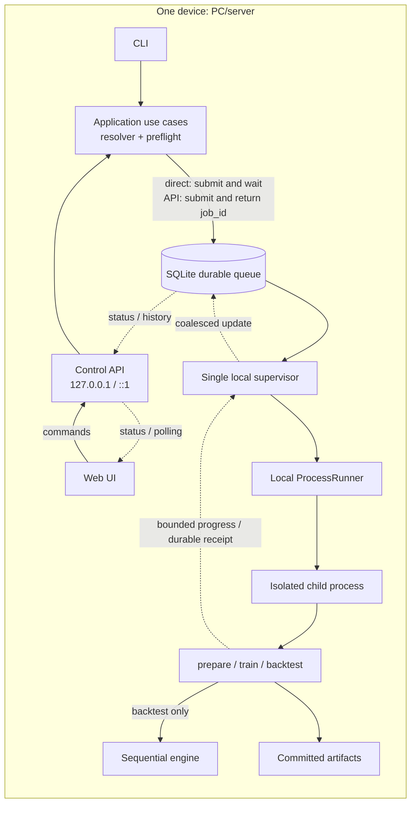
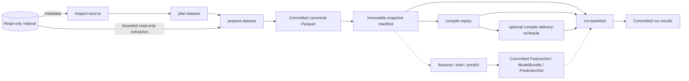
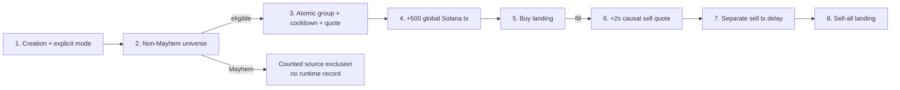

# On-Chain Backtest Engine architecture: concise overview

On-chain research is integrated into the shared React workspace at `/research`.
Existing artifact links, preparation/analysis, warnings, paged evidence and the
three-level whole-result graph retain the §24.6 contract. The replaced research
HTML and global DOM scripts are removed. The implemented §24.6 renderer replacement
uses locally bundled Sigma.js/React Sigma, bounded worker layout, explicit
display-only edge filtering and bounded saved navigation. Implementation status
is recorded in deep-dive §3.4.

Status: accepted as a synchronized overview

> The complete normative description is in the
> [architecture deep dive](architecture-deep-dive.md). This file is its concise
> map and does not introduce independent decisions. When wording is ambiguous,
> the deep dive governs, and any discrepancy found must be corrected in both
> documents.

## Approved wallet-research extension

[Deep dive §24.6](architecture-deep-dive.md#246-on-chain-wallet-research)
defines a separate observational research consumer: bounded `research prepare`
creates a verified immutable participant snapshot; local `research analyze`
builds activity, shared-mint pairs and exact observation evidence in DuckDB.
The same durable job/publication lifecycle and same-origin bounded dashboard
apply. The page explains first purchases and their limitations; locally bundled
Sigma.js/React Sigma adds zoom/pan/drag and accessible exact-pair evidence navigation
within 25 page pairs / 50 nodes, without changing research identity.
The §24.6 whole-result mode adds up to 200,000 pairs / 5,000 participating
wallets: bounded sequential loading, progress/cancellation, exact completeness
checks and all-neighbour search. The implemented three-level display is
visual groups → group wallets → complete wallet neighbourhood, with reconciled
internal/cross-group counts and exact-pair evidence. Grouping is presentation
only; table pagination preserves the loaded result.
Research v2 snapshots also store bounded same-source creation classifications.
Tokens with an empty creation signature are excluded from both analysis modes;
visible warnings list every affected mint and its source-row count through
bounded pagination. Original observations remain stored unchanged.
The shared CLI/API default is `NON_MAYHEM` («Без Mayhem»); `ALL` («Все режимы»)
is explicit. Filtering excludes Mayhem and unclassified tokens before activity,
first buys and pair thresholds, with separate visible row/mint counts.
It never blacklists a wallet for its other Mayhem trades. V1 artifacts retain
their original readable meaning; their missing classifications require a new
snapshot for `NON_MAYHEM`, while a new `ALL` analysis remains supported.
Signer and fee payer remain distinct roles, source-row multiplicity is
preserved, and completeness/finality remain UNKNOWN. Research artifacts cannot
enter replay or Strategy directly. Existing Sniping gates and identities are
unchanged. The first slice is implemented and verified on hermetic source,
CLI/API/child and browser workflows. One saved v1, all-mode live-source cut passed local
analysis of all 10,075 signers and 97,040 rows at 180, 1,000 and 3,600 seconds;
compact intermediate keys preserve exact output under unchanged quotas.
[Capacity evidence](research-capacity.md) records the scope. General live-source
fidelity/capacity, transfers, full wallet PnL, ownership clustering and automatic
strategy promotion remain outside this closure. See the
[wallet research guide](wallet-research.md).

## 1. The decision in one paragraph

The platform is **one Python modular monolith with hexagonal boundaries** that
runs on one native Linux x86_64 or macOS arm64 PC/server, or on Windows 11
x86_64 through WSL2/Ubuntu, with 16–32 GB RAM and local NVMe. The external
ClickHouse is used only as a read-only source while preparing data. The
canonical contract is an immutable stream of atomic transaction-group
boundaries; sub-event order is considered known only to the extent proven by
`ordering_fidelity`.

The Windows profile uses the Linux filesystem inside WSL for the repository and
the operational `data_root`. DrvFS paths (`/mnt/c`, `/mnt/d`), network mounts,
and the native Win32 runtime are unsupported: they remain fail-closed until
separate lock/process/durability adapters and a complete platform gate exist for
them.

`prepare-dataset` materializes selective canonical Parquet data and an immutable
snapshot. A one-off run may read Parquet; repeated runs and sweeps normally use
a content-addressed `ReplayPack` through read-only mmap when the measured
break-even justifies its compilation and disk costs. ReplayPack is rebuildable
only when exact snapshot/compiler inputs are retained and a deterministic
rebuild contract exists. One run is always executed by one sequential,
deterministic child process; only independent runs are parallelized, within a
measured RAM/CPU/NVMe budget.

The Direct CLI and the optional Web UI/localhost Control API call the same
application use cases. The Web UI sends commands to the Control API; job
endpoints persist jobs in a durable local SQLite queue, while read-only
inspect/plan endpoints may respond synchronously. The UI/API do not participate
in the event hot loop. Microservices, network storage, and distributed execution
are unnecessary for the target single-host profile.

The current executable reference slice covers the complete local path:
`bounded-source-evidence/v2`, network-aware `source-inspection/v5`, canonical
`backtest.dataset-plan/v4`/`DatasetSpec` v5, gap-safe incremental
`prepare-dataset` with canonical schema v3, `canonical-distribution/v5` and
`canonical-snapshot/v4`, canonical Parquet, compact-clock `replay-pack/v3`,
ReplayPack/DeliverySchedule, causal engines, sweeps, exact semantic bundle
closure, frozen/embedded exact ML, durable direct/API
queue→supervisor→child execution, and operator maintenance. Legacy evidence,
inspection v1–v4, plan v1–v3, and DatasetSpec v1–v4 receive
`REPREPARE_REQUIRED`.

Pump.fun Sniping is implemented for verified local artifacts with explicit
cut-scoped source admission: non-Mayhem universe policy v2, the fixed
four-stream source profile, live normalizer/projector, sentinel/lifecycle
normalization, a readable reference reducer, the dedicated
`numpy-mmap-pumpfun-sniping-v1`, strict `pumpfun-sniping-run-draft/v3` with a
required execution mode and account profile v2, per-mint mode-specific ATA,
one-time wallet UVA, `pumpfun-roundtrips/v4`, summary v3, correlated ledger v2,
external result tables, and typed CLI/API/Web UI. The reference and NumPy paths
use the same account reducer. Successful one-zero-leg dust transitions are
preserved; a both-zero no-op is rejected.

The two implemented modes are `EXOGENOUS_REPLAY` and the separate
identity-bearing `EXOGENOUS_VIRTUAL_SETTLEMENT`. The virtual mode explicitly
labels sell output beyond observed real SOL as synthetic; it is not a
counterfactual or on-chain-executable liquidity claim. A mode change requires
a new v3 resolution and changes logical/order/round-trip identities, but reuses
the same verified Dataset/Snapshot/ReplayPack without extraction or replay
compilation. Legacy draft v2 receives `RERESOLVE_REQUIRED`; committed summary
v2/round-trip v3 remain readable only under their original strict meaning.

Raw live trade rows do not contain separate protocol/creator fee columns. The
installed normalizer derives these components from the exact curve SOL leg by a
pinned effective-dated 95/30-bps profile and integer rounding, while evidence
binds the formula/profile/normalizer digest as derived-not-observed provenance.
The interim bundle policy counts a bundled buy only as a successful `BUY` with
the same signature/mint after creation in the same transaction. A
same-transaction successful `SELL` is applied to the curve atomically before
the decision, but is not counted as a bundled buy; `bundled_buys_count` is
non-binding.

Live admission is cut-scoped. The exact decision range and settlement tail
require complete four-stream evidence before downstream publication. Missing
transitions produce `CURVE_TRANSITION_MISMATCH`; partial checks, checked-in
`UNKNOWN` examples, or manual `PROVEN` cannot admit a rejected cut. Production
admission additionally requires mode-specific three-way exact equivalence and
representative performance evidence. Cold-cache, 7/30-day, extraction/ML/API
overhead, and deployment checks remain separate gates. The implemented Web UI
covers `resolve -> submit -> progress -> result -> lineage` with one React
Strategy results dashboard for Sniping, Copy Buy and FirstSwap, without
extending live-source admission.

All screens provide a warm-sunset default and a dark theme through a
shared browser-local preference, with a visible tab-only fallback when storage
is unavailable. Appearance does not change commands, identities, or results.

Job/run query surfaces are bounded projections: they do not expose executable
payloads, the full input list, raw final balances, or Parquet. Manifests and
lineage are read separately with hard limits. The CLI validates the identity of
an already running loopback controller before delegation and before local
SQLite composition. Source transport requires verified TLS/VPN/SSH or an
explicit deployment-local insecure HTTP opt-in with a warning; the secret
remains only in the external environment/provider and does not raise fidelity.
The detailed verified boundary is in Section 3.4, “Current project state,” of
the deep dive.

Exact embedded ML currently supports only an integer-linear runtime;
tree/ONNX/GPU tolerance/stateful ML, arbitrary optimized strategies,
resume/checkpoint, and an unconfigured external backup fail closed without
silent fallback. The FirstSwap and Pump.fun optimized backends are limited to
their exact allowlisted closures. A second network family, PumpSwap execution,
and a cross-network run are not implemented. The exact current-vs-production
status remains in deep dive §3.4.

## 2. Goals and hard constraints

The following must be addable without changing the engine:

- strategies, causal features, and ML models;
- other network families, indexer adapters, and local datasets through
  versioned network/position contracts;
- launchpad/AMM/CLOB protocol plugins and their versions;
- execution, latency, clock, fee, slippage, risk, universe, and valuation
  policies;
- new local result/query adapters.

Guarantees and constraints:

- one trusted codebase and one Python environment;
- 16 GB RAM is the minimum supported profile; 32 GB is recommended;
- one local NVMe; CPU-first, with an optional local GPU;
- the source is accessible only to `inspect-source`, `prepare-dataset`,
  bounded `research prepare`, and an optional estimate in `plan-dataset`;
- compile, feature/ML, and backtest jobs read only committed local artifacts;
- a `CANONICAL_EXACT` run with the same logical identity produces a
  byte-identical normalized audit/result regardless of Parquet/ReplayPack,
  batch, and the order of other runs; a tolerance ML backend does not receive
  this guarantee;
- a whole period is not loaded into RAM;
- one snapshot/run contains exactly one immutable network identity and position
  schema; synchronized cross-network runs are currently forbidden;
- insufficient fidelity, an incompatible runtime, or an unpinned dependency
  causes fail-fast/quarantine, not a silent downgrade.

The first version does not build S3/MinIO, PostgreSQL, a local ClickHouse,
Redis, Kafka, a distributed queue, Kubernetes, HA, multi-controller consensus,
a multi-host runner, or a sandbox for untrusted plugin code. Thin Control
API/Web UI adapters, a durable queue, supervisor, ProcessRunner, measured
admission, retry/reconciliation, receipts, and result views already work on one
host. The current UI uses bounded polling; SSE remains an optional transport.

## 3. Boundaries, processes, and dependencies

### 3.1 Starting a job

The diagram shows the current single-host path. The Direct CLI waits
synchronously for terminal state, while the API returns `job_id`, but both
branches create a strict resolved command and durable job record and use one
supervisor/child protocol.



When `backtest serve` is stopped, an ordinary Direct CLI command acquires
controller authority, durably submits the job, runs supervisor cycles, and
waits for the result. With the server active, a job is submitted through the
queue/API surface; a second mutating controller fails fast. An HTTP request
never performs a heavy job inside the API process: it promptly returns
`job_id`.

`controller.lock` excludes a second controller/supervisor and coordinates the
server with a mutating CLI; a separate `writer.lock` permits exactly one
materialization writer. One ASGI/API process and one supervisor loop operate;
multiple ASGI server processes are forbidden. Progress is aggregated
infrequently; market events never pass through SQLite, polling/stream transport,
or the API.

The lock owner and `/api/v1/health` are bound by the domain-tagged digest
`control_plane_id = H("backtest.control-plane-identity", schema, canonical
resolved data root, controller instance ID)`. This operational controller
identity is excluded from run/artifact identities. The CLI does not disclose a
path: when the lock is held, it validates the owner, contacts only the
configured loopback peer, and requires the identity to match. Supported
job/query commands are then delegated by a strict bounded HTTP client;
malformed/missing owner data, an unavailable/mismatched peer, and a
non-delegable mutation fail closed before local SQLite/application composition.

All processes, SQLite, and artifacts reside on one host and use one local data
root. SQLite stores only small operational job/catalog state, not market
events. Independent processes are admitted by the resource admission
controller only within a measured budget.

### 3.2 Roles of local technologies

| Component | Role | Does not do |
|---|---|---|
| Python | Use cases, engine, plugins, CLI, and Control API | Does not retain giant rows as objects |
| Web UI | Job creation, status, results, and lineage | Does not execute backtests or read data files |
| Control API | Command validation, job control, queries, and progress | Does not participate in the event hot loop |
| Local supervisor | Admission and child processes | Does not change engine semantics |
| Local filesystem | Authority for committed artifacts | Is not its own backup |
| Parquet | Canonical snapshots/features/results | Need not be the fastest replay format |
| Arrow IPC | Typed mmap event buffers | Does not define retention by itself |
| NumPy `.npy` | Dense mmap indexes/features/predictions | Does not replace the schema manifest |
| DuckDB | In-process ETL, joins, research SQL, and spill | Does not participate in the hot loop |
| SQLite | Jobs and searchable operational metadata/indexes | Does not store market data or commit bytes |
| NVMe | Sequential data path and OS page cache | Does not provide HA/DR |

These roles are implemented in the reference slice: PyArrow/DuckDB publish and
bounded-read canonical Parquet; NumPy serves verified read-only ReplayPack,
DeliverySchedule, and ML mmap overlays; SQLite stores jobs/attempts/events,
shard frontiers, artifact/lineage indexes, the manifest-bound `run_index`, pins,
and receipts. SQLite is the operational authority for job/attempt/idempotency
state; verified filesystem commit is the authority for artifact bytes, atomic
`pins/*.json` files are the authority for retention roots, and searchable
indexes are rebuildable. Run pages are selected globally by completion epoch
descending and artifact ID ascending, then each bounded page is reverified
against the exact committed manifest. Every verified Run has a searchable or
explicit unqueryable projection row; insert/delete leaves the generation dirty
until transactional completeness checks pass. Missing, dirty, or stale state
fails closed.

DuckDB and SQLite are embedded libraries, not separate daemons. The Web UI is
shipped as static assets inside the Python distribution; Node.js is not a
runtime dependency. Job endpoints accept typed DTO/content IDs, not raw SQL,
shell commands, import paths, or arbitrary filesystem paths. A queue envelope
contains only a strict canonical job-specific payload and exact artifact
closure; an unknown job/field/alias is not executed. The browser does not
receive credentials, Parquet, or ReplayPack.

The initial dependency policy is: DuckDB is the only primary analytical
engine, PyArrow provides columnar I/O and batches, NumPy provides compact/dense
state, and standard-library `sqlite3` provides the catalog/queue. Polars may be
added only after a measured gap.

### 3.3 Import direction

```text
interfaces/adapters/plugins -> application ports -> engine/domain
bootstrap -> everything for wiring
domain/engine -X-> adapters, interfaces, ClickHouse, DuckDB, SQLite, PyArrow
```

- `domain` knows nothing about storage, transport, or dataframe libraries;
- `engine` depends only on domain and core-owned contracts, not plugin
  implementations;
- `application` coordinates use cases and ports;
- adapters and plugins import internal contracts; the dependency does not point
  back inward;
- Direct CLI, `backtest serve`, and the job child are three working entry modes
  over one common bootstrap/wiring layer; the child does not open SQLite and
  returns bounded progress plus a durable completion receipt;
- a port is introduced only at a real replaceable seam, not between every pair
  of functions.

API routes and CLI handlers do not access SQLite, the filesystem, or ClickHouse
directly: they validate transport DTO, call an application use case, and
transform the result into a versioned response/output DTO. Concrete adapters
are connected only in the bootstrap composition root.

## 4. End-to-end workflow

> This workflow is implemented end to end for the reference stack on verified
> local artifacts. Every stage fails closed on an
> unresolved dependency, insufficient fidelity, incompatible runtime, or
> unsupported extension surface.



The stages have separate responsibilities:

1. `inspect-source` reads metadata without mutations, records a schema
   fingerprint without credentials, describes capabilities/fidelity, does not
   download market data, and does not create a local mirror.
2. `plan-dataset` compiles the requirements of the strategy, execution,
   features, models, warmup, decision range, and settlement tail into the
   network/position schema, capabilities, protocol versions, columns,
   capability-specific half-open block ranges, and a dry-run resource budget;
   a proven fidelity/day/disk/quota violation fails fast. Sniping `DatasetSpec`
   v5 includes `global-transaction-duration-roundtrip/v1`: settlement streams
   are extended once to the hard block cap, while the launch stream ends at the
   end of the decision range; a caller tail above the cap is rejected.
3. `prepare-dataset` extracts bounded shards in streaming batches, normalizes
   capability records, applies the protocol projector, causal/as-of joins, and
   cross-capability clock checks, performs QA, publishes canonical Parquet
   distributions separately, and then publishes a snapshot manifest with
   exact references to them. For Sniping, the root remains invisible until the
   read-only candidate validator verifies chain/order/groups, complete causal
   non-Mayhem classification with exact source-evidence/validation
   count+digest binding, Pump state for eligible launches, and the full maximum
   settlement path of every decision-range target.
4. `compile-replay` builds a generic content-addressed ReplayPack that does not
   depend on run-specific latency or seed.
5. Optional `compile-delivery-schedule` accepts the exact resolved ReplayPack
   and resolved latency/clock/RNG/scheduler inputs and materializes observation
   deliveries; without it, the same canonical delivery stream is built during
   the run.
6. `run-backtest` opens a committed `ReplaySource` adapter over canonical
   Parquet or ReplayPack and, when present in `ResolvedRunSpec`, committed ML
   artifacts; it performs preflight, sequential causal replay, and buffered
   output, then atomically publishes the `RunManifest` and results.
7. `run-sweep` creates an immutable list of `ResolvedRunSpec` values and starts
   only as many independent processes as the measured budget admits; one run is
   not divided into time shards. `sweep-result/v2` pins exact run refs and
   physical settings, while the closed set of comparison metrics remains
   scalar; final balances are represented by a count/content digest, not an
   array in each row.
8. `submit-and-monitor` accepts a versioned typed command and mandatory
   idempotency key, invokes the same resolver/preflight as the Direct CLI, and
   persists an immutable `ResolvedJobSpec`. The supervisor moves the job from
   `QUEUED/STARTING/RUNNING` to exactly one terminal state; a successful
   `RunManifest` appears only after artifact commit. Priority, retry, and
   timestamps do not change logical experiment identity. Direct and API paths
   use a strict job-specific decoder, one local supervisor, a SQLite-free child,
   a durable receipt, and verified completion; the UI reads coalesced progress
   through bounded polling.

`ResolvedJobSpec` is the common immutable envelope for `prepare`, `compile`,
`backtest`, `features`, `train`, and `predict`; the backtest-job payload contains
the exact `ResolvedRunSpec`. Priority, UI labels, retry policy, and timestamps
belong only to operational scheduling.

In the target system, requirements for `plan-dataset` are collected
automatically from strategy, feature/model, and execution registries. Today,
`PlanDataset` receives an already prepared versioned tuple of
`DataRequirement`; registries and the remote estimator are not connected, so
source/local byte estimates are normally `UNKNOWN`.

The Strategy never performs SQL/network calls and never receives a source
adapter, snapshot statistics, future labels, or a mutable catalog.

### Source boundaries

A boundary is recorded separately for each capability:

```text
source_id
capability + schema version
network_id + position_schema_id
block range
snapshot cut
chain_finality
ingestion_watermark (nullable)
upstream_revision (nullable/unproven)
internal_revision
source_consistency
completeness
validation_status
```

The half-open typed block range is the authoritative filter; the Solana adapter
maps it to the source `slot`, while a UTC date is used only as a proven-safe
pruning superset. `OFFSET` is forbidden, and keyset pagination is allowed only
with a proven total key. Local `validation_status=PASS` does not raise unknown
finality/completeness/revision/consistency. A bundle cut does not exceed the
minimum contiguous committed frontier; a changed shard creates a new immutable
internal revision.

A full mirror is outside the target architecture; datasets are bounded to
the needs of a specific consumer. The
initial bounded slice is one protocol and 1–7 days; the range expands only
after measuring bytes/day and events/sec. With ambiguous duplicates, the whole
bounded shard is read while preserving multiplicity. Query limits and an
identifier are mandatory; credentials are excluded from query IDs, logs,
exceptions, and cache keys. A row that disappears on a repeated read is not
treated as a tombstone without a CDC/deletion contract, stable identity, and a
proven-complete read.

The decision range permits new strategy targets; the right settlement tail is
needed only to finish orders/timers already created. If the source watermark or
quota prevents proving the complete tail, prepare/run fail closed and do not
hide a pending trade as a censored result. In DatasetSpec v5, the tail is pinned
in identity together with the exact settlement requirement.
`maximum_tail_blocks` is the hard acquisition cap: the planner extracts it in
full for clock/trade/lifecycle streams, and the pre-root validator proves actual
sufficiency. None of these local checks raises `UNKNOWN` source fidelity.

Pump.fun Sniping requires one consistent cut of four streams: `BLOCK_CLOCK`,
`TOKEN_LAUNCH`, `PUMP_CURVE_TRADE`, and `PUMP_CURVE_LIFECYCLE`. Live evidence
must confirm that canonical `BLOCK_CLOCK.transaction_count` includes
successful, failed, and vote transactions, that the Pump transaction index uses
the same global order, that creation fields are immutable at creation time,
that bundled instruction order is exact, and that explicit `mayhem_mode` is
complete, Boolean, and immutable at creation time. Every successful SOL-paired
launch must be causally classified: known Mayhem receives `MAYHEM_EXCLUDED`,
while other eligible launches require complete curve/fees/completion/migration
and a block-time tail. The presence of source columns such as `tx_count` does
not raise fidelity; they become only explicitly mapped physical aliases.
Archive RPC or another table is not a silent fallback.

Static capability TOML is not proof authority: every proof field in it remains
`UNKNOWN`. An optional bounded `inspect-source` pass creates
`bounded-source-evidence/v2` receipts bound to the exact source,
capability/version, network/range/cut, mapping/query digests, executed query
fingerprints, and result digest. The planner validates this provenance and does
not raise semantics that cannot be derived. The generic validator proves only
its limited set of properties. The supported Pump source uses a fixed-profile
four-stream evaluator with live normalizer, sentinel/clock/order/universe/state/
fee/lifecycle checks, and aggregate v2 receipts. Missing required transitions
produce `CURVE_TRANSITION_MISMATCH`, prevent inspection publication, and keep
the affected cut fail closed.

The non-Mayhem universe policy, together with source mapping/query/projector
digests, is part of DatasetSpec dependency identity. A receipt/validation
records classified/eligible/`MAYHEM_EXCLUDED` counts and the ordered exclusion
digest/reason; snapshot publication verifies the exact binding. Excluded
Mayhem rows do not enter the canonical execution stream or run audit.

A canonical skipped-slot sentinel has Unix-epoch `block_time`,
`transaction_count=0`, and a pinned hash/validator fingerprint. It closes only
the continuity of the integer source range and does not create a canonical
clock/transaction/duration boundary. A real produced zero-transaction block
remains a clock row with real time/hash. A missing integer slot, conflicting
duplicate, or malformed sentinel produces `INCOMPLETE_BLOCK_RANGE`.

If a terminal `buy_v2` and migration have the same
signature/mint/block/transaction identity, the versioned lifecycle profile
normalizes `trade -> derived completion -> migration`. The migration table has
no `ix_idx`, so completion and migration receive a versioned deterministic
derived `event_index` strictly after the trade. This is one atomic transaction
group without an intermediate callback or synthetic boundary.

## 5. Canonical data, time, and states

Raw `block_time` is insufficient for ordering. Snapshot and ReplayPack store a
strictly monotone `boundary_ordinal` for atomic historical transaction groups;
the chain-specific position remains typed.

Core-owned position values:

```text
NetworkId = "<family>:<immutable-chain-reference>"
PositionSchemaId = "block32-transaction32-v1"
BlockRange(network_id, from_block_ordinal, to_block_ordinal)
ChainPosition(
  network_id,
  position_schema_id,
  block_ordinal,
  transaction_index,
  event_index,
)
boundary_ordinal = (block_ordinal << 32) + transaction_index + 1
```

The block and zero-based transaction index are validated as UInt32; the event
index defines proven intra-transaction order, but not a separate transaction
boundary. The alias `mainnet`, an endpoint, and a credential are not a
NetworkId. Network is stored once in artifact metadata, but participates in
event/dataset/snapshot/order/run identity. Solana uses the full base58 result of
`getGenesisHash`, not a shortened display prefix. One artifact/run has one
network/schema. Wider coordinates require a new schema, while pre-network
slot-only artifacts receive `REPREPARE_REQUIRED`, without an implicit Solana
default or in-place migration.

The semantic event contract contains:

```text
schema version
boundary / typed chain position
transaction group
event kind
stable causal and source references
protocol + version
typed payload
identity and ordering fidelity
nullable measured source_observed_at
```

Generic launchpad event types are `TokenLaunchEvent`, `VenueTradeEvent`, and
`VenueLifecycleEvent`. Core owns identity/grouping/common assets, while the
protocol plugin owns the payload schema, lifecycle, and integer math.
Pump-specific formulas, Token-2022/cashback, Mayhem classification, and
migrations do not belong in core. The protocol plugin implements only eligible
non-Mayhem execution semantics, while the versioned universe policy classifies
explicit creation-time mode before targeting. A derived lifecycle
`event_index` is allowed only from a pinned source-specific ordering profile;
raw instruction provenance is not replaced.

This is a semantic schema, not a requirement to create a Python dataclass for
each row. Parquet/ReplayPack adapters pass typed `EventBatch`,
`HistoricalGroupView`, and reusable `EventView` values to the engine; the hot
loop uses compact integer IDs and structure-of-arrays.

Four times must not be conflated:

- `effective_at` — when the fact occurred on chain;
- `source_observed_at` — nullable and only a measured source timestamp;
- `extracted_at` — a local operational timestamp, not causal availability;
- `available_at` — a run-specific delivery boundary calculated by the resolved
  latency/clock policy.

The engine separates four states:

- `HistoricalReferenceState` is changed only by historical groups;
- `ObservedState` contains only information already delivered to the strategy;
- `SimulationVenueState` stores the exogenous/shadow/fork state for the selected
  mode;
- `PortfolioState` is derived from the double-entry ledger.

Separate internal queues store deliveries, orders, timers, and notifications;
they are not mixed with the four state views.

Source-row identity, canonical-event identity, and the ordering tie-breaker are
different concepts. A content hash does not prove uniqueness and does not allow
identical rows to be deleted. For `TRANSACTION_PARTIAL`, a row-by-row reducer in
source/hash order is forbidden: the protocol plugin either provides a proven
permutation-independent group reducer or preflight rejects requirements for
unknown intra-transaction order. No callbacks, deliveries, or order eligibility
occur inside an unordered group.

Typed payload columns are defined by the versioned canonical schema and
protocol projector. Amounts, reserves, balances, and fees are stored in integer
atomic units; `UInt64`/`Int128` may not be narrowed without a bounds proof, and
`float` is forbidden in protocol math and the ledger. Rows are sorted by
canonical position and proven sub-position while preserving each transaction
group atomically.

A historical `VenueTradeEvent` may have exactly one zero amount leg only for a
proven successful positive-input reserve transition. Two zero legs, a synthetic
amount, row filtering, and extending this allowance to quote/fill are
forbidden. Normalizer v2 participates in semantic identity and requires a
snapshot/ReplayPack rebuild with three-way exact equivalence.

## 6. Ports and extension contracts

Primary use cases are `inspect-source`, `plan-dataset`, `prepare-dataset`,
`research prepare`, `research analyze`,
`compile-replay`, `compile-delivery-schedule`, `run-backtest`, `run-sweep`,
`build-features`, `train`, `predict`, submit/cancel/query jobs/runs, verify, and
GC. A `RunSpecDraft` with aliases/defaults is not executable: the resolver
creates an immutable `ResolvedRunSpec`, and only that value may proceed to
preflight, queueing, and start.

Key driven ports:

```python
class SourceReader(Protocol):
    def list_capabilities(self, source_id: SourceId) -> tuple[CapabilityDescriptor, ...]: ...
    def scan(self, request: ExtractionRequest) -> Iterator[IndexedBatch]: ...


class ArtifactRepository(Protocol):
    def stage(self, spec: ArtifactDraft) -> ArtifactWriter: ...
    def open_committed(self, artifact_id: ArtifactId) -> ArtifactHandle: ...


class JobQueue(Protocol):
    def submit(self, spec: ResolvedJobSpec, idempotency_key: str) -> JobRecord: ...
    def request_cancel(self, job_id: JobId) -> None: ...
    def claim_next(
        self,
        supervisor_instance_id: str,
        capacity: ResourceCapacity,
    ) -> JobAttempt | None: ...
    def transition(
        self,
        attempt_id: AttemptId,
        expected_version: int,
        new_state: AttemptState,
        result_artifact_id: ArtifactId | None = None,
    ) -> JobAttempt: ...


class ProgressSink(Protocol):
    def publish(self, event: ProgressEvent) -> None: ...


class ProcessRunner(Protocol):
    def spawn(self, attempt: JobAttempt) -> ProcessHandle: ...
    def probe(self, handle: ProcessHandle) -> ProcessStatus: ...
    def terminate(self, handle: ProcessHandle, grace_seconds: float) -> None: ...


class ReplaySource(Protocol):
    def boundaries(self) -> BoundaryReader: ...
    def event_batches(self) -> Iterator[EventBatch]: ...


class Strategy(Protocol):
    def requirements(self) -> StrategyRequirements: ...
    def on_event(self, event: EventView, ctx: StrategyContext) -> Iterable[Intent]: ...
```

`ProtocolProjector` transforms capability streams into canonical group batches.
Canonical distributions, snapshots, derived caches, and results use the common
artifact publication contract. The root manifest is written and verified
before publication. The commit condition includes publication locks, durable
`COMMITTED`, a valid manifest/ID/hashes, and durability verification/adoption;
one marker alone is insufficient. A SQLite index cannot make missing or
uncommitted bytes valid.

The Strategy declares subscriptions, protocols/assets/universe, warmup,
feature/model IDs, minimum identity/order/state/fee/completeness fidelity,
supported execution modes, estimated dynamic state, and resource class.
`StrategyContext` contains only the current `SchedulerInstant`, read-only
observed market/portfolio views, causal feature/prediction views, deterministic
RNG, and buffered telemetry.

Risk, observation/order latency, clock, venue, execution, universe, and
valuation policies are separate resolved bundles. The venue model returns a
pure `ExecutionPlan`: venue transition, fills, fees, ledger postings, and
reports. The engine verifies reservations, conservation, bounds, and
idempotency, then atomically applies the transition together with the postings;
an error rolls back the logical step.

## 7. An indexer adapter is not a protocol plugin

The indexer adapter is responsible for connection/transport, query planning and
pushdown, retries/limits, schema mapping into capability records, and source
boundaries/fidelity.

The protocol plugin is responsible for semantic decoding, launchpad/AMM/CLOB
lifecycle, direction and asset semantics, integer math/rounding/fees,
migrations, venue state/group reducer, and conversion of capability records
into canonical events.

The preparation plan pins versioned capabilities, columns, protocol versions,
coverage, and required fidelity; the projector transforms capability records
into canonical events without mixing transport with protocol semantics. For
each capability, a snapshot uses one authoritative source; silently merging
sources is forbidden.

### 7.1 Approved copy-buy contract

Deep dive §23.5 defines the separate Pump.fun copy-buy strategy. Its reference
source/prepare/run/result and CLI/API/UI slice is implemented;
[deep-dive §3.4](architecture-deep-dive.md#34-current-project-state) bounds current admission.
The common React Strategy results screen includes whole-run summary charts,
bounded signal pages and per-token SOL market-cap charts with source and
actual fill markers. `/copy-results` is a bookmark alias to that screen. Deep-dive §3.4 defines the retained-history query limits and failure
boundary; charts do not change run identities or provide PumpSwap history.
Optimized copy and materialized schedules remain unavailable. It copies successful
BUYs by exact `signing_wallet`, consumes each mint on its first signal even if
the buy is rejected or fails, and exits fully by fee-free price TP/SL or maximum
holding time from fill. Observation, buy, and sell delays are separate inputs.
There are four sell attempts total; pre-submit rejection also counts, and a
retry decision follows two modeled seconds after failure. Four failures leave
an exhausted open position. Fees still enter ledger PnL. Complete bounded
signer/initial-state/market/clock evidence, a proven retry settlement tail, and
separate run/result identities are required; existing Sniping data/admission
and fixed semantics do not automatically cover this strategy.

The separate `pumpfun-copybuy-trade-payload-v1` carries the exact signer and
integer curve state through generic protocol-payload storage; source event
identity is preserved. Its versioned normalizer and transport do not replace
the full preparation proof required by deep dive §23.5.

Copy preparation independently enumerates leader BUYs before joining bounded
creation history, and reconciles them against every required market transition.
Missing older creation rejects the cut. The §23.5 copy-only receipt v3,
inspection v6, DatasetSpec v6 and plan v5 bind this coverage and the full
four-attempt settlement requirement without reinterpreting Sniping artifacts.

## 8. Deterministic scheduler

One run has one sequential reducer. Historical transaction groups receive a
strictly monotone `boundary_ordinal`. The scheduler instant and normative queue
key are:

```text
SchedulerInstant = (
  boundary_ordinal,
  chain_position,          # nullable only for an explicit synthetic boundary
  monotone_logical_ns      # nullable modeled clock metadata
)

queue_key = (
  release_boundary_ordinal,
  phase_priority,
  source_or_creator_boundary_ordinal,
  stable_causal_id
)
```

ReplayPack stores compact block-clock arrays: block ordinal, transaction count,
cumulative transaction prefix, and integer block time. Size grows with blocks,
not all transactions. The scheduler combines event-bearing boundaries with
typed synthetic transaction boundaries, so an order may land in a transaction
without a Pump event and without one Python object per network transaction. A
recognized skipped-slot sentinel is absent from these arrays, does not
participate in cumulative prefix/duration search, and is invisible to the
engine.

`source_or_creator_boundary_ordinal` is the boundary of the originating
historical record or the boundary at which a deterministic internal item was
created. `stable_causal_id` is a domain-tagged fixed-width unsigned/binary
source/order/timer identity independent of path, Python `hash()`, allocation
order, or a physical string dictionary. A numeric ReplayPack field is only a
representation, not a change of semantics.

Phase order is fixed and versioned:

```text
10 HISTORICAL_REFERENCE_APPLY
20 SIMULATION_STATE_RECONCILE
30 OBSERVATION_DELIVERY
40 STRATEGY_CALLBACK
50 RISK_AND_ORDER_ACCEPTANCE
60 VENUE_EXECUTION_AND_LEDGER_COMMIT
70 STRATEGY_EXECUTION_NOTIFICATION
80 CHECKPOINT
```

Latency is converted to `release_boundary_ordinal` before enqueueing: block
latency selects the first boundary no earlier than the target block,
transaction-position latency selects the boundary after N global network
transactions, and duration latency selects the first future boundary under the
declared modeled clock. With insufficient clock fidelity, the target is rounded
up or the run is rejected. Observation latency is calculated from the effective
boundary, while order latency is calculated from the current decision instant.
Every new order must satisfy:

```text
eligible_boundary_ordinal > current_decision_boundary_ordinal
```

Even zero latency does not permit an order in an already applied/current
transaction group.

An optional `DeliverySchedule` stores
`release_ordinal + event_row_index` and provides a sequential two-way merge with
the historical stream. A materialized schedule and the on-the-fly canonical
scheduler must have identical ordering and, under `CANONICAL_EXACT`, the same
audit hash.

`delivery_build_key` is a derivation lookup that pins ReplayPack,
latency/clock/RNG, scheduler/engine/compiler, and writer/runtime inputs;
`delivery_schedule_id` identifies the committed output. Preflight recalculates
the build key and verifies the content ID/hashes. If one build key produces
different outputs, both results are quarantined as a nondeterministic compiler
pending investigation.

The hot loop forbids SQL/network, pandas/DataFrame, Pydantic validation,
`Decimal`/`datetime` arithmetic, mint/signature strings, a Python object/dict or
heap item for each market event, synchronous per-event logging/writes,
`datetime.now()`, Python `hash()`, random UUID values, and global `random`. Historical
deliveries use a two-way merge; the heap remains only for rare dynamic
orders/timers.

## 9. Fidelity modes

Execution mode always participates in `ResolvedRunSpec`:

1. `EXOGENOUS_REPLAY` — an own order does not change the historical market.
2. `EXOGENOUS_VIRTUAL_SETTLEMENT` — the historical market is likewise
   immutable, but a successful sell explicitly sources any virtual-quote
   shortfall beyond observed real SOL from a synthetic external ledger account.
3. `SHADOW_STATE_REPLAY` — an own order changes shadow state before
   reconciliation.
4. `CONDITIONAL_PROTOCOL_REPLAY` — historical inputs and orders are applied to
   fork state.

An own simulated order never changes `HistoricalReferenceState`. No mode is
called exact without sufficient source capabilities and protocol golden tests.
Virtual settlement is exact only relative to its declared deterministic model
and is never presented as on-chain-executable liquidity. It keeps the buy-side
real-token cap and all lifecycle, fee, account, and slippage checks. Only a
sell's real-SOL cap changes:

```text
gross = current historical virtual-reserve sell output
venue_funded = min(gross, current historical real SOL)
synthetic_funded = gross - venue_funded
```

The two debits fund wallet net proceeds plus Pump fee collectors in one
balanced ledger transaction. Synthetic proceeds become spendable simulated
SOL, while failed sells post no synthetic funding. External trades are not
recomputed and own orders do not deplete historical reserves.
Preflight combines the requirements of strategy, execution/fidelity,
features/models, and warmup, and verifies minimum
identity/order/state/fee/finality/completeness.

## 10. Accounting and PnL

The source of truth for money is an append-only double-entry ledger. Postings
sum to zero for each asset, including external accounts: venue, network,
protocol fee collector, and creator. Available and reserved balances are
separate. PnL and valuation are derived views with an as-of price policy, not
ledger mutations.

`run-ledger/v2` stores immutable `correlation_kind` and `correlation_id` for an
order/roundtrip. Realized round-trip cashflow is derived from committed,
correlated portfolio postings; a parallel shadow PnL is not authoritative.
Reconciliation rejects disagreement between the result and the ledger.

The venue model returns a pure `ExecutionPlan`: venue transition, fills, fees,
postings, and reports. The engine verifies reservations, conservation, bounds,
and idempotency and atomically applies the transition with the ledger postings.
An error rolls back the entire logical step.

Audit, ledger, and results are buffered in column batches. They are neither held
entirely in RAM nor written synchronously one row at a time.

### 10.1 Pump.fun Sniping v1 contract

```text
successful SOL-paired creation transaction
-> explicit creation-time mayhem_mode classification
-> Mayhem: source-evidence exclusion, no runtime record
-> non-Mayhem: eligible target
-> atomic apply, including bundled dev buy
-> cooldown + post-group buy reference quote
-> 500 subsequent global Solana transactions
-> buy landing
-> first nonempty transaction boundary with block_time >= fill_time + 2s
-> sell reference quote
-> sell_delay_transactions >= 1
-> sell 100% acquired tokens
```



- Immutable universe policy
  `successful-sol-paired-non-mayhem-pumpfun-launches-in-decision-range-v2`
  classifies every successful SOL-paired launch before the signal. Explicit
  creation-time `mayhem_mode=true` increments the source-evidence/validation
  count+ordered digest with reason `MAYHEM_EXCLUDED`, but creates no canonical
  execution event, run-audit row, target/cooldown/order. A missing, null,
  out-of-domain, conflicting, or late-enriched mode fails closed. Eligible
  launches remain non-Mayhem normal legacy, Token-2022, and cashback.
- The target is every eligible non-Mayhem Pump.fun creation, even without a dev
  buy. The developer is immutable `CreateEvent.creator`, not payer/user.
- Cooldown is keyed by developer, begins at the eligible creation signal, and
  equals 600 seconds. `t+599s` is permanently skipped and `t+600s` is eligible;
  a balance rejection or landed buy failure does not roll back cooldown, and a
  suppressed launch does not extend it. Equal times are resolved by chain
  order.
- The transaction after the target is number 1; buy phase 60 executes after
  historical number 500 and before number 501. Successful, failed, and vote
  transactions are counted. A missing count/order/time or insufficient tail
  fails closed.
- The fixed gross SOL budget includes Pump protocol/creator fees; Solana fees
  and account rent are paid above it. One shared wallet reserves maximum buy
  spend plus the buy network fee and rent in canonical target order; the sell
  fee is not reserved in advance. A pre-submit insufficient balance pays no
  fee.
- Buy and sell have separate slippage limits:
  `min_out=floor(reference_out*(10000-bps)/10000)`. The buy reference is the
  post-target group and the sell reference is the causal `+2s` boundary; signed
  atomic slippage is stored without float. A failed buy creates no sell, while
  a failed sell leaves an open position.
- The draft selects exactly `EXOGENOUS_REPLAY` or
  `EXOGENOUS_VIRTUAL_SETTLEMENT`. Both quote from the causal historical state,
  include own size in the quote, never mutate that state, and never recompute
  other wallets' trades. The second mode relaxes only sell real-SOL solvency
  and records reference/landing potential shortfall separately from successful
  settled synthetic funding. Completion/migration still produces a failed Pump
  instruction with a network fee and no reroute to PumpSwap.
- The Pump plugin owns `PumpCurveStateV1`, integer formulas, and
  effective-dated modes. The initial bonding-curve profile is 95 bps protocol
  plus 30 bps creator with separate rounding; eligible normal
  legacy/Token-2022/cashback require exact versioned semantics/golden tests.
  Mayhem has only an exact classifier/exclusion, not an execution reducer or
  PumpSwap route. An unknown mode or non-SOL pair stops the run.
- Solana buy/sell fee profiles are independent:
  `signatures*lamports_per_signature + ceil(CU_limit*micro_lamports_per_CU/1e6)`.
  A landed failure pays base+priority but no Pump fee. Jito tip is absent in v1.
- A generic network quote explicitly tags the fee and account deposit with
  their `AssetId`; the engine does not equate them with the quote asset. Solana
  Sniping v1 permits both in `SOL`; a network with a different fee asset would
  require a new per-asset valuation/result contract.
- Each mint receives a new mode-specific ATA: legacy 2 039 280 lamports or
  Token-2022 ImmutableOwner 2 074 080; a successful sell closes it, while a
  failed sell leaves it locked. Fresh/prewarmed describes only the wallet-scoped
  UVA of 1 844 400 lamports: fresh creates it exactly once, prewarmed begins
  with it, and the UVA is not closed in the run. Reservation/rollback/refund and
  economic PnL are derived by the common reference/NumPy reducer and ledger.
- A closed position has realized cash PnL from ledger cashflows. An open
  position receives a separate net-liquidation MTM after assumed Pump/Solana
  fees and returned rent; after migration, the last Pump quote is only
  `STALE_PRE_MIGRATION`, not an executable valuation.

The Strategy creates a generic `RoundTripIntent`; the Pump plugin builds the
venue quote, the Solana plugin builds network/account costs, and the common
engine/ledger know no formulas of a specific network or launchpad.

New runs use `pumpfun-roundtrips/v4`,
`pumpfun-sniping-run-summary/v3`, and unchanged `run-ledger/v2`. Round-trip v4 stores
deterministically ordered account components with schema, asset, scope, release
policy, reservation/payment/refund/locked deltas, and attribution; leg failure
codes are also preserved. It adds execution mode, reference/landing liquidity
evidence, actual venue/synthetic funding, and projected MTM shortfall. Summary
v3 provides fee/deposit/slippage and gross/venue/synthetic settlement totals and
does not present partial valuation as complete: with an unvalued open position,
`economic_pnl_atomic=null`, while the valued subtotal remains a separate field.
Committed round-trip v3/summary v2 remain readable under their original strict
schemas; legacy draft v2 is not silently assigned a selectable mode.

## 11. Artifacts, RunSpec, and reproducibility

Local data is separated by meaning. The optional raw cache contains narrow
source rows for development/debugging and may be deleted: it is not
authoritative. Immutable canonical Parquet partitions are the portable storage
contract. A snapshot is a root manifest with exact refs and does not copy
partition bytes. ReplayPack, DeliverySchedule, features, predictions, and
research aggregates are derived artifacts, but not automatically disposable:
`REBUILDABLE` is allowed only with a deterministic rebuild contract and
transitively retained exact inputs. Feature/prediction bytes are otherwise
marked `NON_REBUILDABLE` or `EXPENSIVE_REBUILD` and protected by retention
policy.

Concise structure of the local data root:

```text
var/catalog/catalog.sqlite
var/locks/{controller,writer,publication,retention,...}.lock
var/staging/<attempt-id>/
var/job_receipts/<attempt-id>.json
var/cache/raw/<source>/<network>/<capability>/<block-shard>/
var/canonical/<logical-content-hash>/<canonical-distribution-id>/
  manifest.json
  part-*.parquet
  COMMITTED
var/snapshots/<snapshot-id>/
  manifest.json
  validation.json
  COMMITTED
var/replay/<snapshot-id>/<replay-pack-id>/
var/delivery_schedules/<delivery-schedule-id>/
var/features/<feature-set-id>/
var/predictions/<prediction-set-id>/
var/models/<model-bundle-id>/
var/pins/<pin-id>.json
var/runs/<logical-run-id>/<execution-attempt-id>/
var/tmp/
var/trash/
```

A snapshot is an immutable manifest and does not copy bytes from canonical
partitions. A directory listing is not a manifest; refs are content-addressed
and data-root-relative, without absolute host paths. Temporary and final paths
of one artifact reside on the same filesystem, otherwise atomic rename is not
guaranteed; network mounts are not used for the mmap hot path. A completion
receipt records exact attempt/spec/output IDs and hashes only for
reconciliation and does not replace artifact manifests.

Five artifact identities must not be conflated:

1. `artifact_sha256` — the hash of specific bytes.
2. `logical_content_hash` — canonical records/schema without path, compression,
   or attempt metadata.
3. `canonical_distribution_id` — exact physical files and writer/codec/layout.
4. `dataset_revision_id` — logical content together with source boundaries,
   projector/schema, and causal policies.
5. `snapshot_id` — the exact root manifest with dataset revision and exact
   committed distribution IDs/hashes.

`H(...)` means domain-tagged SHA-256 over a versioned deterministic canonical
serialization. Own ID, `created_at`, path/host/attempt metadata, and SQLite
state are excluded from the hash; a stored ID is always recalculated and
verified.

Another compatible writer may change distribution/snapshot ID without changing
logical content. A different source cut changes `dataset_revision_id` even if
the rows match. `snapshot_id` always means an exact artifact, not a dataset
revision alias.

A snapshot manifest contains at least:

- `snapshot_id`, `dataset_revision_id`, and `logical_content_hash`;
- canonical schema version;
- network/position schema, source/capability boundaries, decision/settlement
  ranges, requested/actual block ranges, and query template hash;
- Sniping universe/source-mapping/query/projector dependency digest and exact
  bounded evidence/validation binding with classified/eligible/excluded
  counts+ordered digest;
- nullable/unproven upstream revision separately from internal revision;
- adapter/projector/code/runtime versions;
- exact distribution IDs, relative refs, and physical hashes;
- counts, min/max position, and
  identity/order/state/fee/finality/completeness fidelity;
- validation report hash, dictionary policy, and duplicate policy;
- `created_at` only as operational metadata.

Run-specific modeled latency does not belong in a snapshot/ReplayPack.

The root manifest is written and verified before publication. Lock order,
same-filesystem staging, fsync of files/directories, atomic rename, and durable
`COMMITTED` form one publication protocol. A marker without proven directory
fsync and verification state is not visible. `open_committed` verifies the
marker, manifest/ID/hashes, and registers a read lease; recovery adoption is
allowed only after full verification. A final path is never overwritten: a
verified committed path may be reused, while a collision is quarantined. SQLite
is updated after commit and does not legitimize missing/uncommitted bytes. Disk
full or a crash before commit leaves staging/orphan/recovery state, not a
result.

A user `RunSpecDraft` may contain aliases and defaults, but is not executable.
The resolver pins exact artifacts, bundle/config digests, and the transitive
dependency closure and creates an immutable `ResolvedRunSpec`. Only that value
may proceed to preflight/queue/start.

The hash of the complete canonical bytes of `ResolvedRunSpec` is its
integrity/provenance ID and is not `logical_run_id`. `replay_semantics_id`
describes inputs that affect result semantics, while
`replay_layout_schema_id` describes only physical representation.
`replay_build_key` is the lookup for derivation and is not the committed
`replay_pack_id`; the manifest records both. Different output bytes for the same
build key do not replace an artifact: both results are quarantined pending
investigation. The same separation of `delivery_build_key` and
`delivery_schedule_id` applies to DeliverySchedule.

Network-aware identity includes canonical `NetworkId`, `PositionSchemaId`, and
block coordinates. Equal numeric positions/payloads in different networks
produce different event/dataset/snapshot/order/run identities; endpoint, source
field `slot`, credential, and local path are excluded.

Two run identities exist normatively:

```text
logical_run_id = H(
  dataset_revision_id + logical_content_hash,
  replay_semantics_id,
  canonical semantic projection of ResolvedRunSpec,
  dependency_merkle_root
)

execution_attempt_id = H(
  logical_run_id,
  exact snapshot_id,
  replay format + replay layout/pack ID,
  optional delivery_schedule_id,
  runtime_lock_id + backend/operational settings,
  unique attempt nonce
)
```

Exact `snapshot_id`, replay format, `replay_layout_schema_id`, `replay_pack_id`,
optional `delivery_schedule_id`, `runtime_lock_id`, backend, batch/readahead,
and attempt metadata are excluded from the logical projection; latency/clock/
seed semantics remain. Parquet/ReplayPack and schedule-on/off variants of one
experiment therefore share one `logical_run_id`, but have different attempts
and provenance. Equality of the normalized audit hash is mandatory only for a
successfully verified `CANONICAL_EXACT` contract; a tolerance backend does not
receive a canonical hash guarantee.

Preflight verifies that the exact snapshot manifest actually contains the
declared `dataset_revision_id` and `logical_content_hash`; that ReplayPack was
derived from the same snapshot, semantics, and layout; and that Parquet and
ReplayPack readers attest to one canonical audit hash.

The run manifest additionally contains:

- `logical_run_id` and `execution_attempt_id`;
- exact snapshot/replay/layout/schedule IDs and input physical hashes;
- all resolved artifact/code/config/runtime digests and dependency Merkle root;
- effective compatibility/fidelity assumptions;
- batch/readahead/thread settings as operational metadata;
- audit/result hashes together with explicit canonicality, warnings/failure
  data, and operational start/end timestamps.

SuccessfulRun v3 stores a bounded summary and descriptors for external
`roundtrips.parquet`, `final_balances.parquet`, ledger, and audit, rather than
embedded balance rows. The manifest contains row counts/content digests,
remains below 1 MiB, and supports at least 16 385 open positions. Exact rows are
available only through a verified artifact reader and bounded query adapter.

The new `pumpfun-sniping-run-draft/v3` accepts exact dataset/replay IDs,
decimal-string initial SOL/gross buy budget, separate buy/sell slippage,
`sell_delay_transactions`, account profile v2, a Pump fee profile, separate
Solana buy/sell fee profiles, a seed, and one required execution mode from the
closed two-value set. The unified run workflow passes
backend, batch, readahead, output buffer, and threads separately as typed
physical-attempt settings in `RunBacktestCommand`/`backtest.run-job/v2`, not in
the semantic draft. The resolver adds fixed
600s/500 tx/2s/SOL-only/sell-all semantics, the selected mode and its matching
versioned settlement policy, and the exact non-Mayhem
universe policy v2. Every semantic policy, validated classification-evidence
binding, network, fee, rent, and PnL changes `logical_run_id`; physical settings
and layout remain attempt provenance. The mode changes logical/order/round-trip
identities but not Dataset/Snapshot/ReplayPack IDs. Draft v2 requires explicit
re-resolution and is never silently interpreted as v3. The resolver also revalidates the
embedded DatasetSpec v5 and rejects a sell delay above the prepared maximum;
network fee/deposit asset IDs are pinned by the resolved network-cost config.

`runtime_lock_id` records the Python/OS/architecture/ABI, exact dependency and
native-library versions, and accelerator/determinism settings for a specific
attempt. It does not replace semantic bundle IDs and is not part of
`logical_run_id`.

RNG must not depend on the order of random calls in other components:

```text
draw = HMAC-SHA256(
  root_seed,
  component_id,
  causal_event_or_order_id,
  draw_index
)
```

Forbidden inputs include `datetime.now()` in core, global `random`, random
UUID values, unsorted `set/dict` iteration order, Python `hash()`, and a hidden result
dependency on batch size. Physical Parquet bytes are equal only with a fixed
writer/codec and metadata. `CANONICAL_EXACT` requires a byte-identical
normalized audit/result; a silent downgrade to tolerance mode is forbidden.

## 12. Extensions, features, and ML

All extension versions are immutable bundles:

```text
code/package digest
API version
config schema + default config
requirements/capabilities
dependency lock/runtime compatibility digest
tests/golden metadata
```

A resolved dependency leaf separately records the exact bundle ID, canonical
run config digest, and API/schema version; attempt-level `runtime_lock_id`
remains a different identity.

Aliases such as `latest`/`production` are resolved to exact IDs before
`ResolvedRunSpec` is created. The common wiring layer of the three composition
roots loads only allowlisted exact bundle IDs; discovered third-party code is
not run automatically.

Plugin categories are protocols, strategies, features, models, execution, risk,
universe, and valuation. Source/indexer, artifact/result, and query
implementations are adapters, not protocol plugins.

### Features, labels, universe, and models

`FeatureSpec` pins feature name/version, entity key, input dependencies,
effective/available time semantics, warmup, dtype/null policy, and code/runtime
digest. A `FeatureSet` is a separate immutable point-in-time overlay over a
committed snapshot/ReplayPack, not part of the canonical snapshot. Labels are
physically inaccessible to the Strategy API; the universe is constructed
point-in-time.

For Sniping, the point-in-time universe uses only explicit creation-time
`mayhem_mode`: known Mayhem participates in the ordered source-evidence/
validation count+digest, while a missing/unknown mode stops preparation. The
policy/config digest participates in dataset and run identity.

FeatureSet stores entity/event row mapping, `available_boundary_ordinal`, a
missing bitmap, warmup/lineage, and schema/dtype/hash. Where possible, the
overlay aligns to ReplayPack row IDs and is read as `.npy` mmap; joining on mint
strings in the hot loop is forbidden.

Common expensive features are materialized once; strategy-specific features
are calculated lazily and cached by content hash. A
`strategy x config x event` cube is not built.

Training is a separate job and records dataset/feature/label/universe IDs, a
temporal split with purge/embargo, hyperparameters/seeds, runtime,
`training_cutoff`, cutoffs of fitted transforms/scalers/calibrators, and modeled
or historical `model_available_at`. An immutable `ModelBundle` contains
weights, preprocessing, schema, calibration, lineage, metrics, runtime digest,
and a determinism declaration.

Each half-open record in a walk-forward schedule pins `model_bundle_id`,
`training_cutoff`, `model_available_at`, and `availability_basis`. Preflight
requires exactly one eligible model per decision,
`model_available_at <= eligible_from`, and that training inputs/labels/fitted
transforms are available no later than model availability. An overlap is
rejected, a gap produces typed `MODEL_UNAVAILABLE`, and an explicit fallback
participates in the schedule hash. Heavy ensemble/GPU inference is performed
offline in a frozen `PredictionSet`; a small deterministic model is loaded once
and runs batched in the child process. A stateful sequential model has bounded
state/checkpoints or precomputation with a limited universe.

Prediction availability is no earlier than the maximum of feature availability,
availability of all model/transform/gate/calibrator components, and modeled
inference completion. Feature/model/schedule aliases are resolved before
`ResolvedRunSpec`. The frozen exact `prediction_set_id` appears directly in the
resolved spec; prediction bytes are an execution input with
lineage/pin/retention/backup, not an ordinary cache. A model schedule without
prediction bytes is allowed only for declared deterministic embedded inference.
`prediction_set_id` includes exact FeatureSets, model schedule/bundles,
inference and causal availability policies, compiler/runtime, and physical
prediction hashes. `CANONICAL_EXACT` is allowed for deterministic frozen bytes
or an embedded path that pre-materializes the same exact causal overlay, uses
checked arithmetic, and passes byte-identical frozen equivalence; tolerance
output is marked `NON_CANONICAL_TOLERANCE`.

The current reference ML implements an exact integer-linear trainer/runtime.
`FROZEN` reads a committed PredictionSet; `EMBEDDED_BATCH` loads the exact
selected ModelBundles once and, before the hot loop, precomputes a bounded,
quota-limited temporary `.npy` mmap. The policy digest pins prediction name,
missing/gap/fallback behavior, modeled delay, arithmetic, and availability.
Preflight rejects overlap/gap, a future model, a missing feature, an unsupported
runtime/dtype, overflow, and mixed exact/tolerance operation. Tree/ONNX/GPU
tolerance and stateful runtimes remain fail-closed extension points.

| Extension | What is added | What does not change |
|---|---|---|
| New strategy | `Strategy` plugin | engine, indexers, snapshots |
| New indexer | `SourceReader` adapter | strategy and domain |
| New launchpad | projector + venue/lifecycle models | scheduler and ledger |
| New feature | `FeatureSpec` + builder/overlay | source adapters |
| New model | training/inference bundle | canonical snapshot |
| New execution/venue model | Versioned execution/venue bundle | strategy API |
| New result format | result adapter | simulation core |

## 13. Python package structure

The boundaries match the complete tree in the deep dive; the file names below
are intentionally abbreviated:

```text
src/backtest/
  domain/                 # identifiers, time, events, intents, execution, ledger, fidelity
  engine/                 # scheduler, historical/observed/simulation state, portfolio, audit, rng
  application/
    ports/                # source, artifacts, catalog, jobs, progress, processes, replay, strategies, models
    use_cases/            # inspect/plan/prepare/compile/run/sweep/features/train/jobs/query/gc/verify
  adapters/
    source/clickhouse/
    artifacts/localfs/
    catalog/sqlite/
    process/local/
    query/duckdb/
    columnar/arrow/
    results/localfs/
  plugins/                # protocols, strategies, features, models, execution, risk, universe, valuation
  runtime/                # budgets, supervisor, job runner, controller/thread/file locks
  bootstrap/              # config, container, cli, serve, job_child
  interfaces/
    cli/
    api/
    web/static/
tests/                    # unit, property, contract, golden, integration, e2e, performance
```

This is one package, distribution, and environment. The CLI, Control API, and
Web UI are inbound interfaces to the same use cases. Separate services/wheels
are not created until APIs stabilize and a measurable need appears.

## 14. Local operation and control plane

This section defines the operational contract implemented by the reference
composition. Its external-evidence boundary and unsupported modes are recorded
separately in Section 1 and deep dive §3.4.

### 14.1 SQLite queue and reconciliation

SQLite runs in WAL mode with `foreign_keys=ON`, explicit short transactions,
and one writer. Claim uses a short `BEGIN IMMEDIATE`, after which heavy work
runs outside the transaction. One `(command_type, idempotency_key)` with the
same canonical request digest returns the existing job; a different digest
receives `409 IDEMPOTENCY_CONFLICT`.

The state machine is `QUEUED -> STARTING -> RUNNING`, followed by exactly one of
`SUCCEEDED/FAILED/CANCELLED/INTERRUPTED`. Transitions use CAS over
`state_version` and `attempt_id`. The child does not write SQLite: the
supervisor coalesces bounded progress. Cancel is a durable flag with cooperative
stop and a timeout policy. After restart, a receipt permits success recovery
only after verifying the exact committed result. If the receipt is absent, a
live process with a matching PID/start token is not blindly adopted: lost IPC
means terminating the process group according to policy and marking it
`INTERRUPTED`; a retry receives a new `attempt_id`. A stale/cancelled attempt
cannot complete the retry.

If SQLite is corrupt, writes are disabled. Artifact/run/model indexes can be
rebuilt from verified manifests, but the job queue, idempotency keys, and
unfinished attempts require a SQLite backup or an explicit start with a new
empty queue while retaining committed results.

### 14.2 RAM, disk, retention, and backup

Initial admission defaults are starting points pending benchmarks, not speed
promises:

| Host | Admission | Aggregate private RSS target |
|---|---|---|
| 16 GB | 1 heavy or 2 light runs | About 6–8 GB |
| 32 GB | 2 heavy or 2–4 light runs | About 12–16 GB |

The common budget includes the OS, API/UI RSS, page-cache floor, model/session
memory, staging/output buffers, temporary peaks, and a safety reserve. If even
one declared child does not fit, the job does not start. Watermarks stop new
extractions/builders before disk full.

GC performs mark-and-sweep from atomic pins, retained committed roots, and
transitive lineage, accounting for active leases/builders and a grace period.
It first builds a dry run with a freed-byte estimate, then reacquires
reachability under exclusive `retention.lock` and atomically moves candidates
to trash; physical deletion follows the grace period. TTL or a disk emergency
does not permit deletion of referenced or pinned artifacts. Creating a pin,
reference, read lease, or publication root takes shared `retention.lock`; GC
takes it exclusively. A reader, pin, and GC do not wait for controller/writer
while already holding retention/publication locks. The common lock order is
`controller.lock -> writer/admission -> retention.lock -> publication.lock`.

Backup is not a runtime dependency: backtests work without a second device, but
the only NVMe remains a single point of failure. A copy in another directory on
the same NVMe is not a backup. The inexpensive option is optional periodic
generation on another USB/NVMe or host, without S3. A generation combines a
consistent SQLite backup and the transitive closure of retained artifacts into
one verified `backup_cut`: a controller barrier briefly delays new submissions
and terminal transitions, the closure is captured under `retention.lock`, and
a backup lease protects the source until the target `COMMITTED` is published.
Restore is tested periodically in an empty directory.

### 14.3 Failure model

| Failure | Behavior |
|---|---|
| Indexer unavailable | Prepare retries/fails; committed local runs continue working |
| Schema drift or incomplete shard | Quarantine; contiguous frontier does not advance |
| Missing block row or malformed/conflicting sentinel | `INCOMPLETE_BLOCK_RANGE`; snapshot root is not published |
| Ambiguous terminal trade/lifecycle order | Reject before engine mutation |
| Crash during write or before durable directory fsync | Partial artifact is invisible; full verification before adoption |
| Crash after commit but before SQLite | Reconciliation finds the committed artifact/receipt |
| Disk full | Builder stops without publishing a partial result |
| Corrupt snapshot/partition | Hash failure and preflight rejection |
| Corrupt ReplayPack | Delete/rebuild only from retained exact snapshot inputs |
| Corrupt SQLite | Disable writes; restore DB or rebuild only rebuildable indexes |
| API/controller crash | Committed success is recovered from a receipt; unknown live child without a receipt is interrupted |
| Browser/SSE disconnect | Run continues; after reload, the UI reads current state |
| Cancel/commit race | CAS winner decides; late output remains an orphan/debug artifact |
| OOM/killed child | Attempt is failed/interrupted; a canonical RunManifest does not appear |
| Missing model or audit mismatch | Preflight rejection or quarantine, without fallback to `latest` |
| Backup target unavailable | Local work continues with a durability warning |

Resume can be deferred. If a checkpoint is introduced, it is allowed only at a
transaction boundary and contains complete engine/strategy/feature/model state,
queues, ledger/audit chain, RNG coordinates, and exact digests; pickle is
forbidden.

### 14.4 Security

- an exposed credential must be rotated before operational use;
- secrets live only in the environment, keychain, or a local secret provider;
- source configuration stores `secret_ref`; secrets do not enter RunSpec,
  manifests, artifacts, backups, logs, exceptions, query IDs, or cache keys;
- `.env`, the configured data root, staging/trash, and generated artifacts are
  necessarily excluded from Git;
- by default, a remote indexer uses verified TLS or VPN/SSH; if ClickHouse is
  accessible only over direct HTTP, the operator may explicitly accept the risk
  through `[source].allow_insecure_remote_http = true` only for a non-loopback
  host with `secure = false` and `verified_private_tunnel = false`;
- an insecure HTTP opt-in is not protection: credentials, queries, and results
  may be intercepted or changed; shipped profiles leave it `false`, the runtime
  emits a warning, and the flag does not participate in semantic identities or
  raise source fidelity;
- the API binds by default only to `127.0.0.1`/`::1`; remote access is through
  an authenticated TLS reverse proxy or VPN/SSH tunnel;
- the UI/API are same-origin: permissive CORS is disabled, Host/Origin are
  validated, mutations are protected against CSRF, and the session cookie is
  `HttpOnly`, `SameSite=Strict`, and `Secure` under HTTPS; CSP, escaping, and
  framing protection are enabled;
- request-size/rate limits, bounded result export, and path-traversal protection
  apply; the API does not accept raw SQL, shell, Python source/import paths, or
  arbitrary filesystem paths, and does not expose Parquet/ReplayPack;
- bundles are loaded by an allowlist of exact digests; unsafe pickle/model
  deserialization is forbidden; file permissions, disk encryption, and an
  encrypted external backup protect strategy/model IP.

The queue accepts only strict versioned typed commands with an exact artifact
closure. An unknown type, extra opaque field, raw executable payload, or
unresolved alias fails closed; there is no generic JSON editor.

### 14.5 Control API, Web UI, and observability

One React/TypeScript UI and one shared Strategy results screen cover the
implemented strategies under deep-dive §34.2. Application result queries own
the common presentation DTOs; adapters perform bounded read-only reductions
over verified stored results. FirstSwap audit and actual fills retain ORDER
correlation; inapplicable PnL/history remain explicit. No engine, strategy,
artifact identity or financial policy changed. Existing result APIs remain
compatible; legacy UI scripts/HTML have been removed. The full repository,
component, real-browser and installed-wheel gates cover this cutover, with
current execution/admission limits still defined by deep-dive §3.4.

The current Control API includes:

```text
POST /api/v1/sources/{source_id}/inspect
POST /api/v1/datasets/plan
POST /api/v1/run-specs/resolve
GET  /api/v1/run-physical-settings
POST /api/v1/backtests
POST /api/v1/sweep-specs/resolve
POST /api/v1/jobs
GET  /api/v1/jobs
GET  /api/v1/jobs/{job_id}
POST /api/v1/jobs/{job_id}/cancel
POST /api/v1/jobs/{job_id}/retry
GET  /api/v1/jobs/{job_id}/events       # cursor-based bounded history
GET  /api/v1/runs
GET  /api/v1/runs/{logical_run_id}
GET  /api/v1/artifacts/{artifact_id}    # metadata/manifest
GET  /api/v1/lineage/{artifact_id}
GET  /api/v1/system/resources
GET  /api/v1/ml/reference-contract
POST /api/v1/ml/features
POST /api/v1/ml/universes
POST /api/v1/ml/labels
POST /api/v1/ml/models/train
POST /api/v1/ml/model-schedules
POST /api/v1/ml/predictions
GET  /api/v1/health
```

The current Sniping surface includes typed discovery and bounded result routes:

```text
GET /api/v1/run-contracts
GET /api/v1/run-artifacts/{artifact_id}/summary
GET /api/v1/run-artifacts/{artifact_id}/dashboard?limit=1..200
GET /api/v1/run-artifacts/{artifact_id}/roundtrips
    ?after_target_boundary_ordinal=DECIMAL
    &after_roundtrip_id=SHA256&limit=1..200
```

They accept an exact committed artifact ID, not an alias/path/SQL; atomic values
and boundary ordinal are returned as decimal strings. Both parts of the
compound keyset cursor are supplied together or both are absent. Source
admission is not bypassed: `UNKNOWN` live evidence remains a typed failure.

The combined dashboard returns the summary and only the first bounded page;
later arrow navigation uses the `roundtrips` composite cursor and never
downloads the full result history.

The CLI calls the same use cases through `describe-run-contract`,
`show-run-summary`, and `list-roundtrips`; the last accepts cursor
`BOUNDARY_ORDINAL:ROUNDTRIP_ID` and limit `1..200`.

A long-running mutation responds with `202 Accepted`, a `job_id`, and a status
URL. Current v1 uses REST/JSON and adaptive bounded polling: active jobs update
quickly, idle/hidden pages back off, resources use a slower timer, and the run
list is not repeatedly polled. SSE remains an optional transport, while
WebSocket, GraphQL, and a broker are unnecessary. One
API/controller process serves HTTP, and one supervisor loop serves local jobs.
Errors contain a stable machine code and safe human message, but not a
traceback, absolute path, or secret.

Status/query DTO do not expose executable envelopes. A job projection contains
spec/payload digests, input count/digest, state, version, and operational
submit/update timestamps, but not the payload or full input list; jobs/events
have a page limit of 1000. Optional job-state filtering precedes the complete
`submitted_at_ns DESC, job_id DESC` page order. Browser job pages continue with
an opaque state-bound keyset cursor. Runs have a limit of 1–50, use an opaque
keyset cursor bound to global or exact logical-run scope, and are globally ordered by
completion time through a rebuildable exact-manifest-bound SQLite projection,
and return timezone-aware start/completion timestamps, exact scalar
hashes/counters, physical settings v2, canonicality, at most 16 warnings of 256
characters, and final-balance count/digest instead of raw rows. Artifact
manifest metadata is limited to
1 MiB, and lineage to 1000 verified items; an oversized document fails closed.
The strict CLI client additionally disables proxies/redirects, caps response
bytes, and parses schemas exactly.

For CLI compatibility only, job and run queries retain a legacy `offset`
bounded to 10,000. It cannot be combined with a cursor; the Web UI does not use
it.

The React Web UI provides overview, typed prepare/backtest/sweep forms,
queue/progress, cancel/retry, bounded typed events, manifests/results/lineage
and resources. Every implemented strategy opens the same result tabs:
overview, entries, exits, trades and verification. Summary cards read verified
metadata, while optional distributions use §34.2's bounded read-only scan
(100,000 rows, 64 MiB files/decoded records, 256-row batches, one scan, five
seconds). Busy, oversized or corrupt reads do not return partial analytics.

The common result endpoints are `strategy-summary`, `strategy-dashboard`,
`entries`, `entries/{entry_id}`, `entries/{entry_id}/chart`, and `analytics`
under `/api/v1/run-artifacts/{artifact_id}`; the exact parameters and schemas
are defined in deep-dive §34.2. One combined response supplies initial summary
and page; later navigation retains only the current 25 entries, with a 200-row
server maximum. Search/sort are explicitly page-local. Trade detail uses a
large accessible overlay, with bounded Pump history, actual attempt markers,
and local trade/full-history views. Per deep-dive §3.4, chart reads admit up to
10 million snapshot rows (500,000 clock rows), 128 partitions and 1 GiB, selecting at most 50,000
venue events before Python decoding. One scan has a ten-second cooperative
deadline and returns at most 4,000 complete points with six actual markers.
Committed input authentication, selected-row digests and exact clock checks
remain mandatory; this presentation query does not replace replay verification.
React Flow shows verified lineage.

All six typed ML forms and closed scalar run comparisons are implemented.
There is no SQL/Python editor, arbitrary file browser or raw artifact download.
English is the default; a closed English/Russian preference and warm/dark
themes persist locally, synchronize across tabs and preserve mounted forms
and result selections. These choices never enter commands or identity. Radix, TanStack Query/Table, React Hook Form,
Zod and Recharts are static build-time UI dependencies; the Python package
serves all assets without a production Node process. A disconnect/reload does
not affect child jobs. Real browser checks cover the complete form-to-child
launch and result/detail/lineage flow, CSP and mobile layout. Real socket E2E
also proves restart recovery, direct/queued equivalence, CLI delegation and
security. These hermetic lifecycle checks do not establish live-source fidelity.

The Sniping UI has a dedicated discovery-backed typed form. Editable
exact data IDs, initial SOL/gross budget, both slippage limits, sell transaction
delay, wallet/Pump/Solana fee profiles, seed, and execution mode form the semantic Sniping
draft; the same workflow passes backend/batch/readahead/output buffer/threads
separately in a typed physical-attempt DTO. Fixed
600s/500 tx/2s/SOL-only/sell-all settings are read-only. Choosing virtual
settlement shows a persistent warning that shortfall-funded output is
synthetic, spendable only inside the simulation, and not proof of on-chain
execution.
Summary and derived efficiency cards plus a BigInt-safe paginated table show lifecycle, component fees,
rent, cashback, signed slippage, realized PnL, open-position MTM, potential
reference/landing/MTM shortfall, and actually settled venue/synthetic funding;
the UI does not construct a spec separately from the API.

Logs are correlated through job/attempt, snapshot/dataset, replay/schedule,
logical-run/execution-attempt, and strategy/model IDs. Metrics cover source
rows/bytes/sec, compression/spill/QA, compile/run wall time, events/sec,
RSS/page faults/swap/NVMe, output/model throughput, queue/state/reconciliation,
SSE/API overhead, and comparison of Direct CLI with an API-queued run.

### 14.6 Static demo

The approved static demo profile (§34.3) reuses React views over bounded, hashed
API exports from synthetic fixtures calculated offline. It cannot execute commands,
access a live source or replace operational API failures with samples. Its separate
build and manual Pages publication do not change the single-host runtime.

[Preparation and manual publication](demo.md). The local slice is implemented;
this is not a claim that the site is already hosted.

## 15. Critical invariants and tests

An invariant violation stops the run or sends the artifact to quarantine; a
warning cannot raise fidelity or canonicality.

### Domain and causality

- the source frontier does not skip a missing/failed/quarantined shard;
- an exact skipped-slot sentinel closes the source range but does not create a
  clock boundary; an absent/malformed/conflicting row produces
  `INCOMPLETE_BLOCK_RANGE`;
- one artifact/run has one immutable NetworkId/position schema; mixed-network
  and legacy slot-only inputs are rejected;
- validation `PASS` does not turn an unknown source property into a known one;
- a content hash is not treated as event identity;
- `TRANSACTION_PARTIAL` has a permutation-invariant group reducer or is
  rejected at preflight;
- the strategy sees nothing before causal delivery and receives no labels,
  future universe/metadata/model;
- delayed observation does not create a retroactive order;
- a Pump Sniping target sees the post-creation group, cooldown is exactly 600s,
  buy lands after 500 global transactions, and the sell decision is causal no
  earlier than fill+2s;
- Sniping mode is explicit and identity-bearing. Virtual settlement changes
  only sell real-SOL solvency: the buy real-token cap remains, reference and
  landing use current historical virtual reserves, and neither own orders nor
  external trades are rewritten;
- a successful virtual sell balances venue-funded plus synthetic-funded gross
  output through an explicit external ledger source. Potential quote/MTM
  shortfall is never reported as used funding, and migration/slippage failures
  use no synthetic liquidity;
- explicit creation-time Mayhem is excluded before signal/cooldown with an
  ordered source-evidence/validation count+digest; no canonical execution/run
  audit rows are created, while normal legacy/Token-2022/cashback remain
  eligible; a missing/unknown mode, transaction clock/right tail, or lifecycle
  fails closed; Mayhem/migration are not rerouted to PumpSwap;
- same-transaction terminal lifecycle is always applied as
  `buy_v2 -> derived completion -> migration` on one boundary;
- a fill does not exceed remaining quantity;
- venue transition and ledger postings are applied atomically;
- the ledger balances separately for each asset, and available balance does not
  become negative without explicit margin;
- protocol math/rounding matches golden fixtures;
- a landed Solana failure charges the network fee but not a Pump fee;
  rent/account/cashback and realized/open PnL reconcile through the ledger.

### Artifacts and identities

- an artifact is invisible without valid durable `COMMITTED`, manifest/ID
  verification, and a recovery contract;
- SQLite does not commit bytes;
- a build/cache key is separate from a committed content ID;
- committed bytes are never changed in place;
- disk full or a crash does not publish a partial result;
- GC does not delete pinned/referenced data and does not win a race against a
  reader/publisher;
- when durability backup is enabled, it is stored on another physical device
  and passes restore verification; it is not a runtime prerequisite;
- the SQLite backup and closure of retained successful artifacts form one
  verified `backup_cut`, while a generation without a valid final marker is not
  considered restorable.

### Runs, ML, and determinism

- only an immutable `ResolvedRunSpec` without aliases/secrets/paths is executed;
- one `logical_run_id` under `CANONICAL_EXACT` produces the same normalized
  audit/result hash;
- Parquet/ReplayPack, dynamic/materialized schedules, batch/readahead, and the
  order of independent runs do not change the logical result;
- physical attempts may differ and must preserve exact provenance;
- feature/model/prediction availability respects the point-in-time lower bound;
- the embedded exact path pins FeatureSets/schedule/models/inference policy,
  precomputes a bounded overlay before the hot loop, and matches the frozen
  exact result;
- exact ML and tolerance ML are not mixed and never downgrade silently;
- a compiler/build-key/output, dependency-closure, or canonical-result mismatch
  causes rejection/quarantine;
- SuccessfulRun v3 publishes external result tables and does not limit the
  number of balances through an embedded manifest.

### Control plane and resources

- the CLI and API create a byte-identical `ResolvedJobSpec`;
- one idempotency key with the same digest does not create a second job, while a
  different digest receives a conflict;
- `SUCCEEDED` is impossible without a valid committed result manifest;
- a durable attempt receipt and artifact verification close the crash window
  between result commit and SQLite completion;
- cancel/completion have one CAS winner; a stale child does not complete a
  retry;
- an API restart and UI disconnect do not change semantics of a running run;
- `controller.lock` excludes a second controller/supervisor, while
  `writer.lock` excludes a second materialization writer;
- a supported host is native Linux x86_64, macOS arm64, or Windows 11 x86_64
  through WSL2/Ubuntu; the Windows profile requires the WSL Linux filesystem,
  while native Win32 and DrvFS operational data roots remain fail-closed;
- one run is sequential; serial and parallel independent runs agree;
- admission prevents OOM and sustained swap on the 16/32 GB profiles.

Mandatory test suites repeat the normative deep-dive matrix:

- unit/property: integer math, conservation, scheduler, keyed RNG, group
  permutation invariance, and identity stability;
- source/protocol contracts: ranges, projection, multiplicity, schema drift,
  source uncertainty, and Parquet/ReplayPack semantic equivalence;
- causality/ML: future-data barriers, labels/universe, walk-forward schedule,
  and prediction availability;
- determinism/performance: formats, schedules, batches, processes, and logical
  versus attempt identity;
- crash/filesystem/GC/backup: kill points, disk full, corrupt artifacts, locks,
  pins, reconciliation, verified backup cut, and empty-directory restore;
- Control API/Web UI: idempotency, state machine, restart, cancel race,
  localhost/security, secret redaction, path traversal, request-size limits,
  SQLite busy, and a browser submit-to-lineage smoke test;
- platform: native Linux/macOS install+CLI+config+test/package smoke and Windows
  11 WSL2 bootstrap/profile smoke inside the Linux filesystem; native Win32
  receives no silent fallback;
- golden E2E on a small fixed source fixture verifies the snapshot hash, event
  order, decisions/fills/ledger, and final audit/result hash.

Sniping adds mandatory acceptance for transaction-clock property tests, `+500`
across block/failed/vote/empty cases, cooldown boundaries, bundled buy, separate
buy/sell slippage, shared wallet, integer Pump/Solana fees,
rent/cashback/PnL, migration failures, 16 385 open positions with a manifest
below 1 MiB, and three-way exact equivalence of reference Parquet/reference
ReplayPack/optimized ReplayPack. Universe tests prove causal eligibility for
normal legacy/Token-2022/cashback, Mayhem exclusion before signal/cooldown, a
reproducible bounded source-evidence/validation count+ordered digest, absence of
a runtime record, and fail-closed unknown/ambiguous mode. DatasetSpec v5 tests
additionally prove the hard tail cap, sentinel/lifecycle profile identity,
pre-root rejection, and legacy reprepare; financial tests prove asset-tagged
network costs, ledger v2 correlation/reconciliation, and that partial valuation
is not presented as complete PnL. Every exact live cut requires its own bounded
source proof. Real-browser acceptance covers submission, progress, result,
and lineage; a hermetic fixture does not prove fidelity for a live cut.

The current hermetic suite covers the network/source schema break, Pump.fun
reference/optimized execution and result/API/UI contracts, as well as data, the
FirstSwap engine, ML, durable supervisor, API/security, packaged static assets,
GC, and backup contracts. The real-socket test uses subprocess uvicorn, durable
restart, an isolated child, progress, result/lineage/receipt, CLI delegation,
and a second restart. Browser acceptance covers the complete UI lifecycle and
the result dashboard. Deployment-wide production readiness requires its own
evidence.

## 16. Performance

- Source extraction uses explicit columns, authoritative half-open typed block
  ranges (mapped to Solana source `slot` only inside the adapter), a UTC date
  only as a pruning superset, Native/Arrow batches, and proven keyset
  pagination; whole-period pandas and `OFFSET` are forbidden.
- Canonical partitions are sorted by boundary/position and proven sub-position.
  Sort/join spill has a hard NVMe quota; no more than one heavy builder runs at
  a time.
- A backtest performs no network/SQL calls. The one-off reader streams Parquet;
  repeated sweeps use sequential read-only ReplayPack mmap with integer
  dictionaries, bounded batches, and readahead only after measured break-even.
- Common FeatureSets, frozen Predictions, and DeliverySchedules are materialized
  once. Per-event ML inference, validation, and logging are forbidden.
- Dense state is stored in compact NumPy arrays; a Python dict remains only for
  sparse/dynamic state. Mmap pages count toward the RSS/page-cache budget.
- Parallelism is process-per-independent-run. Process count is determined by
  peak private RSS, physical cores, native threads, and measured NVMe bandwidth,
  not `cpu_count()`. Peak per process includes model weights/session,
  inference/output buffers, and temporary state, especially under spawn-based
  launch.
- OMP/MKL/OpenBLAS/Arrow/DuckDB/ONNX threads are limited; UI/API RSS belongs in
  the common budget. The child boundary does not rely on state loaded through
  `fork` and is supported on native Linux/macOS and the Linux runtime in WSL2.
- The reference Python reducer is retained. Numba/Cython/Rust acceleration is
  permitted only after profiling and must produce the same golden audit hash.

The benchmark matrix includes Parquet/ReplayPack, cold/warm page cache, batches
of 32k–256k, readahead 1/2/4, 1/2/4 local processes, embedded/frozen ML, and
Direct CLI/API-queued runs. Public `backtest benchmark` runs one exact
artifact-bound cell of this matrix: a closed set comprising Parquet scan,
ReplayPack scan, reference/optimized/full reducers, embedded/frozen inference,
and a control-plane round trip. The profile child measures RSS before
admission, and the report, with exact spec,
wall/CPU/RSS/fault/swap/I/O/cache evidence, and canonical result hash, is
published atomically as a `BENCHMARK` artifact. Capacity 1/7/30 means declared
repetition of the independent base stream; externally-cold mode requires
verified external eviction and otherwise fails closed.

The control workload separately compares `DIRECT` with real loopback `CONTROL`:
isolated closure/controller/server setup is outside the timed body, while
submit, durable queue/supervisor child, terminal polling, typed run query, and a
second local manifest verification are inside it. The presence of the harness
does not replace measurements of the entire mandatory matrix. Tiny spawn
integration verifies serial/actual 2-worker `FULL_BACKTEST`, `DIRECT`, and
real loopback `CONTROL` in both phases, exact equivalence, and full cleanup of
temporary authority/workspace/locks; this is a lifecycle proof, not a
performance baseline.

FirstSwap measurements apply only to their exact allowlisted strategy,
protocol, risk model, input artifacts, and physical grid. They do not establish
Pump.fun Sniping performance or replace extraction/ML/API-overhead and
controlled cold/warm measurements.

For Sniping, the readable reference reducer is implemented and remains the
semantic oracle. The dedicated `numpy-mmap-pumpfun-sniping-v1` uses SoA state,
a compact block clock, a bounded position arena, and buffered outputs; the
mode-specific hermetic three-way suite compares it with reference Parquet and
reference ReplayPack under one semantic identity. Hermetic software
correctness/capacity evidence does not admit an arbitrary live-source cut.

The production performance/release gate requires a representative one-day
external-data measurement: median at least 2x the reference, one exact hash,
private RSS <=3 GiB on the 16-GB profile and <=6 GiB on the 32-GB profile, zero
sustained swap, and one sequential child/native thread. Evidence is scoped to
the declared execution mode, source cut, cache state, and physical grid.
Hermetic and FirstSwap evidence cannot replace that live gate for another cut
or strategy. Cold-cache, exact 7/30-day, and extraction/ML/API-overhead cells
require their own measurements.

## 17. Phased implementation

1. **Phase 0 — foundation:** `pyproject.toml`, lockfile, `src/` layout, CLI,
   config, test harness, and three composition roots; Docker is not a
   requirement. Exit: the empty CLI and tests work identically on a PC/server.
2. **Phase 1 — vertical slice:** one ClickHouse adapter, blocks + token creation
   + one swap stream, one projector, a bounded one-day snapshot, reference
   scheduler, four separated states, `SwapExactInIntent`, ledger, a simple
   strategy, minimal immutable bundle IDs, `runtime_lock_id`, typed
   `ResolvedRunSpec`, a committed `RunManifest`, and a golden E2E hash. Exit: a
   repeated run without the source produces the same hash.
3. **Phase 2 — reliable data layer:** SQLite catalog/job state, locks,
   revisions/frontier, crash/disk-full safety, GC/pins/trash, external
   backup/restore, and a 7-day snapshot. Exit: kill/disk-full tests do not
   publish partial data.
4. **Phase 3 — ReplayPack:** Arrow IPC/NumPy mmap, stable dictionaries,
   DeliverySchedule, Parquet equivalence, performance harness, and tuned
   16/32 GB profiles. Exit: repeated runs are faster with the same audit hash.
5. **Phase 4 — strategies/sweeps:** immutable bundle registry, resolver/sweep
   manifests, supervisor/admission, shared read-only mmap, and 1/2/4-process
   benchmarks. Exit: parallel results match serial results without swap/OOM.
6. **Phase 5 — Control API/Web UI:** durable submit/cancel/retry,
   reconciliation, SSE/polling, thin static UI, localhost security, and measured
   overhead. Exit: the CLI/API produce one spec/result, restart preserves the
   queue, UI disconnect does not affect a run, and overhead fits within
   16/32 GB.
7. **Phase 6 — features/ML:** FeatureSpec, labels/universe separation,
   ModelBundle, walk-forward schedule, frozen predictions, a deterministic
   small embedded model, typed ML UI forms, and causal tests. Exit: future
   features/models do not change prior decisions.
8. **Phase 7 — profiler optimization:** accelerate only measured pure kernels,
   retain the reference backend, and complete a 30-day capacity run. Exit:
   end-to-end wall-time improvement is proven, not only a microbenchmark.
9. **Phase 8 — network-aware Pump.fun Sniping:** first the normative
   network/position schema and a clean legacy break; then four-stream source
   evidence, causal non-Mayhem universe/exclusion count+digest, settlement
   tail/compact clock, reference strategy+fees+ledger+results, and CLI/API/UI;
   only after profiling, a dedicated optimized backend. Exit: §15 Sniping
   acceptance, bounded live proof, three-way exact equivalence, real browser
   smoke, and the representative 2x/RSS/no-swap gate.

### Current phase status

Functional vertical slices for Phases 0–6 and the software portion of Phase 8
are implemented for the reference stack. Production data/replay/run, durable
control-plane/operator paths, exact frozen/embedded ML, and hermetic Pump.fun
Sniping are connected end to end. Deployment-dependent exit criteria require
separate evidence.

The source closure uses evidence v2, inspection v5, plan v4, and DatasetSpec v5.
Fixed queries, live normalization, sentinel/lifecycle transforms, aggregate
receipts, and preparation binding are implemented. The account closure uses
strict draft v3/account profile v2, per-mint mode-specific ATA, one-time wallet
UVA, the shared reference/NumPy reducer, round-trip v4, and summary v3. Draft v2
requires re-resolution; committed summary v2/round-trip v3 retain their
original readable meaning.

Native Linux x86_64 and macOS arm64 are execution profiles. Windows 11 x86_64
uses WSL2/Ubuntu and the PowerShell bootstrap, with repository and `data_root`
inside the WSL Linux filesystem. Native Win32 and DrvFS roots remain
unsupported; the profile does not replace host-specific checks.

Live cuts require complete bounded evidence before inspection or downstream
publication. `CURVE_TRANSITION_MISMATCH` keeps the affected closure fail closed;
partial checks, source column presence, or manual `PROVEN` do not provide
admission. Legacy source/universe/account artifacts are not reinterpreted.
Source transport uses verified TLS/VPN/SSH or the explicit insecure-HTTP opt-in
with a warning; secrets remain in the external provider.

The optimized Pump.fun backend remains restricted to its mode-specific exact
allowlist and three-way equivalence contract. Production performance admission
requires the representative external-data gate. Cold-cache, exact 7/30-day,
Direct/API overhead, and the remaining deployment resource cells need separate
measurements. Phase 7 also contains a bounded FirstSwap optimized backend;
neither backend is a general engine replacement outside its exact allowlist.

The shared loopback API and packaged UI implement submission, progress,
result/lineage queries, and the shared Strategy results dashboard. Their lifecycle checks do
not increase live-source fidelity. Deployment durability requires an encrypted
restore drill on another physical device/host and, when a durable Git remote
does not preserve code inputs, a separate code/config/schema/lockfile archive.

A multi-host runner is outside the target architecture.

| Heavy technology | Measurable trigger |
|---|---|
| Object storage | A versioned off-site archive is required, or retained data no longer fits on NVMe |
| PostgreSQL + external queue | HA/failover, multiple controller writers, or multi-user scheduling is required |
| Local ClickHouse | Repeated scans cover hundreds of GB and DuckDB/Parquet p95 misses the SLA |
| External orchestrator | Recurring DAG/backfills and an operator SLA appear |
| Online feature store | A live low-latency inference SLA appears |

The practical storage signal is pinned artifacts consistently occupying
60–70% of NVMe after retention/backup policies no longer help. Infrastructure
is not added “for the future” before a trigger.

[Continue to the architecture deep dive →](architecture-deep-dive.md)

---

Language: **English** · [Русский](architecture.ru.md)
