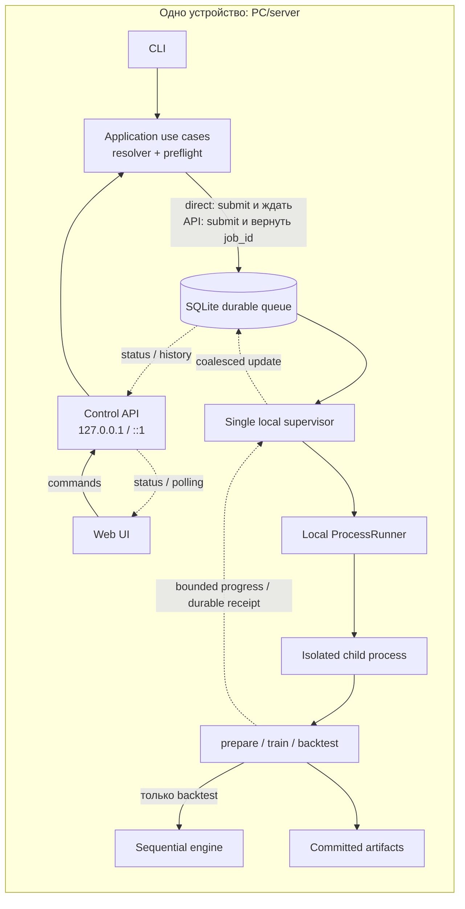
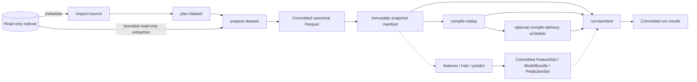
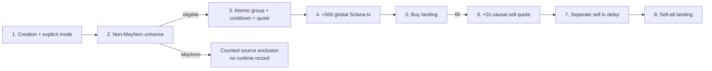

# Краткая архитектура On-Chain Backtest Engine

Ончейн-исследования встроены в общий React-дашборд по адресу `/research`.
Старые ссылки `?artifact=`, подготовка и анализ, предупреждения, страницы
доказательств и три уровня полного графа сохраняют контракт §24.6.
Прежний отдельный HTML и глобальные DOM-контроллеры удалены. React управляет
формами, таблицами и жизненным циклом графа; Cytoscape.js 3.34.3 поставляется
в локальной сборке. Семантика анализа и правила артефактов не изменяются.

Статус: принято как синхронизированный обзор

> Полное нормативное описание находится в
> [углублённом архитектурном документе](architecture-deep-dive.ru.md). Этот файл
> является его сокращённой картой и не вводит самостоятельных решений. При
> неоднозначности применяется deep dive, а найденное расхождение исправляется
> в обоих документах.

## Согласованное расширение для исследования кошельков

[Deep dive §24.6](architecture-deep-dive.md#246-on-chain-wallet-research)
определяет отдельного потребителя наблюдаемых данных: ограниченный
`research prepare` создаёт проверенный неизменяемый снимок участников сделок,
а локальный `research analyze` рассчитывает в DuckDB активность, пары по общим
токенам и ссылки на подтверждающие наблюдения. Используются существующие
очередь, публикация артефактов и ограниченный same-origin интерфейс. Страница
объясняет первые покупки и их ограничения; локальная Cytoscape.js добавляет
масштабирование, перемещение, перетаскивание и доступный переход к покупкам
точной пары в пределах 25 пар / 50 узлов страницы либо всего результата
(до 200 000 пар / 5 000 участвующих кошельков), без изменения research ID.
Полная загрузка порционная, с прогрессом, отменой и проверкой полноты; поиск
охватывает все связи, а страницы таблицы не заменяют полный граф. Подписант
и плательщик комиссии остаются разными ролями; кратность строк сохраняется,
полнота и финальность остаются UNKNOWN. Исследовательские артефакты не входят
непосредственно в replay или Strategy. Допуск Sniping и существующие ID
сохраняются. Первый сценарий реализован и проверен на hermetic source,
CLI/API/child и browser workflows. Live-source fidelity/capacity, переводы,
полный wallet PnL, owner clustering и автоматический перенос в стратегию
остаются вне этой реализации. См. [инструкцию](wallet-research.ru.md).

## 1. Решение в одном абзаце

Платформа — **один Python modular monolith с гексагональными границами**,
работающий на одном native Linux x86_64 или macOS arm64 PC/server либо на
Windows 11 x86_64 через WSL2/Ubuntu, с 16–32 GB RAM и local NVMe.
Внешний ClickHouse используется только как read-only source при подготовке
данных. Канонический контракт — immutable поток atomic transaction-group
boundaries; порядок sub-events считается известным только до доказанной
`ordering_fidelity`.

Windows profile использует Linux filesystem внутри WSL для repository и
operational `data_root`. DrvFS paths (`/mnt/c`, `/mnt/d`), network mounts и
native Win32 runtime не поддерживаются: они остаются fail-closed, пока для них
не появятся отдельные locks/process/durability adapters и полный platform gate.

`prepare-dataset` материализует selective canonical Parquet data и immutable
snapshot. Разовый run может читать Parquet; repeated runs/sweeps обычно
используют content-addressed `ReplayPack` через read-only mmap, когда measured
break-even оправдывает compile и disk cost. ReplayPack считается rebuildable
только при retained exact snapshot/compiler inputs и deterministic rebuild
contract. Один run всегда исполняется одним последовательным deterministic
child process; параллелятся только независимые runs в пределах измеренного
RAM/CPU/NVMe budget.

Direct CLI и optional Web UI/localhost Control API вызывают одни application
use cases. Web UI отправляет команды в Control API; job endpoints сохраняют
jobs в durable local SQLite queue, а read-only inspect/plan endpoints могут
отвечать синхронно. UI/API не участвуют в event hot loop. Микросервисы, network
storage и distributed execution для целевого single-host профиля не нужны.

Текущий executable reference slice проходит весь local путь:
`bounded-source-evidence/v2`, network-aware `source-inspection/v5`, canonical
`backtest.dataset-plan/v4`/`DatasetSpec` v5, gap-safe incremental
`prepare-dataset` с canonical schema v3, `canonical-distribution/v5` и
`canonical-snapshot/v4`, canonical Parquet, compact-clock `replay-pack/v3`,
ReplayPack/DeliverySchedule, causal engines, sweeps, exact semantic bundle
closure, frozen/embedded exact ML, durable direct/API
queue→supervisor→child execution и operator maintenance. Legacy evidence,
inspection v1–v4, plan v1–v3 и DatasetSpec v1–v4 получают
`REPREPARE_REQUIRED`.

Pump.fun Sniping реализован для verified local artifacts с явным cut-scoped
source admission: non-Mayhem universe
policy v2, fixed four-stream source profile, live normalizer/projector,
sentinel/lifecycle normalization, readable reference reducer, dedicated
`numpy-mmap-pumpfun-sniping-v1`, strict `pumpfun-sniping-run-draft/v3` с
required execution mode и account profile v2, per-mint mode-specific ATA,
one-time wallet UVA, `pumpfun-roundtrips/v4`, summary v3, correlated ledger v2,
external result tables и typed CLI/API/Web UI. Reference и NumPy paths используют
общий account reducer. Successful one-zero-leg dust transitions сохраняются;
both-zero no-op отклоняется.

Два реализованных mode — `EXOGENOUS_REPLAY` и отдельный
identity-bearing `EXOGENOUS_VIRTUAL_SETTLEMENT`. Virtual mode явно помечает
sell output сверх observed real SOL как synthetic; это не counterfactual и
не on-chain-executable liquidity claim. Смена mode требует нового v3
resolution и меняет logical/order/round-trip identities, но повторно
использует те же verified Dataset/Snapshot/ReplayPack без extraction и
compile-replay. Legacy draft v2 получает `RERESOLVE_REQUIRED`; committed
summary v2/round-trip v3 читаются только в исходной strict semantics.

Raw live trade rows не содержат отдельных protocol/creator fee columns.
Installed normalizer выводит эти components из exact curve SOL leg по pinned
effective-dated 95/30-bps profile и integer rounding, а evidence связывает
formula/profile/normalizer digest как derived-not-observed provenance.
Interim bundle policy считает bundled buy только как successful `BUY` той же
signature/mint после create в той же transaction. Same-transaction successful
`SELL` применяется к curve atomically до decision, но не считается bundled
buy; `bundled_buys_count` non-binding.

Live admission является cut-scoped. До downstream publication exact decision
range и settlement tail требуют complete four-stream evidence. Missing
transitions дают `CURVE_TRANSITION_MISMATCH`; partial checks, checked-in
`UNKNOWN` examples и ручной `PROVEN` не допускают rejected cut. Production
admission также требует mode-specific three-way exact equivalence и
representative performance evidence. Cold-cache, 7/30-day, extraction/ML/API
overhead и deployment checks остаются отдельными gates. Реализованный Web UI
покрывает `resolve -> submit -> progress -> result -> lineage` и общий React
Strategy results dashboard без расширения live-source admission.

Все React-экраны предлагают Warm sunset по умолчанию и Dark
тему через общую browser-local настройку. При недоступном хранилище UI сообщает
о выборе только для вкладки. Оформление не меняет команды, identities или results.

Job/run query surfaces являются bounded projections: они не раздают executable
payload, полный input list, raw final balances или Parquet; manifest и lineage
читаются отдельно с hard limits. CLI валидирует identity уже работающего
loopback controller до delegation и до local SQLite composition. Source
transport требует verified TLS/VPN/SSH либо явного deployment-local
небезопасного HTTP opt-in с warning; secret остаётся только во внешнем
environment/provider и не повышает fidelity. Подробная проверенная граница — в
разделе 3.4 deep dive.

Exact embedded ML сейчас поддерживает только integer-linear runtime;
tree/ONNX/GPU tolerance/stateful ML, произвольные optimized strategies,
resume/checkpoint и ненастроенный external backup fail closed без silent
fallback. FirstSwap и Pump.fun optimized backends ограничены своими exact
allowlisted closures. Вторая network family, PumpSwap execution и
cross-network run не реализованы. Точный current-vs-production статус остаётся
в deep dive §3.4.

## 2. Цели и жёсткие ограничения

Без изменения engine должны добавляться:

- стратегии, causal features и ML models;
- другие network families, indexer adapters и локальные datasets через
  versioned network/position contracts;
- launchpad/AMM/CLOB protocol plugins и их версии;
- execution, latency, clock, fees, slippage, risk, universe и valuation policies;
- новые локальные result/query adapters.

Гарантии и ограничения:

- один trusted codebase и один Python environment;
- 16 GB RAM — минимальный supported profile, 32 GB — рекомендуемый;
- один local NVMe; CPU-first, optional local GPU;
- source доступен только `inspect-source`, `prepare-dataset`, bounded
  `research prepare` и optional estimate в `plan-dataset`;
- compile, feature/ML и backtest jobs читают только committed local artifacts;
- `CANONICAL_EXACT` run с одинаковой logical identity даёт byte-identical
  normalized audit/result независимо от Parquet/ReplayPack, batch и порядка
  других runs; tolerance ML backend такой гарантии не получает;
- period не загружается целиком в RAM;
- один snapshot/run содержит ровно одну immutable network identity и position
  schema; synchronized cross-network run пока запрещён;
- недостаточная fidelity, несовместимый runtime или незакреплённая dependency
  приводят к fail-fast/quarantine, а не к молчаливому downgrade.

Первая версия не строит S3/MinIO, PostgreSQL, собственный ClickHouse, Redis,
Kafka, distributed queue, Kubernetes, HA, multi-controller consensus,
multi-host runner или sandbox для непроверенного plugin-кода. Тонкие Control
API/Web UI adapters, durable queue, supervisor, ProcessRunner, measured
admission, retry/reconciliation, receipts и result views уже работают на одном
host. Current UI использует bounded polling; SSE остаётся optional transport.

## 3. Контуры, процессы и зависимости

### 3.1 Запуск job

Схема показывает текущий single-host path. Direct CLI синхронно ждёт terminal
state, а API возвращает `job_id`, но обе ветки создают strict resolved command,
durable job record и используют один supervisor/child protocol.



Когда `backtest serve` выключен, обычная Direct CLI команда получает controller
authority, durable-submit-ит job, запускает supervisor cycles и ждёт результат.
При активном server job отправляется через queue/API surface; второй mutating
controller fail-fast. HTTP request никогда не исполняет тяжёлую job внутри API
process: он быстро возвращает `job_id`.

`controller.lock` исключает второй controller/supervisor и координирует server
с mutating CLI; отдельный `writer.lock` допускает ровно одного materialization
writer. Работают один ASGI/API process и один supervisor loop:
несколько ASGI server processes запрещены. Progress агрегируется редко; market
events через SQLite, polling/stream transport или API не проходят.

Lock owner и `/api/v1/health` связаны domain-tagged digest-ом
`control_plane_id = H("backtest.control-plane-identity", schema, canonical
resolved data root, controller instance ID)`. Это operational controller
identity, исключённая из run/artifact identities. CLI не раскрывает path: при
занятом lock он валидирует owner, обращается только к configured loopback peer
и требует совпадения identity. После этого
поддерживаемые job/query commands делегируются strict bounded HTTP client-ом;
malformed/missing owner, недоступный/mismatched peer и неделегируемая mutation
fail closed до local SQLite/application composition.

Все процессы, SQLite и artifacts находятся на одном host и используют один
local data root. SQLite хранит только небольшое operational state jobs/catalog,
а не market events. Независимые processes допускаются resource admission
controller только в пределах измеренного budget.

### 3.2 Роли локальных технологий

| Компонент | Роль | Не делает |
|---|---|---|
| Python | Use cases, engine, plugins, CLI и Control API | Не хранит giant rows как objects |
| Web UI | Создание jobs, status, results и lineage | Не исполняет backtest и не читает data files |
| Control API | Валидация команд, job control, queries и progress | Не участвует в event hot loop |
| Local supervisor | Admission и child processes | Не меняет semantics engine |
| Local filesystem | Authority для committed artifacts | Не является backup самого себя |
| Parquet | Канонические snapshots/features/results | Не обязан быть fastest replay format |
| Arrow IPC | Typed mmap event buffers | Сам не задаёт retention |
| NumPy `.npy` | Dense mmap indexes/features/predictions | Не заменяет schema manifest |
| DuckDB | In-process ETL, joins, research SQL и spill | Не участвует в hot loop |
| SQLite | Jobs и searchable operational metadata/indexes | Не хранит market data и не делает bytes committed |
| NVMe | Sequential data path и OS page cache | Не даёт HA/DR |

Эти роли реализованы в reference slice: PyArrow/DuckDB публикуют и bounded-read
canonical Parquet, NumPy обслуживает verified read-only ReplayPack,
DeliverySchedule и ML mmap overlays, SQLite — jobs/attempts/events, shard
frontiers, artifact/lineage indexes, manifest-bound `run_index`, pins и receipts. SQLite является
operational authority для job/attempt/idempotency state; authority artifact
bytes — verified filesystem commit, retention roots — atomic `pins/*.json`, а
searchable indexes rebuildable. Run pages глобально выбираются по completion
epoch descending и artifact ID ascending только при `COMPLETE` generation,
после чего каждый selected artifact повторно проверяется по exact committed
manifest. Каждый verified Run имеет searchable либо explicit unqueryable row;
projection атомарно заменяется вместе с другими rebuildable indexes, а
insert/delete сохраняет `DIRTY` до completeness checks. Missing, dirty или stale
projection fail closed.

DuckDB и SQLite являются embedded libraries, а не отдельными daemons. Web UI
поставляется static assets внутри Python distribution; Node.js не является
runtime dependency. Job endpoints принимают typed DTO/content IDs, но не raw
SQL, shell commands, import paths или arbitrary filesystem paths. Queue
envelope содержит только strict canonical job-specific payload и exact artifact
closure; unknown job/field/alias не исполняется. Browser не получает
credentials, Parquet или ReplayPack.

Начальная dependency policy: DuckDB — единственный основной analytical engine,
PyArrow — columnar I/O и batches, NumPy — compact/dense state, standard-library
`sqlite3` — catalog/queue. Polars добавляется только после измеримого gap.

### 3.3 Направление импортов

```text
interfaces/adapters/plugins -> application ports -> engine/domain
bootstrap -> everything for wiring
domain/engine -X-> adapters, interfaces, ClickHouse, DuckDB, SQLite, PyArrow
```

- `domain` не знает о storage, transport и dataframe libraries;
- `engine` зависит только от domain и core-owned contracts, но не от plugin
  implementations;
- `application` координирует use cases и порты;
- adapters и plugins импортируют внутренние контракты, зависимость не идёт
  обратно;
- Direct CLI, `backtest serve` и job child — три работающих entry mode над
  одним общим bootstrap/wiring layer; child не открывает SQLite и возвращает
  bounded progress + durable completion receipt;
- порт вводится только на реальном заменяемом шве, а не между каждой парой
  функций.

API routes и CLI handlers не обращаются к SQLite, filesystem или ClickHouse
напрямую: они валидируют transport DTO, вызывают application use case и
преобразуют результат в versioned response/output DTO. Конкретные adapters
подключаются только в bootstrap composition root.

## 4. End-to-end workflow

> Этот workflow реализован end to end для reference stack на verified local
> artifacts. Каждый этап fail closed при unresolved dependency, недостаточной
> fidelity, несовместимом runtime или неподдерживаемом extension surface.



Этапы имеют разные обязанности:

1. `inspect-source` читает metadata без мутаций, сохраняет schema fingerprint
   без credentials, описывает capabilities/fidelity, не скачивает market data
   и не создаёт local mirror.
2. `plan-dataset` компилирует requirements strategy, execution, features,
   models, warmup, decision range и settlement tail в network/position schema,
   capabilities, protocol versions, columns, capability-specific half-open
   block ranges и dry-run resource budget; proven fidelity/day/disk/quota
   violation приводит к fail-fast. Sniping `DatasetSpec` v5 включает
   `global-transaction-duration-roundtrip/v1`: settlement streams одноразово
   расширяются до hard block cap, launch stream — только до конца
   decision range; caller tail выше cap отклоняется.
3. `prepare-dataset` streaming-batches извлекает bounded shards, нормализует
   capability records, применяет protocol projector, causal/as-of joins и
   cross-capability clock checks, выполняет QA, отдельно публикует canonical
   Parquet distributions, затем snapshot manifest с exact references на них.
   Для Sniping root остаётся invisible, пока read-only candidate validator
   не проверит chain/order/groups, полную causal non-Mayhem classification с
   exact source-evidence/validation count+digest binding, Pump state eligible launches и full maximum settlement
   path каждого decision-range target.
4. `compile-replay` строит generic content-addressed ReplayPack, не зависящий от
   run-specific latency или seed.
5. Optional `compile-delivery-schedule` принимает exact resolved ReplayPack и
   resolved latency/clock/RNG/scheduler inputs и materializes observation
   deliveries; без него тот же canonical delivery stream строится во время run.
6. `run-backtest` открывает committed `ReplaySource` adapter над canonical
   Parquet либо ReplayPack и, если они указаны в `ResolvedRunSpec`, committed ML
   artifacts; выполняет preflight, sequential causal replay и buffered output,
   затем атомарно публикует `RunManifest` и results.
7. `run-sweep` создаёт immutable list `ResolvedRunSpec` и запускает только
   столько независимых processes, сколько допускает measured budget; один run
   не делится на time shards. `sweep-result/v2` закрепляет exact run refs и
   physical settings, а закрытые comparison metrics остаются scalar; final
   balances представлены count/content digest, не массивом в каждой row.
8. `submit-and-monitor` принимает versioned typed command и обязательный
   idempotency key, вызывает тот же resolver/preflight, что Direct CLI, и
   сохраняет immutable `ResolvedJobSpec`. Supervisor ведёт job через
   `QUEUED/STARTING/RUNNING` к одному terminal state; successful `RunManifest`
   появляется только после artifact commit. Priority, retry и timestamps не
   меняют logical experiment identity. Direct и API paths используют strict
   job-specific decoder, один local supervisor, SQLite-free child, durable
   receipt и verified completion; UI читает coalesced progress bounded polling.

`ResolvedJobSpec` — общий immutable envelope для `prepare`, `compile`,
`backtest`, `features`, `train` и `predict`; payload backtest-job содержит exact
`ResolvedRunSpec`. Priority, UI labels, retry policy и timestamps относятся
только к operational scheduling.

В целевой системе requirements для `plan-dataset` автоматически собираются из
strategy, feature/model и execution registries. Сейчас `PlanDataset` получает
уже готовый versioned tuple `DataRequirement`; registries и remote estimator не
подключены, поэтому source/local byte estimates обычно `UNKNOWN`.

Strategy никогда не выполняет SQL/network и не получает source adapter,
snapshot statistics, future labels или mutable catalog.

### Source boundaries

Boundary фиксируется отдельно для каждой capability:

```text
source_id
capability + schema version
network_id + position_schema_id
block range
snapshot cut
chain_finality
ingestion_watermark (nullable)
upstream_revision (nullable/unproven)
internal_revision
source_consistency
completeness
validation_status
```

Half-open typed block range является authoritative filter; Solana adapter
отображает его на source `slot`, а UTC date используется
только как proven-safe pruning superset. `OFFSET` запрещён, keyset pagination
разрешена лишь при доказанном total key. Local `validation_status=PASS` не
повышает unknown finality/completeness/revision/consistency. Bundle cut не
превышает minimum contiguous committed frontier; изменившийся shard создаёт
новую immutable internal revision.

Full mirror не входит в целевую архитектуру; dataset ограничивается
потребностями конкретного consumer.
Начальный bounded slice — один protocol и 1–7 дней; диапазон
расширяется только после измерения bytes/day и events/sec. При ambiguous
duplicates читается весь bounded shard с сохранением multiplicity. Query limits
и identifier обязательны; credentials исключены из query ID, logs, exceptions и
cache keys. Исчезнувшая при повторном чтении row не считается tombstone без
CDC/deletion contract, stable identity и proven-complete read.

Decision range разрешает новые strategy targets; правый settlement tail нужен
только для завершения уже созданных orders/timers. Если source watermark или
quota не позволяют доказать полный tail, prepare/run fail closed и не скрывают
pending trade как censored result.
В DatasetSpec v5 tail закреплён в identity вместе с точным
settlement requirement. `maximum_tail_blocks` — это hard acquisition cap:
planner извлекает его полностью для clock/trade/lifecycle streams, а
pre-root validator доказывает фактическую достаточность. Ни одна
из этих local checks не повышает `UNKNOWN` source fidelity.

Pump.fun Sniping требует одного consistent cut четырёх streams: `BLOCK_CLOCK`,
`TOKEN_LAUNCH`, `PUMP_CURVE_TRADE`, `PUMP_CURVE_LIFECYCLE`. Live evidence
обязана подтвердить, что canonical `BLOCK_CLOCK.transaction_count` включает
successful, failed и
vote transactions, Pump transaction index использует тот же global order,
creation fields immutable at creation time, bundled instruction order exact, а
explicit `mayhem_mode` полный, boolean и immutable at creation time. Каждый
successful SOL-paired launch обязан быть causal-classified: known Mayhem
получает `MAYHEM_EXCLUDED`, остальные eligible launches требуют полных
curve/fees/completion/migration и block-time tail. Наличие source columns
вроде `tx_count` не повышает fidelity; они становятся только explicitly mapped
physical aliases. Archive RPC/другая таблица не являются silent fallback.

Static capability TOML не является proof authority: все proof fields
в нём остаются `UNKNOWN`. Optional bounded `inspect-source` pass создаёт
`bounded-source-evidence/v2` receipts, связанные с exact source,
capability/version, network/range/cut, mapping/query digests, executed query
fingerprints и result digest. Planner проверяет эту provenance и не
повышает невыводимую semantics. Generic validator доказывает только свой
ограниченный набор свойств. Для поддерживаемого Pump source установлен fixed-profile
four-stream evaluator с live normalizer, sentinel/clock/order/universe/state/
fee/lifecycle checks и aggregate v2 receipts. Missing required transitions
дают `CURVE_TRANSITION_MISMATCH`, запрещают inspection publication и
сохраняют fail-closed границу для затронутого cut.

Non-Mayhem universe policy вместе с source mapping/query/projector digests
входит в DatasetSpec dependency identity. Receipt/validation фиксирует
classified/eligible/`MAYHEM_EXCLUDED` counts и ordered exclusion digest/reason;
snapshot publication проверяет exact binding. Excluded Mayhem rows не входят в
canonical execution stream или run audit.

Canonical skipped-slot sentinel имеет Unix-epoch `block_time`,
`transaction_count=0` и pinned hash/validator fingerprint. Он закрывает
только непрерывность integer source range и не создаёт canonical
clock/transaction/duration boundary. Real produced zero-transaction block
остаётся clock row с real time/hash. Missing integer slot, conflicting duplicate
или malformed sentinel дают `INCOMPLETE_BLOCK_RANGE`.

Если terminal `buy_v2` и migration имеют одну
signature/mint/block/transaction identity, versioned lifecycle profile
нормализует `trade -> derived completion -> migration`. Migration table не
имеет `ix_idx`, поэтому completion и migration получают versioned
deterministic derived `event_index` строго после trade. Это один atomic
transaction group без intermediate callback или synthetic boundary.

## 5. Канонические данные, время и состояния

Raw `block_time` недостаточен для порядка. Snapshot и ReplayPack хранят strict
monotone `boundary_ordinal` для atomic historical transaction groups;
chain-specific position остаётся typed.

Core-owned position values:

```text
NetworkId = "<family>:<immutable-chain-reference>"
PositionSchemaId = "block32-transaction32-v1"
BlockRange(network_id, from_block_ordinal, to_block_ordinal)
ChainPosition(
  network_id,
  position_schema_id,
  block_ordinal,
  transaction_index,
  event_index,
)
boundary_ordinal = (block_ordinal << 32) + transaction_index + 1
```

Block и zero-based transaction index проверяются как UInt32; event index задаёт
proven intra-transaction order, но не отдельную transaction boundary. Alias
`mainnet`, endpoint и credential не являются NetworkId. Network хранится один
раз в artifact metadata, но входит в event/dataset/snapshot/order/run identity.
Для Solana используется полный base58-результат `getGenesisHash`, а не
укороченный display-prefix.
Один artifact/run — одна network/schema. Более широкие координаты требуют новой
schema, а pre-network slot-only artifacts получают `REPREPARE_REQUIRED`, без
implicit Solana default или in-place migration.

Семантический event contract содержит:

```text
schema version
boundary / typed chain position
transaction group
event kind
stable causal and source references
protocol + version
typed payload
identity and ordering fidelity
nullable measured source_observed_at
```

Generic launchpad event types — `TokenLaunchEvent`, `VenueTradeEvent` и
`VenueLifecycleEvent`. Core владеет identity/grouping/common assets, а protocol
plugin — payload schema, lifecycle и integer math. Pump-specific formulas,
Token-2022/cashback, Mayhem classification и migrations не входят в core.
Protocol plugin реализует только eligible non-Mayhem execution semantics, а
versioned universe policy классифицирует explicit creation-time mode до target.
Derived lifecycle `event_index` допустим только из pinned
source-specific order profile; raw instruction provenance не подменяется.

Это семантическая схема, а не требование создавать Python dataclass на каждую
row. Parquet/ReplayPack adapters передают engine typed `EventBatch`,
`HistoricalGroupView` и reusable `EventView`; в hot loop используются compact
integer IDs и structure-of-arrays.

Нельзя смешивать четыре времени:

- `effective_at` — когда факт произошёл в chain;
- `source_observed_at` — nullable и только измеренный source timestamp;
- `extracted_at` — local operational timestamp, не causal availability;
- `available_at` — run-specific delivery boundary, рассчитанная resolved
  latency/clock policy.

Engine разделяет четыре состояния:

- `HistoricalReferenceState` изменяют только historical groups;
- `ObservedState` содержит только уже доставленную strategy информацию;
- `SimulationVenueState` хранит exogenous/shadow/fork state выбранного mode;
- `PortfolioState` выводится из double-entry ledger.

Отдельные internal queues хранят deliveries, orders, timers и notifications; они
не смешиваются с четырьмя state views.

Identity source row, canonical event и ordering tie-breaker — разные понятия.
Content hash не доказывает uniqueness и не разрешает удалять одинаковые rows.
Для `TRANSACTION_PARTIAL` row-by-row reducer в source/hash order запрещён:
protocol plugin либо предоставляет доказанно permutation-independent group
reducer, либо preflight отклоняет требования к неизвестному intra-transaction
порядку. Внутри unordered group нет callbacks, deliveries или order eligibility.

Typed payload columns задаются versioned canonical schema и protocol projector.
Amounts, reserves, balances и fees хранятся в integer atomic units; `UInt64`/
`Int128` нельзя сужать без bounds proof, а `float` запрещён в protocol math и
ledger. Rows сортируются по canonical position и proven sub-position, при этом
transaction group сохраняется атомарно.

Historical `VenueTradeEvent` допускает ровно одну zero amount leg только при
доказанном successful positive-input reserve transition. Обе zero legs,
synthetic amount, row filtering и перенос этой allowance на quote/fill
запрещены. Normalizer v2 входит в semantic identity и требует rebuild
snapshot/ReplayPack с three-way exact equivalence.

## 6. Порты и extension contracts

Primary use cases: `inspect-source`, `plan-dataset`, `prepare-dataset`,
`research prepare`, `research analyze`,
`compile-replay`, `compile-delivery-schedule`, `run-backtest`, `run-sweep`,
`build-features`, `train`, `predict`, submit/cancel/query jobs/runs, verify и GC.
`RunSpecDraft` с aliases/defaults не исполняется: resolver создаёт immutable
`ResolvedRunSpec`, и только он допускается к preflight, queue и start.

Ключевые driven ports:

```python
class SourceReader(Protocol):
    def list_capabilities(self, source_id: SourceId) -> tuple[CapabilityDescriptor, ...]: ...
    def scan(self, request: ExtractionRequest) -> Iterator[IndexedBatch]: ...


class ArtifactRepository(Protocol):
    def stage(self, spec: ArtifactDraft) -> ArtifactWriter: ...
    def open_committed(self, artifact_id: ArtifactId) -> ArtifactHandle: ...


class JobQueue(Protocol):
    def submit(self, spec: ResolvedJobSpec, idempotency_key: str) -> JobRecord: ...
    def request_cancel(self, job_id: JobId) -> None: ...
    def claim_next(
        self,
        supervisor_instance_id: str,
        capacity: ResourceCapacity,
    ) -> JobAttempt | None: ...
    def transition(
        self,
        attempt_id: AttemptId,
        expected_version: int,
        new_state: AttemptState,
        result_artifact_id: ArtifactId | None = None,
    ) -> JobAttempt: ...


class ProgressSink(Protocol):
    def publish(self, event: ProgressEvent) -> None: ...


class ProcessRunner(Protocol):
    def spawn(self, attempt: JobAttempt) -> ProcessHandle: ...
    def probe(self, handle: ProcessHandle) -> ProcessStatus: ...
    def terminate(self, handle: ProcessHandle, grace_seconds: float) -> None: ...


class ReplaySource(Protocol):
    def boundaries(self) -> BoundaryReader: ...
    def event_batches(self) -> Iterator[EventBatch]: ...


class Strategy(Protocol):
    def requirements(self) -> StrategyRequirements: ...
    def on_event(self, event: EventView, ctx: StrategyContext) -> Iterable[Intent]: ...
```

`ProtocolProjector` преобразует capability streams в canonical group batches.
Canonical distribution, snapshot, derived cache и result используют общий
artifact publication contract. Root manifest записывается и проверяется до
publish. Commit condition включает publication locks, durable `COMMITTED`,
valid manifest/ID/hashes и durability verification/adoption; один marker сам по
себе недостаточен. SQLite index не может сделать missing/uncommitted bytes
валидными.

Strategy объявляет subscriptions, protocols/assets/universe, warmup,
feature/model IDs, minimum identity/order/state/fee/completeness fidelity,
supported execution modes, estimated dynamic state и resource class.
`StrategyContext` содержит только current `SchedulerInstant`, read-only observed
market/portfolio views, causal feature/prediction views, deterministic RNG и
buffered telemetry.

Risk, observation/order latency, clock, venue, execution, universe и valuation
policies являются отдельными resolved bundles. Venue model возвращает pure
`ExecutionPlan`: venue transition, fills, fees, ledger postings и reports.
Engine проверяет reservations, conservation, bounds и idempotency, затем
атомарно применяет transition вместе с postings; ошибка откатывает logical step.

## 7. Indexer adapter не равен protocol plugin

Indexer adapter отвечает за connection/transport, query planning и pushdown,
retry/limits, schema mapping в capability records и source boundaries/fidelity.

Protocol plugin отвечает за semantic decoding, launchpad/AMM/CLOB lifecycle,
direction и asset semantics, integer math/rounding/fees, migrations, venue
state/group reducer и conversion capability records в canonical events.

План подготовки фиксирует versioned capabilities, columns, protocol versions,
coverage и требуемую fidelity; projector преобразует capability records в
canonical events, не смешивая transport с protocol semantics. Для каждой
capability snapshot использует один authoritative source; silent merge sources
запрещён.

### 7.1 Согласованный контракт копирования покупок

Deep dive §23.5 задаёт отдельную стратегию Pump.fun copy-buy. Reference-срез
source/prepare/run/results и CLI/API/UI реализован;
[deep dive §3.4](architecture-deep-dive.ru.md#34-текущее-состояние-проекта) ограничивает текущий допуск.
Optimized copy и materialized schedules недоступны. Она копирует успешные BUY по точному
`signing_wallet`, расходует mint по первому сигналу даже при отказе/неудаче
покупки и полностью выходит по ценовым TP/SL без fees либо максимальному
удержанию от fill. Наблюдение, покупка и продажа имеют отдельные задержки.
Всего четыре попытки продажи, включая pre-submit rejection; решение о повторе
принимается минимум через две модельные секунды после неудачи. Четыре неудачи
оставляют exhausted open position. Комиссии входят в ledger PnL. Нужны полные
bounded signer/initial-state/market/clock evidence, доказанный tail всех повторов
и отдельные run/result identities. Данные/допуск и фиксированные правила
существующего Sniping автоматически не распространяются на эту стратегию.

Отдельный `pumpfun-copybuy-trade-payload-v1` переносит точный signer и
целочисленное состояние кривой через generic protocol-payload storage,
сохраняя идентичность исходного события. Версионированные нормализатор и
транспорт не заменяют полную проверку подготовки из deep dive §23.5.

Подготовка независимо перечисляет BUY лидеров до JOIN с ограниченной историей
создания и сверяет их со всеми нужными рыночными переходами. Отсутствующее
старое создание закрывает cut. Copy-only receipt v3, inspection v6, DatasetSpec
v6 и plan v5 из §23.5 связывают покрытие и полный settlement четырёх попыток,
не переинтерпретируя артефакты Sniping.

Общий React-экран результатов (alias `/copy-results`) показывает диаграммы сводки, ограниченные страницы
сигналов и маркеткап токена в SOL с сигналом лидера и фактическими исполнениями.
Лимиты чтения сохранённой истории и отказы определены в deep dive §3.4;
графики не меняют ID прогонов и не добавляют историю PumpSwap.

## 8. Детерминированный scheduler

Один run имеет один sequential reducer. Historical transaction groups получают
strict monotone `boundary_ordinal`. Scheduler instant и нормативный queue key:

```text
SchedulerInstant = (
  boundary_ordinal,
  chain_position,          # nullable только для explicit synthetic boundary
  monotone_logical_ns      # nullable modeled clock metadata
)

queue_key = (
  release_boundary_ordinal,
  phase_priority,
  source_or_creator_boundary_ordinal,
  stable_causal_id
)
```

ReplayPack хранит compact block clock arrays: block ordinal, transaction count,
cumulative transaction prefix и integer block time. Размер растёт по blocks, не
по всем transactions. Scheduler объединяет event-bearing boundaries с typed
synthetic transaction boundaries, поэтому order может land в transaction без
Pump event без Python object на каждую network transaction.
Recognized skipped-slot sentinel в эти arrays не входит, не
участвует в cumulative prefix/duration search и не виден engine.

`source_or_creator_boundary_ordinal` — boundary исходного historical record
либо boundary, на которой был создан deterministic internal item.
`stable_causal_id` — domain-tagged fixed-width unsigned/binary identity
source/order/timer, не зависящая от path, Python `hash()`, allocation order или
physical string dictionary. Numeric field ReplayPack — лишь representation, не
смена semantics.

Порядок фаз фиксирован и версионируется:

```text
10 HISTORICAL_REFERENCE_APPLY
20 SIMULATION_STATE_RECONCILE
30 OBSERVATION_DELIVERY
40 STRATEGY_CALLBACK
50 RISK_AND_ORDER_ACCEPTANCE
60 VENUE_EXECUTION_AND_LEDGER_COMMIT
70 STRATEGY_EXECUTION_NOTIFICATION
80 CHECKPOINT
```

Latency преобразуется в `release_boundary_ordinal` до enqueue: block latency
выбирает первую boundary не раньше target block, transaction-position latency —
boundary через N global network transactions, duration latency — первую future
boundary по declared modeled clock. При недостаточной clock fidelity target
округляется вверх либо run отклоняется. Observation latency считается от
effective boundary, order latency — от current decision instant. Для любого
нового order обязательно:

```text
eligible_boundary_ordinal > current_decision_boundary_ordinal
```

Даже нулевая latency не разрешает order в уже применённой/current transaction
group.

Optional `DeliverySchedule` хранит `release_ordinal + event_row_index` и даёт
sequential two-way merge с historical stream. Materialized schedule и
on-the-fly canonical scheduler обязаны иметь одинаковый ordering и — при
`CANONICAL_EXACT` — одинаковый audit hash.

`delivery_build_key` — derivation lookup, фиксирующий ReplayPack,
latency/clock/RNG, scheduler/engine/compiler и writer/runtime inputs;
`delivery_schedule_id` — identity committed output. Preflight пересчитывает
build key и проверяет content ID/hashes. При одном build key и разных outputs
оба результата quarantine-ятся как nondeterministic compiler до расследования.

В hot loop запрещены SQL/network, pandas/DataFrame, Pydantic validation,
`Decimal`/`datetime` arithmetic, строки mint/signature, Python object/dict или
heap item на каждое market event, synchronous per-event log/write,
`datetime.now()`, Python `hash()`, random UUID и global `random`. Historical
deliveries идут two-way merge; heap остаётся для редких dynamic orders/timers.

## 9. Fidelity modes

Execution mode всегда входит в `ResolvedRunSpec`:

1. `EXOGENOUS_REPLAY` — own order не меняет historical market.
2. `EXOGENOUS_VIRTUAL_SETTLEMENT` — historical market также остаётся
   неизменным, но successful sell явно получает shortfall virtual quote сверх
   наблюдаемого real SOL из synthetic external ledger account.
3. `SHADOW_STATE_REPLAY` — own order меняет shadow state до reconciliation.
4. `CONDITIONAL_PROTOCOL_REPLAY` — historical inputs и orders применяются к
   fork state.

Собственный simulated order никогда не изменяет `HistoricalReferenceState`.
Ни один mode не называется exact без sufficient source capabilities и protocol
golden tests. Virtual settlement является exact только относительно явно
заданной deterministic model и никогда не представляется как on-chain-
executable liquidity. Он сохраняет buy-side real-token cap и все lifecycle,
fee, account и slippage checks. Меняется только sell real-SOL cap:

```text
gross = current historical virtual-reserve sell output
venue_funded = min(gross, current historical real SOL)
synthetic_funded = gross - venue_funded
```

Два debits финансируют wallet net proceeds и Pump fee collectors в одной
balanced ledger transaction. Synthetic proceeds становятся spendable
simulated SOL, failed sells не создают synthetic funding. External trades не
пересчитываются, own orders не уменьшают historical reserves.
Preflight объединяет requirements strategy, execution/fidelity,
features/models и warmup и проверяет minimum
identity/order/state/fee/finality/completeness.

## 10. Accounting и PnL

Источник истины для денег — append-only double-entry ledger. Сумма postings по
каждому asset равна нулю, включая external accounts: venue, network, protocol
fee collector и creator. Available и reserved balances разделены. PnL и
valuation являются derived views с as-of price policy, а не мутациями ledger.

`run-ledger/v2` хранит immutable `correlation_kind` и `correlation_id`
для order/roundtrip. Realized round-trip cashflow выводится из
committed correlated portfolio postings; параллельный shadow PnL
не является authority. Reconciliation отклоняет расхождение result и
ledger.

Venue model возвращает pure `ExecutionPlan`: venue transition, fills, fees,
postings и reports. Engine проверяет reservations, conservation, bounds и
idempotency и атомарно применяет transition вместе с ledger postings. Ошибка
откатывает весь logical step.

Audit, ledger и results буферизуются column batches. Они не держатся целиком в
RAM и не записываются синхронно по одной row.

### 10.1 Pump.fun Sniping v1 contract

```text
successful SOL-paired creation transaction
-> explicit creation-time mayhem_mode classification
-> Mayhem: source-evidence exclusion, no runtime record
-> non-Mayhem: eligible target
-> atomic apply, включая bundled dev buy
-> cooldown + post-group buy reference quote
-> 500 следующих global Solana transactions
-> buy landing
-> first nonempty transaction boundary with block_time >= fill_time + 2s
-> sell reference quote
-> sell_delay_transactions >= 1
-> sell 100% acquired tokens
```



- Immutable universe policy
  `successful-sol-paired-non-mayhem-pumpfun-launches-in-decision-range-v2`
  классифицирует каждый successful SOL-paired launch до signal. Explicit
  creation-time `mayhem_mode=true` увеличивает source-evidence/validation
  count+ordered digest с reason `MAYHEM_EXCLUDED`, но не создаёт canonical
  execution event, run-audit row, target/cooldown/order. Missing/null/out-of-domain/conflicting или
  late-enriched mode fail closed. Eligible остаются non-Mayhem normal legacy,
  Token-2022 и cashback.
- Target — каждая eligible non-Mayhem Pump.fun creation, даже без dev buy.
  Developer — immutable `CreateEvent.creator`, не payer/user.
- Cooldown keyed by developer начинается на eligible creation signal и равен
  600 seconds. `t+599s` permanently skipped, `t+600s` eligible; balance reject
  или landed buy failure cooldown не отменяет, suppressed launch его не
  продлевает. Одинаковое время разрешается chain order.
- Следующая transaction после target — №1; buy phase 60 выполняется после
  historical №500 и перед №501. Считаются successful, failed и vote
  transactions. Missing count/order/time или недостаточный tail fail closed.
- Fixed gross SOL budget включает Pump protocol/creator fees; Solana fee и
  account rent оплачиваются сверх него. Один shared wallet резервирует maximum
  buy spend + buy network fee + rent в canonical target order; sell fee заранее
  не резервируется. Pre-submit insufficient balance не платит fee.
- Buy/sell имеют разные slippage limits:
  `min_out=floor(reference_out*(10000-bps)/10000)`. Buy reference — post-target
  group, sell reference — causal `+2s` boundary; signed atomic slippage
  сохраняется без float. Failed buy не создаёт sell, failed sell оставляет open
  position.
- Draft выбирает ровно `EXOGENOUS_REPLAY` или
  `EXOGENOUS_VIRTUAL_SETTLEMENT`. Оба режима строят quote из causal historical
  state, включают own size, не меняют этот state и не пересчитывают сделки
  других wallets. Второй mode ослабляет только sell real-SOL solvency и хранит
  potential shortfall reference/landing отдельно от synthetic funding,
  фактически использованного при successful settlement. Completion/migration
  по-прежнему даёт failed Pump instruction с network fee и без reroute в
  PumpSwap.
- Pump plugin владеет `PumpCurveStateV1`, integer formulas и effective-dated
  modes. Начальный bonding-curve profile — 95 bps protocol + 30 bps creator с
  отдельным rounding; eligible normal legacy/Token-2022/cashback требуют exact
  versioned semantics/golden. Mayhem имеет только exact classifier/exclusion,
  не execution reducer и не PumpSwap route. Unknown mode или non-SOL pair
  останавливает run.
- Solana buy/sell fee profiles независимы:
  `signatures*lamports_per_signature + ceil(CU_limit*micro_lamports_per_CU/1e6)`.
  Landed failure платит base+priority, но не Pump fee. Jito tip в v1 отсутствует.
- Generic network quote явно помечает fee и account deposit их
  `AssetId`; engine не приравнивает их к quote asset. Solana Sniping v1
  разрешает оба в `SOL`; network с другим fee asset потребует
  новый per-asset valuation/result contract.
- Каждый mint получает новый mode-specific ATA: legacy 2 039 280 lamports или
  Token-2022 ImmutableOwner 2 074 080; successful sell закрывает его, failed
  sell оставляет locked. Fresh/prewarmed описывает только wallet-scoped UVA
  1 844 400 lamports: fresh создаёт его ровно один раз, prewarmed начинает с
  ним, UVA не закрывается в run. Reservation/rollback/refund и economic PnL
  выводятся общим reference/NumPy reducer и ledger.
- Closed position имеет realized cash PnL по ledger cashflows. Open position
  получает отдельный net-liquidation MTM после предполагаемых Pump/Solana fees
  и возврата rent; после migration последняя Pump quote только
  `STALE_PRE_MIGRATION`, не executable valuation.

Strategy создаёт generic `RoundTripIntent`; Pump plugin строит venue quote,
Solana plugin — network/account costs, а общий engine/ledger не знают formulas
конкретной сети или launchpad.

Новые runs используют `pumpfun-roundtrips/v4`,
`pumpfun-sniping-run-summary/v3` и неизменённый `run-ledger/v2`. Round-trip v4 хранит
deterministically ordered account components с schema, asset, scope,
release policy, reservation/payment/refund/locked deltas и attribution; leg
failure codes также сохраняются. Он добавляет execution mode, liquidity
evidence reference/landing, фактическое venue/synthetic funding и projected MTM
shortfall. Summary v3 даёт fee/deposit/slippage и gross/venue/synthetic
settlement totals и
не выдаёт partial valuation за полную: при unvalued open position
`economic_pnl_atomic=null`, а valued subtotal остаётся отдельным полем. Legacy
Committed round-trip v3/summary v2 остаются читаемыми по исходным strict
schemas; legacy draft v2 не получает selectable mode неявно.

## 11. Артефакты, RunSpec и воспроизводимость

Локальные данные разделены по смыслу. Optional raw cache содержит narrow source
rows для разработки/debug и может быть удалён: он не authoritative. Immutable
canonical Parquet partitions — переносимый storage contract. Snapshot — root
manifest с exact refs и не копирует partition bytes. ReplayPack,
DeliverySchedule, features, predictions и research aggregates — derived
artifacts, но не автоматически disposable: статус `REBUILDABLE` допустим только
при deterministic rebuild contract и transitively retained exact inputs.
Feature/prediction bytes иначе помечаются `NON_REBUILDABLE` либо
`EXPENSIVE_REBUILD` и защищаются retention policy.

Сокращённая структура local data root:

```text
var/catalog/catalog.sqlite
var/locks/{controller,writer,publication,retention,...}.lock
var/staging/<attempt-id>/
var/job_receipts/<attempt-id>.json
var/cache/raw/<source>/<network>/<capability>/<block-shard>/
var/canonical/<logical-content-hash>/<canonical-distribution-id>/
  manifest.json
  part-*.parquet
  COMMITTED
var/snapshots/<snapshot-id>/
  manifest.json
  validation.json
  COMMITTED
var/replay/<snapshot-id>/<replay-pack-id>/
var/delivery_schedules/<delivery-schedule-id>/
var/features/<feature-set-id>/
var/predictions/<prediction-set-id>/
var/models/<model-bundle-id>/
var/pins/<pin-id>.json
var/runs/<logical-run-id>/<execution-attempt-id>/
var/tmp/
var/trash/
```

Snapshot является immutable manifest и не копирует bytes canonical partitions.
Directory listing не является manifest; refs являются content-addressed и
data-root-relative, без absolute host paths. Temporary и final path одного
artifact находятся на одном filesystem, иначе atomic rename не гарантирован;
network mounts не используются для mmap hot path. Completion receipt фиксирует
exact attempt/spec/output IDs и hashes только для reconciliation и не заменяет
artifact manifests.

Пять artifact identities нельзя смешивать:

1. `artifact_sha256` — hash конкретных bytes.
2. `logical_content_hash` — canonical records/schema без path, compression и
   attempt metadata.
3. `canonical_distribution_id` — exact physical files и writer/codec/layout.
4. `dataset_revision_id` — logical content вместе с source boundaries,
   projector/schema и causal policies.
5. `snapshot_id` — exact root manifest с dataset revision и exact committed
   distribution IDs/hashes.

`H(...)` означает domain-tagged SHA-256 над versioned deterministic canonical
serialization. Own ID, `created_at`, path/host/attempt metadata и SQLite state
из hash исключаются; stored ID всегда пересчитывается и проверяется.

Другой compatible writer может изменить distribution/snapshot ID, не изменив
logical content. Другой source cut меняет `dataset_revision_id`, даже если rows
совпали. `snapshot_id` всегда означает exact artifact, а не alias dataset
revision.

Snapshot manifest минимум содержит:

- `snapshot_id`, `dataset_revision_id`, `logical_content_hash`;
- canonical schema version;
- network/position schema, source/capability boundaries, decision/settlement
  ranges, requested/actual block ranges и query template hash;
- Sniping universe/source-mapping/query/projector dependency digest и exact
  bounded evidence/validation binding с classified/eligible/excluded
  counts+ordered digest;
- nullable/unproven upstream revision отдельно от internal revision;
- adapter/projector/code/runtime versions;
- exact distribution IDs, relative refs и physical hashes;
- counts, min/max position и identity/order/state/fee/finality/completeness
  fidelity;
- validation report hash, dictionary и duplicate policies;
- `created_at` только как operational metadata.

Run-specific modeled latency в snapshot/ReplayPack не входит.

Root manifest записывается и проверяется до publication. Lock order,
same-filesystem staging, fsync files/directories, atomic rename и durable
`COMMITTED` образуют единый publish protocol. Marker без доказанного directory
fsync и verification state не видим. `open_committed` проверяет marker,
manifest/ID/hashes и регистрирует read lease; recovery adopt разрешён только
после полной проверки. Final path не overwrite: verified committed path можно
переиспользовать, collision quarantine-ится. SQLite обновляется после commit и
не легализует missing/uncommitted bytes. Disk-full/crash до commit оставляет
staging/orphan/recovery state, а не результат.

Пользовательский `RunSpecDraft` может содержать aliases и defaults, но не
исполняется. Resolver закрепляет exact artifacts, bundle/config digests и
transitive dependency closure и создаёт immutable `ResolvedRunSpec`. Только он
допускается к preflight/queue/start.

Full document hash canonical bytes `ResolvedRunSpec` является его
integrity/provenance ID и не равен `logical_run_id`. `replay_semantics_id`
описывает влияющие на result semantics, а `replay_layout_schema_id` — только
physical representation. `replay_build_key` служит lookup для derivation и не
является committed `replay_pack_id`; manifest фиксирует оба. Одинаковый build
key с другими output bytes не заменяет artifact: оба результата quarantine-ятся
до расследования. То же разделение `delivery_build_key`/
`delivery_schedule_id` действует для DeliverySchedule.

Network-aware identity включает canonical `NetworkId`, `PositionSchemaId` и
block coordinates. Одинаковые numeric positions/payload в разных networks дают
разные event/dataset/snapshot/order/run identities; endpoint, source field
`slot`, credential и local path исключены.

Нормативно существуют две run identity:

```text
logical_run_id = H(
  dataset_revision_id + logical_content_hash,
  replay_semantics_id,
  canonical semantic projection of ResolvedRunSpec,
  dependency_merkle_root
)

execution_attempt_id = H(
  logical_run_id,
  exact snapshot_id,
  replay format + replay layout/pack ID,
  optional delivery_schedule_id,
  runtime_lock_id + backend/operational settings,
  unique attempt nonce
)
```

Exact `snapshot_id`, replay format, `replay_layout_schema_id`, `replay_pack_id`,
optional `delivery_schedule_id`, `runtime_lock_id`, backend, batch/readahead и
attempt metadata исключаются из logical projection; latency/clock/seed semantics
остаются. Поэтому Parquet/ReplayPack и schedule-on/off одного эксперимента имеют
один `logical_run_id`, но разные attempts/provenance. Равенство normalized audit
hash обязательно только для успешно проверенного `CANONICAL_EXACT` contract;
tolerance backend не получает canonical hash guarantee.

Preflight проверяет, что exact snapshot manifest действительно содержит
заявленные `dataset_revision_id` и `logical_content_hash`; ReplayPack выведен из
того же snapshot, semantics и layout; Parquet и ReplayPack readers подтверждают
один canonical audit hash.

Run manifest дополнительно содержит:

- `logical_run_id` и `execution_attempt_id`;
- exact snapshot/replay/layout/schedule IDs и input physical hashes;
- all resolved artifact/code/config/runtime digests и dependency Merkle root;
- effective compatibility/fidelity assumptions;
- batch/readahead/thread settings как operational metadata;
- audit/result hashes вместе с explicit canonicality, warnings/failure data и
  operational start/end timestamps.

SuccessfulRun v3 хранит bounded summary и descriptors external
`roundtrips.parquet`, `final_balances.parquet`, ledger и audit, а не embedded
balance rows. Manifest содержит row counts/content digests, остаётся меньше
1 MiB и поддерживает не менее 16 385 open positions. Exact rows доступны только
через verified artifact reader и bounded query adapter.

Новый `pumpfun-sniping-run-draft/v3` принимает exact dataset/replay IDs,
decimal-string initial SOL/gross buy budget, разные buy/sell slippage,
`sell_delay_transactions`, account profile v2, Pump fee profile, отдельные Solana
buy/sell fee profiles, seed и один обязательный execution mode из закрытого
набора из двух значений. Единый run workflow отдельно передаёт backend,
batch, readahead, output buffer и threads как typed physical-attempt settings в
`RunBacktestCommand`/`backtest.run-job/v2`, не в semantic draft. Resolver
добавляет fixed 600s/500 tx/2s/SOL-only/sell-all semantics, выбранный mode и
соответствующую versioned settlement policy, а также exact
non-Mayhem universe policy v2. Все semantic policies, validated
classification-evidence binding, network, fees, rent и PnL меняют `logical_run_id`;
physical settings и layout остаются attempt provenance.
Mode меняет logical/order/round-trip identities, но не Dataset/Snapshot/
ReplayPack IDs. Draft v2 требует explicit re-resolution и никогда не
интерпретируется как v3 неявно. Resolver также повторно сверяет embedded DatasetSpec v5 и
отклоняет sell delay выше prepared maximum; network fee/deposit asset IDs
закреплены resolved network-cost config.

`runtime_lock_id` фиксирует Python/OS/arch/ABI, exact dependency/native library
versions и accelerator/determinism settings конкретной attempt. Он не заменяет
semantic bundle IDs и не входит в `logical_run_id`.

RNG не должен зависеть от порядка случайных вызовов в других компонентах:

```text
draw = HMAC-SHA256(
  root_seed,
  component_id,
  causal_event_or_order_id,
  draw_index
)
```

Запрещены `datetime.now()` в core, глобальный `random`, случайные UUID, порядок
неотсортированных `set/dict`, Python `hash()` и скрытая зависимость результата
от batch size. Physical Parquet bytes равны только при fixed writer/codec и
metadata. `CANONICAL_EXACT` требует byte-identical normalized audit/result;
silent downgrade в tolerance mode запрещён.

## 12. Extensions, features и ML

Все extension versions являются immutable bundles:

```text
code/package digest
API version
config schema + default config
requirements/capabilities
dependency lock/runtime compatibility digest
tests/golden metadata
```

Resolved dependency leaf отдельно фиксирует exact bundle ID, canonical run
config digest и API/schema version; attempt-level `runtime_lock_id` остаётся
другой identity.

Aliases вроде `latest`/`production` разрешаются в exact IDs до создания
`ResolvedRunSpec`. Общий wiring layer трёх composition roots загружает только
allowlist exact bundle IDs; найденный сторонний код автоматически не запускается.

Plugin categories: protocols, strategies, features, models, execution, risk,
universe и valuation. Source/indexer, artifact/result и query implementations —
adapters, а не protocol plugins.

### Features, labels, universe и models

`FeatureSpec` фиксирует feature name/version, entity key, input dependencies,
effective/available time semantics, warmup, dtype/null policy и code/runtime
digest. `FeatureSet` —
отдельный immutable point-in-time overlay над committed snapshot/ReplayPack, а
не часть canonical snapshot. Labels физически недоступны Strategy API; universe
строится point-in-time.

Для Sniping point-in-time universe использует только explicit creation-time
`mayhem_mode`: known Mayhem учитывается в ordered source-evidence/
validation count+digest, а missing/unknown mode останавливает preparation.
Policy/config digest входит в dataset и run identity.

FeatureSet хранит entity/event row mapping, `available_boundary_ordinal`, missing
bitmap, warmup/lineage и schema/dtype/hash. Где возможно, overlay выравнивается
по ReplayPack row IDs и читается как `.npy` mmap; join по mint strings в hot loop
запрещён.

Общие дорогие features materialize once; strategy-specific features считаются
lazy и кэшируются по content hash. Cube `strategy x config x event` не строится.

Training выполняется отдельной job и фиксирует dataset/feature/label/universe
IDs, temporal split с purge/embargo, hyperparameters/seeds, runtime,
`training_cutoff`, cutoffs fitted transforms/scalers/calibrators и
modeled/historical `model_available_at`. Immutable `ModelBundle` содержит
weights, preprocessing, schema, calibration, lineage, metrics, runtime digest и
determinism declaration.

Каждая half-open запись walk-forward schedule фиксирует `model_bundle_id`,
`training_cutoff`, `model_available_at` и `availability_basis`. Preflight требует
ровно одну eligible model на decision, `model_available_at <= eligible_from` и
то, что training inputs/labels/fitted transforms доступны не позже model
availability. Overlap отклоняется, gap даёт typed `MODEL_UNAVAILABLE`, а explicit
fallback входит в schedule hash. Heavy ensemble/GPU inference выполняется
offline в frozen `PredictionSet`; small deterministic model загружается один раз
и работает batched в child process. Stateful sequential model имеет bounded
state/checkpoint либо precompute/limited universe.

Prediction availability не раньше максимума feature availability, availability
всех model/transform/gate/calibrator components и modeled inference completion.
Feature/model/schedule aliases разрешаются до `ResolvedRunSpec`. Frozen exact
`prediction_set_id` входит непосредственно в resolved spec; prediction bytes —
execution input с lineage/pin/retention/backup, а не обычный cache. Model schedule
без prediction bytes разрешён только для declared deterministic embedded
inference.
`prediction_set_id` включает exact FeatureSets, model schedule/bundles,
inference и causal availability policies, compiler/runtime и physical prediction
hashes.
`CANONICAL_EXACT` разрешён для deterministic frozen bytes либо embedded path,
который заранее materializes тот же exact causal overlay, использует checked
arithmetic и проходит byte-identical frozen equivalence; tolerance output
маркируется `NON_CANONICAL_TOLERANCE`.

Current reference ML реализует exact integer-linear trainer/runtime. `FROZEN`
читает committed PredictionSet; `EMBEDDED_BATCH` один раз загружает exact
selected ModelBundles и до hot loop precomputes bounded quota-limited temporary
`.npy` mmap. Policy digest закрепляет prediction name, missing/gap/fallback,
modeled delay, arithmetic и availability. Preflight отклоняет overlap/gap,
future model, missing feature, unsupported runtime/dtype, overflow и mixed
exact/tolerance. Tree/ONNX/GPU tolerance и stateful runtimes остаются
fail-closed extension points.

| Расширение | Что добавляется | Что не меняется |
|---|---|---|
| Новая стратегия | `Strategy` plugin | engine, indexers, snapshots |
| Новый индексер | `SourceReader` adapter | strategy и domain |
| Новый launchpad | projector + venue/lifecycle models | scheduler и ledger |
| Новая feature | `FeatureSpec` + builder/overlay | source adapters |
| Новая model | training/inference bundle | canonical snapshot |
| Новая execution/venue model | Versioned execution/venue bundle | strategy API |
| Новый формат результата | result adapter | simulation core |

## 13. Структура Python package

Границы совпадают с полным деревом deep dive; имена файлов ниже намеренно
сокращены:

```text
src/backtest/
  domain/                 # identifiers, time, events, intents, execution, ledger, fidelity
  engine/                 # scheduler, historical/observed/simulation state, portfolio, audit, rng
  application/
    ports/                # source, artifacts, catalog, jobs, progress, processes, replay, strategies, models
    use_cases/            # inspect/plan/prepare/compile/run/sweep/features/train/jobs/query/gc/verify
  adapters/
    source/clickhouse/
    artifacts/localfs/
    catalog/sqlite/
    process/local/
    query/duckdb/
    columnar/arrow/
    results/localfs/
  plugins/                # protocols, strategies, features, models, execution, risk, universe, valuation
  runtime/                # budgets, supervisor, job runner, controller/thread/file locks
  bootstrap/              # config, container, cli, serve, job_child
  interfaces/
    cli/
    api/
    web/static/
tests/                    # unit, property, contract, golden, integration, e2e, performance
```

Это один package, distribution и environment. CLI, Control API и Web UI —
inbound interfaces к одним use cases. Отдельные services/wheels не создаются до
стабилизации API и появления измеримой необходимости.

## 14. Локальная эксплуатация и control plane

Раздел задаёт operational contract, реализованный reference composition. Его
external evidence boundary и unsupported modes отдельно зафиксированы в
разделе 1 и deep dive §3.4.

### 14.1 SQLite queue и reconciliation

SQLite работает в WAL mode с `foreign_keys=ON`, explicit short transactions и
одним writer. Claim выполняется коротким `BEGIN IMMEDIATE`, после чего тяжёлая
работа идёт вне transaction. Один `(command_type, idempotency_key)` с тем же
canonical request digest возвращает существующую job; другой digest получает
`409 IDEMPOTENCY_CONFLICT`.

State machine: `QUEUED -> STARTING -> RUNNING`, затем ровно одно из
`SUCCEEDED/FAILED/CANCELLED/INTERRUPTED`. Переходы используют CAS по
`state_version` и `attempt_id`. Child не пишет SQLite: supervisor coalesces
bounded progress. Cancel — durable flag с cooperative stop и timeout policy.
После restart receipt позволяет восстановить success только после проверки exact
committed result. Если receipt отсутствует, живой process с совпавшим PID/start
token не усыновляется вслепую: потерянный IPC означает terminate process group
по policy и `INTERRUPTED`; retry получает новый `attempt_id`. Stale/cancelled
attempt не может завершить retry.

При повреждении SQLite writes отключаются. Artifact/run/model indexes можно
перестроить из verified manifests, но job queue, idempotency keys и незавершённые
attempts требуют SQLite backup либо явного старта новой пустой queue с
сохранением committed results.

### 14.2 RAM, disk, retention и backup

Стартовые admission defaults до benchmark, а не обещания скорости:

| Host | Допуск | Aggregate private RSS target |
|---|---|---|
| 16 GB | 1 heavy или 2 light runs | Около 6–8 GB |
| 32 GB | 2 heavy или 2–4 light runs | Около 12–16 GB |

В общий budget входят OS, API/UI RSS, page cache floor, model/session memory,
staging/output buffers, temporary peaks и safety reserve. Если не помещается
даже один declared child, job не запускается. Watermarks останавливают новые
extractions/builders до disk-full.

GC делает mark-and-sweep от atomic pins, retained committed roots и transitive
lineage, учитывая active leases/builders и grace period. Сначала строится
dry-run с freed-byte estimate, затем под exclusive `retention.lock` заново
проверяется reachability и candidates атомарно перемещаются в trash; удаление
идёт после grace period. TTL или disk emergency не разрешают удалить referenced
или pinned artifact. Создание pin/reference/read lease и publication root берут
shared `retention.lock`; GC — exclusive. Reader, pin и GC не ждут
controller/writer, уже удерживая retention/publication locks. Общий lock order:
`controller.lock -> writer/admission -> retention.lock -> publication.lock`.

Backup не является runtime dependency: без второго носителя backtests работают,
но единственный NVMe остаётся single point of failure. Копия в другой directory
того же NVMe не backup. Дешёвый вариант — optional periodic generation на
другой USB/NVMe или host, без S3. Generation объединяет consistent SQLite backup
и transitive closure retained artifacts в один verified `backup_cut`: controller
barrier кратко задерживает новые submissions и terminal transitions, closure
фиксируется под `retention.lock`, а backup lease защищает source до публикации
target `COMMITTED`. Restore периодически проверяется в пустой directory.

### 14.3 Failure model

| Сбой | Поведение |
|---|---|
| Indexer unavailable | Prepare retries/fails; committed local runs продолжают работать |
| Schema drift или incomplete shard | Quarantine; contiguous frontier не движется |
| Missing block row или malformed/conflicting sentinel | `INCOMPLETE_BLOCK_RANGE`; snapshot root не публикуется |
| Ambiguous terminal trade/lifecycle order | Reject before engine mutation |
| Crash во время write или до durable directory fsync | Partial artifact невидим; full verify перед adopt |
| Crash после commit до SQLite | Reconciliation находит committed artifact/receipt |
| Disk full | Builder останавливается без публикации partial result |
| Corrupt snapshot/partition | Hash fail и preflight reject |
| Corrupt ReplayPack | Delete/rebuild только из retained exact snapshot inputs |
| Corrupt SQLite | Disable writes; restore DB или rebuild только rebuildable indexes |
| API/controller crash | Committed success восстанавливается по receipt; unknown live child без receipt прерывается |
| Browser/SSE disconnect | Run продолжается; UI после reload читает current state |
| Cancel/commit race | CAS winner решает; late output остаётся orphan/debug artifact |
| OOM/killed child | Attempt failed/interrupted; canonical RunManifest не появляется |
| Missing model или audit mismatch | Preflight reject либо quarantine, без fallback на `latest` |
| Backup target unavailable | Local работа продолжается с durability warning |

Resume можно отложить. Если checkpoint появится, он допустим только на
transaction boundary и содержит полный engine/strategy/feature/model state,
queues, ledger/audit chain, RNG coordinates и exact digests; pickle запрещён.

### 14.4 Security

- раскрытый credential должен быть ротирован до operational use;
- secrets живут только в environment, keychain или local secret provider;
- source config хранит `secret_ref`; secrets не входят в RunSpec, manifests,
  artifacts, backups, logs, exceptions, query IDs или cache keys;
- `.env`, configured data root, staging/trash и generated artifacts обязательно
  исключаются из Git;
- remote indexer по умолчанию использует verified TLS либо VPN/SSH; если
  ClickHouse доступен только по прямому HTTP, оператор может явно принять риск
  через `[source].allow_insecure_remote_http = true` только для non-loopback
  host при `secure = false` и `verified_private_tunnel = false`;
- insecure HTTP opt-in не является защитой: credential, запросы и результаты
  могут быть перехвачены или изменены; shipped profiles оставляют его `false`,
  runtime выдаёт warning, а flag не входит в semantic identities и не повышает
  source fidelity;
- API bind по умолчанию только `127.0.0.1`/`::1`; remote access — через
  authenticated TLS reverse proxy или VPN/SSH tunnel;
- UI/API same-origin: permissive CORS выключен, проверяются Host/Origin, mutations
  защищены от CSRF, session cookie — `HttpOnly`, `SameSite=Strict` и `Secure` под
  HTTPS; включены CSP, escaping и framing protection;
- действуют request-size/rate limits, bounded result export и path traversal
  protection; API не принимает raw SQL, shell, Python source/import path или
  arbitrary filesystem path и не раздаёт Parquet/ReplayPack;
- bundles загружаются по allowlist exact digest; unsafe pickle/model
  deserialization запрещена; file permissions, disk encryption и encrypted
  external backup защищают strategy/model IP.

Queue принимает только strict versioned typed commands с exact artifact
closure. Unknown type, extra opaque field, raw executable payload или unresolved
alias fail closed; generic JSON editor отсутствует.

### 14.5 Control API, Web UI и observability

Текущий Control API включает:

```text
POST /api/v1/sources/{source_id}/inspect
POST /api/v1/datasets/plan
POST /api/v1/run-specs/resolve
GET  /api/v1/run-physical-settings
POST /api/v1/backtests
POST /api/v1/sweep-specs/resolve
POST /api/v1/jobs
GET  /api/v1/jobs
GET  /api/v1/jobs/{job_id}
POST /api/v1/jobs/{job_id}/cancel
POST /api/v1/jobs/{job_id}/retry
GET  /api/v1/jobs/{job_id}/events       # cursor-based bounded history
GET  /api/v1/runs
GET  /api/v1/runs/{logical_run_id}
GET  /api/v1/artifacts/{artifact_id}    # metadata/manifest
GET  /api/v1/lineage/{artifact_id}
GET  /api/v1/system/resources
GET  /api/v1/ml/reference-contract
POST /api/v1/ml/features
POST /api/v1/ml/universes
POST /api/v1/ml/labels
POST /api/v1/ml/models/train
POST /api/v1/ml/model-schedules
POST /api/v1/ml/predictions
GET  /api/v1/health
```

Текущая sniping surface включает typed discovery и bounded result routes:

```text
GET /api/v1/run-contracts
GET /api/v1/run-artifacts/{artifact_id}/summary
GET /api/v1/run-artifacts/{artifact_id}/dashboard?limit=1..200
GET /api/v1/run-artifacts/{artifact_id}/roundtrips
    ?after_target_boundary_ordinal=DECIMAL
    &after_roundtrip_id=SHA256&limit=1..200
```

Они принимают exact committed artifact ID, а не alias/path/SQL; atomic values
и boundary ordinal возвращаются decimal strings. Обе части составного keyset
cursor передаются вместе либо обе отсутствуют. Source admission при этом не
обходится: `UNKNOWN` live evidence остаётся typed failure.

Объединённый dashboard возвращает summary и только первую bounded страницу;
дальнейшая навигация стрелками использует составной cursor `roundtrips` и
никогда не загружает полную историю результатов.

CLI вызывает те же use cases через `describe-run-contract`,
`show-run-summary` и `list-roundtrips`; последний принимает cursor
`BOUNDARY_ORDINAL:ROUNDTRIP_ID` и limit `1..200`.

Long-running mutation отвечает `202 Accepted` с `job_id` и status URL. Current
v1 использует REST/JSON и adaptive bounded polling: active jobs обновляются
быстро, idle/hidden pages замедляются, resources используют отдельный timer, а
run list постоянно не опрашивается. SSE остаётся optional transport, а
WebSocket, GraphQL и broker не нужны. Один
API/controller process обслуживает HTTP, один supervisor loop — local jobs.
Ошибки содержат stable machine code и safe human message, но не traceback,
absolute path или secret.

Status/query DTO не раздают executable envelopes. Job projection содержит
spec/payload digests, input count/digest, state, version и operational
submit/update timestamps, но не payload/full input list; jobs/events имеют page
limit до 1000. Optional job-state filter применяется перед полным порядком
`submitted_at_ns DESC, job_id DESC`. Browser job pages продолжаются по opaque
state-bound keyset cursor. Runs имеют limit 1–50, используют opaque keyset
cursor, привязанный к global либо exact logical-run scope, и глобально
упорядочиваются по completion
time через rebuildable exact-manifest-bound SQLite projection и возвращают
timezone-aware start/completion timestamps, exact scalar hashes/counters,
physical settings v2, canonicality, не более 16 warnings по 256 символов и
final-balance count/digest вместо raw rows. Artifact manifest metadata ограничена 1 MiB, lineage — 1000 verified
items; oversized document fail closed. Strict CLI client дополнительно
отключает proxy/redirect, ограничивает response bytes и exact-парсит schema.

Только для совместимости CLI job и run queries сохраняют legacy `offset`,
ограниченный 10 000. Его нельзя сочетать с cursor; Web UI его не использует.

Интерфейс целиком построен на React/TypeScript. Sniping, Copy Buy и FirstSwap
используют общий экран **Strategy results** с вкладками **Overview**, **Entries**,
**Exits**, **Trades**, **Verification**. Язык по умолчанию — English независимо
от языка браузера; **Language → Русский** включает перевод. В боковом меню
отображается **onchain backtest engine**. Язык и оформление сохраняются локально,
синхронизируются между вкладками и не сбрасывают введённые параметры, выбранную
вкладку результата или открытую сделку. При запрете хранилища выбор действует
только в текущей вкладке. Эти настройки не входят в команды и идентичность.

Карточки используют проверенную сводку, дополнительные диаграммы — отдельный
ограниченный запрос сохранённых результатов. Аналитика допускает до 100 000
строк, 64 MiB файлов и декодированных записей, batch до 256 строк и 256 категорий;
один scan имеет лимит пять секунд. Ошибки лимита, занятости и целостности не
превращаются в частичную статистику. Сводка остаётся доступной независимо от
дополнительного scan. FirstSwap не получает выдуманную политику PnL/round-trip;
неприменимые показатели и недоступная история обозначаются явно.

Таблица хранит одну страницу из 25 записей; API допускает до 200. Стрелки
запрашивают следующую keyset-страницу, поиск и сортировка действуют внутри
текущей страницы. Детали токена открываются в большом доступном overlay.
Pump-график показывает маркеткап полной эмиссии по маржинальной цене virtual
reserves, округлённый вниз до лампорта SOL, после целых транзакционных групп.
Сигнал создателя/лидера, фактические вход/выход и неудачные/отклонённые попытки
имеют отдельные маркеры и точные координаты. Линия заканчивается при completion
или migration; нет USD-истории, PumpSwap или подмены котировки исполнения.
**Around trade** / **Full history** меняет только локальный масштаб.

История читается из точного сохранённого snapshot: до 10 миллионов входных строк
(до 500 000 строк часов), 128 partitions, 1 GiB Parquet, 50 000 выбранных событий,
4 000 выходных точек и шести маркеров. Один scan имеет deadline десять секунд.
Выбор venue выполняется в ограниченных columnar batches до Python-декодирования.
Сохраняются проверка committed bytes, manifest/schema/count под leases,
selected-row digest, точные часы и канонический порядок. Это post-run проекция
проверенного successful run; она не заменяет полную проверку replay при запуске.
Недоступная или слишком большая история возвращает явную ошибку без усечения,
нового артефакта или запроса к индексеру.

Все экраны, typed prepare/backtest/sweep и шесть ML-форм принадлежат React.
Radix, TanStack Query/Table, React Hook Form/Zod, Recharts и React Flow/dagre
поставляются как статические browser assets; production Node process не нужен.
Старые HTML/JS удалены; `/copy-results` и `/sniping-results` открывают тот же
React shell. Existing result APIs совместимы. Application-owned запросы не
меняют engine, стратегии, source fidelity, финансовую политику или artifact IDs.
Same-origin/CSP, точные decimal strings/BigInt и bounded polling сохраняются.

Sniping UI имеет отдельную discovery-backed typed форму. Editable:
exact data IDs, initial SOL/gross budget, оба slippage limits, sell transaction
delay, wallet/Pump/Solana fee profiles, seed и execution mode образуют semantic
sniping draft;
backend/batch/readahead/output buffer/threads тот же workflow передаёт отдельным
typed physical-attempt DTO. Fixed 600s/500 tx/2s/SOL-only/sell-all
settings read-only. Выбор virtual settlement показывает постоянное
предупреждение, что shortfall-funded output является synthetic, spendable
только внутри simulation и не доказывает on-chain execution. Summary и derived
efficiency cards, SVG charts и BigInt-safe paginated table показывают lifecycle, component fees, rent,
cashback, signed slippage, realized PnL, open-position MTM, potential
reference/landing/MTM shortfall и фактически settled venue/synthetic funding;
UI не строит spec отдельно от API.

Logs связываются через job/attempt, snapshot/dataset, replay/schedule,
logical-run/execution-attempt и strategy/model IDs. Метрики покрывают source
rows/bytes/sec, compression/spill/QA, compile/run wall time, events/sec, RSS/page
faults/swap/NVMe, output/model throughput, queue/state/reconciliation, SSE/API
overhead и сравнение Direct CLI с API-queued run.

## 15. Критические инварианты и тесты

Нарушение инварианта останавливает run или отправляет artifact в quarantine; warning
не может повышать fidelity или canonicality.

### Domain и causality

- source frontier не перескакивает missing/failed/quarantined shard;
- exact skipped-slot sentinel закрывает source range, но не создаёт
  clock boundary; absent/malformed/conflicting row даёт
  `INCOMPLETE_BLOCK_RANGE`;
- один artifact/run имеет один immutable NetworkId/position schema; mixed
  network и legacy slot-only inputs rejected;
- validation `PASS` не превращает unknown source property в known;
- content hash не считается event identity;
- `TRANSACTION_PARTIAL` имеет permutation-invariant group reducer либо preflight
  reject;
- strategy ничего не видит до causal delivery и не получает labels, future
  universe/metadata/model;
- delayed observation не создаёт retroactive order;
- Pump sniping target видит post-creation group, cooldown ровно 600s, buy land
  after 500 global transactions, а sell decision causal не раньше fill+2s;
- Sniping mode explicit и identity-bearing. Virtual settlement меняет только
  sell real-SOL solvency: buy real-token cap сохраняется, reference/landing
  используют текущие historical virtual reserves, own orders и external trades
  не переписываются;
- successful virtual sell балансирует gross output как venue-funded плюс
  synthetic-funded через explicit external ledger source. Potential quote/MTM
  shortfall не выдаётся за использованное funding, а migration/slippage
  failures не используют synthetic liquidity;
- explicit creation-time Mayhem исключается до signal/cooldown с ordered
  source-evidence/validation count+digest; canonical execution/run audit rows
  не создаются, normal legacy/Token-2022/cashback остаются eligible;
  missing/unknown mode, transaction clock/right tail или lifecycle fail closed;
  Mayhem/migration не reroute-ятся в PumpSwap;
- same-transaction terminal lifecycle всегда применяется как
  `buy_v2 -> derived completion -> migration` на одной boundary;
- fill не превышает remaining quantity;
- venue transition и ledger postings применяются атомарно;
- ledger сходится отдельно по каждому asset, available balance не становится
  отрицательным без explicit margin;
- protocol math/rounding совпадает с golden fixtures.
- landed Solana failure списывает network, но не Pump fee; rent/account/
  cashback и realized/open PnL сходятся через ledger.

### Artifacts и identities

- artifact невидим без valid durable `COMMITTED`, manifest/ID verification и
  recovery contract;
- SQLite не делает bytes committed;
- build/cache key отделён от committed content ID;
- committed bytes не изменяются in place;
- disk-full/crash не публикуют partial result;
- GC не удаляет pinned/referenced data и не выигрывает race у reader/publisher;
- если durability backup включён, он хранится на другом physical device и
  проходит restore verification; это не runtime prerequisite;
- SQLite backup и closure retained successful artifacts образуют один verified
  `backup_cut`, а generation без valid final marker не считается restorable.

### Runs, ML и determinism

- выполняется только immutable `ResolvedRunSpec` без aliases/secrets/paths;
- один `logical_run_id` в `CANONICAL_EXACT` даёт одинаковый normalized
  audit/result hash;
- Parquet/ReplayPack, schedule dynamic/materialized, batch/readahead и порядок
  independent runs не меняют logical result;
- physical attempts могут отличаться и обязаны сохранять точный provenance;
- feature/model/prediction availability соблюдает point-in-time lower bound;
- embedded exact path закрепляет FeatureSets/schedule/models/inference policy,
  precomputes bounded overlay до hot loop и совпадает с frozen exact result;
- exact ML и tolerance ML не смешиваются и не downgrade молча;
- mismatch compiler/build key/output, dependency closure или canonical result
  приводит к reject/quarantine.
- SuccessfulRun v3 публикует external result tables и не ограничивает число
  balances embedded manifest-ом.

### Control plane и resources

- CLI и API создают byte-identical `ResolvedJobSpec`;
- один idempotency key с тем же digest не создаёт вторую job, с другим digest
  получает conflict;
- `SUCCEEDED` невозможен без valid committed result manifest;
- durable attempt receipt и artifact verification закрывают crash window между
  result commit и SQLite completion;
- cancel/completion имеют одного CAS winner; stale child не завершает retry;
- API restart и UI disconnect не меняют semantics выполняющегося run;
- `controller.lock` не допускает второго controller/supervisor, а `writer.lock`
  — второго materialization writer;
- supported host — native Linux x86_64, macOS arm64 либо Windows 11 x86_64
  через WSL2/Ubuntu; Windows profile требует WSL Linux filesystem, а native
  Win32 и DrvFS operational data roots остаются fail-closed;
- один run последовательный; serial и parallel independent runs совпадают;
- admission не допускает OOM и sustained swap на профилях 16/32 GB.

Обязательные test suites повторяют нормативную матрицу deep dive:

- unit/property: integer math, conservation, scheduler, keyed RNG, group
  permutation invariance и identity stability;
- source/protocol contracts: ranges, projection, multiplicity, schema drift,
  source uncertainty и Parquet/ReplayPack semantic equivalence;
- causality/ML: future-data barriers, labels/universe, walk-forward schedule и
  prediction availability;
- determinism/performance: formats, schedules, batches, processes и logical vs
  attempt identity;
- crash/filesystem/GC/backup: kill points, disk-full, corrupt artifacts, locks,
  pins, reconciliation, verified backup cut и empty-directory restore;
- Control API/Web UI: idempotency, state machine, restart, cancel race,
  localhost/security, secret redaction, path traversal, request-size limits,
  SQLite busy и browser submit-to-lineage smoke test;
- platform: native Linux/macOS install+CLI+config+test/package smoke и Windows
  11 WSL2 bootstrap/profile smoke внутри Linux filesystem; native Win32 не
  получает silent fallback;
- golden E2E на маленьком fixed source fixture проверяет snapshot hash, event
  order, decisions/fills/ledger и final audit/result hash.

Sniping добавляет mandatory acceptance: transaction-clock property tests,
`+500` через blocks/failed/vote/empty cases, cooldown boundaries, bundled buy,
separate buy/sell slippage, shared wallet, integer Pump/Solana fees, rent/
cashback/PnL, migration failures, 16 385 open positions при manifest <1 MiB и
three-way exact equivalence reference Parquet/reference ReplayPack/optimized
ReplayPack. Universe tests доказывают causal eligibility normal legacy/
Token-2022/cashback, Mayhem exclusion до signal/cooldown, воспроизводимый
bounded source-evidence/validation count+ordered digest, отсутствие runtime
record и fail-closed unknown/ambiguous mode. DatasetSpec v5 tests
дополнительно доказывают hard tail cap, sentinel/lifecycle profile
identity, pre-root rejection и legacy reprepare;
financial tests — asset-tagged
network costs, ledger v2 correlation/reconciliation и то, что partial
valuation не выдаётся за full PnL. Каждый exact live cut требует собственного
bounded source proof. Real-browser acceptance покрывает submission, progress,
result и lineage; hermetic fixture не доказывает fidelity live cut.

Current hermetic suite покрывает network/source schema break, Pump.fun
reference/optimized execution and result/API/UI contracts, а также data,
FirstSwap engine, ML, durable supervisor, API/security, packaged static assets,
GC и backup contracts. Real-socket test
использует subprocess uvicorn, durable restart, isolated child, progress,
result/lineage/receipt, CLI delegation и повторный restart. Browser acceptance
покрывает полный UI lifecycle и result dashboard. Production readiness
конкретного deployment требует собственного evidence.

## 16. Производительность

- Source extraction использует explicit columns, authoritative half-open typed
  block ranges (mapped to Solana source `slot` only inside adapter), UTC date
  только как pruning superset, Native/Arrow batches и proven keyset pagination;
  whole-period pandas и `OFFSET` запрещены.
- Canonical partitions сортируются по boundary/position и proven sub-position.
  Sort/join spill имеет hard NVMe quota; одновременно работает не более одного
  heavy builder.
- Backtest не делает network/SQL. One-off reader потоково читает Parquet;
  repeated sweeps используют только после measured break-even sequential
  read-only ReplayPack mmap с integer dictionaries, bounded batches и readahead.
- Common FeatureSets, frozen Predictions и DeliverySchedules materialize once.
  Per-event ML inference, validation и logging запрещены.
- Dense state хранится в compact NumPy arrays; Python dict остаётся только для
  sparse/dynamic state. Mmap pages учитываются в RSS/page-cache budget.
- Параллелизм — process-per-independent-run. Process count определяется peak
  private RSS, physical cores, native threads и measured NVMe bandwidth, а не
  `cpu_count()`. Peak per process включает model weights/session,
  inference/output buffers и temporary state, особенно при spawn-based launch.
- OMP/MKL/OpenBLAS/Arrow/DuckDB/ONNX threads ограничиваются; UI/API RSS входит в
  общий budget. Child boundary не полагается на загруженное через `fork`
  состояние и поддерживается на native Linux/macOS и Linux runtime в WSL2.
- Reference Python reducer сохраняется. Numba/Cython/Rust acceleration
  допускается только после profiler и обязана давать тот же golden audit hash.

Benchmark matrix включает Parquet/ReplayPack, cold/warm page cache, batches
32k–256k, readahead 1/2/4, 1/2/4 local processes, embedded/frozen ML и Direct
CLI/API-queued run. Public `backtest benchmark` запускает одну exact
artifact-bound cell этой matrix: closed set из Parquet scan, ReplayPack scan,
reference/optimized/full reducers, embedded/frozen inference и control-plane
round trip; profile child измеряет RSS до admission, а report с exact spec,
wall/CPU/RSS/fault/swap/I/O/cache evidence и canonical result hash atomically
публикуется как `BENCHMARK` artifact. Capacity 1/7/30 означает declared
repetition независимого base stream; externally-cold mode требует verified
external eviction и иначе fail closed.

Control workload отдельно сравнивает `DIRECT` и настоящий loopback `CONTROL`:
isolated closure/controller/server setup не входит в timed body, тогда как
submit, durable queue/supervisor child, terminal polling, typed run query и
повторная local manifest verification входят. Наличие harness не заменяет
измерения всей mandatory matrix. Tiny spawn integration проверяет serial/
actual 2-worker `FULL_BACKTEST`, `DIRECT`, real loopback `CONTROL` в обеих
phases, exact equivalence и полную очистку temporary authority/workspace/locks;
это lifecycle proof, не performance baseline.
FirstSwap measurements относятся только к exact allowlisted strategy,
protocol, risk model, input artifacts и physical grid. Они не доказывают
Pump.fun Sniping performance и не заменяют extraction/ML/API-overhead и
controlled cold/warm measurements.

Для sniping readable reference reducer реализован и остаётся semantic oracle.
Dedicated `numpy-mmap-pumpfun-sniping-v1` использует SoA state, compact block
clock, bounded position arena и buffered outputs; mode-specific hermetic
three-way suite сравнивает его с reference Parquet и reference ReplayPack на одной
semantic identity. Hermetic software correctness/capacity evidence не
допускает произвольный live-source cut.

Production performance/release gate требует representative one-day
external-data measurement: median минимум 2x reference, один exact hash,
private RSS <=3 GiB на 16-GB и <=6 GiB на 32-GB profile, zero sustained swap и
один sequential child/native thread. Evidence относится
только к заявленным execution mode, source cut, cache state и physical grid.
Hermetic/FirstSwap evidence не заменяет live gate другого cut или strategy.
Cold-cache, exact 7/30-day и extraction/ML/API-overhead cells требуют
собственных measurements.

## 17. Поэтапная реализация

1. **Phase 0 — foundation:** `pyproject.toml`, lockfile, `src/` layout, CLI,
   config, test harness и три composition roots; Docker не является requirement.
   Exit: empty CLI и tests одинаково работают на PC/server.
2. **Phase 1 — vertical slice:** один ClickHouse adapter, blocks + token creation
   + один swap stream, один projector, bounded one-day snapshot, reference
   scheduler, четыре разделённых state, `SwapExactInIntent`, ledger, simple
   strategy, minimal immutable bundle IDs, `runtime_lock_id`, typed
   `ResolvedRunSpec`, committed `RunManifest` и golden E2E hash. Exit: повторный
   run без source даёт тот же hash.
3. **Phase 2 — reliable data layer:** SQLite catalog/job state, locks,
   revisions/frontier, crash/disk-full safety, GC/pins/trash, external
   backup/restore и 7-day snapshot. Exit: kill/disk-full tests не публикуют
   partial data.
4. **Phase 3 — ReplayPack:** Arrow IPC/NumPy mmap, stable dictionaries,
   DeliverySchedule, Parquet equivalence, performance harness и tuned 16/32 GB
   profiles. Exit: repeated runs ускорены при одинаковом audit hash.
5. **Phase 4 — strategies/sweeps:** immutable bundle registry, resolver/sweep
   manifests, supervisor/admission, shared read-only mmap и 1/2/4-process
   benchmarks. Exit: parallel results совпадают с serial без swap/OOM.
6. **Phase 5 — Control API/Web UI:** durable submit/cancel/retry,
   reconciliation, SSE/polling, thin static UI, localhost security и measured
   overhead. Exit: CLI/API создают один spec/result, restart сохраняет queue, UI
   disconnect не влияет на run, overhead помещается в 16/32 GB.
7. **Phase 6 — features/ML:** FeatureSpec, labels/universe separation,
   ModelBundle, walk-forward schedule, frozen predictions, deterministic small
   embedded model, typed ML UI forms и causal tests. Exit: future
   features/models не меняют prior decisions.
8. **Phase 7 — profiler optimization:** accelerate only measured pure kernels,
   keep reference backend and complete 30-day capacity run. Exit: end-to-end
   wall-time improvement доказан, не только microbenchmark.
9. **Phase 8 — network-aware Pump.fun Sniping:** сначала normative network/
   position schema и clean legacy break; затем four-stream source evidence,
   causal non-Mayhem universe/exclusion count+digest, settlement tail/compact clock,
   reference strategy+fees+ledger+results,
   CLI/API/UI; только после profiler — dedicated optimized backend. Exit:
   §15 sniping acceptance, bounded live proof, three-way exact equivalence,
   real browser smoke и representative 2x/RSS/no-swap gate.

### Текущий статус этапов

Functional vertical slices Phases 0–6 и software portion Phase 8 реализованы
для reference stack. Production data/replay/run, durable control-plane/
operator paths, exact frozen/embedded ML и hermetic Pump.fun Sniping связаны
end to end. Deployment-dependent exit criteria требуют отдельного evidence.

Source closure использует evidence v2, inspection v5, plan v4 и DatasetSpec v5.
Fixed queries, live normalization, sentinel/lifecycle transforms, aggregate
receipts и preparation binding реализованы. Account closure использует strict
draft v3/account profile v2, per-mint mode-specific ATA, one-time wallet UVA,
shared reference/NumPy reducer, round-trip v4 и summary v3. Draft v2 требует
re-resolution; committed summary v2/round-trip v3 сохраняют исходный читаемый
смысл.

Native Linux x86_64 и macOS arm64 являются execution profiles. Windows 11
x86_64 использует WSL2/Ubuntu и PowerShell bootstrap, с repository и
`data_root` внутри WSL Linux filesystem. Native Win32 и DrvFS roots не
поддерживаются; profile не заменяет host-specific checks.

Live cuts требуют complete bounded evidence до inspection и downstream
publication. `CURVE_TRANSITION_MISMATCH` сохраняет fail-closed границу всей
затронутой closure; partial checks, source column presence и ручной `PROVEN`
не дают admission. Legacy source/universe/account artifacts не
переосмысляются. Source transport использует verified TLS/VPN/SSH либо явный
insecure-HTTP opt-in с warning; secrets остаются во внешнем provider.

Optimized Pump.fun backend ограничен mode-specific exact allowlist и
three-way equivalence contract. Production performance admission требует
representative external-data gate. Cold-cache, exact 7/30-day, Direct/API
overhead и остальные deployment resource cells требуют отдельных
measurements. Phase 7 также содержит bounded FirstSwap optimized backend;
ни один backend не является general engine replacement вне exact allowlist.

Общий loopback API и packaged UI реализуют submission, progress,
result/lineage queries и Sniping dashboard. Их lifecycle checks не повышают
live-source fidelity. Deployment durability требует encrypted restore drill
на другом physical device/host и отдельный code/config/schema/lockfile archive,
если durable Git remote не сохраняет code inputs.

Multi-host runner не входит в target architecture.

| Тяжёлая технология | Измеримый trigger |
|---|---|
| Object storage | Нужен versioned off-site archive или retained data не помещаются на NVMe |
| PostgreSQL + external queue | Нужны HA/failover, несколько controller writers или multi-user scheduling |
| Local ClickHouse | Repeated scans сотен GB, а DuckDB/Parquet p95 не достигает SLA |
| External orchestrator | Появились recurring DAG/backfills и operator SLA |
| Online feature store | Появился live low-latency inference SLA |

Практический storage signal — pinned artifacts стабильно занимают 60–70% NVMe,
а retention/backup policies уже не помогают. До trigger инфраструктура не
добавляется «на будущее».

[Перейти к подробному описанию архитектуры →](architecture-deep-dive.ru.md)

---

Язык: [English](architecture.md) · **Русский**
