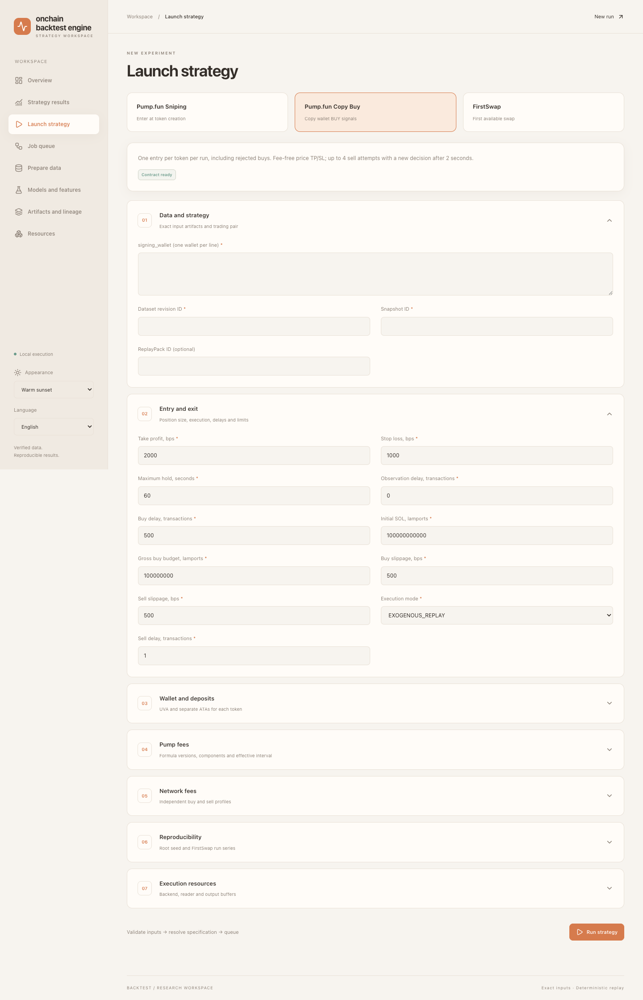

# Getting started

This guide takes an environment from a clean checkout to a running Web UI and
walks through the full network-aware Pump.fun Sniping path: source inspection,
a selective snapshot, ReplayPack, strict run resolution, and trade review.
Run all commands from the repository root.

## 1. System requirements

The supported runtime targets are:

- Linux x86_64;
- macOS arm64;
- Windows 11 x86_64 through WSL2 with Ubuntu x86_64.

Native Win32 execution is not currently supported or verified. On Windows,
keep both the repository and operational `data_root` inside the WSL Linux
filesystem, for example under `~/backtest`. Do not use `/mnt/c`, `/mnt/d`,
other DrvFS mounts, or network mounts for operational artifacts.

All platforms also require:

- Python `>=3.13,<3.14`;
- `uv` in `PATH`;
- at least 16 GB RAM, with 32 GB recommended;
- a local SSD/NVMe for `data_root`;
- ClickHouse access only for inspection and dataset preparation.

Docker, Node.js, and separate database servers are not required for normal
operation. DuckDB and SQLite run as embedded libraries inside Python processes.

## 2. Set up the environment

On Linux or macOS, run:

```bash
uv sync --all-groups --frozen
source .venv/bin/activate
python --version
backtest --help
```

On Windows, install and enter Ubuntu from PowerShell first:

```powershell
wsl --install -d Ubuntu
wsl --distribution Ubuntu
```

After the first command, Windows may require a restart. Clone or copy the
repository into the WSL Linux filesystem, open its root in the Ubuntu shell,
and run the same Bash setup commands:

```bash
uv sync --all-groups --frozen
source .venv/bin/activate
python --version
backtest --help
```

After the checkout exists at `~/backtest`, run the complete repository-provided
profile smoke directly from Windows PowerShell:

```powershell
wsl --distribution Ubuntu --cd '~/backtest' -- bash scripts/windows-wsl2-smoke.sh
```

The equivalent wrapper is `scripts/setup-windows-wsl2.ps1` when that script is
invoked from a Windows-visible copy of the checkout.

The expected Python version is `3.13.x`. You can skip environment activation
and invoke commands as `.venv/bin/backtest` on every supported runtime,
including Ubuntu under WSL2.

## 3. Local profile

Choose a starting profile:

- `configs/local-16gb.toml` — at most one run child at a time;
- `configs/local-32gb.toml` — more aggregate memory and at most two independent
  run children when measured resources are sufficient;
- `configs/local-windows-wsl2-16gb.toml` — the 16 GB Windows 11/WSL2 profile; use it
  only from Ubuntu inside WSL2 and keep `data_root` on the WSL Linux filesystem.

If `configs/local.toml` is not configured yet, copy the appropriate profile to
the gitignored local file.

Linux or macOS:

```bash
cp configs/local-16gb.toml configs/local.toml
```

Windows 11/WSL2, from the Ubuntu shell:

```bash
cp configs/local-windows-wsl2-16gb.toml configs/local.toml
```

Edit `configs/local.toml`. At minimum, verify:

```toml
[paths]
data_root = "var"

[control]
host = "127.0.0.1"
port = 8081

[planning]
# Illustrative acquisition budget across all requested capabilities.
max_total_blocks = 65536
max_shard_blocks = 4096

[source]
source_id = "my-indexer"
host = "127.0.0.1"
port = 8123
database = "default"
username = "readonly-user"
secret_ref = "BACKTEST_INDEXER_PASSWORD"
secure = false
verified_private_tunnel = false
allow_insecure_remote_http = false
```

`data_root` and other relative paths are resolved from the current working
directory, so always run commands from the project root. Do not copy a baseline
over an already configured `configs/local.toml`. The examples below use illustrative source IDs and block ranges. Configure
the local mappings for your source and choose a bounded range; increasing a
resource ceiling does not admit a source by itself.
See [configuration.md](configuration.md) for every field.

## 4. Start the Web UI without an indexer

You can open the UI before configuring a live source:

```bash
backtest serve --config configs/local.toml
```

Open `http://127.0.0.1:<control.port>`. For the configuration above:

```text
http://127.0.0.1:8081
```

The React interface opens in English. Use **Language → Русский** in the sidebar
for Russian, or **Appearance** to switch between Warm sunset and Dark.
Choose **Launch strategy** for Sniping, Copy Buy or FirstSwap. Expand the
sections for wallet/account profiles, fees, reproducibility and resources.



This screenshot uses an isolated browser fixture. Its defaults illustrate the
form and do not supply source evidence or recommend trading parameters.

No username or password is required. The localhost UI uses an automatically
created HttpOnly session cookie. Stop the server with `Ctrl+C`; completed
committed artifacts and the durable queue remain in `data_root`.

If the address shows an unrelated interface or Basic Auth prompt, check which
process owns the port and choose a different `[control].port`.

Linux, or Ubuntu under WSL2:

```bash
ss -ltnp
```

macOS:

```bash
lsof -nP -iTCP:8081 -sTCP:LISTEN
```

Windows PowerShell, when checking the host-side forwarded port:

```powershell
Get-NetTCPConnection -LocalPort 8081 -State Listen
```

Do not enter credentials into a prompt owned by an unknown process.

In `serve` mode, one process serves the API/static UI and one supervisor loop.
A heavy job enters the SQLite queue and runs in a separate child process, not
inside the HTTP request.

## 5. Configure the indexer

Connection settings live in `[source]`, but the password must not be stored in
TOML. Its value is read from the variable named by `secret_ref`.

Use the Bash shell on Linux, macOS, or Ubuntu under WSL2:

```bash
export BACKTEST_INDEXER_PASSWORD='your-indexer-secret'
```

Rotate compromised credentials before operational use.

In addition to connection settings, you need two secret-free mappings:

- a capability mapping: source tables/columns, typed network identity, bounded
  query key, and declared fidelity;
- a projection mapping: translation from logical capability columns into the
  canonical event kinds `BLOCK`, `TOKEN_LAUNCH`, `VENUE_TRADE`, and
  `VENUE_LIFECYCLE`.

Create local files such as:

```text
configs/indexer-capabilities.local.toml
configs/indexer-projections.local.toml
```

Both names already match `.gitignore`. In a configured local environment,
these files describe the verified physical indexer schema:

- the capability mapping contains exactly four `pumpfun-indexer-v1` raw-stream
  contracts;
- the projection mapping accepts only canonical columns emitted by the
  installed Pump-owned `pumpfun-indexer-v1-live-normalizer-v2` normalizer;
- bootstrap selects the fixed SQL profile and normalizer only when all four
  tables, their columns, and version tokens match exactly. A partial or changed
  mapping is rejected.

Reference both files from `configs/local.toml`:

```toml
capabilities_file = "configs/indexer-capabilities.local.toml"
projections_file = "configs/indexer-projections.local.toml"
```

The TOML contains no Pump formulas, joins, or `CASE` expressions: the fixed
adapter builds explicit-column, read-only SQL; the Pump plugin validates and
normalizes raw rows; and only then does the projection mapping create canonical
events. Exact digests of this query/normalizer/projector pipeline are part of
generated evidence and the DatasetSpec.

Having these two local files means the software knows **how to validate** this
indexer. It does not mean that the source is admitted. Exact admission requires
successfully generated `bounded-source-evidence/v2` receipts for the specific
range; static TOML continues to contain only `UNKNOWN`.

The repository contains a consistent pair of examples:

- [`configs/indexer-capabilities.example.toml`](../configs/indexer-capabilities.example.toml);
- [`configs/indexer-projections.example.toml`](../configs/indexer-projections.example.toml).

If local mappings are not configured, use the examples only as templates:

```bash
cp configs/indexer-capabilities.example.toml configs/indexer-capabilities.local.toml
cp configs/indexer-projections.example.toml configs/indexer-projections.local.toml
```

Do not run these `cp` commands over configured
`configs/indexer-*.local.toml` files: the example pair is illustrative and does
not describe a particular live schema. Every checked-in proof is intentionally
`UNKNOWN`, so copying the examples does not enable an exact Sniping run. The schema and evidence for a particular source
are established through `inspect-source`.

For a remote endpoint, choose exactly one transport mode:

- `secure = true` with verified TLS;
- a non-loopback endpoint reached through an already authenticated VPN/SSH
  tunnel, with `verified_private_tunnel = true`;
- a loopback endpoint for a local tunnel.

If the indexer is available only over direct non-loopback HTTP and the operator
explicitly accepts the risk, the local configuration may contain:

```toml
[source]
secure = false
verified_private_tunnel = false
allow_insecure_remote_http = true
```

This is an emergency opt-in, not protection: the password, queries, and results
travel without encryption and may be intercepted or altered. Runtime emits an
explicit warning. The flag is mutually exclusive with `secure = true` and
`verified_private_tunnel = true`, is unnecessary for loopback, does not permit
a public Control API/UI, and does not raise source fidelity. Checked-in profiles
leave it `false`; enable it only in the gitignored `configs/local.toml`.

## 6. Inspect the source

Stop `backtest serve` if you intend to use a mutating/direct CLI path. Run a
normal metadata-only inspection with:

```bash
backtest inspect-source \
  --config configs/local.toml \
  --capabilities configs/indexer-capabilities.local.toml
```

The command reads metadata, checks configured capabilities, and publishes a
local `source-inspection/v5` artifact. It does not download a full mirror and
does not raise `UNKNOWN` merely because a table or column exists.

Pump.fun Sniping requires a separate bounded evidence pass. The coordinates
below are illustrative: they do not identify an admitted dataset and must be
replaced with the bounded range you intend to inspect.

- decision range `[1000000, 1004096)`;
- evidence range `[1000000, 1008192)` with a right tail of 4096 blocks;
- example budget: `requested_days = 1` and maximum sell delay 200 transactions.

`requested_days` checks the budget limit; it does not convert dates into block
ordinals. Planning and inspection therefore use already resolved exact ranges,
not UTC timestamps alone.

Both boundary pairs are half-open. Pass the decision range explicitly so that
Mayhem classification and the launch-universe digest cover only the target
window, not the settlement tail:

```bash
backtest inspect-source \
  --config configs/local.toml \
  --capabilities configs/indexer-capabilities.local.toml \
  --evidence-from-block 1000000 \
  --evidence-to-block 1008192 \
  --decision-from-block 1000000 \
  --decision-to-block 1004096
```

Both evidence boundaries and both decision boundaries must be supplied in
pairs; the decision range must be inside the evidence range. If decision flags
are omitted, the CLI treats the entire evidence range as the decision range —
an incorrect operator choice for Sniping with a tail.

One external evidence cut may exceed 4096 blocks. The composition layer splits
it deterministically into contiguous internal subshards no wider than 4096
blocks. `TOKEN_LAUNCH` is read only over the decision range;
`BLOCK_CLOCK`, `PUMP_CURVE_TRADE`, and `PUMP_CURVE_LIFECYCLE` use the complete
evidence range. Every internal query remains bounded, streaming, read-only, and
uses explicit columns. Exactly one aggregate receipt per capability is still
published externally, not one artifact per subshard. The number of sequential queries depends on the selected ranges; evidence
inspection can take longer than metadata-only inspection.

Only a successful evidence pass returns `artifact_id`,
`evidence_receipt_ids`, `cut_evidence`, and proof statuses. Save the exact
`artifact_id` of this last inspection for `plan.json`. Each
`bounded-source-evidence/v2` receipt binds the source,
NetworkId/PositionSchemaId, capability/version, mapping/query digests, exact
evidence and decision ranges, fingerprints of every internal query,
normalizer/projector digests, result digest, and observed row count. Receipts
also bind launch classification/exclusion, skipped-slot sentinels, and derived
terminal lifecycle order. Credentials and source rows are not stored in the
artifact.

A receipt proves the fact and result of a particular bounded check, not the
entire `pumpfun-sniping-source-v2` automatically. The fixed evaluator returns
`PROVEN` only after the exact raw profile, normalizer, and cross-stream checks
all pass for one cut. A gap, conflict, unknown mode, clock/curve/lifecycle/
bundle semantics violation, or mismatched digest produces a typed failure. The
current bounded placeholder treats a bundled buy only as a later successful
`BUY` with the same `signature` and `mint` in the same creation transaction. A
successful `SELL` in that transaction is also applied to the curve atomically
before the decision, but is not classified as a bundled buy;
`bundled_buys_count` is not an independent proof. Raw trades do not contain
separate protocol/creator fee columns: the normalizer derives 95/30 components
from the exact curve SOL leg under the pinned integer formula/profile, and the
receipt binds them as derived-not-observed provenance. An inspection artifact
with false admission is not published. Do not manually change a static TOML
proof from `UNKNOWN` to `PROVEN`; the parser rejects it.

Use content IDs returned by your own commands. A gap or inconsistent state
transition prevents publication of the inspection and downstream artifacts.
Manual `PROVEN` or disabled validation cannot repair missing source evidence.

Legacy `bounded-source-evidence/v1`, `source-inspection/v1`–`v4`,
`backtest.dataset-plan/v1`–`v3`, and DatasetSpec v1–v4 are not migrated in
place; reuse attempts return `REPREPARE_REQUIRED`.

## 7. Plan a selective dataset

Create `plan.json`. Replace every angle-bracket value below. `network_id`
contains a family and immutable chain reference; do not use an alias such as
`solana:mainnet`, an endpoint, or an indexer name. The current Solana contract
is `block32-transaction32-v1`, and ranges are always half-open:
`[from_block_ordinal, to_block_ordinal)`.

```json
{
  "source_id": "my-indexer",
  "source_inspection_artifact_id": "<64-hex inspection artifact ID>",
  "network_id": "solana:5eykt4UsFv8P8NJdTREpY1vzqKqZKvdpKuc147dw2N9d",
  "position_schema_id": "block32-transaction32-v1",
  "from_block_ordinal": 1000000,
  "to_block_ordinal": 1004096,
  "warmup_blocks": 0,
  "settlement_tail_blocks": 0,
  "max_shard_blocks": 4096,
  "requested_days": 1,
  "requirements": [
    {
      "origin": "EXECUTION",
      "origin_id": "pumpfun-sniping-block-clock-v1",
      "capability_id": "pumpfun.block-clock.v2",
      "columns": ["block_ordinal", "block_time", "transaction_count", "block_hash"],
      "minimum_fidelity": {
        "identity": "EXACT",
        "ordering": "UNKNOWN",
        "state": "NONE",
        "fees": "UNKNOWN",
        "chain_finality": "FINALIZED",
        "completeness": "COMPLETE_TO_WATERMARK",
        "consistency": "SNAPSHOT_CONSISTENT"
      },
      "accepted_protocol_versions": ["solana-block-clock-v1"],
      "evidence_contracts": ["pumpfun-sniping-source-v2"],
      "warmup_blocks": 0,
      "settlement_tail_blocks": 0,
      "settlement_requirement": {
        "schema": "global-transaction-duration-roundtrip/v1",
        "target_stream": "TOKEN_LAUNCH",
        "settlement_streams": [
          "BLOCK_CLOCK",
          "PUMP_CURVE_LIFECYCLE",
          "PUMP_CURVE_TRADE"
        ],
        "initial_delay_transactions": 500,
        "minimum_duration_ns": 2000000000,
        "maximum_followup_delay_transactions": 200,
        "maximum_tail_blocks": 4096
      }
    },
    {
      "origin": "STRATEGY",
      "origin_id": "pumpfun-sniping-launch-v1",
      "capability_id": "pumpfun.token-launch.v2",
      "columns": ["transaction_succeeded", "mint", "creator", "creation_user"],
      "minimum_fidelity": {
        "identity": "EXACT",
        "ordering": "INSTRUCTION_EXACT",
        "state": "AFTER_ONLY",
        "fees": "UNKNOWN",
        "chain_finality": "FINALIZED",
        "completeness": "COMPLETE_TO_WATERMARK",
        "consistency": "SNAPSHOT_CONSISTENT"
      },
      "accepted_protocol_versions": ["pump-program-static-fee-v1"],
      "evidence_contracts": ["pumpfun-sniping-source-v2"],
      "warmup_blocks": 0,
      "settlement_tail_blocks": 0
    },
    {
      "origin": "EXECUTION",
      "origin_id": "pumpfun-sniping-curve-trade-v1",
      "capability_id": "pumpfun.curve-trade.v2",
      "columns": ["side", "base_amount_atomic", "quote_amount_atomic", "protocol_fee_atomic", "creator_fee_atomic"],
      "minimum_fidelity": {
        "identity": "EXACT",
        "ordering": "INSTRUCTION_EXACT",
        "state": "AFTER_ONLY",
        "fees": "COMPONENTS",
        "chain_finality": "FINALIZED",
        "completeness": "COMPLETE_TO_WATERMARK",
        "consistency": "SNAPSHOT_CONSISTENT"
      },
      "accepted_protocol_versions": ["pump-program-static-fee-v1"],
      "evidence_contracts": ["pumpfun-sniping-source-v2"],
      "warmup_blocks": 0,
      "settlement_tail_blocks": 0
    },
    {
      "origin": "EXECUTION",
      "origin_id": "pumpfun-sniping-lifecycle-v1",
      "capability_id": "pumpfun.curve-lifecycle.v2",
      "columns": ["lifecycle_kind", "lifecycle", "mode"],
      "minimum_fidelity": {
        "identity": "EXACT",
        "ordering": "INSTRUCTION_EXACT",
        "state": "AFTER_ONLY",
        "fees": "UNKNOWN",
        "chain_finality": "FINALIZED",
        "completeness": "COMPLETE_TO_WATERMARK",
        "consistency": "SNAPSHOT_CONSISTENT"
      },
      "accepted_protocol_versions": ["pump-program-static-fee-v1"],
      "evidence_contracts": ["pumpfun-sniping-source-v2"],
      "warmup_blocks": 0,
      "settlement_tail_blocks": 0
    }
  ],
  "budget": {
    "max_remote_bytes": 17179869184,
    "max_local_bytes": 17179869184,
    "max_days": 1,
    "temporary_reserve_bytes": 4294967296,
    "disk_low_watermark_bytes": 34359738368
  },
  "query": {
    "max_execution_seconds": 300,
    "max_memory_bytes": 4294967296,
    "max_result_rows": 10000000
  },
  "request_remote_estimate": false
}
```

Capability IDs and protocol versions must match the specific inspection
artifact exactly. The planner adds `mandatory_columns` from the capability
mapping. `settlement_requirement` is required for Sniping and is part of
DatasetSpec v5 identity. This example dataset supports
`sell_delay_transactions <= 200`; if you need a longer delay, increase
`maximum_followup_delay_transactions` **before preparation** and prepare a new
dataset. The resolver will not run a longer sell latency on an already prepared
snapshot.

`maximum_tail_blocks: 4096` is a hard acquisition cap, not a claim that 4096
blocks will necessarily be sufficient. The planner expands `BLOCK_CLOCK`,
`PUMP_CURVE_TRADE`, and `PUMP_CURVE_LIFECYCLE` exactly to this cap once;
`TOKEN_LAUNCH` remains inside the decision range, so the tail creates no new
targets. The pre-root validator then uses the actual compact clock to verify
that every target can complete 500 transactions, two seconds, and the maximum
sell delay. A caller tail above 4096, a source watermark below the cap, or an
actually insufficient clock produces a typed fail-closed result without
unbounded incremental loading.

For the illustrative ranges above, aggregate capability width is 28,672
blocks: 4,096 for launches and 8,192 for each of three settlement streams.
`max_total_blocks` must cover that sum. It is a resource ceiling, not evidence
of fidelity or settlement-tail sufficiency.

Plan validation downloads nothing:

```bash
backtest plan-dataset plan.json \
  --config configs/local.toml \
  --capabilities configs/indexer-capabilities.local.toml
```

The plan passes source admission only with a `source-inspection/v5` created by
the preceding bounded command for the exact ranges and binding four successful
`bounded-source-evidence/v2` receipts. A metadata-only inspection or checked-in
`UNKNOWN` examples produces typed `SOURCE_EVIDENCE_MISMATCH`; do not bypass it
by editing JSON/TOML.

The plan should show the original decision range, capability-specific
extraction ranges with the right settlement tail, only required columns, and
acceptable host quotas. Do not raise limits merely to bypass a rejection:
first reduce the range or measure actual resource usage. An insufficient tail,
four streams from different source cuts, or unproven fidelity produces a typed
failure.

## 8. Prepare the snapshot

`prepare-dataset` accepts the same versioned plan request:

```bash
backtest prepare-dataset plan.json \
  --config configs/local.toml \
  --capabilities configs/indexer-capabilities.local.toml
```

A successful response contains:

- `snapshot_id` — the exact root snapshot;
- `dataset_revision_id` — logical dataset plus source boundaries;
- `logical_content_hash` — hash of canonical records/schema.

For Sniping, this response is possible only after pre-root validation of the
whole candidate. The validator checks canonical order/groups, Pump state, the
compact transaction clock, and the maximum settlement path for every launch in
the decision range. `SETTLEMENT_TAIL_INSUFFICIENT` or another validation error
means that the snapshot root was not published; separately committed
distributions cannot be used as a snapshot.

After commit, later compile/backtest commands do not access the indexer.

## 9. ReplayPack for repeated runs

`reference-pumpfun-sniping-v1` can read canonical Parquet directly. For a run
series and for `numpy-mmap-pumpfun-sniping-v1`, first build the mmap ReplayPack:

```bash
backtest compile-replay <snapshot_id> --config configs/local.toml
```

Save `replay_pack_id` from the response. ReplayPack is a rebuildable fast path,
not the source of truth; the committed snapshot remains the authoritative
input. The pack contains compact arrays for block ordinal, complete
`transaction_count`, cumulative prefix, and `block_time_ns`, rather than one
Python object per Solana transaction.

## 10. Pump.fun Sniping draft v3

The current executable contract is the strictly validated
`pumpfun-sniping-run-draft/v3`. Its `execution_mode` field is required; draft
v2 cannot be executed as v3 and returns `RERESOLVE_REQUIRED`.

First inspect the supported editable fields and fixed semantics:

```bash
backtest describe-run-contract pumpfun-sniping-run-draft/v3 \
  --config configs/local.toml
```

Create `run-draft.json`, substituting exact IDs from earlier responses:

```json
{
  "contract_schema": "pumpfun-sniping-run-draft/v3",
  "dataset_revision_id": "<64-hex dataset revision ID>",
  "snapshot_id": "<64-hex snapshot ID>",
  "replay_pack_id": "<64-hex ReplayPack ID>",
  "delivery_schedule_id": null,
  "execution_mode": "EXOGENOUS_REPLAY",
  "initial_sol_balance_lamports": "2000000000",
  "gross_buy_budget_lamports": "200000000",
  "buy_slippage_bps": 3500,
  "sell_slippage_bps": 3500,
  "sell_delay_transactions": 200,
  "wallet_account_profile": {
    "schema": "pumpfun-solana-wallet-account-profile/v2",
    "profile_id": "pumpfun-solana-accounts-v2",
    "initial_uva_state": "fresh",
    "effective_from_unix_s": 0,
    "effective_until_unix_s": 4102444800,
    "account_costs": [
      {
        "requirement_schema_id": "pumpfun-user-volume-accumulator-v1",
        "deposit_lamports": "1844400"
      },
      {
        "requirement_schema_id": "solana-associated-token-account-legacy-v1",
        "deposit_lamports": "2039280"
      },
      {
        "requirement_schema_id": "solana-associated-token-account-token-2022-immutable-owner-v1",
        "deposit_lamports": "2074080"
      }
    ]
  },
  "pump_fee_profile": {
    "profile_id": "pump-static-95-30-v1",
    "program_version": "pump-program-static-fee-v1",
    "buy_formula_version": "pump-buy-exact-gross-sol-v1",
    "sell_formula_version": "pump-sell-exact-token-in-v1",
    "effective_from_unix_s": 0,
    "effective_until_unix_s": 4102444800,
    "protocol_fee_bps": 95,
    "creator_fee_bps": 30
  },
  "buy_solana_fee_profile": {
    "profile_id": "solana-buy-v1",
    "formula_version": "solana-legacy-v0-base-priority-v1",
    "transaction_format": "V0",
    "effective_from_unix_s": 0,
    "effective_until_unix_s": 4102444800,
    "charged_signature_count": 1,
    "lamports_per_signature": "5000",
    "compute_unit_limit": 86000,
    "micro_lamports_per_compute_unit": "10"
  },
  "sell_solana_fee_profile": {
    "profile_id": "solana-sell-v1",
    "formula_version": "solana-legacy-v0-base-priority-v1",
    "transaction_format": "V0",
    "effective_from_unix_s": 0,
    "effective_until_unix_s": 4102444800,
    "charged_signature_count": 1,
    "lamports_per_signature": "5000",
    "compute_unit_limit": 100000,
    "micro_lamports_per_compute_unit": "10"
  },
  "root_seed": "42"
}
```

Atomic amounts, including each `deposit_lamports`, fee-profile atomic fields,
and `root_seed`, travel as decimal strings to preserve precision in the Web
UI/JSON. The example parameters are: an initial balance of 2 SOL, a gross buy
budget of 0.2 SOL, 35% (`3500` bps) for both slippage limits, a sell delay of
200, buy/sell CU limits of 86000/100000, and 10 micro-lamports/CU. The effective
interval and every component price must remain valid for the selected dataset.
For a one-off reference Parquet run, set `replay_pack_id` to the actual JSON
value `null`. The optimized backend requires the exact `replay_pack_id`.

`fresh` means only that the wallet-scoped Pump UserVolumeAccumulator is absent
at the beginning of the run. It does not mean a pre-created ATA: every
successful buy creates a mode-specific ATA for the mint, a successful sell
closes it, and a failed sell leaves the ATA and token balance locked. The
profile therefore contains three separately effective-dated prices: UVA,
legacy ATA, and Token-2022 ATA.

The draft intentionally does not expose the fixed cooldown of 600 seconds, buy
delay of 500 global Solana transactions, sell-decision delay of 2 seconds,
SOL-only, or sell-all semantics; the resolver materializes them in semantic
identity. It does require exactly one of `EXOGENOUS_REPLAY` and
`EXOGENOUS_VIRTUAL_SETTLEMENT`. Both modes replay
external trades as observed, quote against causal historical state, include
our order size, and never mutate historical reserves. Virtual settlement
changes only sell-side real-SOL solvency: a successful sell explicitly splits
gross output into observed venue-funded SOL and a synthetic shortfall. The
buy-side real-token cap, lifecycle, slippage, fees, accounts, and migration
behavior remain unchanged. Synthetic proceeds are spendable inside the
simulated wallet but do not prove that the sell could execute on-chain.

To switch modes, change `execution_mode` in the v3 draft and run `resolve-run`
again. This creates new logical/order/round-trip identities and a different
`logical_run_id`, but reuses the same Dataset, Snapshot, and ReplayPack; it
does not require `prepare-dataset` or `compile-replay` again.

## 11. Resolve and run

A draft is not executable. The resolver first pins exact artifacts, defaults,
runtime, and bundle closure. It also rechecks NetworkId,
`block32-transaction32-v1`, four-stream source evidence, and settlement tail:

```bash
backtest resolve-run run-draft.json \
  --config configs/local.toml > resolved-run.json
```

By default, `delivery_schedule_id: null`, so observation delivery is built
dynamically. For repeated runs with one ReplayPack/latency/clock/seed policy,
you may materialize an equivalent stream:

```bash
backtest compile-delivery-schedule resolved-run.json \
  --config configs/local.toml
```

Copy the returned `delivery_schedule_id` into `run-draft.json` and run
`resolve-run` again. A schedule is valid only with the exact ReplayPack; the
resolver verifies its build key, network, position schema, and decision range
before execution. It materializes post-group observation order but does not
replace dynamic buy/sell timers.

Run one sequential deterministic execution with a unique physical nonce. Use
the reference backend for Parquet; with a ReplayPack, select either the
reference backend or the dedicated optimized backend:

```bash
RUN_ATTEMPT_NONCE="$(python -c 'import secrets; print(secrets.token_hex(32))')"
backtest run resolved-run.json \
  --attempt-nonce "$RUN_ATTEMPT_NONCE" \
  --backend numpy-mmap-pumpfun-sniping-v1 \
  --config configs/local.toml
```

The response includes `logical_run_id`, `execution_attempt_id`, and
`run_artifact_id`. The nonce changes the physical attempt, not the semantic
identity of the experiment. CLI flags for backend/batch/readahead/output
buffer/threads and their Web UI counterparts are separate physical-attempt
settings: the API transports them through `RunPhysicalSettingsCommand`, while
the canonical durable job uses `backtest.run-job/v2`. They are intentionally
absent from `pumpfun-sniping-run-draft/v3` and do not alter `logical_run_id`.

## 12. Inspect the result

```bash
backtest list-runs --config configs/local.toml
backtest show-run-summary <run_artifact_id> --config configs/local.toml
backtest list-roundtrips <run_artifact_id> --limit 200 --config configs/local.toml
backtest list-roundtrips <run_artifact_id> \
  --after '<boundary_ordinal>:<roundtrip_id>' \
  --limit 200 \
  --config configs/local.toml
backtest verify-artifact <run_artifact_id> --config configs/local.toml
backtest show-lineage <run_artifact_id> --config configs/local.toml
```

`show-run-summary` returns `pumpfun-sniping-run-summary/v3`: bounded
counts/hashes, selected execution/settlement policies, realized PnL,
protocol/creator/network fee totals, paid/refunded/locked account deposits,
slippage counters, and reconciled gross/venue/synthetic settlement totals. If
any open position cannot be valued, `valuation_status` is
`PARTIAL_UNVALUED_OPEN_POSITIONS`, full `economic_pnl_atomic` is `null`, and the
partial total remains only in `valued_economic_pnl_subtotal_atomic`.
`list-roundtrips` reads verified `roundtrips.parquet` in keyset pages of at most
200 rows; pass the `next_cursor` cursor to the next call. Exact
reference/min/landing amounts, signed slippage, component fees, account/rent,
cashback, realized, and MTM values remain integer atomic values. Current
`pumpfun-roundtrips/v4` exposes `account_profile_id`, ordered
`account_components[]`. Each component includes requirement schema, scope,
release policy, attribution, lifecycle, and exact reserved/paid/released/
refunded/locked amounts; this replaces the ambiguous scalar account fields in
v2, and mode-specific reference/landing liquidity evidence. It keeps potential
shortfall separate from actually settled synthetic funding and records
projected MTM shortfall without a ledger posting. The failure code for each leg
remains separate, and every financial row reconciles with correlated
`run-ledger/v2`. Committed summary v2/round-trip v3 results remain readable
under their original schemas and are not rewritten.

The same data is available in the React UI. Open **Strategy results** in the
sidebar and select **Results** on a committed run. The exact `run_artifact_id`
opens at `/runs/{id}`, with **Overview**, **Entries**, **Exits**, **Trades** and
**Verification** tabs shared by all implemented strategies. Cards read verified
summary metadata; supplemental distributions use a separately bounded scan.
Tables keep one page of 25 entries. The API permits up to 200, while the UI
uses 25. Arrows request another page; search and alternate sorts apply only
to the loaded page. Partial economic PnL stays unavailable, with the valued
subtotal shown separately.

Select a token or its details button under **Trades** to open a large overlay.
For Pump results, it displays the original signal, actual filled entry/exit,
failed/rejected attempts and SOL market-cap history from retained verified
inputs. **Around trade** and **Full history** adjust the local view. The line
ends at completion/migration; it is neither USD history nor an execution-price
chart. A missing history or exceeded scan limit returns an explicit error.
FirstSwap has no defined round-trip/PnL policy or Pump history.

**Verification → Open manifest and lineage → Lineage** opens the bounded
dependency graph. Each node links to verified artifact metadata. The UI reads
through the API and never opens SQLite, Parquet or filesystem paths directly.
Virtual settlement retains a visible synthetic-funding warning on results and
trade details; those proceeds do not establish on-chain executability.

The main UI similarly shows 20 jobs and 10 runs at a time. Jobs are globally
newest-first; runs are also selected globally newest-by-completion-time before
the bounded page is read. Arrow navigation requests another server page, while
alternate allowlisted sorts remain page-local so the UI does not verify the
entire run history. Runs load once on startup, on manual refresh, or after a
run-producing job completes; only active jobs retain the fast polling cadence.

## 13. Direct CLI or queue

- Direct mode: with `serve` stopped, a heavy command is durably submitted,
  starts the local supervisor/child, and waits for terminal state.
- UI/API mode: `serve` holds controller authority, the command quickly enters
  the SQLite queue, and the UI polls status/progress.
- With the server running, `run`, `sweep`, and ML CLI aliases use
  `--enqueue --idempotency-key <stable-key>`.
- Do not start a second server or direct writer for the same `data_root`.
  `controller.lock` intentionally rejects that race.

Example queued run:

```bash
backtest run resolved-run.json \
  --attempt-nonce <64-hex nonce> \
  --enqueue \
  --idempotency-key example-experiment-v1 \
  --config configs/local.toml
```

## 14. Admission boundaries

Capability/projection examples and hermetic tests describe the software
contract, but do not prove live-indexer completeness. Every exact cut requires
its own authoritative `PROVEN` receipts for all four streams. A new or extended
range without them remains fail closed; local TOML and a normalizer cannot
replace evidence, and manually changing `UNKNOWN` is prohibited.

Measure performance and resources on the selected data and target host using
the [benchmark methodology](performance-baseline.md). A check of one range
does not prove other ranges, greater capacity, or cold-cache performance.
Windows is supported through WSL2/Ubuntu; native Win32 is unsupported.

## 15. Next steps

- Every command: [CLI reference](cli-reference.md).
- RAM, disk, and backup settings: [configuration.md](configuration.md).
- Where to add strategy/indexer/protocol code: [project-layout.md](project-layout.md).
- Why these constraints exist: [architecture-deep-dive.md](architecture-deep-dive.md).

---

**Language:** English · [Русский](getting-started.ru.md)
