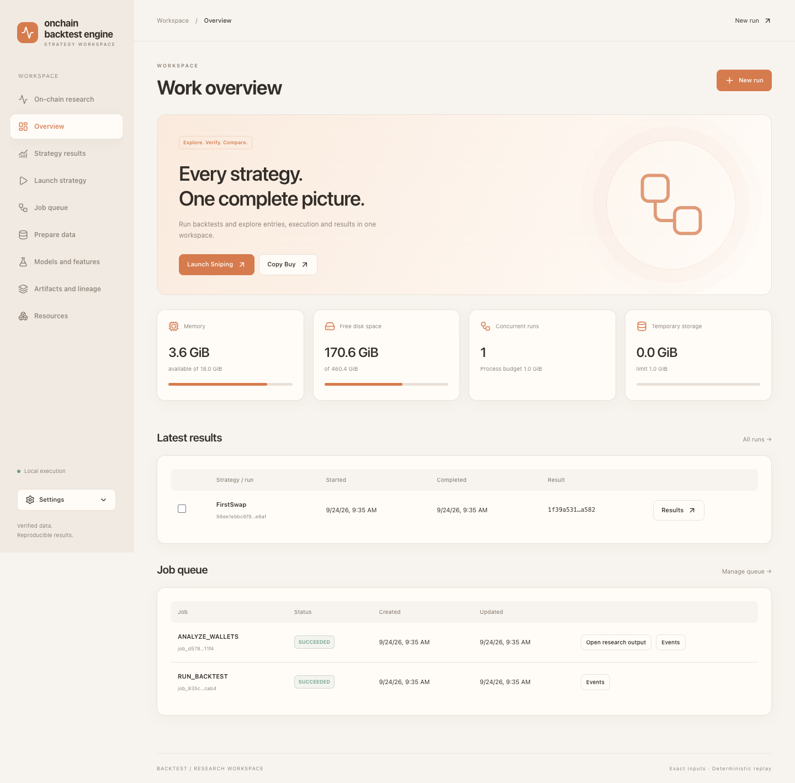
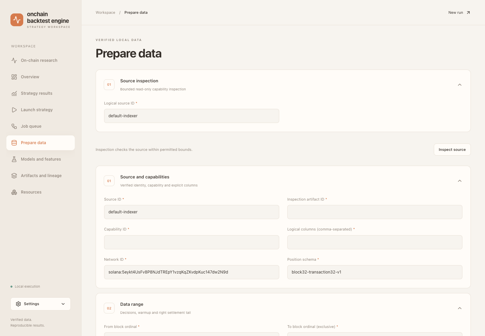
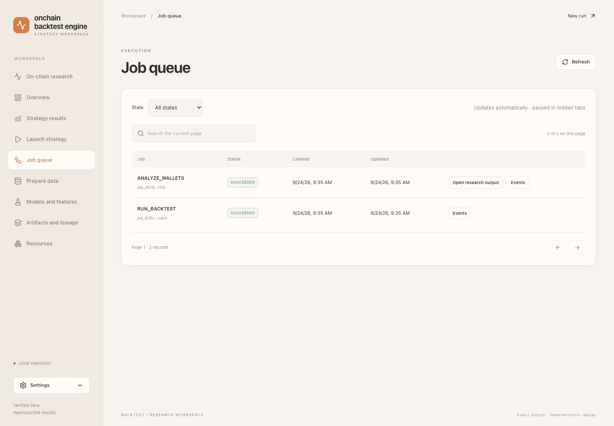
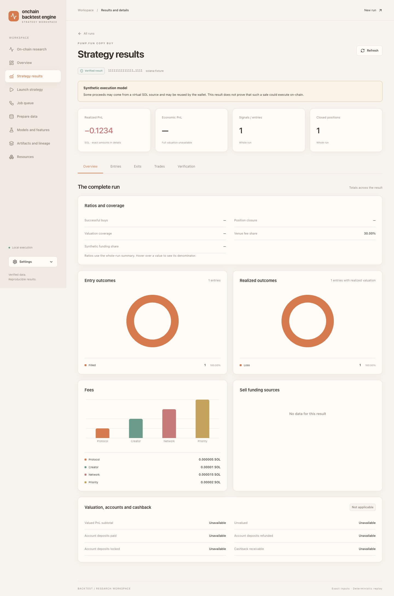
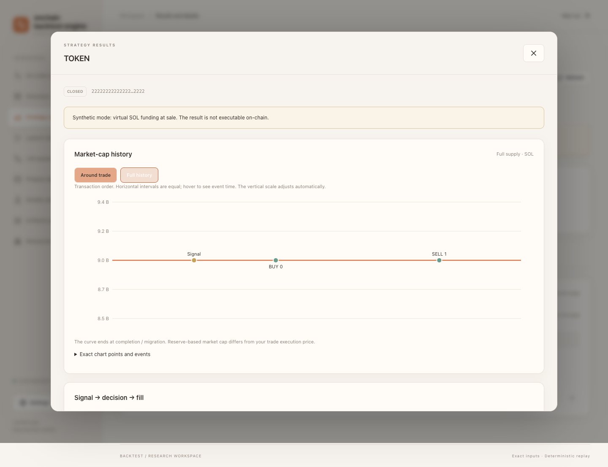
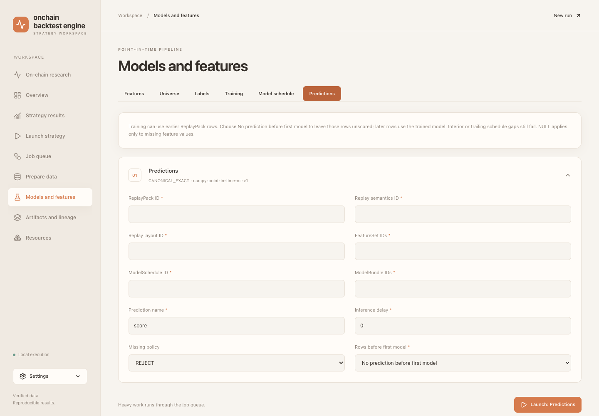
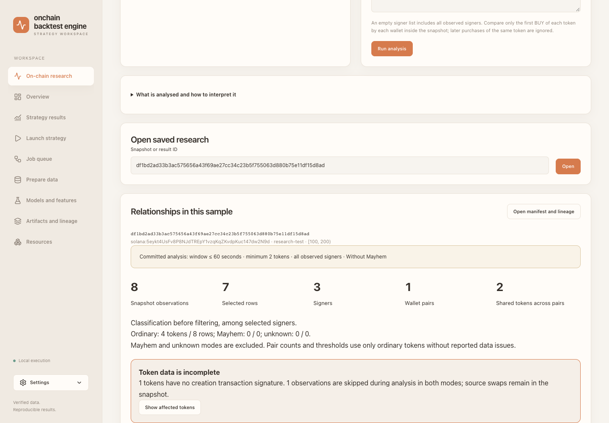
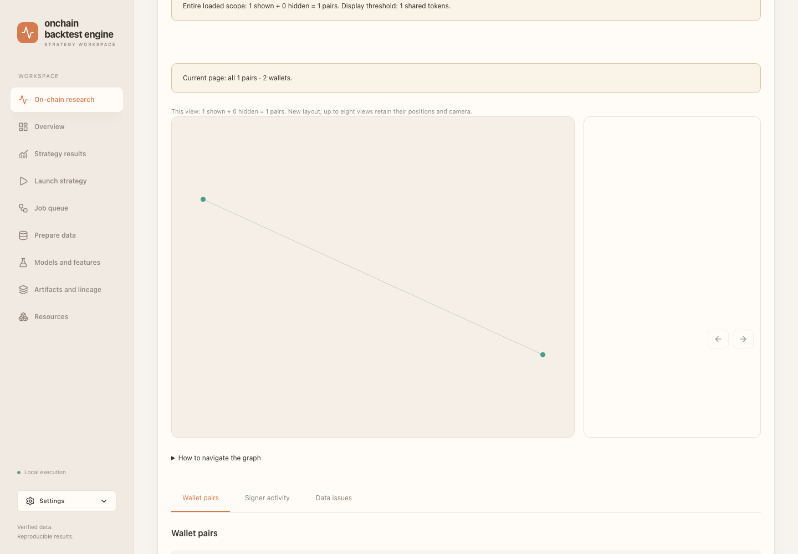

# Web UI 使用指南

**语言：** [English](ui-guide.md) · [Русский](ui-guide.ru.md) · 简体中文

本指南说明浏览器中的完整基本流程。所有截图都来自隔离的合成测试数据，
其中的 ID、结果和参数不是实时来源证据，也不是交易建议。

## 启动界面

```bash
backtest serve --config configs/local.toml
```

打开 `http://127.0.0.1:<control.port>`。侧栏底部的 **Settings** 可切换语言和主题。
如果只想查看界面而不提交任务，请使用[静态演示](demo.md)。

## 工作区概览



- **Prepare data**：检查只读来源并创建有界本地快照。
- **Launch strategy**：解析并提交 Sniping、Copy Buy 或 FirstSwap。
- **Job queue**：查看进度、事件、取消和重试。
- **Strategy results**：查看汇总、进出场、成交和验证信息。
- **Models and features**：创建 point-in-time ML 工件链。
- **On-chain research**：查看签名钱包、共同购买和原始证据。
- **Artifacts and lineage**：验证工件及完整依赖关系。
- **Resources**：查看内存、磁盘、进程和临时空间限制。

绿色 **Local execution** 只表示浏览器已连接本机 Control API，并不表示外部
数据源已正确配置。

## 准备数据



先执行只读的 **Inspect source**，再使用返回的 inspection/capability ID 创建
有界的半开区间计划，最后提交准备任务。重任务会进入 **Job queue**。任务达到
`SUCCEEDED` 后，从 receipt 或 **Artifacts and lineage** 复制精确的
Snapshot/ReplayPack ID。不要在 UI 中输入密码、私钥、任意 SQL 或文件路径。

## 启动策略并查看任务


选择策略，填写所需工件 ID，检查进出场、费用、可复现性和资源字段，然后点击
**Run strategy**。默认值只是示例。提交成功并不等于运行成功；请在队列中等待
`SUCCEEDED`。



**Events** 显示持久化进度和明确错误；只有成功发布验证工件后才会出现结果链接。
**Retry** 使用同一不可变命令创建新尝试，不会静默修改输入。

## 查看策略结果



先确认 **Verified result**、策略、网络和 fidelity/合成执行警告。破折号表示数据
不可用，不表示零。使用 **Entries**、**Exits**、**Trades** 和
**Verification** 查看决策、成交和来源关系。



**Around trade** 显示成交附近，**Full history** 使用同一有界历史。展开 evidence
可查看精确值。

## 基础 ML 流程



按顺序使用 **Features → Universe → Labels → Training → Model schedule →
Predictions**。每一步都使用前一步发布的精确 ID。训练可以使用 ReplayPack 的早期
行；预测时选择 **No prediction before first model**，让第一模型可用之前的前缀
保持未评分。模型之后的内部或尾部 schedule 空缺仍然是错误。FirstSwap 必须使用
相同的前缀策略。

## 链上研究



研究先创建有界 snapshot，再分析保存的 snapshot。空 signer 列表表示该 snapshot
中的所有已观察 signer，而不是全网所有钱包。必须先阅读数据质量警告。



节点是钱包，边是符合条件的已观察关系。显示阈值只隐藏视图中的边，不会修改已保存
的分组或证据。选择钱包或分组后，打开原始购买记录，并在结论前检查
**Data issues**。研究结果不会自动成为策略、ML 特征或执行许可。

更多设置见[配置](configuration.zh-CN.md)，命令行等价流程见
[CLI 指南](cli-reference.zh-CN.md)。
