# Wallet research before a strategy

The `/research` page investigates which signing wallets buy the same Pump.fun
tokens near the same reported block time. It saves observations, calculates
activity and wallet pairs, and opens each relationship's original purchases.
No strategy is required. The normative contract is
[deep dive §24.6](architecture-deep-dive.md#246-on-chain-wallet-research).

```mermaid
flowchart LR
    Source[Read-only ClickHouse] --> Prepare[research prepare]
    Prepare --> Snapshot[ResearchSnapshot]
    Snapshot --> Analyze[research analyze / DuckDB]
    Analyze --> Result[ResearchResult]
    Result --> Dashboard[Activity / pairs / original trades]
    Dashboard --> Hypothesis[Testable hypothesis]
    Hypothesis -. separate causal admission .-> Feature[Feature / Universe / Strategy]
```



## Choose observations

The first profile reads successful SOL-paired `pumpfun_v2_swaps` rows in one
half-open block range: inclusive left bound, exclusive right bound. The local
capability mapping pins the network's complete genesis hash. Configure the
connection and environment-backed `secret_ref` using the
[configuration guide](configuration.md).

Start with a small interval. Research does not join trades to launches inside
the decision range or apply the Sniping non-Mayhem universe. It observes this
Pump.fun source scope, not the entire Solana market. Existing Sniping snapshots
have a different scope and lack the required wallet roles, so they cannot be
used as research snapshots.

With Control API running, open `/research`, enter block bounds, and prepare a
snapshot. Open the successful job to see its source rows and fill the analysis
form with its immutable ID. The equivalent standalone CLI command is:

```bash
# Replace the example interval and deployment-local paths with your own.
backtest research prepare 443282098 443292098 \
  --config configs/local-16gb.toml \
  --capabilities /absolute/path/to/capabilities.toml
```

The example is syntax, not a verified live cut. The command returns the
snapshot's `artifact_id`. Each new acquisition reads the source again and
preserves old immutable snapshots. When an API process owns the controller,
submit through its web form; a direct CLI job cannot create a second controller.

## Analyze shared purchases

Defaults are a 60-second inclusive window, at least two shared tokens, and all
observed signers. Optionally select up to 128 complete wallet addresses; this
changes the calculation's participant set, not just graph display.

```bash
backtest research analyze <SNAPSHOT_ID> \
  --config configs/local-16gb.toml \
  --window-seconds 60 --minimum-shared-mints 2
```

Repeat `--wallet <ADDRESS>` to select signers. Changed window, threshold or
selection produces a new identity-bearing result. Analysis requires only
verified committed local files and no source connection.

1. For each signer/mint, select the first observed BUY **within this snapshot**
   by block, transaction, instruction and canonical observation ordinal.
2. Two different signers qualify for that mint if the absolute difference of
   their reported block timestamps is no larger than the window. Exactly
   60 seconds qualifies under a 60-second window.
3. One mint contributes once per pair. Rebuys and duplicate observations do
   not strengthen the relationship.
4. Apply the threshold after complete aggregation. Direction compares reported
   transaction positions; observations in one transaction are a tie.

The first observed purchase is not necessarily the wallet's first-ever
purchase. Reported block time does not prove when a strategy could know it.

## Inspect results and evidence

Run `backtest serve --config configs/local-16gb.toml` and open `/research` at
the server's printed local address. Select a completed job or paste an exact
artifact ID. `/research?artifact=<RESULT_ID>` reopens that result on the same
controller.

| View | Meaning |
|---|---|
| Summary counters | The whole immutable result, independent of pagination |
| Activity | All observed BUY/SELL rows, distinct mints, block bounds and source SOL-leg sums |
| Pairs | Shared mints and direction by reported transaction positions |
| Graph | Current page only: at most 25 pairs and 50 nodes |
| Purchase evidence | Mint and both original purchases, including full signatures, signers and fee payers |
| Lineage | The exact retained input snapshot |

The evidence total sums pair/mint contributions; it is not a market-wide
distinct-token count. Activity deliberately retains duplicate source rows.
Amounts remain exact integer lamports, including across the browser boundary.

```bash
backtest research show <RESULT_ID> --config configs/local-16gb.toml
backtest research rows <RESULT_ID> pairs --limit 25 --config configs/local-16gb.toml
# --pair takes the pair table's row_id.
backtest research rows <RESULT_ID> evidence --pair 0 --limit 25 \
  --config configs/local-16gb.toml
```

Pass a returned `next_cursor` through `--cursor` to continue the same artifact,
table and pair. A cursor cannot be reused in a different view.

## Interpret the result and its limits

Signer, fee payer and economic owner are different roles. Shared purchases or
a common payer do not establish common ownership, coordination, copy trading
or predictive power. Completeness, finality, source-snapshot consistency and
causal availability remain `UNKNOWN`. Successful preparation proves a complete
bounded read of valid observed rows, not that the source contains every trade.
Transfers, full balance history, wallet PnL and ownership clustering are not
implemented. Source amount-leg sums are not wallet profit.

Preparation permits at most 300,000 blocks and 2 million rows. Analysis limits
the window to 0–3,600 seconds, each mint to 2,048 participants and the candidate
join to 4 million pair/mint combinations **before** the time filter. Memory,
spill, output and query time are bounded; source-server limits may reject a
scan earlier. API pages allow at most 200 rows and the UI requests 25.

Limit failures reject the whole computation. They never drop popular tokens,
truncate observations or silently sample a top list. Narrow the range or
explicitly select signers and run a new analysis. A smaller time window does
not remove the prejoin candidate check.

Leave the signer field empty to analyze all observed signers. A saved
97,040-row cut with 10,075 signers passed at 180 seconds and a minimum of two
shared mints: 81,645 pairs and 213,851 pair/mint evidence rows. The graph still
shows the current page. [Capacity evidence](research-capacity.md) records this
specific workload. Windows of 1,000 and 3,600 seconds also pass on this cut:
compact temporary keys reduce repeated address storage while the published
rows keep full addresses and exact observation references. Larger or denser
snapshots can still exceed the guards.

## Move a hypothesis toward a strategy

Formulate a rule and test it on a separate period. Backtesting requires a
separately implemented causal feature, universe or strategy with a versioned
contract. Wallet selection must use only information available by the
historical decision boundary; choosing wallets using a future period cannot
affect earlier decisions. Automatic ResearchResult-to-strategy conversion is
not implemented. Existing exact Sniping admission remains unchanged.

---

**Language:** English · [Русский](wallet-research.ru.md)
