# Wallet research before a strategy

The `/research` page investigates which signing wallets buy the same Pump.fun
tokens near the same reported block time. It saves observations, calculates
activity and wallet pairs, and opens each relationship's original purchases.
No strategy is required. The normative contract is
[deep dive §24.6](architecture-deep-dive.md#246-on-chain-wallet-research).

```mermaid
flowchart LR
    Source[Read-only ClickHouse] --> Prepare[research prepare]
    Prepare --> Snapshot[ResearchSnapshot]
    Snapshot --> Analyze[research analyze / DuckDB]
    Analyze --> Result[ResearchResult]
    Result --> Dashboard[Activity / pairs / original trades]
    Dashboard --> Hypothesis[Testable hypothesis]
    Hypothesis -. separate causal admission .-> Feature[Feature / Universe / Strategy]
```



## Choose observations

The first profile reads successful SOL-paired `pumpfun_v2_swaps` rows in one
half-open block range: inclusive left bound, exclusive right bound. The local
capability mapping pins the network's complete genesis hash. Configure the
connection and environment-backed `secret_ref` using the
[configuration guide](configuration.md).

Start with a small interval. Research v2 preserves all successful observed trades
and separately looks up creation metadata for their exact mints in the same
source. Creation may predate the observation range. Each mint is classified as
ordinary, Mayhem or unknown, with its source creation reference and repeat count.
Missing metadata stays unknown; conflicting, null or malformed metadata rejects
preparation. This does not apply the Sniping execution universe. It observes this
Pump.fun source scope, not the entire Solana market. Existing Sniping snapshots
have a different scope and lack the required wallet roles, so they cannot be
used as research snapshots.

With Control API running, open `/research`, enter block bounds, and prepare a
snapshot. Open the successful job to see its source rows and fill the analysis
form with its immutable ID. The equivalent standalone CLI command is:

```bash
# Replace the example interval and deployment-local paths with your own.
backtest research prepare 443282098 443292098 \
  --config configs/local-16gb.toml \
  --capabilities /absolute/path/to/capabilities.toml
```

The example is syntax, not a verified live cut. The command returns the
snapshot's `artifact_id`. Each new acquisition reads the source again and
preserves old immutable snapshots. When an API process owns the controller,
submit through its web form; a direct CLI job cannot create a second controller.

## Analyze shared purchases

Defaults are a 60-second inclusive window, at least two shared tokens, and all
observed signers, and **Без Mayhem** (`NON_MAYHEM`). Optionally select up to 128 complete wallet addresses; this
changes the calculation's participant set, not just graph display.

```bash
backtest research analyze <SNAPSHOT_ID> \
  --config configs/local-16gb.toml \
  --window-seconds 60 --minimum-shared-mints 2 --mode NON_MAYHEM
```

Choose **Все режимы** (`--mode ALL`) to include all token modes, subject to data-issue exclusions below. In
**Без Mayhem**, only explicitly ordinary tokens remain; Mayhem and unknown
modes are excluded with separate visible counts. The filter runs before first
buys, pair counts and the minimum threshold. A pair with two shared tokens,
one ordinary and one Mayhem, has a count of one after filtering and disappears
at a minimum of two. Its wallets are still eligible through ordinary trades.
Changing the selector requires running a new analysis; it does not hide edges
in the old result. All three graph levels use the new complete pair result.

**Data completeness warnings.** A literal empty creation `signature` in
`pumpfun_token_creation` excludes the mint in both modes. The warning shows
mint/row totals; **Показать проблемные токены** opens **Проблемы данных**, listing
every affected address, reason and observation-row count through pagination.
Snapshot warnings cover all swaps; result warnings cover the selected signers
before filters. Source swaps, partial coordinates and the reported mode remain
stored; the issue never fabricates a transaction identity. Invalid/nonempty
signatures, invalid/null modes and conflicting creation records still reject.

The mode summary counts rows and distinct tokens **among the selected signers
before the mode filter**. Activity and `selected_rows` describe the retained
subset. Snapshot counts cover all original observations. The **Режимы токенов**
table exposes classification and creation provenance independently of swaps.

Old v1 snapshots/results remain readable as all-mode observations. They have no
Mayhem evidence: a new `NON_MAYHEM` command returns
`RESEARCH_REPREPARE_REQUIRED`. Prepare a new snapshot for the desired block range;
then open that successful job and analyze its new ID. The page fills empty block
fields from the opened artifact. Explicit ALL analysis on v1 remains local-only
and reports mode counts as unknown; existing bytes are never rewritten.

Repeat `--wallet <ADDRESS>` to select signers. Changed window, threshold or
selection or token mode produces a new identity-bearing result. Analysis requires only
verified committed local files and no source connection.

1. Apply signer and token-mode filters. For each retained signer/mint, select the first observed BUY **within this snapshot**
   by block, transaction, instruction and canonical observation ordinal.
2. Two different signers qualify for that mint if the absolute difference of
   their reported block timestamps is no larger than the window. Exactly
   60 seconds qualifies under a 60-second window.
3. One mint contributes once per pair. Rebuys and duplicate observations do
   not strengthen the relationship.
4. Apply the threshold after complete aggregation. Direction compares reported
   transaction positions; observations in one transaction are a tie.

The first observed purchase is not necessarily the wallet's first-ever
purchase. Reported block time does not prove when a strategy could know it.

### What only first purchases misses

The selection is independent for **each wallet/token combination**. A wallet
has a first BUY of X and a separate first BUY of Y. It is not one first trade
for the entire wallet. Purchases before the snapshot are unknown to this
recipe; moving its left block boundary may change which purchases are first.
The block range defines the full observation period; the seconds window only
limits the gap between two first purchases of the same mint. Qualifying
purchases of different mints can happen hours apart.

Example: token X, 60-second window, all rows inside the snapshot:

| Time | Wallet | Purchase | Compared? |
|---|---|---|---|
| 10:00:00 | A | First X | Yes |
| 10:20:00 | A | Repeated X | No |
| 10:20:30 | B | First X | Yes |

The comparison uses 10:00:00 and 10:20:30: **1,230 seconds**, above the window.
X contributes nothing to this pair even though the later buys are 30 seconds
apart. If B's first buy were at 10:00:30 instead, X would contribute exactly
one; a minimum of two still requires another qualifying token. The page
includes this worked example beside its four-step method description.

## Inspect results and evidence

Run `backtest serve --config configs/local-16gb.toml` and open `/research` at
the server's printed local address. Select a completed job or paste an exact
artifact ID. `/research?artifact=<RESULT_ID>` reopens that result on the same
controller.

| View | Meaning |
|---|---|
| Summary counters | The whole immutable result, independent of pagination |
| Activity | Selected BUY/SELL rows after signer and mode filters, distinct mints, block bounds and source SOL-leg sums |
| Pairs | Shared mints and direction by reported transaction positions |
| Page graph | Current table page: at most 25 pairs and 50 nodes |
| Whole-result graph | Every pair in the exact result, up to 200,000 edges and 5,000 participating wallets |
| Purchase evidence | Mint and both original purchases, including full signatures, signers and fee payers |
| Lineage | The exact retained input snapshot |

The bundled Cytoscape.js graph supports wheel/pinch zoom, canvas panning and
node dragging. Use Fit to restore the viewport, Reset layout to undo manual
positions, and Expand for more space. The default **Текущая страница** mode
uses the table cursor and replaces its graph when the table changes page.

Select **Весь результат** above the graph to read every pair from the selected
result. Progress reports downloaded and constructed edges; **Отменить загрузку
графа** cancels this display operation. This does not submit an analysis job or
read the external indexer. Completion requires all contiguous pair ordinals,
cursor exhaustion and equality with the verified summary count. The limit is
200,000 edges / 5,000 wallets that actually participate in pairs; the activity
summary may include additional wallets without qualifying pairs. Exceeding a
limit rejects the full graph explicitly, without sampling or displaying a
partial graph as complete. Requests contain at most 200 rows and 2 MiB each;
total transport is capped at 128 MiB, each request at 15 seconds, and the whole
load/build at 3 minutes. Large views consume more browser memory than a page.

The full result opens with three reversible levels:

1. **1 / Все группы**: one node per visual group, sized by wallet count. A line
   represents **wallet pairs between two groups**, not a token count. Internal
   pairs + crossing pairs reconcile exactly to the full result. Click a line
   for a paginated list of all contributing pairs and their original purchases.
2. **2 / Группа**: every member and every internal pair. The inspector reports
   external pair counts and lists links to other groups; these pairs are not
   discarded. **Все кошельки группы** and **Все внутренние пары** provide
   complete keyboard-accessible lists in pages of 50.
3. **3 / Окружение кошелька**: the selected wallet at the centre and all its
   neighbours from the entire result, including other groups. **Показывать связи
   между соседями** explicitly adds all pairs among those neighbours; separate
   counters show direct and optional pairs.

**Найти кошелёк в графе** searches full addresses or case-sensitive substrings
across all participating wallets and opens level three directly. At most 100
suggestions appear, with the full match count and a prompt to refine the search.
The inspector lists every neighbour in pages of 50. A pair opens its exact
**Открыть исходные покупки** action regardless of the table page. Use the level
buttons to go back; **Снять выделение** restores the current level's inspector.
Table pagination, activity and evidence navigation preserve the loaded model.
Switching to page mode or another artifact releases it. Subsequent projections
have a 30-second deadline and a separate cancel button; a rejected projection
retains the checked model for another navigation attempt, never a partial canvas.

Grouping uses the weighted local-moving stage of modularity optimization,
inspired by [Blondel et al.](https://arxiv.org/abs/0803.0476), with shared-token
counts as edge weights, canonical address order, resolution one and at most
20 sweeps. This is a bounded display heuristic (`local-modularity-20-v1`), not
the full multilevel Louvain algorithm or a claim of optimality. The page reports
whether moves stopped or the sweep cap was reached. Group numbers are local
to this result and implementation; they are not persistent owner IDs.

Colours indicate visual groups. Large group views use rings, placing wallets
with more internal links nearer the centre; small views use the existing
bounded CoSE layout. Wallet views keep the selected wallet at the centre and
place neighbours by group. Distances are not similarity measurements. No group,
position or label establishes common ownership, coordinated trading,
statistical significance or a profitable strategy. This is the complete selected
result, not every connection in the market. The table remains available when
the graph library is unavailable or full-view admission fails.

The evidence total sums pair/mint contributions; it is not a market-wide
distinct-token count. Activity deliberately retains duplicate source rows.
Amounts remain exact integer lamports, including across the browser boundary.

```bash
backtest research show <RESULT_ID> --config configs/local-16gb.toml
backtest research rows <RESULT_ID> pairs --limit 25 --config configs/local-16gb.toml
# --pair takes the pair table's row_id.
backtest research rows <RESULT_ID> evidence --pair 0 --limit 25 \
  --config configs/local-16gb.toml
```

Pass a returned `next_cursor` through `--cursor` to continue the same artifact,
table and pair. A cursor cannot be reused in a different view.

## Interpret the result and its limits

Signer, fee payer and economic owner are different roles. Shared purchases or
a common payer do not establish common ownership, coordination, copy trading
or predictive power. Completeness, finality, source-snapshot consistency and
causal availability remain `UNKNOWN`. Successful preparation proves a complete
bounded read of valid observed rows, not that the source contains every trade.
Transfers, full balance history, wallet PnL and ownership clustering are not
implemented. Source amount-leg sums are not wallet profit.

Preparation permits at most 300,000 swap blocks, 2 million swap rows and
50,000 observed mints. Its separate exact-mint creation lookup has its own
20-million scanned-row / 2-GiB scanned-byte / 2-million result-row / 1-GiB
result-byte / 120-second caps; any violation aborts the entire snapshot. Analysis limits
the window to 0–3,600 seconds, each mint to 2,048 participants and the candidate
join to 4 million pair/mint combinations **before** the time filter. Memory,
spill, output and query time are bounded; source-server limits may reject a
scan earlier. API pages allow at most 200 rows. Tables request 25; explicit
whole-graph loading uses sequential pages of 200.

Limit failures reject the whole computation. They never drop popular tokens,
truncate observations or silently sample a top list. Narrow the range or
explicitly select signers and run a new analysis. A smaller time window does
not remove the prejoin candidate check.

Leave the signer field empty to analyze all observed signers. A saved
97,040-row **v1, all-mode** cut with 10,075 signers passed at 180 seconds and a minimum of two
shared mints: 81,645 pairs and 213,851 pair/mint evidence rows. Graph scope is
chosen separately from table pagination. [Capacity evidence](research-capacity.md) records this
specific workload. Windows of 1,000 and 3,600 seconds also pass on this cut:
compact temporary keys reduce repeated address storage while the published
rows keep full addresses and exact observation references. Larger or denser
snapshots can still exceed the guards.

## Move a hypothesis toward a strategy

Formulate a rule and test it on a separate period. Backtesting requires a
separately implemented causal feature, universe or strategy with a versioned
contract. Wallet selection must use only information available by the
historical decision boundary; choosing wallets using a future period cannot
affect earlier decisions. Automatic ResearchResult-to-strategy conversion is
not implemented. Existing exact Sniping admission remains unchanged.

---

**Language:** English · [Русский](wallet-research.ru.md)
