# Исследование кошельков до создания стратегии

Раздел `/research` помогает проверить гипотезу «какие кошельки покупают одни и
те же токены примерно в одно время». Он сохраняет наблюдения источника,
рассчитывает активность и пары кошельков, затем позволяет раскрыть связь до
конкретных покупок. Стратегия для этого не нужна.

Архитектурный контракт находится в
[deep dive §24.6](architecture-deep-dive.md#246-on-chain-wallet-research).
Это отдельный потребитель данных перед бэктестом:

```mermaid
flowchart LR
    Source[Read-only ClickHouse] --> Prepare[research prepare]
    Prepare --> Snapshot[ResearchSnapshot]
    Snapshot --> Analyze[research analyze / DuckDB]
    Analyze --> Result[ResearchResult]
    Result --> Dashboard[Активность · пары · исходные сделки]
    Dashboard --> Hypothesis[Проверяемая гипотеза]
    Hypothesis -. отдельная реализация и causal admission .-> Feature[Feature / Universe / Strategy]
```



## 1. Выбрать наблюдения

Первая версия читает успешные SOL-парные сделки из `pumpfun_v2_swaps` за
полуоткрытый диапазон блоков: левая граница включена, правая исключена.
Сеть определяется полным genesis hash из локального capability mapping.
Профиль подключения и `secret_ref` настраиваются по
[руководству конфигурации](configuration.ru.md); пароль остаётся в окружении.

Начни с небольшого диапазона. В отличие от Sniping, исследование не ограничивает
сделки токенами, созданными в этом диапазоне, и не применяет его non-Mayhem
universe. Это наблюдаемая выборка Pump.fun, а не весь рынок Solana. Снимки
Sniping не подходят: у них другая область данных и нет нужных ролей кошельков.

При работающем Control API открой `/research`, введи границы и нажми
«Подготовить снимок». После успешного завершения задачи нажми «Открыть»:
появятся исходные строки, а ID снимка заполнит форму анализа.

Для самостоятельного локального запуска через CLI:

```bash
# Замени границы и пути своими значениями; правый блок не входит в выборку.
backtest research prepare 443282098 443292098 \
  --config configs/local-16gb.toml \
  --capabilities /absolute/path/to/capabilities.toml
```

Диапазон здесь — пример синтаксиса, не проверенный live-срез. Команда возвращает
`artifact_id` исследовательского снимка. Новое получение данных повторно читает
источник; сохранённый снимок остаётся неизменным. Если API уже владеет локальным
контроллером, запускай задачи из веб-формы: отдельный прямой CLI-запуск не
создаёт второго контроллера.

## 2. Проверить совместные покупки

Начальные параметры: окно 60 секунд, минимум два общих токена, все наблюдаемые
подписанты. Можно перечислить до 128 полных адресов: это ограничивает набор
участников расчёта, а не только отображение графа.

```bash
backtest research analyze <SNAPSHOT_ID> \
  --config configs/local-16gb.toml \
  --window-seconds 60 --minimum-shared-mints 2
```

Повторяемый параметр `--wallet <ADDRESS>` задаёт отбор подписантов. Изменение
окна, порога или отбора создаёт другой результат с зафиксированными параметрами.
Анализ читает только проверенные локальные файлы; подключение к источнику ему
не требуется.

Расчёт устроен так:

1. Для каждого подписанта и токена выбирается первая наблюдаемая BUY в пределах
   снимка, по позиции блока/транзакции/инструкции и порядковому номеру строки.
2. Два разных подписанта образуют пару для токена, если разница
   сообщённых источником времён блока по модулю не превышает окно. Ровно
   60 секунд входит в окно 60 секунд.
3. Один токен добавляет паре ровно один голос. Повторные покупки и одинаковые
   исходные строки не увеличивают число общих токенов.
4. Порог применяется после полного подсчёта. «A раньше» и «B раньше» сравнивают
   позиции транзакций; наблюдения в одной транзакции считаются ничьей.

«Первая» означает первую внутри снимка, а не первую покупку за всю историю
кошелька. Окно использует время блока, а не доказанное время доступности
информации стратегии.

## 3. Посмотреть результат и исходные покупки

```bash
backtest serve --config configs/local-16gb.toml
```

Открой `/research` на адресе, который напечатает сервер. Результат можно найти
через завершённую задачу или вставить его ID. Ссылка с `?artifact=<RESULT_ID>`
позволяет снова открыть тот же результат на этом локальном контроллере.

| Представление | Что означает |
|---|---|
| Общие счётчики | Весь результат, независимо от открытой страницы |
| Активность подписантов | Все наблюдаемые BUY/SELL-строки, токены, границы блоков и суммы SOL-частей |
| Пары | Общие токены и направление по сообщённым позициям транзакций |
| Граф | Только пары текущей страницы, до 25 пар / 50 узлов |
| «Покупки →» | Токен и две исходные покупки с полными подписями транзакций, подписантами и плательщиками |
| «Происхождение» | Точный снимок, от которого получен результат |

Количество «общих токенов у пар» — сумма вкладов токенов во все пары. Один
токен может участвовать в нескольких парах; это не число уникальных токенов
всего рынка. Активность сохраняет дубликаты источника и явно считает строки.
Суммы передаются точными целыми значениями в lamports, без округления браузером.

Те же данные доступны ограниченными страницами через CLI:

```bash
backtest research show <RESULT_ID> --config configs/local-16gb.toml
backtest research rows <RESULT_ID> pairs --limit 25 --config configs/local-16gb.toml
# Значение --pair — row_id пары из предыдущей таблицы.
backtest research rows <RESULT_ID> evidence --pair 0 --limit 25 \
  --config configs/local-16gb.toml
```

Для продолжения передай возвращённый `next_cursor` в `--cursor`. Курсор
действителен только для того же артефакта, таблицы и пары.

## 4. Интерпретировать связь

Подписант, плательщик комиссии и экономический владелец — разные понятия.
Общий payer не объединяет кошельки в одного владельца. Совместные покупки
могут мотивировать дальнейшее исследование, но сами по себе не доказывают
координацию, копитрейдинг или предсказательную способность.

Полнота, финальность, согласованность снимка источника и причинная доступность
остаются `UNKNOWN`. Успешная подготовка подтверждает завершённое ограниченное
чтение и валидность наблюдаемых строк, а не отсутствие пропусков в источнике.
Переводы, полная история балансов, wallet PnL и поиск общего владельца в этой
версии не реализованы. Суммы частей сделок не являются прибылью кошелька.

## 5. Учитывать границы расчёта

Подготовка ограничена 300 000 блоками и 2 млн строк. Анализ допускает окно
0–3600 секунд, до 512 подписантов на один токен и до 2 млн потенциальных
пар-токенов **до** временного фильтра. Ограничены память, временные файлы,
выходные файлы и время запроса; сервер может остановить чтение раньше по своим
лимитам. Страница API содержит максимум 200 строк, веб-страница — 25.

Превышение лимита завершает задачу ошибкой целиком. Популярные токены не
отбрасываются, строки не обрезаются. Сузь диапазон или явно выбери подписантов
и создай новый анализ. Уменьшение временного окна не снимает проверку числа
потенциальных пар до соединения таблиц.

## 6. Перенести гипотезу в стратегию

Сначала сформулируй правило и проверь его на другом временном участке.
Для бэктеста потребуется отдельная причинная фича, universe или стратегия
с версионированным контрактом: отбор кошельков должен использовать только
информацию, доступную к историческому моменту решения. Подбор участников по
всему будущему периоду нельзя переносить в ранние решения.

Автоматического преобразования ResearchResult в вход стратегии пока нет.
Текущие проверки точности и допуска данных Sniping сохраняются в полном объёме.

---

**Язык:** [English](wallet-research.md) · Русский
