# Исследование кошельков до создания стратегии

Раздел `/research` помогает проверить гипотезу «какие кошельки покупают одни и
те же токены примерно в одно время». Он сохраняет наблюдения источника,
рассчитывает активность и пары кошельков, затем позволяет раскрыть связь до
конкретных покупок. Стратегия для этого не нужна.

Архитектурный контракт находится в
[deep dive §24.6](architecture-deep-dive.md#246-on-chain-wallet-research).
Это отдельный потребитель данных перед бэктестом:

```mermaid
flowchart LR
    Source[Read-only ClickHouse] --> Prepare[research prepare]
    Prepare --> Snapshot[ResearchSnapshot]
    Snapshot --> Analyze[research analyze / DuckDB]
    Analyze --> Result[ResearchResult]
    Result --> Dashboard[Активность · пары · исходные сделки]
    Dashboard --> Hypothesis[Проверяемая гипотеза]
    Hypothesis -. отдельная реализация и causal admission .-> Feature[Feature / Universe / Strategy]
```



## 1. Выбрать наблюдения

Профиль читает успешные SOL-парные сделки из `pumpfun_v2_swaps` за
полуоткрытый диапазон блоков: левая граница включена, правая исключена.
Сеть определяется полным genesis hash из локального capability mapping.
Профиль подключения и `secret_ref` настраиваются по
[руководству конфигурации](configuration.ru.md); пароль остаётся в окружении.

Начни с небольшого диапазона. В отличие от Sniping, исследование не ограничивает
сделки токенами, созданными в этом диапазоне, и не применяет его non-Mayhem
universe. Новый снимок v2 отдельно читает сведения о создании ровно тех токенов,
которые есть в сделках, из того же источника. Создание может предшествовать
началу периода. Режим — обычный, Mayhem или неизвестный — сохраняется отдельно
от сделок вместе со ссылкой на создание. Отсутствующие сведения остаются
неизвестными; противоречивые, пустые или некорректные данные прерывают подготовку.
Это наблюдаемая выборка Pump.fun, а не весь рынок Solana. Снимки
Sniping не подходят: у них другая область данных и нет нужных ролей кошельков.

При работающем Control API открой `/research`, введи границы и нажми
«Подготовить снимок». После успешного завершения задачи нажми «Открыть»:
появятся исходные строки, а ID снимка заполнит форму анализа.

Для самостоятельного локального запуска через CLI:

```bash
# Замени границы и пути своими значениями; правый блок не входит в выборку.
backtest research prepare 443282098 443292098 \
  --config configs/local-16gb.toml \
  --capabilities /absolute/path/to/capabilities.toml
```

Диапазон здесь — пример синтаксиса, не проверенный live-срез. Команда возвращает
`artifact_id` исследовательского снимка. Новое получение данных повторно читает
источник; сохранённый снимок остаётся неизменным. Если API уже владеет локальным
контроллером, запускай задачи из веб-формы: отдельный прямой CLI-запуск не
создаёт второго контроллера.

## 2. Проверить совместные покупки

Начальные параметры: окно 60 секунд, минимум два общих токена, все наблюдаемые
подписанты, режим **«Без Mayhem»**. Можно перечислить до 128 полных адресов: это ограничивает набор
участников расчёта, а не только отображение графа.

```bash
backtest research analyze <SNAPSHOT_ID> \
  --config configs/local-16gb.toml \
  --window-seconds 60 --minimum-shared-mints 2 --mode NON_MAYHEM
```

**«Без Mayhem»** (`--mode NON_MAYHEM`) оставляет только токены с подтверждённым
обычным режимом. Mayhem и неизвестные исключаются до выбора первых покупок,
подсчёта связей и применения порога. **«Все режимы»** (`--mode ALL`) включает
все режимы токенов с учётом проверки данных ниже. Кошелёк не исключается целиком из-за других сделок с Mayhem.

**Проблемы наполнения данных.** Если в `pumpfun_token_creation` не заполнена
подпись транзакции создания (`signature = ''`), токен пропускается **в обоих
режимах**. Предупреждение показывает число токенов и исключённых наблюдений.
Нажми **«Показать проблемные токены»**: таблица «Проблемы данных» содержит каждый
адрес, причину и число его строк; следующие адреса доступны через пагинацию.
В снимке счётчики охватывают все сделки, в результате — выбранных подписантов
до фильтров. Исходные сделки сохраняются. Пустая подпись не подменяется:
координаты и исходный флаг остаются в «Режимах токенов» вместе с отметкой проблемы.
Противоречивые версии создания, некорректный/пустой `mayhem_mode` и непустая
невалидная подпись по-прежнему останавливают подготовку.

Например, у пары два общих токена: обычный и Mayhem. После фильтра остаётся
один общий токен: при пороге 2 связь исчезнет, при пороге 1 останется.
Выбери режим и нажми «Запустить анализ»: изменятся результат и все три уровня
его графа. Один выбор в форме не меняет уже открытый результат.

Счётчики режимов относятся к сделкам выбранных подписантов **до** исключения
токенов. Отдельно показаны строки и токены Mayhem и с неизвестным режимом.
«Строк в выборке» и активность — уже после фильтра. В снимке сохраняются все
исходные сделки, а вкладка «Режимы токенов» показывает классификацию и создание.

В старых снимках v1 режимов нет. Старые результаты остаются читаемыми и означают
«Все режимы». Для «Без Mayhem» подготовь **новый снимок** за нужные блоки,
открой завершённую задачу и запусти анализ нового ID. Пустые поля блоков
подставляются из открытого результата. Попытка использовать старый снимок
для «Без Mayhem» возвращает `RESEARCH_REPREPARE_REQUIRED`; анализ «Все режимы»
по старому снимку работает локально и показывает режимы как неизвестные.

Повторяемый параметр `--wallet <ADDRESS>` задаёт отбор подписантов. Изменение
окна, порога, режима токенов или отбора создаёт другой результат с зафиксированными параметрами.
Анализ читает только проверенные локальные файлы; подключение к источнику ему
не требуется.

Расчёт устроен так:

1. После фильтра подписантов и режима токенов для каждого подписанта и токена выбирается первая наблюдаемая BUY в пределах
   снимка, по позиции блока/транзакции/инструкции и порядковому номеру строки.
2. Два разных подписанта образуют пару для токена, если разница
   сообщённых источником времён блока по модулю не превышает окно. Ровно
   60 секунд входит в окно 60 секунд.
3. Один токен добавляет паре ровно один голос. Повторные покупки и одинаковые
   исходные строки не увеличивают число общих токенов.
4. Порог применяется после полного подсчёта. «A раньше» и «B раньше» сравнивают
   позиции транзакций; наблюдения в одной транзакции считаются ничьей.

«Первая» означает первую внутри снимка, а не первую покупку за всю историю
кошелька. Окно использует время блока, а не доказанное время доступности
информации стратегии.

### Что пропускает метод «только первые покупки»

Первая покупка выбирается отдельно для **каждого сочетания «кошелёк + токен»**.
У кошелька есть первая BUY токена X и отдельно первая BUY токена Y. Это не
одна самая ранняя сделка кошелька вообще. История до начала снимка не
проверяется; сдвиг левой границы может изменить первые покупки. Блоки задают
весь период наблюдения, а окно в секундах — разрыв между первыми покупками
одного токена. Совпадения по разным токенам могут происходить в разные часы.

Пример: токен X, окно 60 секунд, все покупки внутри снимка:

| Время | Кошелёк | Покупка | В сравнении? |
|---|---|---|---|
| 10:00:00 | A | Первая X | Да |
| 10:20:00 | A | Повторная X | Нет |
| 10:20:30 | B | Первая X | Да |

Сравниваются 10:00:00 и 10:20:30: **1 230 секунд**, больше окна. Токен X
не добавит паре совпадение, хотя поздние покупки разделяют всего 30 секунд.
Если бы первая покупка B произошла в 10:00:30, X добавил бы ровно одно
совпадение. При минимуме 2 всё ещё нужен другой совпавший токен. Такой пример
есть и на странице рядом с четырьмя шагами расчёта.

## 3. Посмотреть результат и исходные покупки

```bash
backtest serve --config configs/local-16gb.toml
```

Открой `/research` на адресе, который напечатает сервер. Результат можно найти
через завершённую задачу или вставить его ID. Ссылка с `?artifact=<RESULT_ID>`
позволяет снова открыть тот же результат на этом локальном контроллере.

| Представление | Что означает |
|---|---|
| Общие счётчики | Весь результат, независимо от открытой страницы |
| Активность подписантов | Все наблюдаемые BUY/SELL-строки, токены, границы блоков и суммы SOL-частей |
| Пары | Общие токены и направление по сообщённым позициям транзакций |
| Граф | Только пары текущей страницы, до 25 пар / 50 узлов |
| «Покупки →» | Токен и две исходные покупки с полными подписями транзакций, подписантами и плательщиками |
| «Происхождение» | Точный снимок, от которого получен результат |

Граф на локальной Cytoscape.js поддерживает масштаб колесом/жестом,
перемещение фона и перетаскивание узлов. «Уместить граф» возвращает весь
текущий граф в область просмотра, «Сбросить расположение» отменяет ручную
расстановку, «Развернуть граф» увеличивает его высоту. Выбери узел или полный
адрес в доступном с клавиатуры списке: справа появятся только его связи на
этой странице. Нажми ребро или соседний адрес, затем открой исходные покупки
точной пары. Кнопки страниц у графа используют тот же курсор, что таблица,
и заменяют узлы, а не накапливают их. Первая страница не является топом
сильнейших связей. Расстояния между узлами не доказывают кластеры или
статистическую силу связи. Если библиотека не загрузилась, таблица остаётся
доступной.

Количество «общих токенов у пар» — сумма вкладов токенов во все пары. Один
токен может участвовать в нескольких парах; это не число уникальных токенов
всего рынка. Активность сохраняет дубликаты источника и явно считает строки.
Суммы передаются точными целыми значениями в lamports, без округления браузером.

Те же данные доступны ограниченными страницами через CLI:

```bash
backtest research show <RESULT_ID> --config configs/local-16gb.toml
backtest research rows <RESULT_ID> pairs --limit 25 --config configs/local-16gb.toml
# Значение --pair — row_id пары из предыдущей таблицы.
backtest research rows <RESULT_ID> evidence --pair 0 --limit 25 \
  --config configs/local-16gb.toml
```

Для продолжения передай возвращённый `next_cursor` в `--cursor`. Курсор
действителен только для того же артефакта, таблицы и пары.

## 4. Интерпретировать связь

Подписант, плательщик комиссии и экономический владелец — разные понятия.
Общий payer не объединяет кошельки в одного владельца. Совместные покупки
могут мотивировать дальнейшее исследование, но сами по себе не доказывают
координацию, копитрейдинг или предсказательную способность.

Полнота, финальность, согласованность снимка источника и причинная доступность
остаются `UNKNOWN`. Успешная подготовка подтверждает завершённое ограниченное
чтение и валидность наблюдаемых строк, а не отсутствие пропусков в источнике.
Переводы, полная история балансов, wallet PnL и поиск общего владельца в этой
версии не реализованы. Суммы частей сделок не являются прибылью кошелька.

## 5. Учитывать границы расчёта

Подготовка ограничена 300 000 блоками сделок, 2 млн строк и 50 000 токенов.
Отдельный запрос создания этих токенов ограничен 20 млн прочитанных строк,
2 ГиБ прочитанных байт, 2 млн возвращённых строк, 1 ГиБ результата и 120 секундами.
Превышение любого лимита прерывает весь снимок. Анализ допускает окно
0–3600 секунд, до 2048 подписантов на один токен и до 4 млн потенциальных
пар-токенов **до** временного фильтра. Ограничены память, временные файлы,
выходные файлы и время запроса; сервер может остановить чтение раньше по своим
лимитам. Страница API содержит максимум 200 строк, веб-страница — 25.

Превышение лимита завершает задачу ошибкой целиком. Популярные токены не
отбрасываются, строки не обрезаются. Сузь диапазон или явно выбери подписантов
и создай новый анализ. Уменьшение временного окна не снимает проверку числа
потенциальных пар до соединения таблиц.

Чтобы исследовать всех наблюдаемых подписантов, оставь поле адресов пустым.
На сохранённом снимке v1 в режиме «Все режимы» из 97 040 строк и 10 075 подписантов проверено окно
180 секунд с минимумом двух общих токенов: 81 645 пар и 213 851 строка
доказательств «пара–токен». Граф по-прежнему показывает текущую страницу.
[Замеры ёмкости](research-capacity.md) относятся к этой выборке. На ней также
проходят окна 1000 и 3600 секунд: компактные временные ключи уменьшают повторное
хранение адресов, а результат сохраняет полные адреса и точные ссылки на покупки.
Более крупный или плотный снимок всё ещё может превысить лимиты.

## 6. Перенести гипотезу в стратегию

Сначала сформулируй правило и проверь его на другом временном участке.
Для бэктеста потребуется отдельная причинная фича, universe или стратегия
с версионированным контрактом: отбор кошельков должен использовать только
информацию, доступную к историческому моменту решения. Подбор участников по
всему будущему периоду нельзя переносить в ранние решения.

Автоматического преобразования ResearchResult в вход стратегии пока нет.
Текущие проверки точности и допуска данных Sniping сохраняются в полном объёме.

---

**Язык:** [English](wallet-research.md) · Русский
